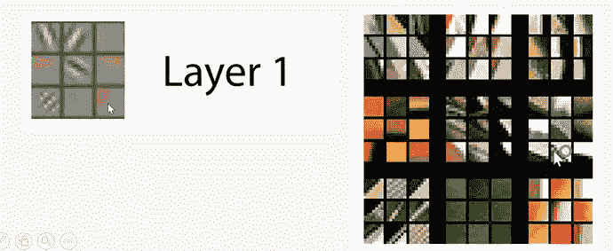
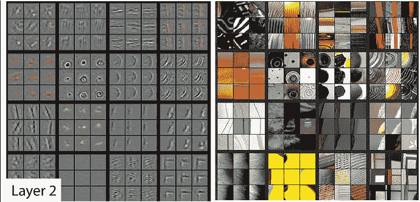
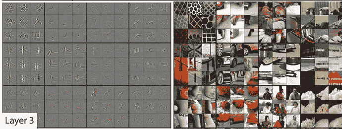
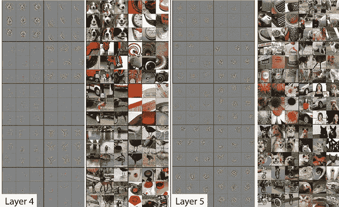
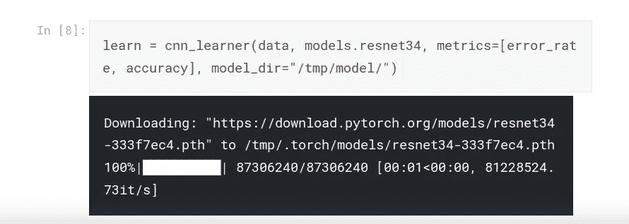
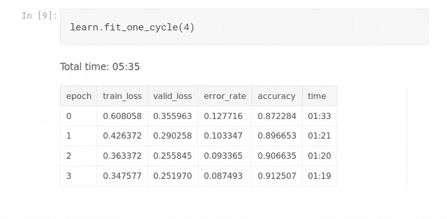
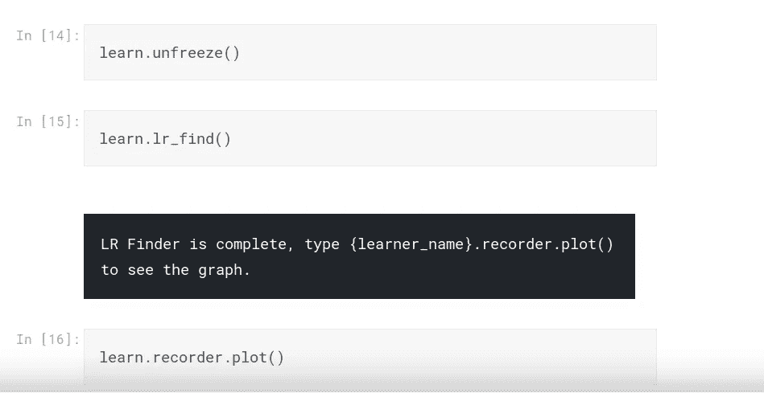
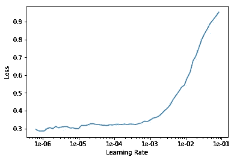
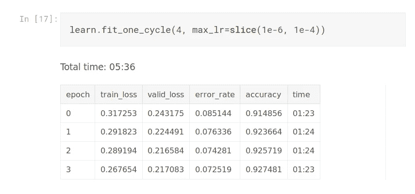

# 预先训练好的模型是如何工作的？

> 原文：<https://towardsdatascience.com/how-do-pretrained-models-work-11fe2f64eaa2?source=collection_archive---------4----------------------->

## 介绍

在我的大多数深度学习项目中，我都使用过预训练的模型。我也提到过，从他们开始而不是从头开始训练通常是个好主意。在本文中，我将对此进行详细解释，并在此过程中帮助您理解大部分代码片段。在文章的最后，我还将谈到计算机视觉中的一种技术，它有助于提高您的模型的性能。

让我们开始吧。

## 训练神经网络

当我们训练神经网络时，网络的初始层可以识别非常简单的事情。说一条直线或者一条斜的。一些非常基本的东西。

随着我们深入网络，我们可以识别更复杂的东西。

第二层可以识别像正方形或圆形这样的形状。

第三层可以识别复杂的模式。

最后，网络的最深层可以识别像狗脸这样的东西。它可以识别这些东西，因为我们的模型的权重被设置为某些值。

Resnet34 就是这样一个模型。它被训练对 1000 种图像进行分类。

## 使用预训练模型的直觉

现在想想这个。如果你想训练一个分类器，任何分类器，不管你想分类什么，初始层都会检测斜线。因此，每次创建神经网络时都训练它们是没有意义的。

这只是我们网络的最后几层，这些层学习识别需要培训的项目特定的类。

因此，我们所做的是，我们采取 Resnet34，并删除其最终层。然后，我们向它添加一些我们自己的层(随机初始化),并训练这个新模型。

在我们看如何在代码中做到这一点之前，我想提一下，预训练模型通常是在大量数据上训练的，并使用通常不是每个人都可用的资源。以 ImageNet 为例。它包含超过 1400 万张图片，其中 120 万张图片属于 1000 个类别中的一个。因此，使用这些模型对我们来说是非常有益的。

## 代码

现在让我们看看在 fastai 中我们是如何做到这一点的。我们首先加载一个预训练的模型。

最初，我们只训练增加的层。我们这样做是因为这些层的权重被初始化为随机值，并且比 ResNet 层需要更多的训练。因此，我们只训练 ResNet 和网络的其余部分。

一旦我们稍微训练了最后几层，我们就可以`unfreeze`resnet 34 的各层了。然后我们为整个模型找到一个好的[学习率](https://medium.com/@dipam44/learning-rate-and-golf-87c8d4697e31)并训练它。

我们的学习率与损失的关系如下图所示。

我们不希望我们的损失增加。因此，我们选择一个[学习率](https://medium.com/@dipam44/learning-rate-and-golf-87c8d4697e31)刚好在图形开始上升之前(这里是 1e-04)。另一个选项，也是我用过的选项，是选择一个切片。

这意味着，如果我们的网络中只有 3 层，第一层将以学习速率= 1e-6 进行训练，第二层以 1e-5 进行训练，最后一层以 1e-4 进行训练。框架通常将网络的层分成组，在这种情况下，切片意味着不同的组以不同的学习速率训练。

我们这样做是因为我们不想大量更新初始图层的值，但我们希望大量更新最终图层的值。因此有了切片。

这种以不同的学习速率训练神经网络不同部分的概念被称为 ***【区别学习】*** ，是深度学习中相对较新的概念。

我们继续解冻层的过程，找到一个好的[学习率](https://becominghuman.ai/learning-rate-and-golf-87c8d4697e31)并训练更多的层，直到我们得到好的结果。

最后，预训练模型不仅可用于计算机视觉应用，还可用于其他领域，如自然语言处理。

我们现在可以继续讨论计算机视觉项目的技巧了。

## 渐进式图像缩放

提高计算机视觉模型性能的一个技巧是为较低分辨率的图像(例如大小= 128)训练一个模型，并使用这些权重作为较高分辨率图像(大小= 256，然后 512，以此类推)的初始值。这种技巧被称为 ***渐进式图像缩放*** 。我在我的一个项目中使用了它，我的模型的性能提高了 2%。

现在，从 92%增加到 94%可能听起来没什么大不了的，但如果我们处理医疗应用，我们希望尽可能准确。正是这些小技巧将优秀的模特与竞赛获奖的模特区分开来。[阅读这篇研究论文，了解更多类似的技巧](https://arxiv.org/abs/1812.01187)。不是所有的方法每次都有效，但是你真的必须尝试和试验什么有效，什么无效，直到你有了感觉。

这就是本文的全部内容

如果你想了解更多关于深度学习的知识，可以看看我在这方面的系列文章:

 [## 深度学习系列

### 我所有关于深度学习的文章的系统列表

medium.com](https://medium.com/@dipam44/deep-learning-series-30ad108fbe2b) 

~快乐学习。