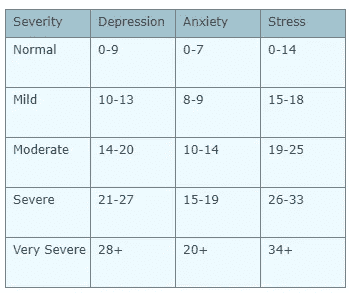
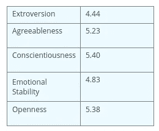

# 心理测试结果如何因年龄、种族和性别而异？

> 原文：<https://towardsdatascience.com/how-do-psychometric-test-results-vary-across-age-race-and-gender-2651672cd96c?source=collection_archive---------16----------------------->

我们大多数人都曾在某个时候做过性格测试。无论是为了找工作、上学还是仅仅为了娱乐，你可能记得浏览过结果以了解更多关于你自己的信息，以及你与其他人相比如何。

但是你有没有想过这些结果是如何与其他人口统计因素相关联的，比如种族、性别、年龄、宗教和性取向？

我最近也问过自己这个问题，为了找到这个问题的答案，我深入研究了数据。在探索了由[开源心理测量项目](https://openpsychometrics.org/)发布的所有公开可用的[数据集](https://openpsychometrics.org/_rawdata/)后，我特别选择了三个(亲密关系体验量表；抑郁、焦虑和压力量表；以及罗森博格自尊量表)和超过 110，000 项心理测试的结果在考生的同意下发布。

根据这些数据集中记录的答案，我发现:

> ***1。年龄与人格特质维度*** *有关系，与关系依恋风格也有关系。*
> 
> **②*。宗教和压力分数是有关系的。***
> 
> ***3。*** *种族与心理健康的衡量标准有关系，如压力、抑郁和焦虑。*
> 
> **4。性别与情绪稳定性** *和宜人性之间存在一定的关系。*
> 
> ***5。性取向与抑郁*** *、焦虑、压力量表有关系。*

尽管数据分析得出了一些有趣的结果，但我还必须强调，由于在线性格测试的性质以及无法验证所给答案的准确性，**该分析旨在为该主题的进一步研究提供一些思考甚至动机，而不是可以推广到更大人群的结果**。

说到这里，下面是通过开源心理测量项目收集的数据和在亚马逊 Mechanical Turk 上收集的数据的[质量对比。结果表明，前者“包含的无效应答率低于 AMT 数据的 25%。”](https://openpsychometrics.org/_rawdata/validity/)

对于那些对该分析背后的过程感兴趣的人来说，可以访问数据和代码[这里](https://github.com/nchibana/DS-Unit-1-Sprint-5-Data-Storytelling-Blog-Post)。

# 宗教与压力得分有什么关系？

开源心理测量项目提供的测试之一被称为 DASS 量表，代表抑郁、焦虑、压力量表。

在过滤掉所有无效回答(对效度问题回答不正确的人)后，我绘制了其余 34，583 个测试结果的结果图，并进行了均值相等的双样本 t 检验。

我发现自称为**摩门教徒的考生平均压力得分最高**(得分越高，压力越大)，而自称为新教徒的考生压力得分最低。

Note: Higher stress scores indicate higher levels of stress | Source: The Open Source Psychometrics Project; N=34,583

由于 t 统计结果为正(t=4.734，p < 0.01), I can conclude that the mean of self-reported stress scores of Mormons is significantly different than that of Protestants. Using the same test, I also found that there is also a statistically significant difference between the stress scores of Protestants and Atheists ( t=6.113, p < 0.01).

You can compare these means to the conventional severity labels below.

Overall, the mean stress score for this population of test takers fits within the cut-off score for those with “moderate” stress levels.

Although the results are thought-provoking, **)，我们应谨慎对待从该数据中得出的任何结论，并将其应用于一般人群**，因为其值得进行更全面的分析，以控制可能的外来、混杂变量。

# 随着年龄的增长，我们会变得更安全吗？

数据中发现的另一个有趣的模式是某些个性指标与年龄之间的关系。

在绘制了几个跨年龄变量之后，我发现被调查者的年龄和性别与情绪稳定性、开放性、责任心、宜人性和外向性得分之间存在关系，如十项人格问卷(TIPI)所测量的那样。

Note: Higher scores indicate higher levels of emotional stability | N=34,583

所有年龄组中，男性受访者的情绪稳定性平均得分高于女性。与此同时，似乎年龄越大的受访者越有可能获得更高的情绪稳定性分数(分数越高表明情绪稳定性水平越高)。卡方检验结果证实这两个变量不是独立的(χ2=982.64，p < 0.01)。

Source: [TIPI Norms](https://gosling.psy.utexas.edu/scales-weve-developed/ten-item-personality-measure-tipi/)

如果你将这些平均值与该量表创建者发布的常模进行比较，你会发现该测试人群的平均情绪稳定性得分(3.185)低于普通人群的得分(4.830)。这可能表明，那些参加在线心理测试的人并不代表更大的人群，但这需要进一步调查。

# 种族与人格测量有什么关系？

我还绘制了不同性格特征种族的平均结果，用 TIPI 和 DASS 量表测量。

虽然在某些情况下，结果可能看起来与直觉相反，但值得进一步研究。卡方检验的结果表明种族和情绪稳定性不是独立的(χ2=597.83，p < 0.01)。较高的分数对应于所讨论的特质或行为的较高水平。

Note: Higher scores indicate higher levels of the trait or behavior in question | N=34,583

还必须指出的是，大多数考生将自己归类为亚洲人、白人或其他人种。

# 性取向呢？

我还进行了卡方检验，以确定性取向是否独立于情感稳定性等 DASS 指标。结果表明两者并非不相关(χ2=509.23，p < 0.01)。

从下面的副图中，你可以看到，与其他类别相比，异性恋者的焦虑和抑郁得分最低(低得分对应于低水平的焦虑和抑郁)。与此同时，那些自称双性恋的人抑郁和焦虑得分最高，情绪稳定性得分最低。

Note: Higher scores indicate higher levels of the trait or behavior in question | N=34,583

# 原籍国和压力水平

我还绘制了各个国家的压力分数，发现西方国家的压力分数总体上并不高。相反，中东和非洲国家的考生压力分数似乎更高。

Note: Higher scores indicate higher levels of stress. Countries in white were not represented by test takers. | N=34,583

# 结论

从这一分析中，我们可以得出结论，考生身份的固有特征，如年龄、性别、种族、原籍国和性取向，与各种个性和行为措施有关。

然而，我们必须进一步研究在线心理测试者和更大的普通人群之间的差异。根据这一分析的结果，在线测试者似乎在情绪稳定性方面得分较低，在焦虑和抑郁方面得分较高。