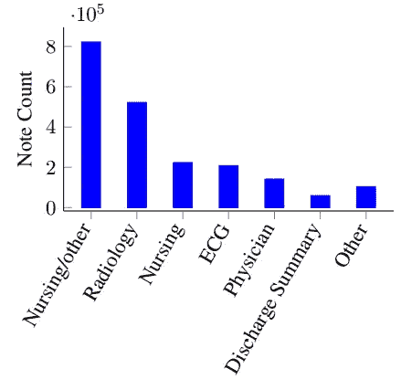
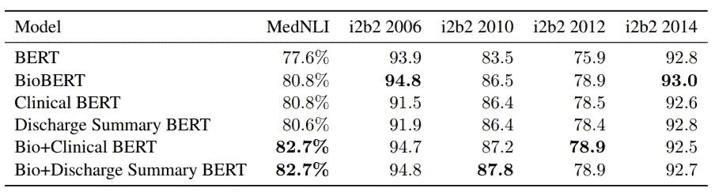
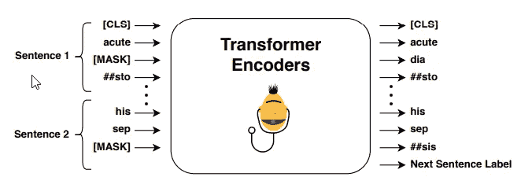
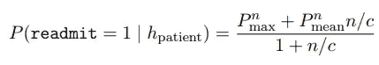
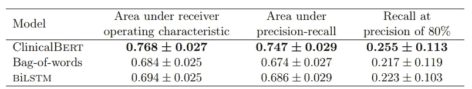

# 他们如何在临床领域应用 BERT？

> 原文：<https://towardsdatascience.com/how-do-they-apply-bert-in-the-clinical-domain-49113a51be50?source=collection_archive---------6----------------------->

## 临床领域中的 BERT

Photo by [Edward Ma](https://unsplash.com/@makcedward?utm_source=medium&utm_medium=referral) on [Unsplash](https://unsplash.com?utm_source=medium&utm_medium=referral)

这个故事同时在 [Dev.to](https://dev.to/makcedward/how-do-they-apply-bert-in-the-clinical-domain-1ipd) 和 Medium 上发表。

通过[埃尔莫](/elmo-helps-to-further-improve-your-word-embeddings-c6ed2c9df95f)(彼得斯等人，2018 年)、[伯特](/how-bert-leverage-attention-mechanism-and-transformer-to-learn-word-contextual-relations-5bbee1b6dbdb)(德夫林等人，2018 年)和 [GPT-2](/too-powerful-nlp-model-generative-pre-training-2-4cc6afb6655) (拉德福德等人，2019 年)，上下文单词嵌入被证明极大地提高了自然语言处理模型的性能。许多研究试图在特定领域的数据上微调 BERT 模型。 [BioBERT 和 SciBERT](/how-to-apply-bert-in-scientific-domain-2d9db0480bd9) 在上次介绍过。我想继续这个话题，因为还有另外两个研究微调 BERT 模型并应用于临床领域。

本故事将讨论[公开可用的临床 Bert 嵌入](https://arxiv.org/pdf/1904.03323.pdf) (Alsentzer 等人，2019 年)和[临床 BERT:模拟临床记录和预测医院再入院](https://arxiv.org/pdf/1904.05342.pdf)(黄等人，2019 年)，同时将详细介绍 BERT，但重点是研究人员如何将其应用于临床领域。如果你想更多地了解伯特，你可以看看这个[故事](/how-bert-leverage-attention-mechanism-and-transformer-to-learn-word-contextual-relations-5bbee1b6dbdb)。将涵盖以下内容:

*   建立临床特定的 BERT 资源
*   临床应用

# 建立临床特定的 BERT 资源

Alsentzer 等人在 [MIMIC-III v1.4 数据库](https://mimic.physionet.org/gettingstarted/dbsetup/)中应用了 200 万个注释(Johnson 等人，2016)。共有 15 种票据类型，Alsentzer 等人汇总为非出院小结类型和出院小结类型。放电汇总数据是为下游任务培训/微调而设计的。

Distribution of note type MIMIC-III v1.4 (Alsentzer et al., 2019)

给定这些数据， [ScispaCy](https://arxiv.org/pdf/1902.07669.pdf) 用于将文章标记为句子。这些句子将分别传递给 BERT-Base(原始 BERT 基本模型)和 [BioBERT](https://github.com/naver/biobert-pretrained) 进行额外的预训练。

临床 BERT 是基于 BERT-base 构建的，而临床 BioBERT 是基于 BioBERT 构建的。一旦上下文单词嵌入被训练，信号线性层分类模型被训练用于跟踪命名实体识别(NER)、去标识(de-ID)任务或情感分类。

与原始的 BERT 模型相比，这些模型在 MedNLI 中取得了更好的效果。同时，您可能会注意到 i2b2 2006 和 i2b2 2014 没有改进，它们是去 ID 任务。

Performance comparison among different models in MedNLI and i2b2 data set (Alsentzer et al., 2019))

# 临床应用

与此同时，黄等人也注重临床笔记的研究。然而，黄等人研究的主要目标是通过利用良好的临床文本表示来建立预测模型。黄等研究发现，降低再住院率对患者是有利的，如节省费用等。

与 Alsentzer 等人相同，MIMIC-III 数据集(Johnson 等人，2016 年)用于评估。遵循相同的 BERT 实践，通过预测屏蔽记号和下一句预测来训练上下文单词嵌入。简而言之，预测屏蔽记号就是随机屏蔽一个记号，并使用周围的单词来预测屏蔽记号。下一句预测是一个二元分类器，该模型的输出是分类第二句是否是第一句的下一句。

Training tasks of ClincialBERT (Huang et al., 2019)

在具有预训练的上下文单词嵌入之后，微调过程被应用于再入院预测。这是一个二元分类模型，用于预测患者在未来 30 天内是否需要再次住院。

BERT 模型的一个限制是令牌的最大长度是 512。一个长的临床笔记将被分割成多个部分，并分别进行预测。一旦所有子部分被预测，最终概率将被聚集。由于担心单纯使用最大值或平均值，黄等人将两者结合起来，以得到更准确的结果。

Scalable radmission prediction formula (Huang et al., 2019)

实验结果表明，微调后的 ClinicalBERT 模型优于经典模型。

Performance comparison among models (Huang et al., 2019)

# 拿走

*   Alsentzer 等人使用分类模型的信号层来评估结果。这可能是一个良好的开端，并期望伯特模型能够学习的内容。评估其他高级模型架构可以提供更好的综合实验结果。
*   对于较长的临床病历，黄等人采用了一些数学技巧来解决。它可能无法捕捉非常长的临床记录的内容。可能需要进一步思考处理长输入的更好方法。

# 喜欢学习？

我是湾区的数据科学家。专注于数据科学、人工智能，尤其是 NLP 和平台相关领域的最新发展。欢迎在 [LinkedIn](https://www.linkedin.com/in/edwardma1026) 上与 [me](https://makcedward.github.io/) 联系，或者在 [Medium](http://medium.com/@makcedward/) 或 [Github](https://github.com/makcedward) 上关注我。

# 延伸阅读

*   [临床 BERT 嵌入 GIT 库](https://github.com/EmilyAlsentzer/clinicalBERT)
*   [临床伯特](https://github.com/kexinhuang12345/clinicalBERT)
*   [MIMIC-III v1.4 数据库](https://mimic.physionet.org/gettingstarted/dbsetup/)
*   [比奥伯特和塞伯特](/how-to-apply-bert-in-scientific-domain-2d9db0480bd9)

# 参考

*   E.阿尔森策、J. R .墨菲、W. Boag、W. H .翁、d .金、t .瑙曼和 M. B. A .麦克德莫特。[公开可用的临床 BERT 嵌入](https://arxiv.org/pdf/1904.03323.pdf)。2019
*   K.黄、J. Altosaar 和 R. Ranganath。 [ClinicalBert:模拟临床记录并预测医院再入院](https://arxiv.org/pdf/1904.05342.pdf)。2019