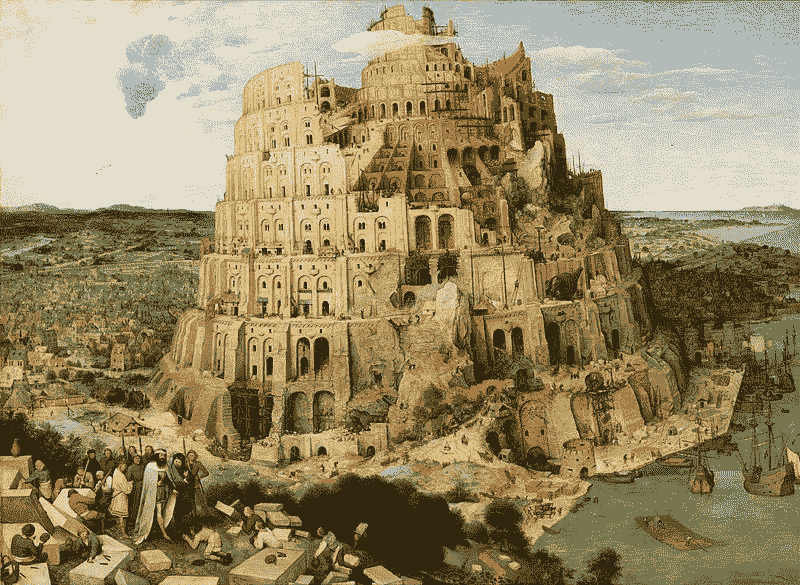
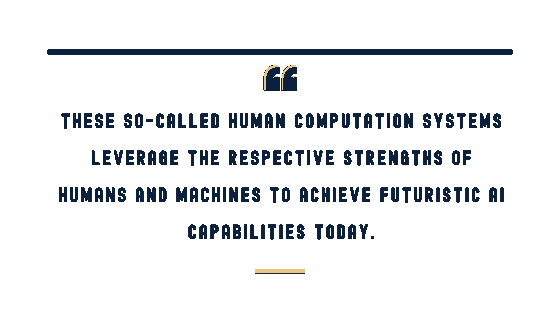
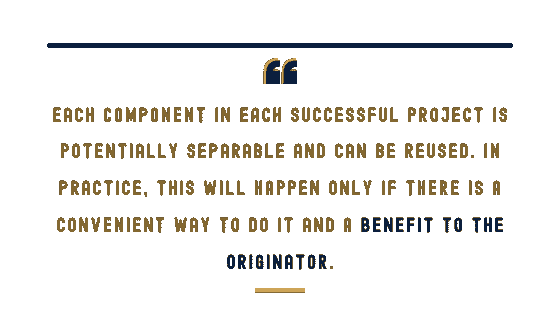
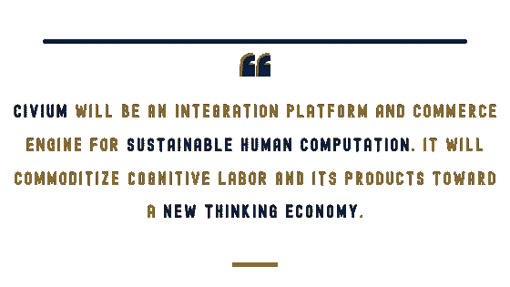
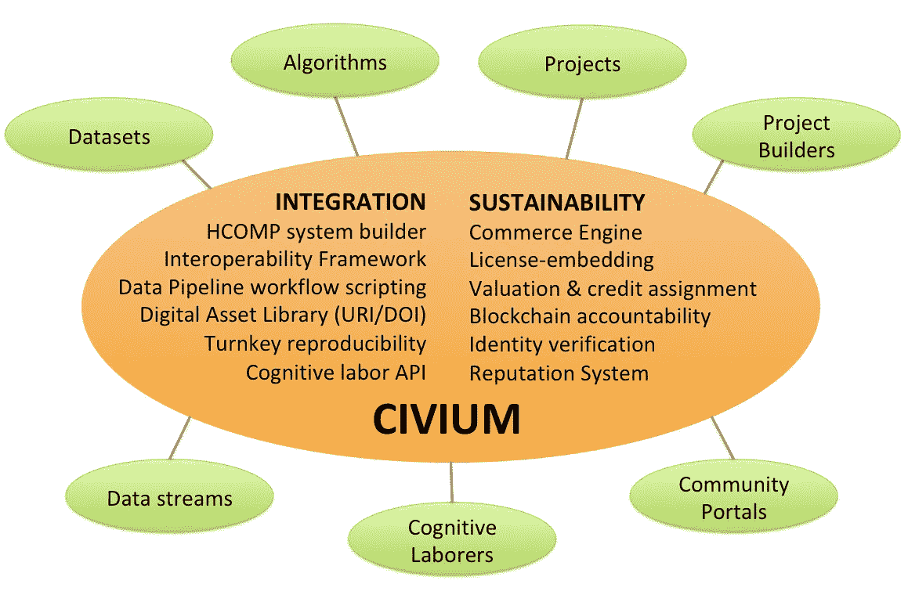
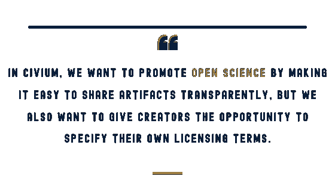
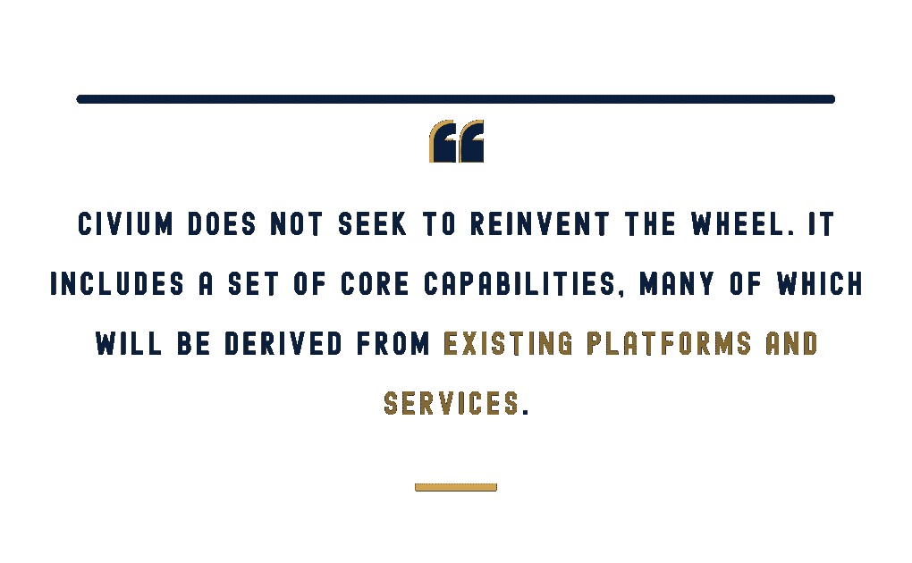

# 我们如何创造一个可持续的思维经济？

> 原文：<https://towardsdatascience.com/how-do-we-create-a-sustainable-thinking-economy-4d77839b031e?source=collection_archive---------32----------------------->

> “看，人民是一个，他们都有一种语言；他们已经开始这样做了。现在，他们想做的事，没有什么不能阻止他们。”
> 
> -《创世纪》第十一章第六节

正如巴别塔起源神话中所传达的那样，大规模合作对我们人类的自决至关重要，以至于当一种共同语言使世界人民团结在一个集体事业中时，全能者认为应该进行干预，以免人类获得全能。科学事业代表了现代的巴别塔。这是现存的最大规模的协同努力，目标是实现全知。越来越多的人认识到，科学是我们所拥有的最有效的工具，可以减少威胁我们人类和地球系统未来的复杂问题的不确定性。

20 世纪最有影响力的科学家之一万尼瓦尔·布什在 1945 年恰当地指出，科学“提供了思想的记录，并使人类能够操纵和摘录这些记录，以便知识在一个种族而不是一个 individual"⁴.人的一生中不断发展和延续尽管如此，即使我们当前的技术社会基础设施实现了快速的知识共享，科学似乎也无法跟上我们今天面临的失控问题——其中许多是我们自己发明的副作用。

尽管受到布什著作的启发，发明了电脑鼠标的道格拉斯·恩格尔巴特认识到快速的知识共享不足以解决世界上日益复杂的问题。恩格尔巴特认为，解决这些问题的唯一途径是通过加强合作，并倡导一种旨在“改进我们改进的方式”的自举方法。事实上，恩格尔巴特的鼠标是人类和 machines⁵之间更紧密融合的有意步骤，因此也是通过这些机器将人类与其他人类联系在一起的有意步骤。

因此，在我们能够快速提高对世界的理解之前，我们需要一个框架，让我们能够研究和应用人类/人工智能 partnerships⁶.将这样一个框架与将信息处理资产和服务视为商品的商业系统相结合，可能会催生一个欣欣向荣的新思维经济。公民科学项目及其使能技术可以成为可持续发展的企业，从而形成一个丰富的可重复使用和可扩展的公民科学平台小部件市场、在线认知劳动者社区的交钥匙访问以及稳定的研究数据集供应。

## 时势

今天，我们畅游在前所未有的计算能力中，并全天候连接到无处不在的网格，但我们仍淹没在数据中，因为我们正在努力解决棘手的社会问题。人类从未像现在这样在更多的时间、更多的地方联系在一起，但这种非结构化的联系并不适合有目的的知识转移。例如，对 Twitter 的社交网络分析揭示了两极分化的子网的形成，这些子网成为了志同道合的 members⁷的“回音室”，而不是为混合不同观点可能产生的新想法提供肥沃的环境。

更糟糕的是，科学学科正变得更加专业化，因为新技术使研究人员能够更深入地钻研利基领域，创造出具有自己难以理解的 folksonomies⁸的孤立社区，并导致知识孤岛的激增。对于 know⁹来说，任何一个领域都有太多的东西需要跨学科的方法来解决，包括今天最邪恶的⁰问题。即使解决这些问题所需的数据和知识隐藏在知识中，我们也缺乏将它们整合成有效且可行的解决方案的能力。

许多人转向机器学习(一种人工智能形式)作为求助途径，因为它能够从异构数据集揭示复杂的因果关系。主要由于计算速度的提高，已经存在了几十年的机器学习方法突然变得可行，可以在医疗诊断、银行贷款审批和刑事判决等不同领域进行预测，支持决策。然而，当人类的偏见渗入训练数据或上下文信息缺失时，你可能会得到性别歧视或种族主义的预测，而不会区分相关性和因果关系。需要更多的研究来解决偏见问题，并更好地理解人工智能和人类各自的影响如何影响结果。在此之前，人们在使用这些工具时可能会受到不利和不公平的影响。

## 人类/人工智能伙伴关系的价值

“强人工智能”的圣杯是能够执行任何人类认知任务——换句话说，实现类似人类的智能。令人惊讶的是，这种能力今天依然存在。它叫…人类！事实上，人工智能系统经常使用人类认知产品的数据进行训练，这增加了对它们的需求。获取这种人类生成的数据的一种方法是通过“公民科学”，在线志愿者帮助获取或分析数据，以换取参与科学研究的机会。这些项目通常是为了解决一个研究需求而开发的，这种需求不能单独使用基于机器的方法来满足，因为工作的某些方面(例如对图像进行分类)只能由人类来适当地完成。

2019 年 4 月 13 日，来自全球各地的数千名公共志愿者在不到一个周末的时间里完成了为期三个月的阿尔茨海默病研究，共同创造了生物医学数据分析的新世界纪录。他们通过玩我们开发的名为“抓失速”的在线游戏来做到这一点。像大多数公民科学项目一样,《失速追踪器》体现了一类新兴的混合分布式信息处理系统⁴.这些所谓的*人类计算(HCOMP)* 系统利用人类和机器各自的优势来实现今天⁵.的未来人工智能能力因此，这些混合系统通过简单地循环人类来处理认知任务，实现了前所未有的能力，即使是最先进的人工智能系统⁶.也无法完成这些任务

失速追踪器并不是唯一的成功案例。HCOMP 正在推进癌症⁷和艾滋病毒⁸研究，诊断撒哈拉以南非洲的疟疾⁹，减少坦桑尼亚⁰的女性生殖器切割，预测多哥的洪水影响，赋予盲人实时场景理解能力，在语言障碍和基础设施故障的情况下加快救灾，改写我们对宇宙学⁴ ⁵的理解，并改进保护科学⁶.的预测

## 障碍

如今，将 HCOMP 应用于重大社会问题是一项“高风险/高回报”的事业。这需要投入大量的时间和金钱，而且成功的可能性很低。没有直接的集成路径来链接人工智能和基于人类的处理组件，没有工作流自动化的机制，数据管道通过手动研究人员干预和定制的适配器捆绑在一起，在可转移的粒度级别上缺乏模块化和重用，并且没有验证方法或数据质量保证的标准方法。

虽然最近的失速捕捉器事件展示了现实世界的效用和影响，但与许多成功的 HC 平台一样，它花了几年时间来完全开发复杂的信息处理系统，使这一壮举成为可能。我们是怎么做到的？首先，我们建立了一个数据管道，采用卷积神经网络对原始数据进行预处理，并分离出认知任务。接下来，我们开发了一个游戏化的众包平台，它与人类和人工智能系统⁷.紧密耦合为了激励参与，我们创建了一个中立的奖励引擎，但是也不断地结合用户反馈来改进交互设计。最后，我们开发了一种优化的动态一致性算法，用于机器辅助验证人群生成的数据。所有这些都是为了最大化分析通量，同时满足严格的生物医学数据质量要求。

如果每个公民科学项目都倾向于被视为一张白纸，那么难怪成功率会很低，而实现的时间会很长。但是每个成功项目中的每个部分都是潜在可分的。事实上，没有原则上的理由为什么不能把每一部分都做成共享的模块，这样它就可以被重用、重用，并扩展成具有新功能的新模块。然而，在实践中，只有在有一种方便的方式并且对发起人有利的情况下，这种情况才会发生。

另一个关键问题是可持续性。对于这些项目中的许多项目来说，一个中心目标是使用人类生成的数据来训练一个人工智能系统，该系统可以解放志愿者，或者至少吸收一些工作量。但这种结果很少见。更常见的情况是，正当这些公民科学项目发展出一个繁荣的社区，验证了他们的方法，并开始产生高质量的研究数据时，他们的资金枯竭了，他们不容易维持下去(例如，参见 Tsueng 博士给 Mark2Cure 参与者的终止信的内嵌摘录)。这种情况经常发生，因为它们得到了有时间限制的资助，资助范围要么是概念开发的证明，要么是解决具体的研究问题。

> “不幸的是，我们没有所需的资源来解决困扰当前 Mark2Cure 迭代的所有问题，这些问题影响了用户体验并阻碍了参与。虽然我们的研究表明 Mark2Curators 可以贡献高质量和有意义的数据，但这些设计问题使得我们不太可能招募到足够多的用户[……]经过长时间的讨论，我们决定停止贡献……”
> 
> Scripps Research 的 Ginger Tseung 博士

## 走向思考型经济

如果我们有办法给项目注入收入来维持运营，会怎么样？上述进展障碍存在于更大的利益相关者生态系统中，所有利益相关者都投资于新的数据科学方法及其应用。每个利益相关者都带来了他们自己的⁸挑战和相关需求，但也为其他利益相关者带来了潜在的解决方案。这种需求和供给的互补性暗示了一种潜在的经济。

例如，一名渴望数据的机器学习研究生可以收费提供人工智能建模服务，或者以访问公民科学项目生成的大型训练集作为交换。然后，他们可以将自己表现最好的模型授权给学术研究人员，以获得发表权，并授权给营利性实体，以获得授权费。

公民科学项目本身可以通过向受资助的领域研究人员提供具有成本效益的数据分析来产生收入，这些研究人员为这些分析提供预算。另一个收入来源可能包括向其他公民科学项目授权“群体智慧”算法或专门的界面部件。

与此同时，公民科学志愿者可以建立基于表现的声誉，并在此基础上被聘为有偿认知劳动者。Mooqita 已经证明了这种方法的可行性，它将外部组织的在线任务整合到 MOOCs 中，成为⁹.的学习机会一些在在线任务中表现出熟练程度的学生被雇佣在 MOOC 之外继续同样的在线工作。

但是今天这些都没有发生，因为 1)信息处理交换不存在，2)我们被困在知识经济中。知识经济是一种重视一阶知识生产的思维模式，一阶知识是在孤立的环境中使用数据来指导我们行动的死记硬背的方法。这种知识忽略了现实世界中许多相互作用的系统之间存在的复杂的相互依赖性。

但是我们从已知的事物中建立高阶知识的速度很慢，因为整合知识比整合数据要困难得多。它需要的不仅仅是数据处理，还需要思考。想想精准医疗的挑战，其目标是基于患者的基因组、微生物群、病史和生活方式选择来预测前瞻性治疗的影响。这需要在不同的多源数据中发现模式，然后应用跨学科的专业知识来解释它们。为此，我们需要 HCOMP。

## Civium 简介

为了实现这些目标，人类计算研究所正在领导 Civium 的开发，这是一个用于可持续人类计算的集成平台和商业引擎。Civium 的目的是为了科学的进步而简化信息处理，并使认知劳动及其产品商品化，走向新的思维经济。对于公民科学从业者来说，这可以减少开发时间和运营成本，实现快速的社区参与，并创造有助于维持项目的收入机会。

今天有一个名为 brainlife.io 的平台，它使神经科学家能够直接在云计算基础设施上发布算法和数据集。通过预先实施互操作性，所有数据集和算法都可以互换，并通过工作流轻松组合到更复杂的管道中，称为“开放服务”⁰.这种方法支持数据建模结果的可再现性。因此，brainlife.io 已经在神经科学社区中被广泛采用。

这种简单而明智的方法似乎是一个更广泛的计划的合适基础，该计划旨在开发一个支持人类计算研究的开放科学平台，包括基于群体的计算的整个生命周期。各种群体科学方法，如数据准备、参与者参与、机制设计、聚合算法和验证方法，以及协调这些方法的特定动态工作流，都会对人类计算系统的成功发展产生重大影响。此外，将这些组件的组件和子组件快速连接在一起以进行快速评估和验证的能力对于有效校准系统行为的各个方面至关重要。

除了扩展 brainlife.io 以包括支持公民科学和 HCOMP 研究的基于人类的信息处理，Civium 还将关键地整合一个商业系统以促进发展和可持续发展。事实上，Civium 的关键假设是技术创新无法在经济真空中持续。因此，成功将关键取决于以模拟和解决现实世界的约束和激励的方式将集成“胶水”与商业系统交织在一起。我们相信，将这些技术和经济系统恰当地结合在同一个平台上，将释放潜在的市场驱动力，为推进思维系统的发展带来一个繁荣的生态系统。在接下来的两节中，我们将更深入地探讨 Civium 的这些关键方面。

## 综合

目前存在几个公民科学项目建设者(例如，Zooniverse、citsci.org、Spotteron、Anecdata 等。)，通常在线性设计过程中提供一个选项菜单。其中的每一个都适合一组用例(例如，图像分类)。这些平台支持快速开发和参与者访问，尽管它们可能会限制新项目可能采用的潜在数据集、应用程序和数据科学方法的范围。此外，还有像 PYBOSSA 和 TurKit 这样的众包库，它们非常灵活，支持几乎无限多种应用程序，但可能需要大量编码。

**Civium 寻求提高这些现有社区资产**和其他资产的可访问性，并通过在基于云计算服务的共享信息处理环境中提供这些资产来降低运营成本，在该环境中，这些资产可以以不同的方式组合并应用于新的数据集。

Civium 还鼓励小部件和服务的模块化，这样它们就可以被共享和重用。例如，一个新的镰状细胞病项目可以将 EyeWire 的图像预处理算法与 stardust@home 的虚拟显微镜界面、Stall Catchers 的共识算法相结合，然后在 Zooniverse 门户服务中发布项目时向 SciStarter.org 仪表板服务注册。此外，工作流可以使用项目的输出来自动训练人工智能模型，该模型为人类认知任务提供持续改进的协作输入。

## 可持续性

混合人机系统和平台正在改变世界，这已经不是什么秘密，对这些能力的需求只会增长。难道不是时候团结起来，以符合我们价值体系的方式为每个人解决可持续发展问题了吗？除了作为一个集成平台，Civium 还将自下而上地设计一个集成的商业引擎，通过创建一个信息处理和数字资产的市场，帮助播种一种新的“思维经济”(正如在 2019 年[微软教师峰会](https://www.microsoft.com/en-us/research/video/crowd-cloud-and-the-future-of-work-updates-from-human-ai-computation/)上介绍的那样)。在这种模式下，任何数字产品或服务都是潜在的收入来源。例如，公民科学平台提供的分析能力可以作为付费服务来提供。在现有公民科学项目中使用的功能模块(例如，共识算法)可以被注册并可用于其他项目。门户服务，如 Zooniverse，可以通过交钥匙访问按月付费购买，也可以注册 SciStarter 的 dashboard 服务。甚至公民科学项目本身也可能需要参与费，例如 Project FeederWatch，它已经向用户收取每年 18 美元的费用。但是如何指定和实现这样的使用策略呢？

*Civium combines integration and sustainability features within a single platform*

在 Civium 中，我们希望通过使透明地共享人工制品变得容易来促进开放科学，但我们也希望给创作者指定他们自己的许可条款的机会，无论是否涉及经济报酬。今天，许多研究人员分享开源和开放科学的价值，作为加快研究和影响的手段。与此同时，研究人员似乎发自内心地认识到可持续资助的困难。这种价值驱动的行为和可持续性之间的不协调可能源于开源=免费这一广为流传的神话。开源(就此而言，还有开放科学)的“免费”部分是在源代码(和数据)透明的脉络中。跟钱没关系。例如，如果有人创建了一个算法并在 Civium 上发布了该模块，他们可以说“任何人都可以使用它，只要他们信任我”(就像 CC-BY 一样)，或者规定“我拥有这个软件，但我将向任何学术研究人员授予免费许可证，以及为期 6 个月的可更新许可证，用于 X 美元的盈利。任何衍生产品都必须遵守这些许可条款。”诸如此类。这不仅适用于小工具，也适用于在线服务(例如，访问大型参与者社区)，并且可以通过多种方式进行衡量。事实上，Civium 提供了一个评估和信用分配系统，用于跟踪哪些资源得到了利用以及利用了多少。

实现这一点的关键是“照单全收”的许可能力，这将使使用策略能够嵌入到注册的服务和数字制品(如算法、数据集等)中。).在一个透明的社会是一个礼貌的社会的前提下，这些将受到身份验证服务和基于区块链的问责制的保护。提供商将能够规定他们选择的任何条款，市场可以自由接受这些条款或寻找其他条款。使用策略可以另外规定只在 Civium 的底层计算资源上使用已发布的工件，这可能会解决协作限制，否则这些限制可能会阻碍来自不同组织的数据建模者和数据提供者之间的协作。全球分布的 Azure 服务器场使地理定位处理成为可能，这将使其他大陆的数据科学家能够在他们原籍国的服务器上处理数据，从而进一步实现以前被禁止的合作机会，例如分析受 GDPR 保护的基因组数据集以支持精准医学研究。

## 赋予公民生命

在思考这一雄心勃勃的事业时，很明显，由聪明能干的组织采取的相关举措尚未取得成果，认为人类计算研究所可以独自解决这一问题是傲慢的想法。因此，我们与我们的社区成员分享了这些想法，思考了为什么这样一个平台尚未被广泛采用，并考虑了现在可以做些什么来实现这一点。事实上，将 Civium 视为一个人类计算系统本身，拥有多个利益相关者，有助于为这一方法提供信息。

那么为什么像 Civium 这样的东西今天不存在呢？一个障碍可能与组织限制和任务偏差有关。大型企业解决方案上市速度快，而且可能是可持续的，但服务于盈利目标，引入了限制性的付费墙，并向少数行业利益相关者提供有偏见的产品。另一方面，基于社区的倡议往往服务于更广泛的目标，但涉及行动缓慢、铁板一块的财团。当这些团队开发并同意一组需求时，那些特性规范不再满足这个快速变化的领域的需求。此外，植根于学术的项目往往有意避开大企业，这阻碍了潜在的收入流。

作为一个非营利组织，人类计算研究所的使命是为了社会的利益而推进 HCOMP，而不是为了利润。这一使命旨在寻求学术、企业和政府利益的共同基础。在 HCI 的管理下，Civium 可以服务于许多人的利益，同时在非地质时间尺度上取得成果。

## 下一步是什么？

如今，Civium 计划正在与开发 brainlife.io 的微软研究院和印第安纳大学的 Pestilli 实验室合作向前发展。公民科学实践者、HCOMP 研究人员和机器学习爱好者的更广泛社区正在形成一股浪潮，寻求公民科学规模经济的全球联盟的主要成员也表达了兴趣，如联合国公民科学与可持续发展目标(SDG)协调工作组，EU-公民。科学和其他。将在 10 月下旬的 HCOMP 2019 大会上召开一次公开的社区会议，回答问题并收集反馈，随后在 1 月份召开一次项目启动会议，以就规范达成一致并分配角色。

Civium 不打算重新发明轮子。事实上，我们的目标只是将相关的部分组合在一起，这样就可以很容易地组合和重用它们。Civium 还寻求支持那些创造数字产品并提供大众服务的组织和个人，包括认知劳动者本身。Civium 包括一组核心功能，其中许多功能将来自现有的平台和服务。例如，Civium 将建立在 brainlife.io 的基础上，它为互操作性和交钥匙再现性提供了一种可靠的方法。对于其许可引擎，Civium 将建立在我们的另一个合作伙伴 [GridRepublic](https://www.gridrepublic.org/) 开发的成熟项目之上，该项目将区块链可追溯性应用于合同。这些核心能力将在一个无缝平台内交织技术集成和经济可持续性，在这个平台上，参与者门户、公民科学项目、人工智能算法和数据集可以互操作并蓬勃发展。

从某种意义上说，Civium 是一种新型超级计算机的操作系统，由计算机硬件和认知“软件”提供支持，将使我们能够构建、改进和部署变革性的人类/人工智能系统，以支持开放科学和创新。它也是一个集市，用于分享、交易和寻找我们需要的小部件和服务，以创建和维持我们寻求的功能，为不受支持的项目和平台注入新的生命。最终，我们相信 Civium 有潜力播种一种新的思维经济，奖励解决我们最紧迫的社会问题所需的独特的人类认知能力。

## 承认

衷心感谢 Eglė Marija Ramanauskaitė和 Jennifer Couch 的广泛反馈，这些反馈极大地改进了本文的结构和语气。感谢众多同事对 Civium 和相关想法的讨论和反馈，包括 Vani Mandava、Lucy Fortson、欧阳丹丹 Gurari、Diane Bovenkamp、Franco Pestilli、Soichi Hayashi、Darlene Cavalier、Lea Shanley、Besmira Nushi、Matthew Blumberg、Nancy Kleinrock 和许多其他人。

## 参考

1.创世纪。在:*钦定本圣经*。

2.巴别塔。在:*维基百科*。；2019.https://en.wikipedia.org/w/index.php?title=Tower_of_Babel&oldid = 912466515。2019 年 8 月 27 日接入。

3.公众越来越信任科学家为社会谋福利。科学新闻。[https://www . science news . org/article/public-trust-scientists-work-good-society-growing。](https://www.sciencenews.org/article/public-trust-scientists-work-good-society-growing.)发表于 2019 年 8 月 2 日。2019 年 8 月 4 日接入。

4.我们可能会认为。大西洋。https://www . theatlantic . com/magazine/archive/1945/07/as-we-may-think/303881/。出版于 1945 年 7 月 1 日。2019 年 8 月 27 日接入。

5.50 年后，我们仍然没有抓住所有演示的母亲。*连线*。2018 年 12 月。[https://www . wired . com/story/50 年后——我们仍然不理解这位所有演示的母亲/](https://www.wired.com/story/50-years-later-we-still-dont-grasp-the-mother-of-all-demos/.)2019 年 8 月 27 日接入。

6.《人类计算和收敛》。在:班布里奇 WS，洛可 MC，编辑。*科技融合手册*。Cham:斯普林格国际出版公司；2016:455–474.doi:10.1007/978–3–319–07052–0 _ 35

7.威廉姆斯·HTP，小麦克默里，库尔茨·T，雨果·兰伯特 f。网络分析揭示了气候变化社交媒体讨论中的开放论坛和回音室。全球环境变化。2015;32:126–138.doi:10.1016

8.方足球俱乐部。专业科学。*感染免疫*。2014;82(4):1355–1360.doi:10.1128/IAI . 01530–13

9.里查森·PJ。作为一种分布式计算形式的人类累积文化进化。在:米凯鲁奇 P，编辑。*人类计算手册*。纽约州纽约市:斯普林格纽约；2013:979–992.doi:10.1007/978–1–4614–8806–4 _ 76

10.《规划一般理论中的困境》。*政策科学*。1973;4(2):155–169.doi:10.1007/BF01405730

11.Tan S，Adebayo J，Inkpen K，Kamar E.《调查用于累犯预测的人类+机器互补性》。 *ArXiv180809123 Cs Stat* 。2018 年 8 月。[http://arxiv.org/abs/1808.09123.](http://arxiv.org/abs/1808.09123.)2019 年 9 月 28 日接入。

12.史蒂文森 l .公民科学家为加速老年痴呆症的研究创造了新的记录。Discov Mag Citiz Sci 沙龙。2019 年 5 月。[http://blogs . discover magazine . com/citizen-science-salon/2019/05/06/citizen-scientists-set-new-record-for-accelerating-Alzheimers-research/。](http://blogs.discovermagazine.com/citizen-science-salon/2019/05/06/citizen-scientists-set-new-record-for-accelerating-alzheimers-research/.)2019 年 5 月 6 日接入。

13.老年痴呆症可以被成千上万的业余爱好者治愈。https://www . wired . com/story/在数千台显微镜下寻找失去的记忆/。2019 年 10 月 21 日接入。

14.公民网络科学&人类计算的新方向和机遇。*Hum compute*。2014;1(2).doi:10.15346/hc.v1i2.2

15.米歇尔·P·迪金森·JL。人群的力量。*理科*。2016;351(6268):32–33.doi:10.1126/science.aad6499

16.布瑟 A，斯隆 M，米开朗琪 p，保韦尔斯 E. *人工智能:一个政策导向的介绍*。威尔逊中心；2017.[https://www . scribd . com/document/364545974/人工智能-政策导向-简介。](https://www.scribd.com/document/364545974/Artificial-Intelligence-A-Policy-Oriented-Introduction.)2019 年 1 月 8 日接入。

17.坎迪多·多斯·雷斯·FJ、林恩·S、阿里·HR 等人众包公众进行癌症的大规模分子病理学研究。*埃比奥美辛*。2015;2(7):681–689.doi:10.1016/2015 . 05 . 009

18.由蛋白质折叠游戏玩家解决的单体逆转录病毒蛋白酶的晶体结构。*自然结构分子生物学*。2011;18(10):1175–1177.doi:10.1038/nsmb.2119

19.Luengo-Oroz MA，Arranz A，Frean J .众包疟疾寄生虫定量:一个分析受感染稠血涂片图像的在线游戏。*医学互联网研究*。2012;14(6).doi:10.2196/jmir.2338

20.领导莫。让坦桑尼亚的乡村出现在地图上。*读写分词*。2018 年 4 月。[https://medium . com/read-write-participate/put-rural-Tanzania-on-the-map-79d 0888 df 210。](https://medium.com/read-write-participate/put-rural-tanzania-on-the-map-79d0888df210.)2019 年 5 月 2 日接入。

21.反思参与:人道主义者探索地理信息的创新。ISPRS Int J Geo-Inf*。2015;4(3):1729–1749.doi:10.3390/ijgi4031729*

22.Bigham JP，Jayant C，Ji H，et al. VizWiz:对视觉问题的近乎实时的回答。在*第 23 届 ACM 年度用户界面软件和技术研讨会会议录*。10 年的尤斯特。美国纽约州纽约市:ACM2010:333–342.土井指数:10.1145/186658686867

23.灾害应对中的人类计算。在:米凯鲁奇 P，编辑。*人类计算手册*。纽约州纽约市:斯普林格纽约；2013:95–104.doi:10.1007/978–1–4614–8806–4 _ 11

24.星尘号宇宙飞船收集的七个尘埃粒子的星际起源证据。[https://science.sciencemag.org/content/345/6198/786.full.](https://science.sciencemag.org/content/345/6198/786.full.)2019 年 5 月 2 日接入。

25.星系动物园绿豌豆:一类致密极端恒星形成星系的发现。 *Mon Not R Astron Soc* 。2009;399(3):1191–1205.doi:10.1111/j . 1365–2966.2009.15383 . x

26.生物多样性保护和研究的人/计算机学习网络。年:*第二十四届 IAAI 会议*。；2012.[https://www . aaai . org/OCS/index . PHP/IAAI/IAAI-12/paper/view/4880。](https://www.aaai.org/ocs/index.php/IAAI/IAAI-12/paper/view/4880.)2019 年 5 月 2 日接入。

27.加速生物医学研究的人机合作。*微软 Res* 。[https://www . Microsoft . com/en-us/research/video/a-human-machine-partnership-to-accelerate-biomedical-research/。](https://www.microsoft.com/en-us/research/video/a-human-machine-partnership-to-accelerate-biomedical-research/.)2019 年 5 月 3 日接入。

28.单数*他们*。在:*维基百科*。；2019.https://en.wikipedia.org/w/index.php?title=Singular_they 的 oldid=918961982。2019 年 10 月 2 日接入。

29.Krause M，Schiö berg D，Smeddinck JD。Mooqita:用一种新颖的工作-学习模式赋予隐藏的才能。in:*2018 CHI 计算系统中人的因素会议扩展摘要*。CHI EA '18。美国纽约州纽约市:ACM2018 年:CS14:1–CS14:10。多伊:10.1145/317035363637

30.Avesani P，McPherson B，Hayashi S，等,《开放扩散数据衍生产品，通过衍生产品的集成发布和可再生开放云服务实现大脑数据升级》。 *Sci 数据*。2019;6(1):1–13.doi:10.1038/41597–019–0073-y

31.《人类计算的美国研究路线图》。 *ArXiv150507096 Cs* 。2015.doi:10.13140/RG

32.小 G，奇尔顿 LB，高盛 M，米勒 RC。TurKit:机械土耳其人上的人类计算算法。在*第 23 届 ACM 年度用户界面软件和技术研讨会会议录*。10 年的尤斯特。美国纽约州纽约市:ACM2010:57–66.土井指数:10.1145/186658686867

33.Fritz S，See L，Carlson T，等,《公民科学与联合国可持续发展目标》。 *Nat 维持*。2019;2(10):922–930.doi:10.1038/s 41893–019–0390–3