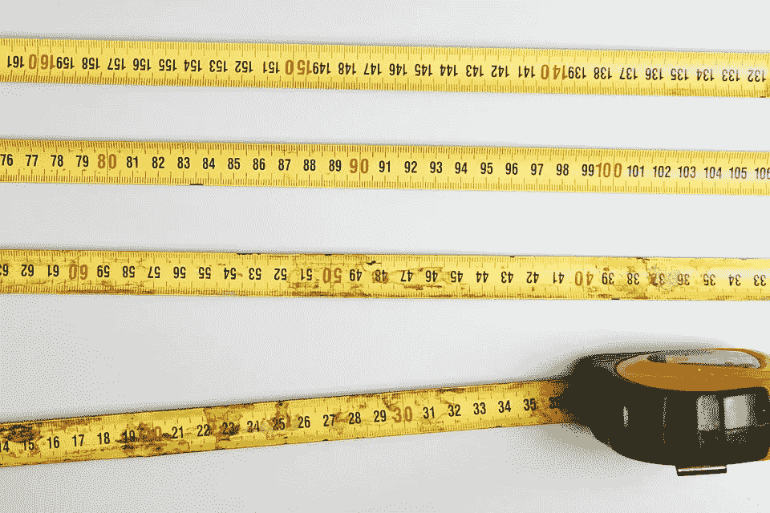
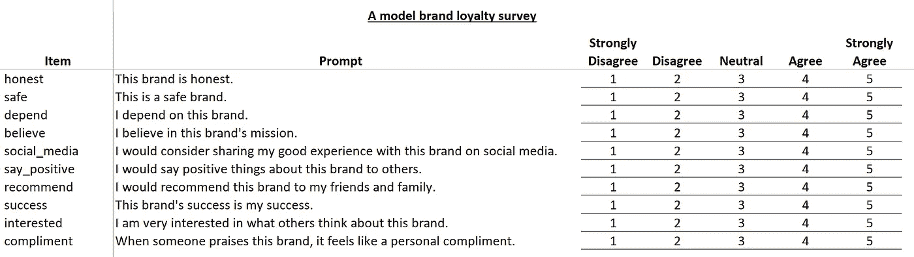
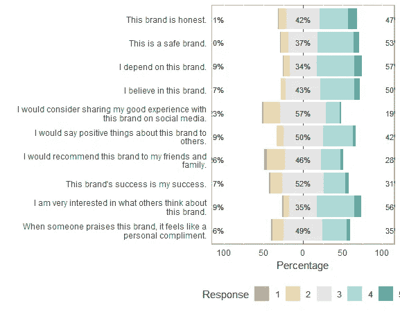
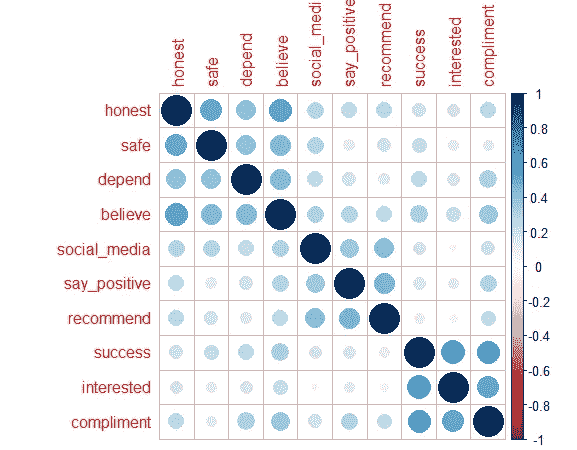
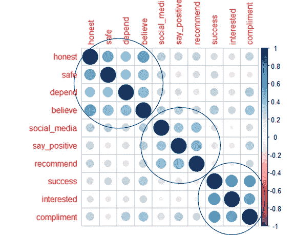
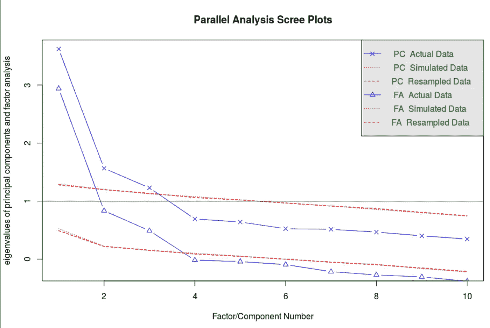
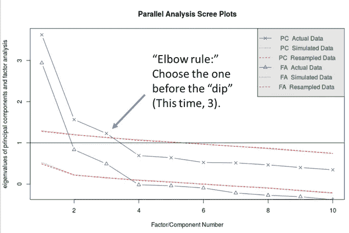
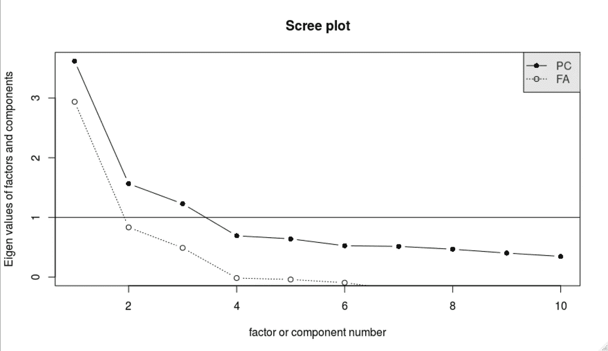
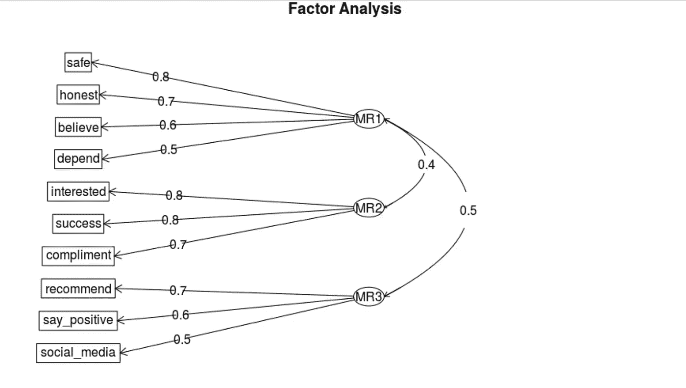

# 我们如何衡量忠诚度？调查发展介绍

> 原文：<https://towardsdatascience.com/how-do-we-measure-loyalty-an-introduction-to-survey-development-a08b6e30916c?source=collection_archive---------21----------------------->



[https://pixabay.com/photos/measuring-tape-measurement-tools-926716/](https://pixabay.com/photos/measuring-tape-measurement-tools-926716/)

试图“衡量忠诚度”听起来太疯狂了，只有德怀特·施鲁特才会这么说，但这是营销研究人员一直在做的事情。在本帖中，我们将介绍探索自我报告调查结果的基础知识，以发现哪些“潜在”因素可能反映在调查项目中。


[http://www.elitecolumn.com/wp-content/uploads/2018/03/Dwight-Schrute-Quotes-3.jpg](http://www.elitecolumn.com/wp-content/uploads/2018/03/Dwight-Schrute-Quotes-3.jpg)

这是心理学、市场营销和组织行为学等社会科学领域的常用技术，在这些领域，兴趣的概念可能无法直接测量。

# 心理测验学

通常这种类型的研究是在专有的社会科学工具中进行的，如 SPSS 或 MPlus，但我们将使用`R`进行分析。首先，我们将安装所有必需的包并加载两个数据框:`brand_loyalty`，它包含调查结果，以及`brand_loyalty_items`，它告诉我们关于调查中每个项目的更多信息。

```
# Download survey responsesbrand_loyalty <- read.csv("[https://cwru.box.com/shared/static/naelh1otw6dlsavj8jwnfmr021680xgk.csv](https://cwru.box.com/shared/static/naelh1otw6dlsavj8jwnfmr021680xgk.csv)")# Item description and proposed dimensionsbrand_loyalty_items <- read.csv("[https://cwru.box.com/shared/static/0qvuvuu47hmq75mi0ljl8qo7p29hs472.csv](https://cwru.box.com/shared/static/0qvuvuu47hmq75mi0ljl8qo7p29hs472.csv)",
                                stringsAsFactors = FALSE)
```

# 对调查的剖析

在我们开始分析数据之前，最好从受访者的角度来看调查。这里我们看到了与品牌忠诚度概念相关的十个“项目”。受访者用 1 到 5 分表示他们对每个项目的认同程度。这个评级系统被称为李克特量表，以其开发者，社会科学家伦西斯·利克特命名。



让我们通过探索性数据分析(EDA)来了解我们的回答，然后我们可以跳到如何使用它们来衡量忠诚度。

# 调查 EDA

我们假设我们的数据收集一切顺利——我们都知道这永远不会发生！没有丢失的值，没有需要重新编码的项目，什么都没有。实际上，在继续下面的步骤之前，您可能希望检查这些内容。

## 响应频率

我们的每一项产品都有一至五分的等级。将每个项目评为 1 的受访者比例是多少？A 3？通过`psych`中的`response.frequencies()`函数，我们可以看到每个项目响应的总体分布。我们将对输出进行舍入，并以百分比格式显示:

```
> round(response.frequencies(brand_loyalty),4) * 100
                1     2     3     4     5 miss
honest       1.00 10.00 42.00 36.00 11.00    0
safe         0.67  9.67 37.00 45.00  7.67    0
depend       0.67  8.00 34.00 47.67  9.67    0
believe      0.33  6.33 43.33 43.00  7.00    0
social_media 2.33 21.00 57.33 18.00  1.33    0
say_positive 0.33  8.33 49.67 38.00  3.67    0
recommend    3.67 22.67 45.67 24.67  3.33    0
success      1.33 15.33 52.00 27.33  4.00    0
interested   2.00  6.67 35.33 47.33  8.67    0
compliment   2.00 14.00 48.67 30.67  4.67    0
```

在这里，我们可以看到大多数项目的回答都集中在 3 到 4 的范围内。没有太多 1 和 5 的“极端”响应。我们还可以在这里确认没有丢失值。

让我们继续用可视化来分析响应频率。我们将使用`likert`包来绘制每个项目的响应频率。`likert`要求项目被结构化为因子，所以让我们使用`dplyr`中的`mutate_if()`来实现。

让我们用`brand_loyalty_items`的`description`列来标记这个图。通过这种方式，我们实际上可以看到回答者实际回应的提示。

```
library(likert)
library(dplyr)# Select likert items, convert to factorsbrand_loyalty_f <- brand_loyalty %>% 
  mutate_if(is.integer, as.factor)# Rename based on full item namesnames(brand_loyalty_f) <- c(brand_loyalty_items$description)# plot likert itemsresult <- likert(brand_loyalty_f)
plot(result, group.order = names(brand_loyalty_f))
```

可视化有助于理解每个项目的总体分散性。



## 项目相关性

我们对每个项目*本身的分数不感兴趣，相反，我们想用这些项目来衡量潜在的变量——忠诚度。项目之间存在什么样的关系，可能表明它们在测量一些共同点，以告诉我们关于忠诚度的信息？*

为了对这些关系有所了解，让我们用`corrplot`绘制一个相关热图。

```
library(corrplot)
corrplot(cor(brand_loyalty))
```



我们看到有些项目比其他项目更相关:具体来说，前四个、中间三个和最后三个项目似乎代表不同的项目“组”。



让我们再看一下调查。


显而易见，这些项目会有更高的相关性:前四个与品牌信任有关，中间三个与感知价值有关，最后三个与认同有关。

# 从相关性到因素

虽然 EDA 是一个有益的开端，但我们最终还是想测试我们是否有一个可靠有效的工具来衡量忠诚度。我们的下一步是通过探索性因子分析进行降维。是的，*又一个*“探索性”的步骤！

这一次，我们想探究潜在变量的多少个维度可能会反映在数据中。我们将这些项目与这些维度相关联，而不是将这些项目彼此相关联。

通过 EDA，我们有一种很好的感觉，这种仪器反映了三维，但我们可以通过另一种方法得到估计:并行分析。这将数据集与随机生成的数据集进行比较，并比较结果以提示数据中存在哪些重要维度。

这可以通过`psych`的`fa.parallel()`功能实现:

```
fa.parallel(brand_loyalty)
```

## 平行分析



我们稍后将更正式地解释这个所谓的“scree 情节”。现在，记住“肘规则”来估计建议的因素数量。“碎石”地块[因山坡上松散的岩石而得名](https://dictionary.cambridge.org/dictionary/english/scree)。建议的因子数量可以在曲线“倾斜”之前的 X 轴位置找到。在我们的图中，“下降”从因子 4 开始，所以因子的建议数量是 3。



如果还没有“点击”,不要担心——`fa.parallel()`的输出包含了以下信息:

```
> fa.parallel(brand_loyalty)Parallel analysis suggests that the number of factors =  3  and the number of components =  3
```

您可能会注意到，该图包括主成分和因子分析的输出。虽然这两种都是降维技术，但每种都有不同的目标。

主成分分析旨在用尽可能少的变量解释数据中尽可能多的总方差，这是一种优化规则，通过将索引变量创建为其他变量的组合来解决。

相比之下，因子分析通过潜在变量与一组显式变量之间的关系来衡量潜在变量。因素分析的目的是解释项目和维度之间的相关性。每个变量被定义为维度的线性组合。

这两种技术都不优于另一种——这完全取决于上下文。在这种情况下，因为我们的目标是测量一个潜在变量，所以因子分析是比主成分分析更好的选择。

## 探索性因素分析:建模与诊断

从 EDA 和并行分析中，我们倾向于在我们的数据中反映三维。让我们通过一个完整的探索性因素分析(EFA)来建立这个模型。在这一点上，我们根据经验寻找数据中的关系，通过各种诊断评估看起来合适的维数。

我们将从`psych`开始通过`fa()`函数进行 EFA，将`nfactors`设置为`3`。让我们把全民教育的结果分配给`brand_loyalty_efa`。这将有助于访问结果中的元素——结果中有 50 多个元素！

*注意:*`fa()`功能需要安装`GPArotation`。

```
> brand_loyalty_efa <- fa(brand_loyalty, nfactors = 3)> names(brand_loyalty_efa)
 [1] "residual"      "dof"           "chi"           "nh"            "rms"           "EPVAL"         "crms"         
 [8] "EBIC"          "ESABIC"        "fit"           "fit.off"       "sd"            "factors"       "complexity"   
[15] "n.obs"         "objective"     "criteria"      "STATISTIC"     "PVAL"          "Call"          "null.model"   
[22] "null.dof"      "null.chisq"    "TLI"           "RMSEA"         "BIC"           "SABIC"         "r.scores"     
[29] "R2"            "valid"         "score.cor"     "weights"       "rotation"      "communality"   "communalities"
[36] "uniquenesses"  "values"        "e.values"      "loadings"      "model"         "fm"            "rot.mat"      
[43] "Phi"           "Structure"     "method"        "scores"        "R2.scores"     "r"             "np.obs"       
[50] "fn"            "Vaccounted"
```

每一个输出都讲述了一个关于我们全民教育的故事，但我们不能看全部，对吗？考虑这三个诊断，你的全民教育诊断的“悬崖笔记”——按重要性排序:因子负荷、特征值和因子得分相关性。

## 因素负荷

这实质上是每个项目与潜在变量的维度的相关性。虽然没有一个准则说明什么是强因子载荷，但我们将使用大于|.5|的基本经验法则。项目可以加载到多个因子，但任何“次要”加载都应小于|.3|。

使用`$loadings`可以从我们的全民教育输出中获取因素负载:

```
> brand_loyalty_efa$loadings

Loadings:
             MR1    MR2    MR3   
honest        0.692              
safe          0.755              
depend        0.549  0.114       
believe       0.594  0.137       
social_media  0.217         0.475
say_positive                0.635
recommend                   0.733
success              0.774       
interested           0.776       
compliment           0.677  0.184

                 MR1   MR2   MR3
SS loadings    1.756 1.705 1.226
Proportion Var 0.176 0.170 0.123
Cumulative Var 0.176 0.346 0.469
```

那么，这是怎么回事呢？我们有一些二次装载，但都在 0.3 以下。看起来除了`social_media`外，所有的主载荷都超过了. 5。在 0.475。

我们应该放弃吗？记住，这些不是一成不变的规则。如果我们相信这个项目提供了关于潜在变量的独特信息，我们应该保留它。然而，如果我们发现它是无用或多余的项目，我们可以以节俭的名义放弃它。我们可以在调查开发的后期更正式地测试`social_media`的效用。

## **特征值**

接下来，我们将考虑“凯泽-古特曼法则”来确定正确的因子数。这是确定 EFA 中因子数量的传统方法:我们应该将因子数量设置为等于大于 1 的特征值[的数量。](https://thepsychologist.bps.org.uk/volume-21/edition-10/finding-magic-number)这符合逻辑，因为超过 1 的特征值表示方差的“一个变量的价值”。

可以在对象`e.values`中找到特征值:

```
> brand_loyalty_efa$e.values
 [1] 3.6206684 1.5647759 1.2282820 0.6919068 0.6401634 0.5247305 0.5144098 0.4666997 0.4019293 0.3464342
```

特征值表明了三个因素——但是你已经从碎石图中知道了！

## 碎石图，重访

让我们再来看看碎石图。通过将原始数据帧`brand_loyalty`传递给`scree()`函数，我们可以产生一个不那么“繁忙”的版本:

```
scree(brand_loyalty)
```

这和之前的图是一样的，但是仔细看看 Y 轴:它们是特征值！不仅如此，穿过 Y 轴的实线被设置为 1。所以，我们只是精确地估计了我们在 scree 图中的视觉效果。



**因素得分相关性**

在全民教育中，因子得分是以数值的形式产生的，这些数值表明每个回答者在一个因子的每个维度上的相对地位。我们可以通过调用输出的`scores`对象上的`head()`函数来查看这些分数的预览:

```
> head(brand_loyalty_efa$scores)MR1         MR2        MR3[1,] -0.2352680 -0.05711601 -1.5141629[2,] -0.2350122 -0.45791785  0.6840743[3,] -0.7019507 -0.83111162 -0.3847279[4,]  0.7754942  0.95429483  0.9438122[5,]  0.8629493  0.95651211  0.7357261[6,] -1.1570106  0.93738262 -1.3978041
```

为什么要看我们的因子得分相关性？记住，每个维度都应该衡量我们潜在变量的一个相关但不同的方面。如果两个因素*过于*高度相关(通常超过 0 . 6)，它们可能测量的是同一事物，在这种情况下，我们会以简约的名义减少因素的数量。

因素得分相关性存储在`score.cor`对象中:

```
> brand_loyalty_efa$score.cor
          [,1]      [,2]      [,3]
[1,] 1.0000000 0.3640649 0.4102557
[2,] 0.3640649 1.0000000 0.2547783
[3,] 0.4102557 0.2547783 1.0000000
```

# 概述:全民教育诊断

从所有的诊断来看，我们似乎在三维空间的正确轨道上。因子得分相关性不太高，我们符合特征值的 Kaiser-Guttman 规则，所有主要因子载荷都大于|.5|…嗯，除了`social_media`，我们现在保留它。

如果我们的调查不符合这些标准，我们有两个一般选项:

1.  丢弃装载不良的物品，以及
2.  改变因子的数量。

幸运的是，我们的全民教育到位了，所以我们可以继续下去。

# 模型图:每张图片都讲述了一个故事

似乎我们的十个项目中的每一个都反映了该结构的三个维度之一，“品牌忠诚度”为了达到这一点，我们已经打印了*许多*数字，所以让我们使用`psych`中的`fa.diagram()`函数，用我们的全民教育模型的有用可视化来结束我们的分析:



在这里，我们看到了清单变量和它们加载到的维度之间的关系。当我们测量物品如何“反映”尺寸时，箭头从尺寸指向*尺寸*到*物品。这三个维度也是相互关联的——因子 2 和因子 3 之间的相关性非常低，以至于没有在图表中显示出来。*

# 下一步是什么？

那么，我们已经满意地测量了忠诚度了吗？

不完全是。

探索性因素分析就是:探索性的。接下来，我们想用—你猜对了！— *验证性*因子分析。这将是一个正式的假设检验，以建立我们理论上定义的模型和数据中存在的东西之间的关系。

我们还想测量我们的工具的可靠性和有效性，知道它可以持续测量我们声称要测量的东西。

我计划在以后的数据科学文章中讨论这些主题。

在那之前，用下面的完整代码练习你的 EFA 技能。