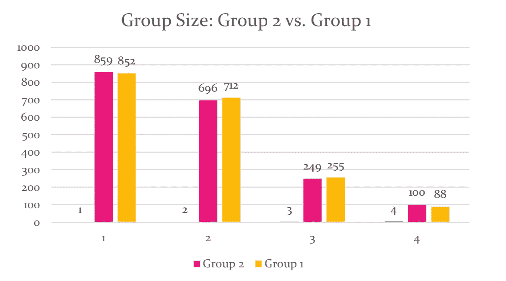
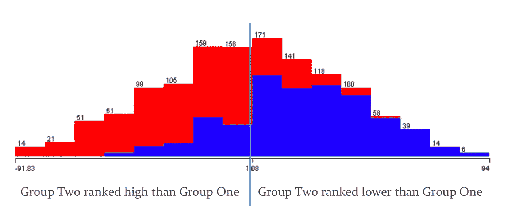
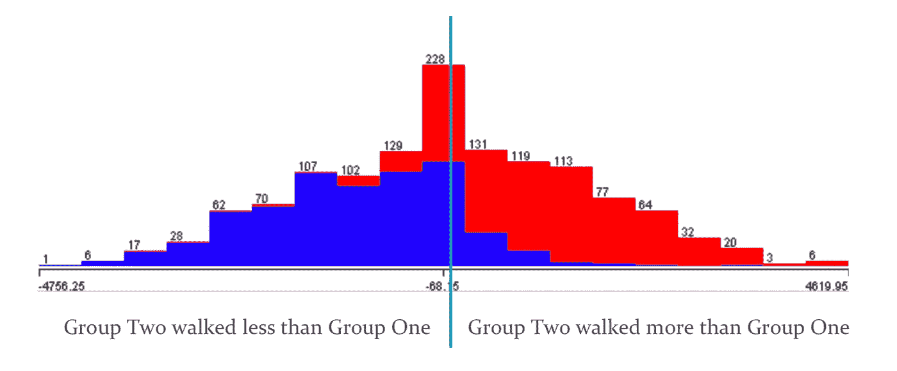
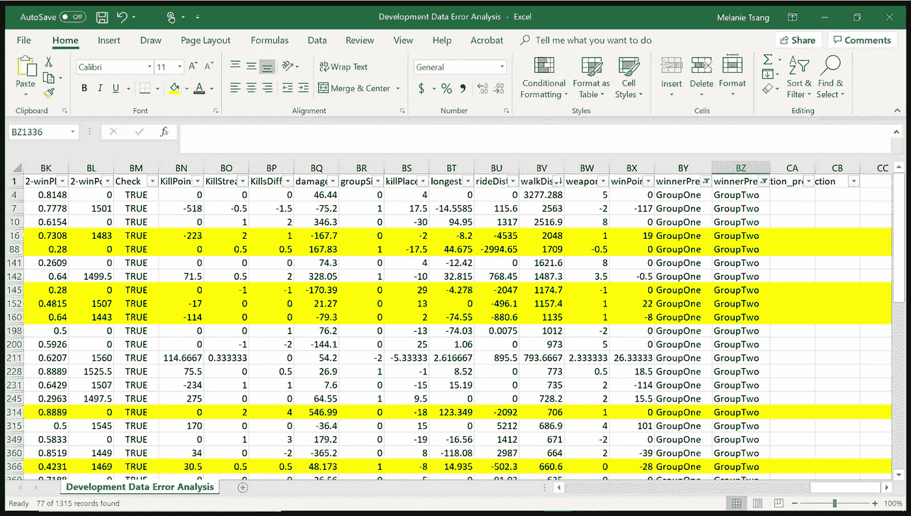
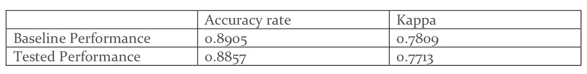
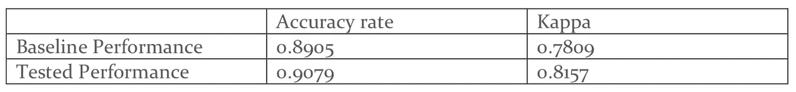
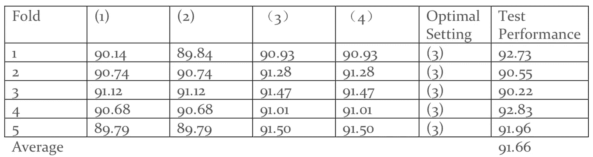
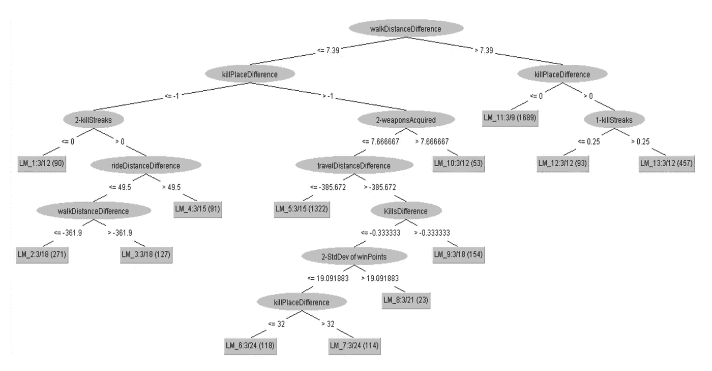

# 我们如何在 PUBG 生存？

> 原文：<https://towardsdatascience.com/how-do-we-survive-in-pubg-903e261b260?source=collection_archive---------19----------------------->

layer Unknown's Battle Grounds，也称为 PUBG，是一款流行的视频游戏，每月有数百万活跃用户。在每场游戏中，100 名玩家被丢在一个岛上的不同地方。他们必须找到供应品和武器，并与其他玩家战斗，以便生存到最后一个离开。玩家可以选择与最多 3 名其他玩家组队或单独游戏。在游戏过程中，随着游戏区不断缩小和移动，他们被迫四处移动。我对学习这些游戏玩家在模拟生存世界中的行为很感兴趣，以了解其背后的心理。人们更喜欢组队还是单打独斗？他们更有可能战斗还是躲藏？什么样的策略可以帮助他们生存到最后？

这个项目也是我第一次尝试机器学习中的特征工程过程，包括错误分析、特征空间评估、集成和调整过程。我使用 Weka 和 Lightside 来实现我的实验。这篇文章不会教你任何代码，但它是机器学习过程的一个综合案例，包括数据清理、数据集分割、交叉验证和功能设计。

# 数据收集

在 [Kaggle](https://www.kaggle.com/c/pubg-finish-placement-prediction) 上找到的数据集包含超过 445 万个实例和 28 个特征(参见参考资料中的数据源)。有代表每个游戏比赛 Id、代表每个组的组 Id(从 1 到 4 变化)和代表每个玩家的玩家 Id。数据被格式化为每个实例作为每个玩家的赛后统计数据。特征包括在游戏中的表现，比如复活团体成员的次数、击杀次数、行走距离等。(见附录)。还有外部排名的功能，表明玩家在游戏之外的表现。在 0 到 1 的范围内(1 是第一名，而 0 是最后一名)，每场比赛的获胜位置百分比被重新构造为最终预测类别。

我选择了游戏模式“小队”,玩家可以组成 1-4 人一组对抗其他组。原因是数据集中的许多要素都与群体绩效有关。我将每个实例转换为代表每个组，并取平均值和一些特征的标准偏差。我在每场比赛中随机保留 2 组，以比较哪组排名更高。在训练集和测试集中，我将获胜位置百分比转换为“获胜者预测”，该值显示排名较高的组，以便使其成为二元预测。我还添加了一些有意义的特征来进行比较，并以它们之间的差异作为值，如团队规模差异，杀死等级差异，步行距离差异，获得的武器数量差异。关于数据清洗，我去除了同一个游戏重复玩家、负面排名、大于 4 的小组规模等不合理的数据。我按照随机顺序分割数据集，分割比例如下:交叉验证集 70%，开发集 20%，测试集 10%。**我想预测的是在每场游戏**中随机抽取的两个组中，哪一组会是赢家，所以分类是基于赢家预测的。在数据清理过程之后，有 6576 个实例和 65 个特征。获胜者预测中的“第二组”和“第一组”在每个分割数据集中都占据大约 50%。

# 数据探索

我首先对开发集进行了探索性的数据分析，以获得对数据的自然理解。以下是一些有趣的发现。

> *人们更喜欢独奏还是合奏？*

组 2 和组 1 的组大小分布非常相似。似乎大多数人更喜欢独自或只和一个伙伴玩游戏。

> 当我们积极地比赛时，我们更有可能赢吗？

由第二组的杀死等级减去第一组的杀死等级计算的杀死位置差异的分布似乎是正态分布。因此，在 Y 轴为正的图表右侧，第二组排名较低，而在 Y 轴为负的左侧，第二组排名较高。如下图所示，红色部分是第二组获胜者，蓝色部分是第一组获胜者。这张图表明，在大多数情况下，当一个团队的击杀等级高时，它更有可能获胜。

> *移动和隐藏哪个是更好的游戏策略？*

通过第二组的步行距离减去第一组的步行距离计算的步行距离差的分布也呈现正态分布。因此，在 Y 轴为正的图的右侧，第二组比第一组走得多，而在 Y 轴为负的左侧，第二组比第一组走得少。如下图所示，红色部分是第二组获胜者，蓝色部分是第一组获胜者。这张图表说明，在大多数情况下，当一个团队行进的距离更长时，它更有可能获胜。

# 误差分析

我首先选择了逻辑回归，因为所有要素都是数字数据，而预测是二进制的，基于权重的模型对此很有用。对于 65 个特征，基于树的模型将是耗时的。我的基准表现如下，准确率 0.8905，Kappa 0.7809。

**1。水平差异分析**

我首先检查了预测游戏获胜者是第二组的实例，而实际上是第一组。我将水平差异从最大到最小排序，并查看具有相对较大特征权重的特征。我发现 walkDistanceDifference 横向差异大，特征权重相对重要。walkDistanceDifference 的计算方法是第二组的行走距离减去第一组在同一场比赛中的行走距离，因此负数意味着第二组在比赛中比第一组走得少，而正数意味着第二组走得多。这意味着走得多的那一组更有可能获胜(这在游戏设置中是有意义的，因为这可能意味着他们存活得更久)。然而，也可能有例外，一组玩得更积极，出去得更多，因此输得更快，而另一组则倾向于安全，大部分时间躲在一个地方，存活更长时间。

为了进一步解决这个问题，我还下载了 csv 文件中的预测标签，查看预测第二组获胜而第一组实际获胜的实例，然后将 walk distance 差异从最大到最小排序，以便我可以查看第二组走得更长但输掉游戏时的异常情况。

我发现的一件事是，有时第二组比第一组走得多，但第一组开车的距离更长(在游戏中他们可以选择骑一辆车，如果他们找到一辆车的话)。正如突出显示的例子所示，有许多组走的不如另一组多，但开车比另一组多得多。因此，仅测量步行距离或乘车距离可能无法很好地正确显示总行驶距离。此外，rideDistance 具有第二大水平差异。因此，这两个特点似乎是有问题的，需要进一步的代表性。

**因此，我通过将步行距离和乘车距离组合作为第二组、第一组和两组之间的差异的总行驶距离，提出了 3 个新特征。**

我在开发集中测试了新的特性空间，并得到了一个微不足道的改进。虽然不重要，但预测第二组的实例数量实际上减少了 5 个，并被校正为第一组。

然而，当我将它应用于交叉验证集时，它实际上降低了性能。最可能的原因是开发集中的改进是过度拟合的，它没有推广到新的数据集。

**2。垂直差异分析**

然后，我通过检查垂直绝对差进行了另一项误差分析。由于新的开发集在实例中引入了更多的错误，预测第一组，但实际上是第二组，我的目标是找出这两组实例看起来如何彼此相似。我发现 1-KillPlace 特征具有较小的垂直差异和较大的特征权重。这是一个只有第一组的基于杀戮的排名。第一组获胜时的平均排名在 34 位左右，失败时在 43 位左右。这里的例外是，有时第一组输了，即使它的排名高达 34。正如我之前提到的，有时候一个团队打得更有侵略性，杀了更多的人，所以他们的杀戮排名很高，但他们也有更高的风险输掉比赛。

这里给我的一个启发是，逻辑回归擅长全局分析，但它可能会因一些极端的例外而有所偏差。我需要一种算法，它可以忽略极端的异常，一次只查看较小的数据集。决策树可能是一个很好的方法，但由于我有 68 个数字数据的特征，决策树可能需要大量的时间来建立模型。如果我能结合逻辑回归和决策树的优势呢？**逻辑模型树(LMT)** 将是一个很好的选择，因为它可以捕捉非线性模式和更高的方差。所以我尝试使用 LMT 并比较这两种算法的结果，我在开发集上有了显著的改进。

我在交叉验证集上应用了该模型，并取得了显著的改进。

**3。合奏**

由于 boosting 将特别检查以前的模型在迭代过程中分类错误的实例，我认为这是一个提高我的例子的准确性的好方法。所以我在开发集上用 LMT 的分类器尝试 AdaBoost，然而，性能降低了。

由于我的特征空间相对复杂，我的下一步探索是减少可能不是好指标的特征。我尝试了 AttributeSelectedClassiflier，用主成分作为赋值器。使用主成分的原因是为了减少特征空间的维数，同时保留尽可能多的信息。最后，性能也降低了。

我还尝试了 CfsSubsetEvaluator，因为我拥有的很多特性都是相互关联的，比如 killPlace 和 KillPoints。这个赋值器将帮助我有选择地保留与类相关的有用特性，但不重复其他特性。事实证明，性能也没有比我的基线更好。

我会尝试的另一个好的赋值器是 SVMAttributeEvaluator，因为它是一个反向消除方法，对我的大特征空间有好处，但是，Weka 和 Lightside 不提供这个选项。

**4。特征空间评估**

除了我之前尝试的包装器方法之外，我还想探索使用过滤器方法是否可以提高性能，因为它允许我独立地选择算法之外的特性。

我使用了 AttributeSelectedEvaluator 和主成分作为评估器。三种不同的设置是原始特征空间(68 个特征)、40 个特征和 20 个特征。我做了一个实验来测试三个特征空间。但是这两个新的特征空间实际上降低了性能。我还测试了其他评估者，得到了相同的结果，所以我决定保持特征空间不变。

# 调谐过程

我想调整 LMT 算法的两个参数。对于 minNumberInstances，缺省值是 15，我想测试 50。我想知道，通过添加更多节点被视为分裂的实例，是否会提高每个节点的准确性，从而提高整体性能。对于 boostingIterations，默认值为-1，表示没有迭代。我想测试 3，看看它是否提高了分类精度。

因此，我测试的四个设置如下:(1)节点被认为分裂的最小实例数为 15，提升迭代次数为-1(意味着不迭代)，(2)实例数 50，提升迭代次数-1，(3)实例数 15，提升迭代次数 3，(4)实例数 50，提升迭代次数 3。请注意，设置(1)是默认设置。我用准确率来衡量性能。

第一阶段:
(1)90.81(2)90.81(3)91.05(4)91.05

设置(3)是最佳设置，因为它具有最高的准确率，并且比(4)简单。

第三阶段:

根据阶段 1，设置(3)是最佳设置。在第三阶段，我也选择了设置(3)作为每个折叠的最佳设置。在这种情况下，我没有运行任何重要的测试，也没有证据表明优化是值得的。

似乎每个节点上实例的最小权重对模型性能没有太大影响。但是，增加迭代次数可能有助于提高多次尝试的准确性。

在一个全新的数据集上，如果我使用设置(3)，我估计性能大约为 91.66，因为它是 5 倍测试性能的平均值。

# 最终评估

最后，我使用 LMT 在交叉验证集上训练了一个模型，设置(3)实例数为 15，增加迭代次数为 3。在添加了来自错误分析的 3 个新特征之后，我保留了特征空间。我从最终测试集中获得的最终性能是 0.9179 的准确率，这接近于我在调优过程中的估计，Kappa 是 0.8359。

Tree View

# 反射

通过观察该树，该模型从步行差开始，并在一些点上在骑行距离和旅行距离差处分裂，这证明了我在误差分析期间新添加的特征的重要性。尽管一些节点在仅与其中一个组相关的特征处分裂，例如组 2-killStreaks，但是许多其他节点使用两个组的差异，甚至赢点的标准偏差。这也显示了保留原始特征以及添加组合特征的有用性。根据主树选取的特征，要赢得游戏，移动距离、杀戮能力和群体成员生存能力的方差是重要因素。一般来说，我们玩得越有侵略性，也就是说频繁移动和杀死更多的人，我们就越有可能赢。

在这个项目中，我经历了误差分析，包括水平差异分析，垂直差异分析，集成算法和特征空间评估，以及调整过程。最有帮助的步骤是观察特征空间并手动执行特征工程。选择适合数据的正确算法也很重要。在我的例子中，我结合了回归模型和树模型的优点，回归模型擅长将线性模型拟合到数字数据中，树模型提供了更多的方差并补偿了非线性的极限。我能够在交叉验证集上显著提高模型性能，并在最终测试集上达到 91.79%的分类准确率。

我的项目分析有一些限制。首先，我只测试了一种游戏模式下的数据，结果可能不适用于现实世界中的所有游戏模式。第二，我没有预测排名，而是选择将项目范围转向二进制分类。我从一场比赛中随机挑选了两组，并试图预测谁会赢得比赛。在这种情况下，通过移除其他组的表现，我移除了一些涉及的方差和因素，这些方差和因素也可能影响对现实世界中游戏结果的预测。

总之，我能够达到我的目标，预测 PUBG 游戏的赢家，并找出一些可以影响游戏结果的重要行为。为了进一步评估，可以引入来自其他游戏模式的数据，并且可以测试其他类型的预测。