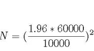
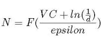
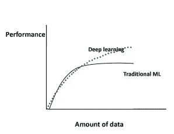
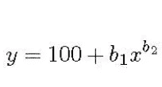

# 你怎么知道你有足够的训练数据？

> 原文：<https://towardsdatascience.com/how-do-you-know-you-have-enough-training-data-ad9b1fd679ee?source=collection_archive---------3----------------------->

©pathdoc/AdobeStock

最近有一些关于数据是否是新石油的争论。不管是哪种情况，为我们的机器学习工作获取训练数据可能是昂贵的(在工时、许可费、设备运行时间等方面)。).因此，机器学习项目中的一个关键问题是确定需要多少训练数据来实现特定的性能目标(即，分类器准确性)。在这篇文章中，我们将对从回归分析到深度学习的领域中关于训练数据大小的经验和研究文献结果进行快速而广泛的回顾。训练数据大小问题在文献中也被称为*样本复杂度。*具体来说，我们将:

提出回归和计算机视觉任务的经验训练数据大小限制。

给出统计检验的期望功效，讨论如何确定样本量。这是一个统计题目；但是，考虑到它与机器学习中确定训练数据大小的密切关系，将其包括在此讨论中是合适的。

呈现统计理论学习的结果，关于什么控制训练数据的大小。

提供以下问题的答案:随着训练数据的增长，性能会继续提高吗？深度学习的情况下会发生什么？

我们将提出一种方法来确定分类中的训练数据大小。

最后，我们将提供一个问题的答案:训练数据的增长是处理不平衡数据的最好方法吗？

**训练数据量的经验界限**

让我们首先根据我们使用的模型类型，讨论一些广泛使用的经验方法来确定训练数据的大小:

回归分析:根据 1/10 的经验法则，我们需要每个预测因子 10 个病例[3]。在[4]中讨论了不同的版本，例如 1/20，以解决回归系数收缩。一个令人兴奋的，最近开发的，二元逻辑回归的变化是在[5]中提出的。具体来说，作者通过考虑预测变量的数量、总样本量和正样本/总样本量的分数来估计训练数据量。

计算机视觉:对于使用深度学习的图像分类，经验法则是每类 1000 张图像，如果使用预先训练的模型，这个数字可以显著下降[6]。

**假设检验样本量的确定**

假设检验是数据科学家可以用来检验人群之间的差异、确定新药效果等的工具之一。在这种情况下，考虑到检验的功效，通常需要确定样本量。

让我们考虑这个例子:一家科技巨头搬到了 A 城，那里的房价大幅上涨。一名记者想知道公寓的新均价是多少。给定 60K 处的公寓价格的标准差和 10K 可接受的误差幅度，有 95%的置信度时，应该平均多少公寓销售价格？对应的公式如下所示；n 是他将需要的样本大小，1.96 是来自标准正态分布的数字，对应于 95%的置信度

Estimation of sample size

根据上述等式，记者需要考虑大约 138 套公寓的价格。

上述公式根据具体的测试而变化，但它将始终包括置信区间、可接受的误差幅度和标准偏差的度量。关于这个话题的很好的讨论可以在[7]中找到。

**训练数据量的统计学习理论**

我们先来介绍一下著名的 Vapnik-Chevronenkis (VC)维度[8]。VC 维是模型复杂性的度量；模型越复杂，其 VC 维越高。在下一段中，我们将介绍一个根据 VC 指定训练数据大小的公式。

首先，让我们看一个经常用来显示 VC 是如何计算的例子:想象我们的分类器是一个 2-D 平面中的直线，我们有 3 个点需要分类。无论这 3 个点的正/负组合可能是什么(全部正，2 个正，1 个正，等等。)，一条直线就能正确地将阳性和阴性样本分类/分开。因此，我们说线性分类器可以*粉碎*任何点，因此，它的 VC 维至少是 3。并且因为我们可以找到不能被线精确分开的 4 个点的例子，我们说线性分类器的 VC 精确地是 3。事实证明，训练数据大小 N 是 VC 的函数[8]:

Estimation of training data size from the VC dimension

其中 *d* 是失败的概率，而*ε*是学习误差。*因此，如[9]所述，学习所需的数据量取决于模型的复杂程度。*这种做法的一个副作用是众所周知的神经网络对训练数据的贪婪，因为它们非常复杂。

**随着训练数据的增长，性能会继续相应提高吗？深度学习的情况下会发生什么？**

Figure 1.

图 1 显示了在传统机器学习[10]算法(回归等)的情况下，机器学习算法的性能如何随着数据量的增加而变化。)而在深度学习的情况下[11]。具体来说，对于传统的机器学习算法，性能按照幂律增长，然后达到平稳状态。关于深度学习，有大量正在进行的研究，关于性能如何随着数据量的增加而扩展[12]-[16]，[18]。图 1 显示了这项研究的当前共识；对于深度学习，根据幂定律，性能随着数据大小不断增加。例如，在[13]中，作者使用深度学习技术对 3 亿张图像进行分类，他们发现性能随着训练数据大小的增加而呈对数增长。

让我们在这里包括一些值得注意的，与上述相反的，在深度学习领域的结果。具体来说，在[15]中，作者将卷积网络用于 1 亿幅 Flickr 图像和说明的数据集。关于训练数据大小，他们报告说性能随着数据大小的增加而提高；然而，在 5000 万张图像之后，它就稳定下来了。在[16]中，作者发现图像分类精度随着训练数据大小而增加；然而，在某个模型依赖点之后，最初也增加的模型稳健性开始下降。

**确定分类中训练数据大小的方法**

这是基于众所周知的学习曲线，它通常是误差与训练数据大小的关系图。[17]和[18]是了解机器学习中学习曲线以及它们如何随着偏差或方差的增加而变化的极好参考。Python 在 scikit-learn 中提供了一个学习曲线函数[17]。

在分类中，我们通常使用稍微不同形式的学习曲线；这是*分类精度*与训练数据大小的关系图。确定训练数据大小的方法很简单:确定您的领域的学习曲线的确切形式，然后，只需在图上找到所需分类精度的对应点。例如，在参考文献[19]、[20]中，作者在医学领域使用学习曲线方法，并用幂律函数来表示:

Learning curve equation

其中 y 是分类精度，x 是训练集，b1，b2 对应学习率和衰减率。参数根据问题域而变化，并且它们可以使用非线性回归或加权非线性回归来估计。

**训练数据的增长是处理不平衡数据的最好方法吗？**

© hin255/AdobeStock

这个问题在[9]中有所论述。作者提出了一个有趣的观点；*在不平衡数据的情况下，准确度不是分类器性能的最佳衡量标准。*原因很直观:让我们假设负类是主导类。那么我们就可以达到很高的准确率，通过预测大部分时间是负面的。相反，他们提出精度和召回率(也称为敏感度)是衡量不平衡数据性能的最合适的方法。除了上述明显的准确性问题之外，作者声称测量精度对于不平衡域来说本质上更重要。例如，在医院的报警系统[9]中，高精度意味着当警报响起时，很有可能确实是某个病人出现了问题。

有了适当的性能度量，作者比较了包不平衡学习[21] (Python scikit-learn 库)中的不平衡校正技术与简单使用更大的训练数据集。具体来说，他们在一个包含 50，000 个样本的药物发现相关数据集上使用了带有不平衡校正技术的 K-最近邻，然后在大约 100 万个样本的原始数据集上与 K-NN 进行了比较。上述软件包中的不平衡校正技术包括欠采样、过采样和集成学习。作者将实验重复了 200 次。他们的结论简单而深刻:*就测量精度和召回率而言，任何失衡纠正技术都无法与添加更多训练数据相提并论。*

至此，我们已经结束了我们的快速参观。下面的参考资料可以帮助你更多地了解这个主题。感谢您的阅读！

**参考文献**

[1] **世界上最有价值的资源不再是石油，而是数据，**[https://www . economist . com/leaders/2017/05/06/The-worlds-Most-valued-Resource-Is-again-Oil-But-Data](https://www.economist.com/leaders/2017/05/06/the-worlds-most-valuable-resource-is-no-longer-oil-but-data)2017 年 5 月。

[2] Martinez，A. G .，**不，数据不是新油，**[https://www.wired.com/story/no-data-is-not-the-new-oil/](https://www.wired.com/story/no-data-is-not-the-new-oil/)2019 年 2 月。

[3] Haldan，m .，**需要多少训练数据？**，[https://medium . com/@ Malay . haldar/how-much-training-data-do-you-need-da 8 EC 091 e 956](https://medium.com/@malay.haldar/how-much-training-data-do-you-need-da8ec091e956)

[4]维基百科**，十分之一法则**，[https://en.wikipedia.org/wiki/One_in_ten_rule](https://en.wikipedia.org/wiki/One_in_ten_rule)

[5] Van Smeden，m .等，**二元 Logistic 预测模型的样本量:超出每个变量标准的事件**，医学研究中的统计方法，2018。

[6]皮特·沃顿的博客，**训练一个神经网络需要多少图像？**，[https://Pete warden . com/2017/12/14/how-many-images-do-you-neural-network-training/](https://petewarden.com/2017/12/14/how-many-images-do-you-need-to-train-a-neural-network/)

[7] Sullivan，l .，**功率和样本大小分布，**[http://SPH web . bumc . bu . edu/otlt/MPH-Modules/BS/BS 704 _ Power/BS 704 _ Power _ print . html](http://sphweb.bumc.bu.edu/otlt/MPH-Modules/BS/BS704_Power/BS704_Power_print.html)

[8]维基百科， **Vapnik-Chevronenkis 维度**，[https://en . Wikipedia . org/wiki/VAP Nik % E2 % 80% 93 chervonenkis _ Dimension](https://en.wikipedia.org/wiki/Vapnik%E2%80%93Chervonenkis_dimension)

[9] Juba，b .和 H. S. Le，**精确召回与准确性以及大数据集的作用，**人工智能促进协会，2018 年。

[10]朱，x .等，**我们需要更多的训练数据吗？**[https://arxiv.org/abs/1503.01508](https://arxiv.org/abs/1503.01508)，2015 年 3 月。

[11] Shchutskaya，v .，**计算机视觉市场最新趋势，**[https://indata labs . com/blog/data-science/Trends-Computer-Vision-software-Market？cli_action=1555888112.716](https://indatalabs.com/blog/data-science/trends-computer-vision-software-market?cli_action=1555888112.716)

[12] De Berker，a .，**预测深度学习模型的性能，**[https://medium . com/@ archydeberker/Predicting-the-Performance-of-Deep-Learning-Models-9cb 50 cf 0 b 62 a](https://medium.com/@archydeberker/predicting-the-performance-of-deep-learning-models-9cb50cf0b62a)

[13]孙，c .等，**再论深度学习** **时代**，[2017 年 8 月](https://arxiv.org/abs/1707.02968)。

[14]赫斯提，j .，**深度学习缩放是可预测的，从经验上来说，**[https://arxiv.org/pdf/1712.00409.pdf](https://arxiv.org/pdf/1712.00409.pdf)

[15]朱林，一个**。，从大量弱监督数据中学习视觉特征，**【https://arxiv.org/abs/1511.02251】T2，2015 年 11 月。

[16]雷，s .等，**训练数据如何影响用于图像分类的神经网络的精度和鲁棒性**，会议，2019。

[17] **教程:Python 中机器学习的学习曲线**，[https://www . data quest . io/blog/Learning-Curves-Machine-Learning/](https://www.dataquest.io/blog/learning-curves-machine-learning/)

[18] Ng，r .，**学习曲线**，[https://www.ritchieng.com/machinelearning-learning-curve/](https://www.ritchieng.com/machinelearning-learning-curve/)

[19]Figueroa，R. L .等人，**预测分类性能所需的样本量**，BMC 医学信息学和决策制定，12(1):8，2012。

[20] Cho，j . et al .**训练一个医学图像深度学习系统需要多少数据才能达到必要的高精度？**，[https://arxiv.org/abs/1511.06348](https://arxiv.org/abs/1511.06348)，2016 年 1 月。

[21]g .勒迈特、f .诺盖拉和 C. K .阿里达斯，**不平衡学习:一个 Python 工具箱来解决机器学习中不平衡数据集的诅咒**，[https://arxiv.org/abs/1609.06570](https://arxiv.org/abs/1609.06570)