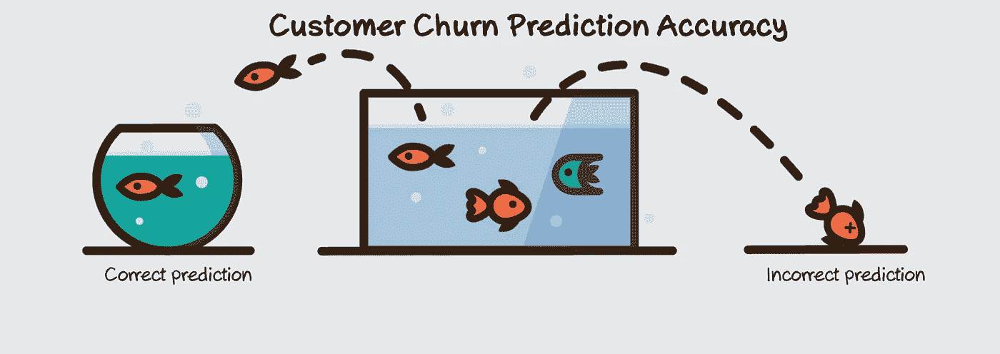
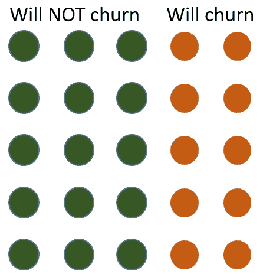
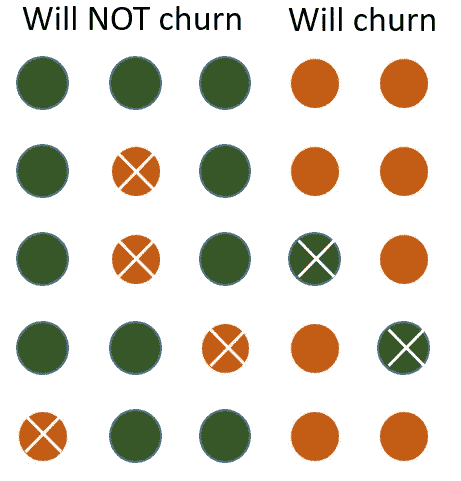
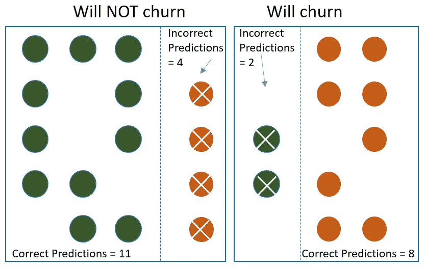
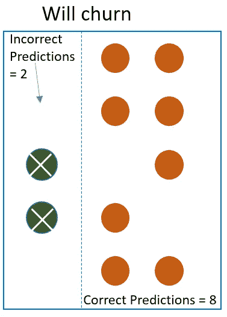
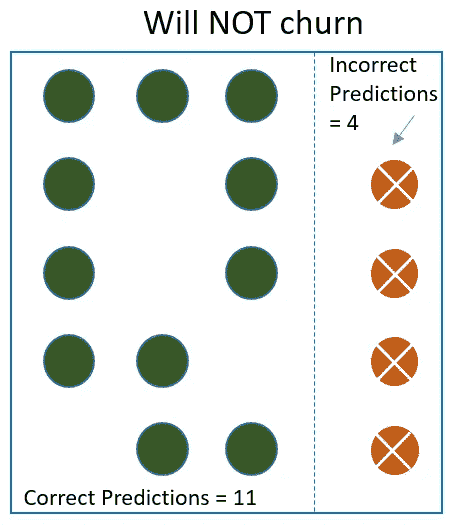
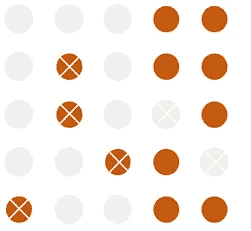
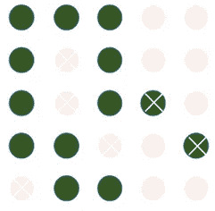

# 你如何衡量你的客户流失预测模型是否良好？

> 原文：<https://towardsdatascience.com/how-do-you-measure-if-your-customer-churn-predictive-model-is-good-187a49a9eee3?source=collection_archive---------9----------------------->

准确性是一个关键的衡量标准，管理层在批准将模型投入生产之前会查看准确性。本文讨论了度量什么和如何度量的实际方面。

# 测量精度时需要考虑的两个要点

1.  测量准确度时使用的数据不应在培训中使用。您可以将数据分成 80%和 20%。使用 80%进行训练，使用剩余的 20%进行预测，并将预测值与实际结果进行比较，以确定准确性
2.  一个结果掩盖了另一个结果。比如说你 95%的交易都不是诈骗。如果算法标记每一笔交易不是欺诈，它的正确率为 95%。所以准确率是 95%,但 5%的误差会让你倾家荡产。在这些场景中，我们需要处理其他指标，如敏感性和特异性等。我们将在本文中以实用的方式介绍这一点。

# 问题定义

这个预测性问题的目标是确定哪些客户会流失。数据集有 1000 行。使用 80%的样本(800 行)进行训练，使用 20%的数据来度量准确性。(200 行)。假设我们已经用 800 行训练了模型，并在 200 行上进行预测。

# 标记的实际流失结果

为了直观地解释这个问题，假设我的测试数据有 25 个客户。

在这 25 个客户中，15 个不会流失(绿色)，10 个已经流失(红色)。这些是实际的结果。现在，让我们应用训练好的模型来预测谁会流失。

# 预测的流失结果已标记

这些是预测的结果。这个算法犯了很多错误。

它正确地预测了一些，也错误地预测了一些。例如，它将一些会流失的客户标记为不会流失，也将一些不会流失的客户标记为会流失的人。预测错误的用 x 标记。

# 预测结果统计

为了更容易理解，我在每组中直观地划分了预测，这样我们就知道哪些预测是正确的，哪些是错误的。

1.  它准确地预测了 8 个会流失的客户。(这叫真正)
2.  它*错误地*预测了 2 个将流失的客户为不流失。(这叫做假阳性)
3.  它预测了 11 个不会正确流失的客户(这被称为真阴性)
4.  它*错误地*预测了 4 个不会流失的客户。(这叫做假阴性)

记住这些流行语的方法是…假阳性被错误地预测为阳性(又名错误地预测为流失)，假阴性被错误地预测为阴性(又名错误地预测为不会流失)。

# 感兴趣的精度测量

常见的问题是:

1.  整体准确度如何？
2.  模型能够标记为将流失的客户占实际流失客户的百分比是多少？
3.  模型能够标记为不会流失的实际不会流失的客户百分比是多少？
4.  有百分之多少的客户预测客户会真正流失？
5.  预测不会流失但实际上不会流失的客户比例是多少？

# 1.整体准确度如何？

正确预测的总数/总数= (11 + 8) / 25 = 76%

# 2.该模型能够标记为“将流失”的客户占实际流失客户的百分比是多少

我们有 10 个不满意的客户，我们正确预测了 8 个。所以比率= 8/10 = 80%

这也被称为敏感性或阳性率或回忆。由于该度量不包括错误预测的内容，因此该度量对于不平衡的类往往是有偏差的。

一个 100%敏感的模型将识别所有被搅动的顾客。很少有模型是 100%敏感的。灵敏度为 85%的模型将识别 85%的流失客户，但会错过 15%的流失客户。高度敏感的模型有助于排除预测不会流失的客户。逻辑是，它在预测谁会流失方面非常准确。这意味着，如果它说这个客户不会流失，我们可以潜在地排除他们。

# 3.实际上“不会流失”的客户中，模型能够标记为“不会流失”的客户比例是多少

我们有 15 个非搅动客户，我们正确预测了 11 个。所以比率= 11/15 = 73.3%

这也被称为特异性或真阴性率。由于该度量不包括错误预测的内容，因此该度量对于不平衡的类往往是有偏差的。

100%特异性的模型将识别所有非搅动的客户。很少有模型是 100%特异的。具有 90%特异性的模型将识别 90%的非搅动顾客，但是将错过 10%的非搅动顾客。一个高度特异性的模型对于识别将会流失的客户是有用的。逻辑是，它在预测谁不会流失方面非常准确。这意味着，如果它说这个客户会流失，它更值得信赖。

# 4.预测会流失的客户中有多少人实际流失了？

我们有 12 个客户被预测为被搅动的客户(全部为红色，包括 X ),我们正确预测了 8 个(红色，不包括 X)。所以比率= 8/12 = 67%

这意味着 100 个预测会流失的客户中，只有 67 个会流失，其余 33 个不会流失。

这也称为精度或正预测值。

# 5.预测不会流失的客户实际上没有流失的比例是多少？

我们有 13 个客户(包括 X 的绿色圆圈)被预测为“未搅动”客户，我们正确预测了 11 个(没有 X 的绿色圆圈)。比率= 11/13 = 85 %

这意味着 100 个预测不会流失的客户中，85 个不会流失，其余 15 个不会流失。

这也称为负预测值

# 用简单的术语快速总结这些措施

1.  该模型将抓住 80%的真正会流失的客户。
2.  该模型将抓住 73%实际上不会流失的客户
3.  总体准确率为 76%
4.  在它预测会流失的客户中，67%的人实际上会流失
5.  在预测不会流失的客户中，73%的客户实际上不会流失

# 结果

这是一个相当不错的模型。你能够吸引 80%会流失的客户。你肯定少了 20%。在所有被预测会流失的客户中，你有 27%被错误地预测为流失。如果目标是与客户接触并交谈，以防止他们搅动，那么与那些被错误标记为“没有搅动”的人接触是可以的，因为这不会导致任何负面问题。这可能会让他们因为得到额外的爱而更加快乐。这是一种从第一天起就能增加价值的模式。请注意，将这些信息分发给正确的受众并允许用户采取行动是非常重要的，我们将在后续文章中对此进行介绍。