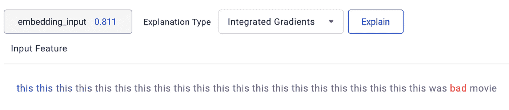
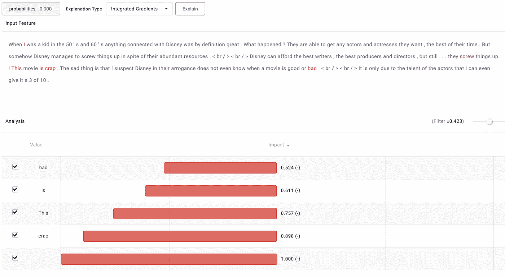
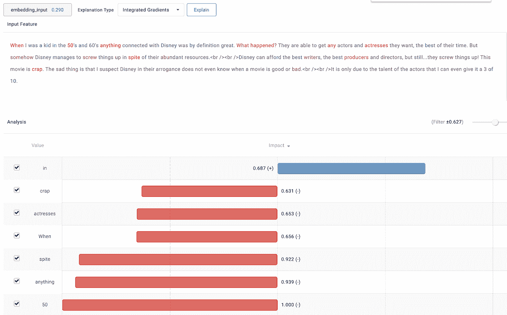

# 伯特现在是谷歌搜索的一部分，所以让我们了解它是如何推理的

> 原文：<https://towardsdatascience.com/how-does-bert-reason-54feb363211?source=collection_archive---------16----------------------->

> 在由 Google AI 发布大约一年后，BERT 现在是行业中 NLP 任务的首选模型框架。当发布时，它在各种 NLP 基准上取得了最先进的结果。
> 
> 它之所以被称为框架，是因为 BERT 本身不是一个模型，但用作者自己的话说，它是一种“预先训练语言表示的方法，这意味着我们在大型文本语料库(如维基百科)上训练一个通用的“语言理解”模型，然后将该模型用于我们关心的下游 NLP 任务(如问答)。”
> 
> 在这篇博文中，当我们提到 BERT 模型时，我们指的是基于 BERT 架构并使用预先训练的权重针对特定任务进行微调的模型。但是和大多数深度学习模型一样，它是一个黑箱。一些论文试图解释这一现象，并创造了一个被 HuggingFace 的人们称为“伯特学”的领域。**在这篇博文中，我们将尝试使用一种称为** [**综合梯度**](https://arxiv.org/pdf/1703.01365.pdf) **的归因方法来解释一个 BERT 模型在 IMDB 评论数据集上的决策。**
> 
> **更新:Google 现在使用** [**BERT 进行搜索**](https://techcrunch.com/2019/10/25/google-brings-in-bert-to-improve-its-search-results/) **，能够更好的理解自然语言查询。**

## 但是伯特有什么特别之处呢？

冒着过度简化 BERT 方法的风险，它基本上需要训练一个神经网络来学习“*语言*”(请不要从字面上理解)，然后这个网络被用作主干来执行各种 NLP 任务。这与计算机视觉中的迁移学习没有太大的不同，在计算机视觉中，你在一个通常擅长“*视觉*”(同样，不完全是人类意义上的)的主干网络上为特定任务进行微调。

它之所以具有革命性，是因为它是第一个深度双向的语言表示，这意味着它会查看给定单词之后的单词，而不仅仅是前面的单词。人们认为，这是它优于单向表示的原因。

此外，它的架构是基于 [transformer](https://arxiv.org/abs/1706.03762) 的，这有助于它衡量单词在句子中出现的上下文。所有这些因素加在一起在某种程度上解释了它的成功。它的架构已经在许多博客文章中详细解释过了，这里有一篇由 [Jay Alammar](http://jalammar.github.io/illustrated-bert/) 写的文章，我推荐。

## **那么为什么解释伯特呢？**

由于上面提到的所有要点，基于 BERT 的模型正迅速成为许多公司 NLP 的首选解决方案，无论是内部建模任务还是规模不是问题的生产场景。鉴于 BERT 模型在基准数据集和任务上的卓越准确性，我们为什么要解释它呢？

作为一名 ML 从业者，重要的是要理解模型是否真的发展了语言理解，或者只是学习了简单/虚假的相关性；已经有人怀疑 [***到底有多聪明***](https://www.aclweb.org/anthology/P19-1334/) 。当我们试图在 NLP 方面取得进一步进展时，这一点尤为重要。

作为产品使用 BERT 服务客户的企业或产品所有者，理解它很重要，因为您不希望它歧视客户或被一个对立的例子所愚弄。

在这篇文章的其余部分，我们使用特征属性来阐明 BERT 模型是如何推理的。

## **但是首先，什么是定语？**

> 属性是分配给每个特征的分数，与该特征对预测的贡献成比例。归因可以是积极的，也可以是消极的，这取决于该特征具有积极的还是消极的影响。

现在，如果我们想给一个特征赋予重要性，它必须在反事实的背景下进行。反事实是你想要比较的另一个 X。反事实隐含在解释中。例如，当你试图向运行缓慢的火车解释上班迟到时，你是在间接地与火车准点运行的日子进行比较。所以你的反事实是火车准时运行的一天。现在一个反事实可以是一个单独的例子，也可以是一个分布(一组例子)，无论哪种方式都有一些强有力的观点。出于我们的目的，我们将考虑点反事实。

现在我们通过一个实际的例子来了解一下，用一个简单的线性回归模型。该模型接受 N 个输入，并将它们映射到一个标量输出。给定输入 X1 =(x1，x2，… xn)上的模型函数(f)描述为 f(x1，x2，…xn)= A0+a1 * X1+a2 * x2+a3 * x3+…+an * xn。在上面的例子中，对于反事实 X '， ***来说，特征 x1 的属性是******a1 *(x1—x1 ')***。如果属性之和等于 f(X1)—f(X’)，则称该归属方法满足“*效率”*公理。

## **好了，那么什么是综合渐变归因法呢？**

> ***综合渐变*** 是谷歌开发的一种基于渐变的归因方法。它与其他基于梯度的方法的不同之处在于，它满足某些公理(例如，上面定义的效率是公理之一)，并且等价于计算非原子游戏的 Aumann-Shapley (Aumann，R. J .和 Shapley，L. S .值。普林斯顿大学出版社，普林斯顿，新泽西州，1974 年)价值的特点。

为了简洁起见，我们在这里不讨论奥曼-沙普利值的数学。综合梯度是一种归因方法，它需要一个反事实来明确说明归因。反事实被作者称为“基线”。**论文作者推荐的标准基线是没有信息或信号的基线，理想情况下具有中性预测**。例如，视觉模型的黑色图像或 NLP 模型的空文本。我们将使用空白文本作为基线。

## **车型:**

在这里，我们将旨在解释在 [IMDB 电影评论数据集](https://ai.stanford.edu/~amaas/data/sentiment/)上微调的 BERT 基本模型的预测，了解它在定制电影评论上的推理能力，并将其与在相同数据集上训练的 BiLSTM 模型进行比较。

1.  所用的 BERT 模型是基本的无案例模型，使用从[这里是](https://colab.research.google.com/github/google-research/bert/blob/master/predicting_movie_reviews_with_bert_on_tf_hub.ipynb)改编的代码进行微调，没有任何深度超参数优化。在坚持的测试集上，它达到了大约 90%的准确率。
2.  BiLSTM 模型是使用从[这里的](https://github.com/keras-team/keras/blob/master/examples/imdb_bidirectional_lstm.py)改编的代码来训练的。它实现了约 85%的测试集精度，同样，没有任何超参数优化。

## **最后，说明:**

让我们通过一些简单的、可信的单行评论来探究模特的行为。随着我们的继续，我们会增加一些复杂性，但是真的没有什么是孩子不能处理的。最后，我们将从模型的角度，在一个“真实”的电影评论上测试这些模型。

我们将使用 [**提琴手**](https://fiddler.ai/) (充分披露:我为提琴手工作)来完成这项任务。我们将把 BERT 模型和电影评论数据导入 Fiddler，并使用它的 NLP 解释接口来可视化属性。出于讨论的目的，我们将主要集中在解释的定性方面。

我们举第一个例子， ***【这是部好电影】*** 。相当明确的权利？伯特模型正确地将其认定为正面，对“好”给予最高的正面归因，对“电影”给予一定的负面归因。对“电影”的负面归因意味着，如果用空文本(我们的基线)代替“电影”，模型会给句子打更高的分数。

BiLSTM 模型对情绪的预测也是正确的，但对“这个”给予了最高的归因。这不是一个非常直观的解释，因为从人类的角度来看，“好”应该得到更多的重视。

这是一个漏洞吗？再来给 ***【这是部烂片】*** 加上若干个“这”es，模型正确识别为负面。果然，我们的直觉是正确的。预测发生了逆转，现在被标记为积极情绪！

这是一个非凡的洞见， ***展示了 BiLSTM 模型是多么的易受攻击，以及解释是如何帮助暴露这个漏洞的*** 。然而，伯特模型并没有被这种特殊的花招所欺骗。

现在他们能处理否定吗？

是的，伯特能够预测*的“这不是一部好电影”作为负面评价。它确实设法将足够多的负面归因归因于“不是 a”，以对抗正面归因于“好”。有趣的是，这可能不是人类解释他/她的思路的方式。他们不会说，句子中的“好”使得句子不太可能是否定句，这基本上是模型在这里所说的。*

**

*然而，BiLSTM 模型未能处理否定，并将其标记为积极的评论。*

**

*如果我们把“好”换成“坏”会怎么样？伯特现在给“不是”一个正值，因为现在它在“一部糟糕的电影”附近。这令人印象深刻！这表明它对否定有一个基本的理解，至少比 BiLSTM 模型好得多。*

**

*BiLSTM 模型将负值同时归因于“不是”和“不好”，因此它再次显示了在上下文理解方面的弱点。*

**

*现在让我们看看他们在更细致的评论中表现如何。*

****“这部电影不会浪费你的时间”*** 是正面评价，即使不是压倒性如此。伯特模型将其归类为负面，正面的概率几乎为零。正如我们从下面的解释中所看到的，它不能处理上下文中的“不要浪费”。*

**

*BiLSTM 模型实际上表达了一些怀疑，但也认为它是负面的。“浪费”的存在主导了它的决策。*

**

***现在让我们在一个训练集示例上测试这些模型，他们都已经看过了:***

*评论是 ***“当我在五六十年代还是个孩子的时候，任何与迪士尼有关的东西都是伟大的。发生了什么事？他们可以得到任何他们想要的男女演员，最好的时间。尽管迪斯尼资源丰富，但不知何故，他们设法把事情搞砸了。迪士尼请得起最好的编剧，最好的制片人和导演，但还是…他们把事情搞砸了！这部电影是垃圾。可悲的是，我怀疑迪士尼在他们的傲慢甚至不知道什么时候一部电影是好是坏。只是由于演员们的才华，我甚至可以给它打 3 分。”****

**

*这显然是一个负面的评论，两个模型都这样认为。BERT 模型给它一个几乎为零的正面评价机会，而 BiLSTM 模型给它一个 0.29%的正面评价机会。*

*伯特模型将大部分归因于评论后半部分的句子，这些句子清楚地表明了评论者对电影的看法。它对“废话”和“糟糕”之后的句号进行了大量的归因。记住，幽默的归属考虑了所有可能的相互作用，所以句号的归属是上下文相关的，与它在文本中的位置有关。我们的推测是，句号对伯特模型很重要，因为如果没有句号，句子就会继续，并且可能会有一些词来增强/淡化/维持句子中的情感。停在那里的句子有一些意义，在这种情况下是否定的。*

*BiLSTM 模型对大量随机单词给出了很高的否定归因，并且偏向于评论早期的单词。此评论来自训练集，因此模型可能过度拟合了它。这或许也表明，对这种 RNN 模式的长期文本理解是有局限性的。*

**

## *那么，我们在这里学到了什么？*

1.  ****解释是 ML 工作流程*** 的重要组成部分。它们帮助我们评估模型的能力和局限性。这对于面临自由形式、开放式输入的模型尤其重要。此外，确定人工智能到底有多智能也是理论上的兴趣所在。*
2.  *特别是关于 BERT 模型，它的解释似乎比 BiLSTM 模型更容易理解。我们承认，这可能不是两种架构的公平比较，因为一个更大、优化更好的 BiLSTM 模型的性能可能与 BERT 相当。但是，即使排除比较，这些解释本身也提供了一些证据，表明现在在 NLP 中流行的语言建模方法有一些合理性，不仅从预测准确性的角度来看，而且从模型如何获得预测的角度来看。*

## ***参考文献:***

*[1] Sundararajan M，Taly A 和 Yan Q，[深度网络的公理化归属](https://arxiv.org/abs/1703.01365) (2017)，ICML 17 年第 34 届机器学习国际会议论文集—第 70 卷*

*[2] Jacob Devlin，Ming-Wei Chang，Kenton Lee 和 Kristina Toutanova， [BERT:用于语言理解的深度双向转换器的预训练](https://arxiv.org/abs/1810.04805) (2018)，arXiv 预印本 arXiv:1810.04805v2*