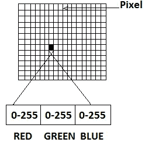

# 计算机如何理解图像？

> 原文：<https://towardsdatascience.com/how-does-computer-understand-images-c1566d4537bf?source=collection_archive---------8----------------------->

## 用简单的语言解释计算机视觉

Image of a dog (Photo by [Angel Luciano](https://unsplash.com/@roaming_angel?utm_source=unsplash&utm_medium=referral&utm_content=creditCopyText) on [Unsplash](https://unsplash.com/?utm_source=unsplash&utm_medium=referral&utm_content=creditCopyText))

当我们看到这张照片时，我们可以不假思索地说，这是一只可爱的狗的照片。即使是一个 8 岁的孩子也能毫不费力地认出照片中的狗。

> 你有没有想过计算机是如何看到同样的图像的？

我相信你们很多人都有过这样的经历。在我生命中的某个时刻我的确是。在这篇文章中，我将解释计算机是如何看到图像并理解它的。

计算机将图像视为 0 和 1。像素是图像中最小的单位。

A digital image is a 2D array of pixels. Each pixel is characterised by its (x, y) coordinates and its value. [1]

当我们拍摄数字图像时，它被存储为像素的组合。每个像素包含不同数量的通道。如果是灰度图像，它只有一个像素，而如果是彩色图像，它包含三个通道:红色、绿色和蓝色。

A digital image represented as pixels and channels. [2]

如上面的数字彩色图像表示所示，每个像素的每个通道具有 0 到 255 之间的值。在计算机能够理解图像之前，这些值中的每一个都用二进制表示。

> 下一个问题是，它怎么能说给定的图像包含一张狗的图片呢？

在这种情况下，如果不能理解图像的含义，或者不能描述图像的内容，仅仅能够阅读图像是没有用的。这就是机器学习的用武之地。

机器(或计算机)可以被教会如何理解图像并说出图像包含的内容。这是机器学习的一个例子，教计算机理解和描述图像。这类似于我们通过展示每个案例的例子来教孩子识别不同的字母或区分苹果和香蕉。这正是计算机学习识别图像中物体的方式。

A kid learning to draw a heart in the beach (Photo by [Jude Beck](https://unsplash.com/@judebeck?utm_source=unsplash&utm_medium=referral&utm_content=creditCopyText) on [Unsplash](https://unsplash.com/?utm_source=unsplash&utm_medium=referral&utm_content=creditCopyText))

就像人类有不同的技能，其中一项技能是识别图像中的对象(上图中的狗)，计算机有机器学习模型，可以认为是一项技能，来执行相同的任务。正如人类需要接受训练来执行特定技能一样，计算机也需要训练机器学习模型。

在这两种情况下，训练都是通过例子进行的。类似于如何教孩子识别苹果，通过给出几个包含苹果的示例图像，可以教机器学习模型如何识别图像中的苹果。从这些示例图像中，模型学习苹果的特征，比如它的形状和颜色。现在，当一个苹果的新图像以这种模式呈现给这台计算机时，它可以使用它先前了解到的关于苹果的信息，并识别出这个新图像也包含苹果。

Image of an apple (Photo by [dylan nolte](https://unsplash.com/@dylan_nolte?utm_source=unsplash&utm_medium=referral&utm_content=creditCopyText) on [Unsplash](https://unsplash.com/?utm_source=unsplash&utm_medium=referral&utm_content=creditCopyText))

这篇文章介绍了计算机如何读取数字图像，以及它如何理解图像所包含的内容。

***发现这个帖子有用吗？*** *在下面留下你的想法作为评论。*

希望实现对象检测。查看我的关于 [**物体检测的帖子，只用了 10 行 python 代码。**](/object-detection-with-less-than-10-lines-of-code-using-python-2d28eebc5b11)

希望实现人脸检测。查看我在 [**上的帖子如何使用 python 在不到 3 分钟的时间内实现人脸检测。**](/implement-face-detection-in-less-than-3-minutes-using-python-9f6b43bb3160)

[**点击这里**](https://medium.com/@sabinaa.pokhrel) 阅读我其他关于 AI/机器学习的帖子。

**来源:**

[1]莱拉，玛丽亚&普劳西，阿加皮&乔治奥祖卢，安东尼奥斯。(2011).MATLAB 在核医学图像处理中的应用。10.5772/19999.

[2]钱德朗，贾迪普。(2019).用于便携式血气分析的基于图像的比色技术。

**进一步阅读:**

 [## 计算机视觉的简明介绍

### 计算机视觉，通常缩写为 CV，被定义为一个研究领域，旨在开发技术来帮助…

machinelearningmastery.com](https://machinelearningmastery.com/what-is-computer-vision/)  [## 计算机视觉——导论

### 揭开像素背后的含义

towardsdatascience.com](/computer-vision-an-introduction-bbc81743a2f7)