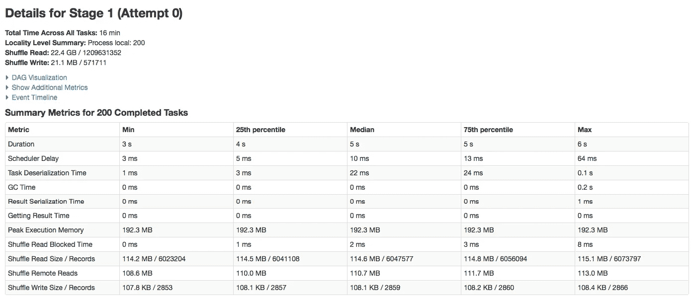

# 脸书如何针对大规模工作负载调整 Apache Spark？

> 原文：<https://towardsdatascience.com/how-does-facebook-tune-apache-spark-for-large-scale-workloads-3238ddda0830?source=collection_archive---------6----------------------->

我想开始祝你有一个美好的 2019 年，在我今年的第一篇文章中，我将分享由刘和来自的 Sital Kedia 在 Spark 峰会会议上介绍的针对大规模工作负载调整 Apache Spark 的会议摘要[以及我的日常经验。](https://databricks.com/session/tuning-apache-spark-for-large-scale-workloads)

当我们谈论 Spark 调优时，我们需要认识到每个应用和环境都是不同的，因此**我们不能假设这种配置对所有情况都是最好的**。在这种情况下，大多数推荐的属性都与大型管道或以批处理模式处理大型数据集的作业相关。

让我们开始定义我们可以从脸书收集的主题

1.  缩放火花驱动器
2.  缩放火花执行器
3.  扩展外部洗牌服务
4.  工具

# 1.缩放火花驱动器

**动态执行人分配**

> 是一个 Spark 特性，它允许动态地添加和删除 Spark 执行器，以匹配工作负载。[ [掌握 Apache Spark](https://jaceklaskowski.gitbooks.io/mastering-apache-spark/spark-dynamic-allocation.html) ]

如果您与其他团队共享集群资源，那么完全推荐启用此配置，这样您的 Spark 应用程序就只使用它最终将使用的资源。它可以根据工作量调整执行者的数量。

```
spark.dynamicAllocation.enable = true
spark.dynamicAllocation.executorIdleTimeout = 2m
spark.dynamicAllocation.minExecutors = 1
spark.dynamicAllocation.maxExecutors = 2000
```

这四个参数是自我描述的，也许第二个需要更多的细节。executorIDleTimeout 用于正确移除执行器。

**更好的获取失败处理**

中止阶段之前允许的连续阶段尝试次数(默认为 4)。

```
spark.stage.maxConsecutiveAttempts = 10
```

**调整 RPC 服务器线程**

增加 RPC 服务器线程以修复内存不足(实际上我在 [spark 官方文档](https://people.apache.org/~pwendell/spark-nightly/spark-master-docs/latest/configuration.html#networking)中找不到更多细节，一个很好的解释是[这里是](https://github.com/jaceklaskowski/mastering-apache-spark-book/blob/master/spark-rpc-netty.adoc#settings))

```
spark.rpc.io.serverTreads = 64
```

# 2.缩放火花执行器

首先必须理解如何基于自 Spark 1.6 [ [Spark 内存管理](https://0x0fff.com/spark-memory-management/) ]以来开发的统一内存管理来定义执行器内存的结构(图 1)


Fig. 1 Executor memory layout

**随机存储器**

一小部分(堆空间— 300MB)用于执行和存储[【深入探讨:Apache Spark 中的内存管理】](http://Deep Dive: Memory Management in Apache Spark)。这个值越低，溢出和缓存数据回收就越频繁。此配置的目的是为内部元数据、用户数据结构和稀疏、异常大的记录的不精确大小估计留出内存(默认为 60%)。

```
spark.memory.fraction * (spark.executor.memory - 300 MB)
```

**用户记忆**

是为 Spark 中的用户数据结构、内部元数据保留的，并且在记录稀疏和异常大的情况下，默认情况下，保护内存不足错误的发生。

```
(1 - spark.memory.fraction) * (spark.executor.memory - 300 MB)
```

**保留记忆**

这是系统保留的内存。它的值是 300MB，这意味着这 300MB 的 RAM 不参与 Spark 内存区域大小的计算。它会储存火花内部物体。

**记忆缓冲区**

要为每个执行器分配的堆外内存量(以兆字节为单位)。这是一个考虑到虚拟机开销、内部字符串、其他本机开销等因素的内存。[【火花属性】](https://spark.apache.org/docs/2.2.0/running-on-yarn.html#spark-properties)

```
spark.yarn.executor.memoryOverhead = 0.1 * (spark.executor.memory)
```

**启用堆外内存**

```
#Shuffle Memory spark.memory.offHeap.enable = true
spark.memory.ofHeap.size = 3g#User Memoryspark.executor.memory = 3g#Memory Bufferspark.yarn.executor.memoryOverhead = 0.1 * (spark.executor.memory + spark.memory.offHeap.size)
```

**垃圾收集调优**

> 当您的程序存储的 rdd 有大量“变动”时，JVM 垃圾收集会是一个问题。(在只读取一次 RDD，然后在其上运行许多操作的程序中，这通常不是问题。)当 Java 需要驱逐旧对象为新对象腾出空间时，它将需要跟踪所有 Java 对象并找到未使用的对象。GCT

这里的一个建议是使用 GC 而不是 G1GC

```
spark.executor.extraJavaOptions = -XX:ParallelGCThreads=4 -XX:+UseParallelGC
```

**调混文件缓冲**

磁盘访问比内存访问慢，因此我们可以通过缓冲读/写来分摊磁盘 I/O 成本。

```
#Size of the in-memory buffer for each shuffle file output stream. #These buffers reduce the number of disk seeks and system calls made #in creating intermediate shuffle files. [[Shuffle behavior](https://people.apache.org/~pwendell/spark-nightly/spark-master-docs/latest/configuration.html#shuffle-behavior)]
spark.shuffle.file.buffer = 1 MB spark.unsafe.sorter.spill.reader.buffer.size  = 1 MB
```

**优化溢出文件合并** [ [Spark-20014](https://issues.apache.org/jira/browse/SPARK-20014)

通过关闭到的传输并使用缓冲文件读/写来提高 io 吞吐量，从而使用 mergeSpillsWithFileStream 方法。

```
spark.file.transferTo = false
spark.shuffle.file.buffer = 1 MB
spark.shuffle.unsafe.file.ouput.buffer = 5 MB
```

**调整压缩块大小**

默认压缩块为 32 kb，这对于大型数据集来说不是最佳选择。如果您转到[幻灯片](https://www.slideshare.net/databricks/tuning-apache-spark-for-largescale-workloads-gaoxiang-liu-and-sital-kedia)，您会发现通过增加块大小，随机播放/溢出文件大小减少了 20%。

```
#Block size used in LZ4 compression, in the case when LZ4 #compression codec is used. Lowering this block size will also lower #shuffle memory usage when LZ4 is used. [[Compression and Serialization](http://Block size used in LZ4 compression, in the case when LZ4 compression codec is used. Lowering this block size will also lower shuffle memory usage when LZ4 is used.)]
spark.io.compression.lz4.blockSize = 512KB#Note that tha default compression code is LZ4 you could change #using
spark.io.compression.codec
```

# 3.扩展外部洗牌服务

**在 Shuffle 服务器上缓存索引文件**

> 问题是，对于每次 shuffle 提取，我们都要重新打开同一个索引文件并读取它。如果我们能够避免多次打开同一个文件并缓存数据，效率会更高。我们可以使用 LRU 缓存来保存索引文件信息。通过这种方式，我们还可以限制缓存中条目的数量，这样我们就不会无限地浪费内存。[ [Spark-15074](https://issues.apache.org/jira/browse/SPARK-15074)

```
#Cache entries limited to the specified memory footprint.
spark.shuffle.service.index.cache.size = 2048
```

**可配置洗牌注册超时和重试**

对于更有可能发生节点故障的大型集群(例如，超过 50 个节点)，这是特别推荐的。

```
spark.shuffle.registration.timeout = 2m
spark.shuffle.registration.maxAttempst = 5
```

# 4.工具

**Spark UI 指标**

我认为这可能是下一篇文章的一部分(这次有实际的例子👩‍💻 👨‍💻)因为那里有很多调试、优化、调优的有用信息。

首先，为了进行优化，您可以检查随机读取阻塞时间(任务等待随机数据从远程机器读取所花费的阻塞时间[[堆栈溢出](https://stackoverflow.com/questions/37468394/spark-shuffle-read-blocked-time)])



Fig 2\. Example of a Spark UI Metric [[Community Hortonworks](https://community.hortonworks.com/questions/67659/what-are-the-important-metrics-to-notice-for-each.html)]

感谢阅读！下一篇文章再见。

PS 如果你有任何问题，或者想要澄清一些事情，你可以在 [Twitter](https://twitter.com/thony_ac77) 和 [LinkedIn 上找到我。](https://www.linkedin.com/in/antoniocachuan/)如果你想了解 Apache Arrow 和 Apache Spark，我有一篇文章[**用一些例子对 Apache Arrow 和 Apache Spark 以及 Pandas**](/a-gentle-introduction-to-apache-arrow-with-apache-spark-and-pandas-bb19ffe0ddae) 进行了简单的介绍，此外，今年出版了一本我认为很棒的书 [Spark:权威指南](https://amzn.to/2NQxTmZ)。