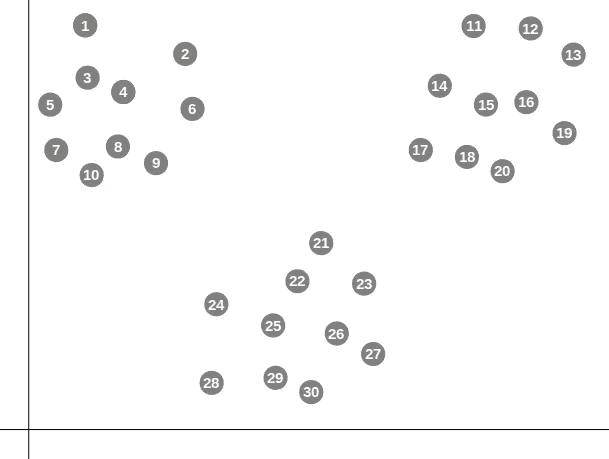
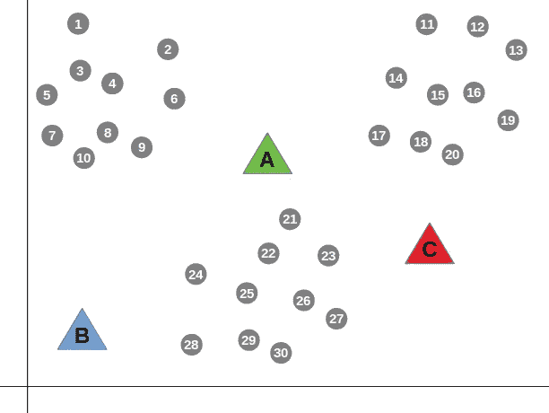
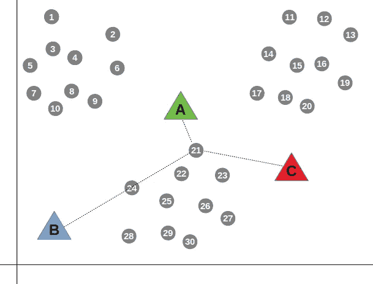
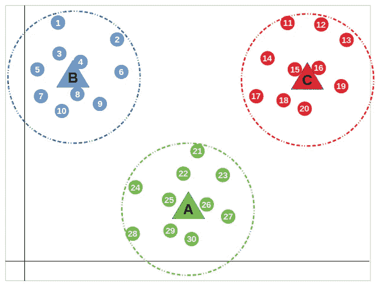
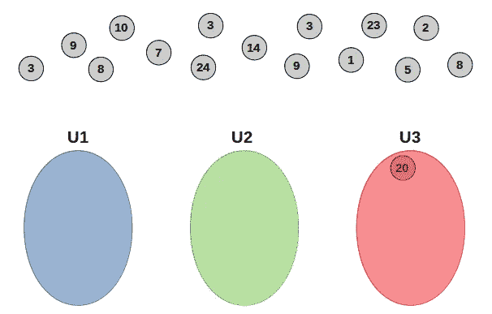
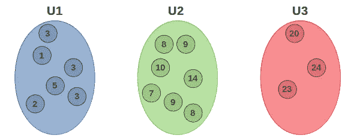

# 机器学习中的 k-Means 聚类是如何工作的？

> 原文：<https://towardsdatascience.com/how-does-k-means-clustering-in-machine-learning-work-fdaaaf5acfa0?source=collection_archive---------1----------------------->

机器学习中无监督学习领域最著名的主题之一是 k 均值聚类。尽管这种聚类算法相当简单，但对于该领域的新手来说，它看起来很有挑战性。在这篇文章中，我试图用两个不同的例子来解决 k-Means 聚类的过程。第一个示例将更侧重于大图和可视化过程，而第二个示例侧重于所涉及的底层计算。

# 无监督学习和聚类

监督和非监督学习算法的主要区别在于后者没有数据标签。通过无监督学习，数据特征被输入到学习算法中，学习算法决定如何标记它们(通常用数字 0，1，2..)又基于什么。这个“基于什么”的部分决定了要遵循哪个无监督学习算法。

大多数基于无监督学习的应用利用了被称为*聚类*的子领域。**聚类是根据数据样本共有的某个特征将数据样本组合成*个簇*的过程——这正是无监督学习的初衷。**

# 那么，什么是 k-Means，我们为什么要使用它呢？

作为一种聚类算法，k-Means 将数据点作为输入，并将其分组为 k 个聚类。这个分组过程是学习算法的训练阶段。**结果将是一个模型，该模型将数据样本作为输入，并根据模型经历的训练返回新数据点所属的聚类。这有什么用呢？这就是内容推广和推荐通常的工作方式——以一种非常简单的方式。网站可以选择将人与在网站上分享相似活动(即特征)的其他人放在气泡(即集群)中。通过这种方式，推荐的内容会有些切中要害，因为具有类似活动的现有用户很可能对类似的内容感兴趣。此外，当一个新人进入网站的生态系统时，这个人将被放在一个特定的集群中，内容推荐系统会处理其余的事情。**

基于这个想法，k-Means 只是一个聚类算法。它使用点之间的距离作为相似性的度量，基于 k 平均值(即均值)。这是一个很有意思的算法，言归正传。

# 将 k 放在 k-Means 中

> k-Means 背后的想法是，我们想在现有的数据中增加 k 个新点。这些点中的每一个——称为质心——都将试图以 k 个星团中的一个为中心。一旦这些点停止移动，我们的聚类算法就停止了。

正如你可能已经怀疑的，k 的值非常重要。这个 k 叫做超参数；我们在训练前设定其值的变量。这个 k 指定了我们希望算法产生的聚类数。这个聚类数实际上是数据中的质心数。

在我们进一步讨论之前，让我们先来看看到目前为止一切都是如何融入大局的:

*   我们知道，机器学习的核心在于泛化的想法——对模型从未见过的输入做出可靠的输出预测。
*   无监督学习就是将数据样本分组在一起，而不管它们的标签(如果它们有标签的话)。
*   聚类是一种无监督的学习算法，将数据样本分组为 k 个聚类。
*   该算法基于 k 个点的平均值(即质心)产生 k 个聚类，这些点在数据集周围漫游，试图使它们自己居中——每个聚类的中间有一个。

# k-Means:简言之

有什么比伪代码更好的算法总结？

```
Assign initial values for each **u** (from **u**=1 till **u**=k);Repeat {
        Assign each point in the input data to the **u** that is closest
        to it in value;Calculate the new mean for each **u**;if all **u** values are unchanged { break out of loop; }
}
```

# k-Means:详细

如果你以前读过我的任何帖子，你可能知道我喜欢先用例子来解释，然后谈论我们话题的技术方面。此外，我不喜欢向读者介绍主题背后铺天盖地的数学知识，因为我相信这些知识对研究人员来说比对那些在这个问题上有自身利益的人来说更重要。

回到 k 均值和我们的第一个例子。假设我们有一个数据集，绘制出来后看起来像下图:



对我们人类来说，这些数据看起来完全符合三个组(即集群)。然而，机器看不到这一点，因为这些点是实际的数据“点”，其值只是机器无法感知的数字。

关于聚类的目标，我们有一组未标记的数据点，我们希望将它们放入组中。这些组通常标有数字(0，1，2..)由算法本身决定。含蓄地说，我们真正需要的实际上是一个划分组的决策边界。为什么？在实践中，推理通过将数据点与相应的聚类相关联来工作。这就是决策界限显得重要的地方。

> k-Means 聚类就是将我们拥有的训练点放入聚类中。但它的目的遵循相同的想法。我们想知道哪些数据点属于一起，而没有任何标签。

我们通过**放置 k 个不同的平均值**(即平均值)来开始该算法，这些平均值的值要么被随机初始化，要么被设置为平面上的真实数据点。让我们从 **k=3** 开始，因为数据“看起来”分为三组(我们将在稍后的帖子中回到这个“看起来”的词)。出于解释的目的，让我们随机初始化平均值的值(即位置):



现在，算法逐个检查数据点，测量每个点与三个质心(A、B 和 C)之间的距离。然后，该算法将质心最近(即距离最近)的数据点分组。

例如，第 21 个数据点将属于绿色的组 A，仅仅因为它在距离质心 A 更近:



一旦我们将每个数据点与其最近的质心相关联，我们就重新计算平均值——质心的值；质心的新值是属于该质心的所有点的总和除以组中的点数。

我们一直这样做，直到没有质心在重新计算时改变它的值。这意味着每个质心都以其簇的中间为中心，该簇被其自己的圆形决策边界所包围:



# 另一个例子

让我们再举一个例子，但这次是从不同的角度。假设我们有以下一组点，我们希望将其分为 3 组:


这些数据没有以视觉上吸引人的方式呈现。我们只有一组想要聚类的点。另一个重要的注意事项是，符号化这些数据点的圆圈中的值是这些点的实际值。他们没有像我们之前的例子那样展示数据的顺序。相反，这些值是一些特征值 f 的量化，我这样说是为了让你更容易理解均值的计算是如何工作的。

让我们准备我们的空集群:


可以把这些集群想象成包含我们数据集中的点的袋子。

让我们将 U 值(即均值/质心)初始化为:

```
U1 = 6
U2 = 12
U3 = 18
```

这些值可以是随机的，但是为了简单起见，它们被选择为均匀分布在数据空间(1 到 24)中。

由于我们已经有了均值，我们可以开始计算特征 F 值为 F 的任何点与三个均值(U1、U2 和 U3)之间的距离，其中绝对距离为:

```
distance = | F - U | 
```

首先，让我们取特征 F 值为 20 的数据点:

```
|20 - U1| = |20 - 6| = 14
|20 - U2| = |20 - 12| = 8
|20 - U3| = |20 - 18| = 2
```

根据上述计算，值为 20 的**数据点距离平均值 U3** 更近。因此，我们将该点“标记”为 U3，将其放入相应的集群/包中:



其他各点也是如此:

```
|3 - U1| = |20 - 6| = 3
|3 - U2| = |20 - 12| = 9
|3 - U3| = |20 - 18| = 15
```

依此类推，直到我们将所有的数据点归入相应的聚类:


按照算法，我们现在需要重新计算平均值(U1、U2 以及 U3):

```
U1 = (3+8+1+3+7+5+2+3+8) / 9 = 4.44
U2 = (9+10+14+9) / 4 = 10.5
U3 = (20+24+23) / 3 = 22.33
```

在开始执行时，我们的 U 值分别是 6、12 和 18。现在，在第一次迭代之后，这些值分别变成了 4.44、10.5 和 22.33。我们现在必须再次经历距离计算步骤，但是使用新的平均值。我们清空我们的包/簇，然后重新开始:


这次我们从一个随机点开始，比方说特征 F 值为 8 的点。距离计算如下:

```
|8 - U1| = |8 - 4.44| = 3.56
|8 - U2| = |8 - 10.5| = 2.5
|8 - U3| = |8 - 22.33| = 14.33
```

因此，具有值 8 的数据点属于平均值 U2 的聚类，因为它在距离上最接近它。如果你还记得，同样的数据点(8)在第一轮属于 U1。由此可见平均值的重要性。

反复运行该算法，直到计算后平均值不变，将达到以下形式，平均值分别为 2.83、9.29 和 22.33:



# 最终注释

正如你在我们的第二个例子中看到的，我们在任何给定点操作的平均值对模型的可靠性非常重要。这并不排除初始值。事实上，如果起始位置非常糟糕，算法可能会导致聚类完全错误！因此，另一种初始化方法是从数据集本身选择我们的初始 k 位置，将其中一个点设置为其周围的平均值。无论哪种方式，通常的做法是在相同的数据集上重复运行该算法，直到我们找到最常见的解决方案和聚类形式——并坚持下去。

还记得我们说数据“似乎”已经被分成三份的那个阶段吗？这只是为了说明人眼在这些应用中的重要性。由于我们没有地面真实误差估计(因为它通常需要标签)，我们需要对超参数的另一种测量。对于许多应用来说，一个人查看图并确定 k 值就足够了。然而，这并没有以任何方式高估 k 值的重要性。

最后，k-Means 的一个明显优势是它给出了整个聚类的平均值，而不仅仅是聚类本身。这在与分割相关的图像处理任务中非常有用——当将分割作为聚类问题处理时。