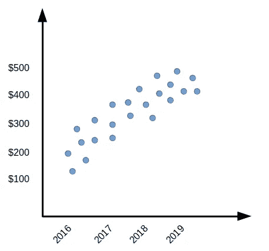
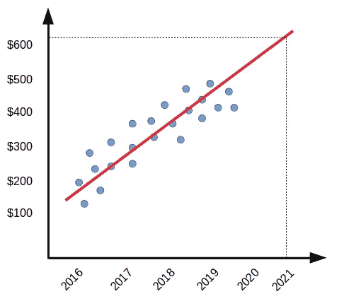
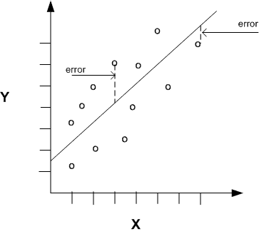

# 线性回归实际上是如何工作的？

> 原文：<https://towardsdatascience.com/how-does-linear-regression-actually-work-3297021970dd?source=collection_archive---------1----------------------->


Photo by [Chris Liverani](https://unsplash.com/@chrisliverani?utm_source=medium&utm_medium=referral) on [Unsplash](https://unsplash.com?utm_source=medium&utm_medium=referral)

线性回归可以说是统计学和机器学习中最著名的话题之一。它是如此重要，以至于它在几乎所有机器学习课程中都占据了重要地位。然而，这可能有点棘手，尤其是如果一个人没有统计学背景。

# 什么是线性回归？

> 线性回归可以被认为是一种机器学习算法，它允许我们将数字输入映射到数字输出，将一条线拟合到数据点。

换句话说，线性回归是一种模拟一个或多个变量之间关系的方法。从机器学习的角度来看，这样做是为了确保泛化——让模型能够预测它从未见过的输入的输出。

# 为什么要一概而论？

如果你读了我在 Medium 上的其他帖子，你会注意到我试图尽可能地强调一般化的观点。泛化是机器学习的本质。**拥有这种*人工*形式的智能的整个想法依赖于将模型教得如此之好的过程，以至于它能够自己*行动****。换句话说，你希望模型不要局限于它所学到的任何东西。把它当成一个孩子。如果你的孩子一生只见过猫——因为一些你强加给他的令人不安的原因——如果在某个时候你决定给他看一张狗的照片，你会期望他知道狗不是猫。这不是他所学的东西。*

# *为什么是线性回归？*

*因此，一群创意科技爱好者在硅谷创办了一家公司。这家名为 Banana 的初创公司非常创新，自 2016 年以来，他们一直在不断增长。你，这位富有的投资者，想知道是否把你的钱押在香蕉明年的成功上。让我们假设你不想冒很多钱的风险，尤其是因为硅谷的风险很高。所以你决定买一些股票，而不是投资公司的大部分。*

*你看一看香蕉的股票价格，自从它们启动以来，你看到下面的数字。*

**

*嗯，你肯定能看到趋势。香蕉公司正在疯狂地成长，仅仅三年时间，他们的股票价格就从 100 美元涨到 500 美元。你只关心 2021 年的价格会怎么样，因为你想给你的投资一些时间和公司一起开花结果。乐观地说，看起来在接下来的几年里，你的钱会越来越多。这一趋势不太可能经历突然、剧烈的变化。这导致你假设股价会跌到 500 美元以上。*

*这里有一个有趣的想法。根据过去几年的股价记录，你能够*预测*股价将会如何。你能够推断出我们没有数据的一年(2021 年)新股票价格的范围(图上不存在)。嗯——算是吧。*

***你刚才所做的是推断你的模型(你的脑袋)来进行概括——预测你甚至不知道的 x 值的 y 值。**然而，这无论如何都不准确。你无法具体说明股价最有可能是多少。据你所知，它可能会超过 500 美元。*

***这就是线性回归(LR)发挥作用的地方。LR 的本质是找到最符合图上数据点的线，这样我们就可以或多或少地准确知道 2021 年股价可能会跌到哪里。***

**

*让我们通过查看它的重要性来检查上面 LR 生成的行(红色)。看起来，只要稍加修改，我们就能意识到，到 2021 年，香蕉的股价可能会比 600 美元高一点。*

*显然，这是一个过于简化的例子。然而，过程保持不变。作为一种算法，线性回归依赖于降低成本以最大化性能的概念。接下来我们将研究这个概念，以及我们是如何在图上画出红线的。*

# *训练线性回归器*

*来解决技术上的问题。我在上一节中描述的是一元线性回归，因为我们试图将一个自变量(x 值)映射到一个因变量(y 值)。这与多元线性回归相反，多元线性回归试图将多个自变量(即特征)映射到因变量(即标签)。现在，让我们言归正传。*

*图上的任何直线都遵循以下公式:*

```
*f(X) = M.X + B*
```

*其中 M 是直线的斜率，B 是允许直线垂直移动的 y 截距，X 是函数的输入值。*

*就机器学习而言，这遵循惯例:*

```
*h(X) = W0 + W1.X*
```

*其中 W0 和 W1 是权重，X 是输入要素，h(X)是标注(即 y 值)。*

> ***线性回归的工作方式是试图找到权重(即 W0 和 W1 ),从而为我们拥有的输入数据(即 X 特征)找到最佳拟合线。根据最低成本确定最佳拟合线。***

# *那么，成本是多少呢？*

*事情是这样的。成本可以采取不同的形式，取决于手边的机器学习应用。然而，一般来说，成本是指模型在[*与实际训练数据*](https://medium.com/datadriveninvestor/what-are-training-validation-and-test-data-sets-in-machine-learning-d1dd1ab09bae)*相差多少的情况下产生的损失或误差。**

**说到线性回归，我们通常使用的代价函数是平方误差代价。**

```
**J(W0,W1) = (1/2n).sigma((h(Xi)-Ti)^2) for all i=1 until i=n**
```

**其中 J(W0，W1)是指权重为 W0，W1 的模型的总成本。h(Xi)是指模型对索引为 I 的要素 X 处的 y 值的预测。Ti 是索引为 I 处的实际 y 值。最后，n 是数据集中数据点的总数。**

****

**我们的成本函数所做的基本上是获取模型预测的 y 值和数据集中每个数据点的实际 y 值之间的距离(例如欧几里德距离)，然后将该距离平方，再除以数据点的数量，就可以得到平均成本。所述距离在上图中被示为误差向量。(1/2n)项中的 2 只是为了简化下一节中对成本函数进行微分的过程。**

# **这一切的训练在哪里？**

**训练机器学习模型就是使用学习算法来寻找使成本最小化的权重(我们公式中的 W0，W1)。为了简单起见，让我们使用梯度下降算法。虽然这是一个相当简单的话题，梯度下降值得自己的职位。因此，我们只简单介绍一下。**

**在线性回归的上下文中，训练基本上是找到这些权重，并将它们插入直线函数，以便我们有最佳拟合的线(W0，W1 最小化成本)。该算法基本上遵循伪代码:**

```
**Repeat until convergence {
    temp0 := W0 - a.((d/dW0) J(W0,W1))
    temp1 := W1 - a.((d/dW1) J(W0,W1))
    W0 = temp0
    W1 = temp1
}**
```

**其中(d/dW0)和(d/dW1)分别是 J(W0，W1)相对于 W0 和 W1 的偏导数。这种偏导数的要点基本上是导数:**

```
**(d/dW0) J(W0,W1) = W0 + W1.X - T
(d/dW1) j(W0,W1) = (W0 + W1.X - T).X**
```

**如果我们在模型上运行梯度下降学习算法，并通过每一步获得的成本，模型将收敛到最小成本。导致最小成本的权重作为我们之前提到的线函数的最终值处理(即 h(X) = W0 + W1)。x)。这意味着与我们的 h(X)函数等价的线实际上是我们的线性回归量。**

# **旁注:性能**

**有时，当训练数据集包含大量值不一致的数据点时，我们求助于称为离散化的过程。这是指将数据集中的 Y 值从连续转换为离散，从而产生简洁、干净和可用的数据范围，而不是数据值本身。但是，这会导致数据丢失，因为从技术上来说，您会将数据点分解成表示连续值范围的条柱。模型有效性的另一个主要因素是它对我们选择的箱/范围数量的依赖。**

**如果线性回归模型性能不好，我们通常会选择更高的多项式函数。这基本上是在回归函数中引入新的变量，这样我们可以给它更多的灵活性。然而，这将导致 LR 线不再是一条直线。**

> ****原来，就线性回归而言，“线性”并不是指“直线”，而是指“落在一条线上”。****

**这意味着我们的线性回归实际上不必是一条直线，就像我们通常在数学中看到的那样。回归中的这种灵活性可以极大地提高性能。然而，更高的多项式可能导致更高的方差，以及指数级更高的计算复杂度。这往往会导致过度拟合。这是一个大话题，我将在另一篇文章中详细讨论。**

# **结论**

**线性回归是找到最适合图上可用数据点的直线的过程，因此我们可以使用它来预测数据集中不存在的输入的输出值，并相信这些输出会落在该直线上。性能(和错误率)取决于各种因素，包括数据的干净程度和一致性。有不同的方法来提高模型的性能(即，可推广性)。然而，每种方法都有自己的优缺点，这使得方法的选择取决于应用。**