# 我如何使用聚类分析来自优步的拼车数据

> 原文：<https://towardsdatascience.com/how-does-uber-use-clustering-43b21e3e6b7d?source=collection_archive---------7----------------------->

## 优步拼车数据分析

Photo by [Viktor Bystrov](https://unsplash.com/@xokvictor?utm_source=unsplash&utm_medium=referral&utm_content=creditCopyText) on [Unsplash](https://unsplash.com/s/photos/uber?utm_source=unsplash&utm_medium=referral&utm_content=creditCopyText)

根据 Gartner 的数据，到 2020 年，2.5 亿辆联网汽车将成为物联网的主要组成部分。联网车辆预计每小时将产生 25GB 的数据，可以对这些数据进行分析以提供实时监控和应用程序，并将带来移动性和车辆使用的新概念。Ref: [Gartner](https://www.gartner.com/en/newsroom/press-releases/2015-01-26-gartner-says-by-2020-a-quarter-billion-connected-vehicles-will-enable-new-in-vehicle-services-and-automated-driving-capabilities)

优步科技公司是一个点对点乘车共享平台。优步平台连接可以开车到客户位置的出租车司机。优步使用机器学习，从计算定价到寻找汽车的最佳定位，以实现利润最大化。使用公共优步出行数据集讨论构建用于分析和监控汽车 GPS 数据的实时示例。

优步出行数据集，包含由优步从纽约市生成的数据。这些数据可以在[五月三十八日](https://data.fivethirtyeight.com/)免费获得。

数据来自纽约市，该市有五个区:布鲁克林区、皇后区、曼哈顿区、布朗克斯区和斯塔滕岛区。对该数据集应用 K-means 聚类，以了解在优步的旅行并识别纽约州内的不同行政区。

> *聚类是将数据集分成由相似数据点组成的组的过程。聚类是一种无监督的机器学习，当您有未标记的数据时使用。*

这里，我们应用了 K-Means 聚类算法，其主要目标是将相似的元素或数据点分组到一个聚类中。**K-means 中的“K”代表簇的个数。**K-Means 算法的工作原理可以在这里查看[。](/k-means-clustering-in-sas-9d19efd4fb1b)

本博客讨论了聚类算法在优步拼车数据集中的使用案例。总共确定了 6 个集群，但没有在本博客中讨论集群的有效性。主要侧重于解释和理解现实世界中的概念。

**导入必要的库**

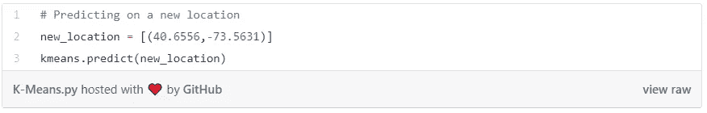

优步皮卡数据可从 2014 年 4 月至 9 月的五月三十八日获得。这里，我使用了 2014 年 8 月的数据集进行解释。

**读取 CSV 文件**

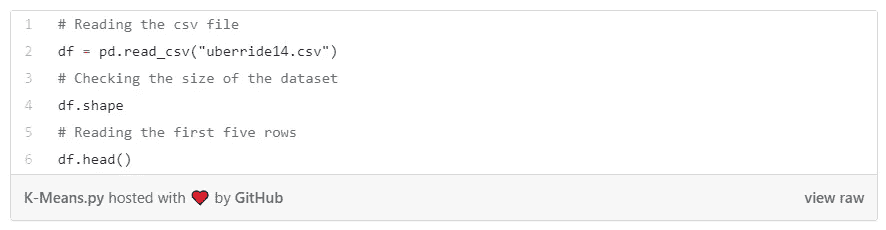

**输出**

数据集有 829，275 个观察值和四列。它有四个属性，

1.  **日期/时间:**优步提货的日期和时间。
2.  **Lat(纬度):**优步皮卡的纬度
3.  **Lon(经度):**优步皮卡的经度。
4.  **基地:**隶属于优步皮卡的 TLC 基地公司代码。

## 选择功能

这里，在称为“clus”的独立数据帧中选择纬度和经度。

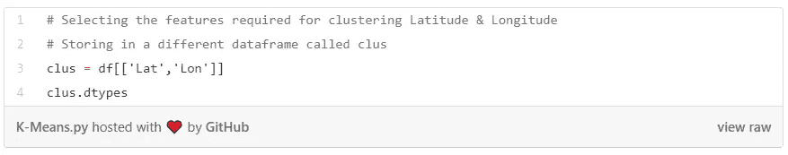

**输出**

我们正在应用 K 均值聚类。第一步是找到 k 的最佳值。这可以通过下图所示的肘形图找到。

**输出**

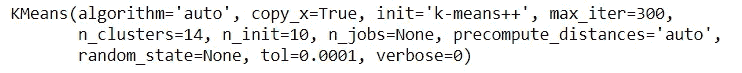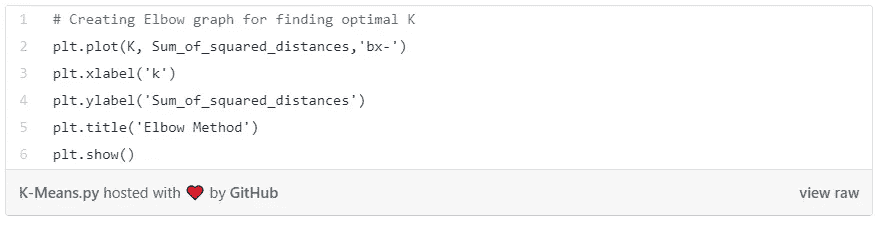

**输出**

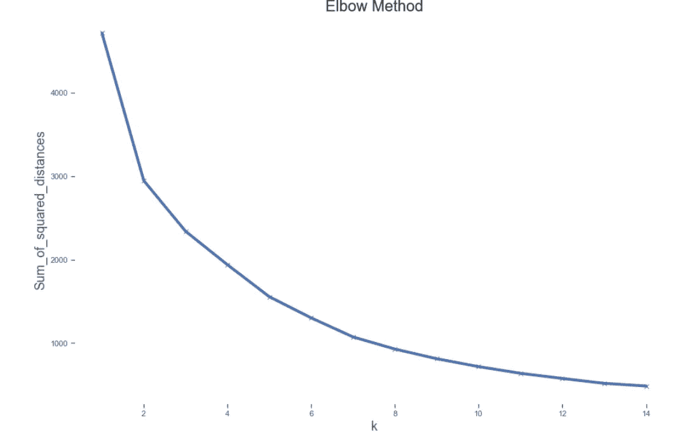

从上面的肘形图中，我们可以看到，随着星团数量的增加，观测值与其最近的星团质心的平方距离之和不断减小。我们可以看到，在 K=6 之后，有一个显著的降低。我们可以选择 6 个或 7 个集群。为此数据集选择了 6。

## 执行 k 均值聚类

K-Means 算法中的聚类数分配

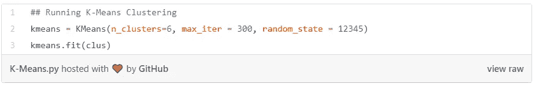

**输出**

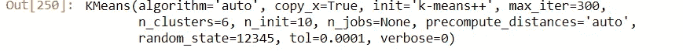

## 存储聚类质心

将簇质心存储在另一个称为质心的对象中。

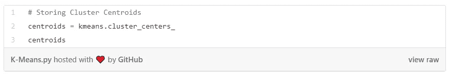

**输出**

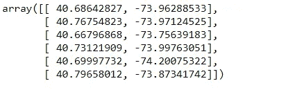

我们可以从上面的输出中看到六个质心。例如，40.68，-73.96 是聚类 1 的质心，也就是质心 1 的纬度和经度值。类似地，我们也有其他星团的质心。

**可视化质心**

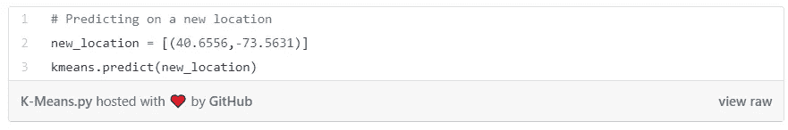

从质心提取纬度和经度，并转换成两个独立的数据框架。合并两个数据框，并将其命名为“clocation ”,以便于可视化。

**输出**

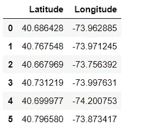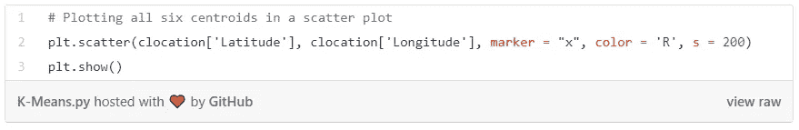

**输出**

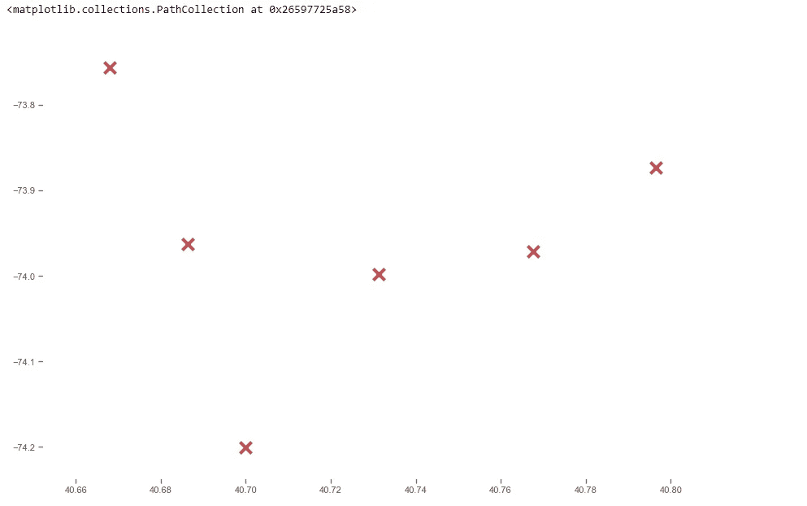

在上面的散点图中，我们可以看到每个星团的所有质心。然而，这并没有显示任何有意义的信息。让我们在谷歌地图(纬度和经度)上画出同样的图，并可视化

这里，我们使用了一个叶子库来生成地图。传递质心并映射位置

**输出**

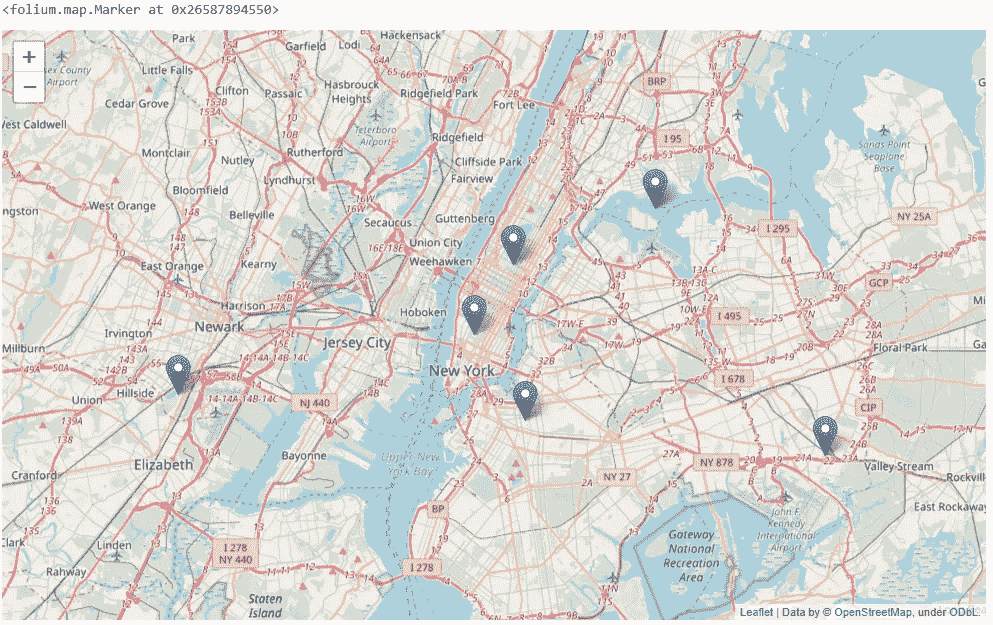

我们可以看到所有的六个质心都被绘制在地图上。这些质心对优步有什么帮助？

1.  优步可以利用这些质心作为他们的枢纽。每当优步收到一个新的乘车请求，他们可以检查与这些质心的接近程度。无论哪个特定质心更近，优步都可以将车辆从该特定位置引导到客户位置。
2.  优步有许多司机，为许多地方提供服务。如果优步知道中心(特定的质心)，并且如果他们得到许多搭车请求，那么从战略上来说，他们可以将他们的司机放在得到搭车请求的概率很大的好位置。这将有助于优步更快地为客户服务，因为车辆放置在更靠近位置的地方，这也有助于发展他们的业务。
3.  优步可以利用这些质心来优化放置他们的车辆。他们可以发现在一天中的哪个时段哪个质心有更多的乘车请求进来。例如，如果优步在上午 11 点从质心 0(聚类 1)获得更多请求，但是从质心 3(聚类 4)获得非常少的请求，则他们可以将车辆从聚类 4 重定向到聚类 1(如果在聚类 4 中有更多车辆存在)。
4.  通过分析哪个集群处理最大请求、高峰时间等，优步可以使用这些质心进行最优定价。假设，如果他们没有太多的车辆被送到一个特定的位置(更多的需求)，那么他们可以在需求高而供应少的情况下进行最优定价。

## 存储集群

存储聚类并将其合并到原始数据集中

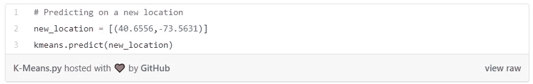

**输出**

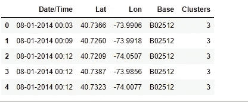

## 哪个集群接收最大乘坐请求？

对集群总数进行分组和可视化

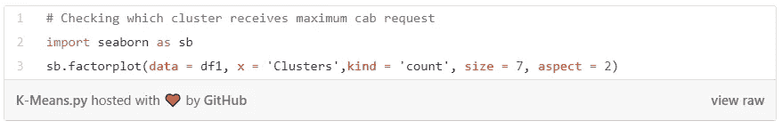

**输出**

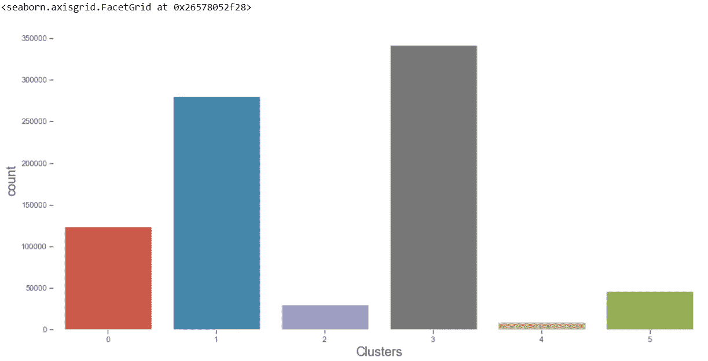

集群 3 收到最大游乐设备请求，之后是集群 1。集群 4 收到的请求最少。优步可以在集群 3 中放置更多的车辆来满足更高的需求。

## 正在检查新位置

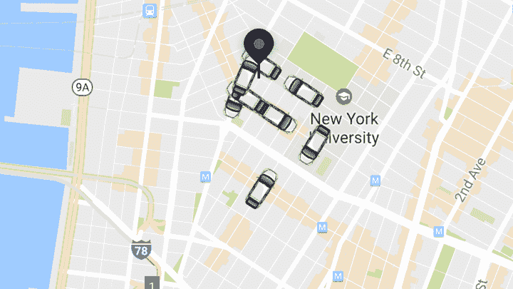

source: [macobserver](https://www.macobserver.com/analysis/london-uber-strike-little-impact/)

如果优步获得一个新的乘车请求(通过经度和纬度获得他们的新位置),然后传递纬度和经度值，那么它将预测车辆应该去哪个集群？

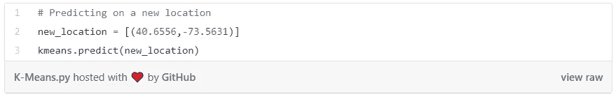

**输出**

传递新的请求纬度和经度值(40.65，-73.56)。新请求将被分配给聚类 2，因为与其他质心相比，它与聚类 2 的质心的距离是最小的。车辆将来自集群 2。

在这里，我们只收集了 2014 年 8 月与五个区相关的数据。在一个实时，我们有更多的质心(纬度和经度)作为优步在许多国家和地区提供服务。这些质心将作为限定区域内所有乘车请求的枢纽。

以上显示了 K-Means 聚类如何帮助优步公司获得最优定价和汽车的最优位置，以便更快地为客户服务并发展业务。

请继续学习，并关注更多内容！