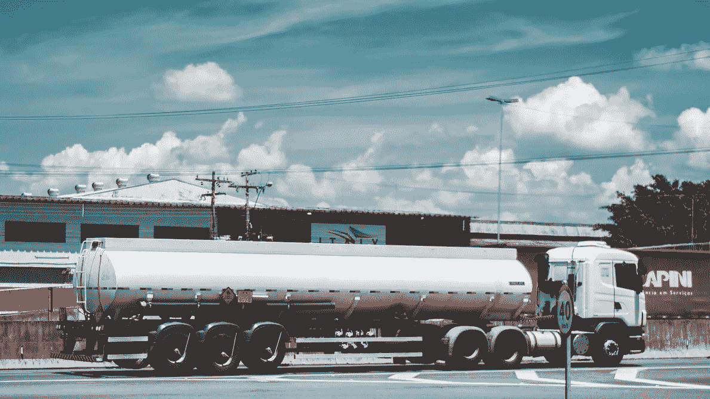

# 动态定价算法如何将毛利提高+10%

> 原文：<https://towardsdatascience.com/how-dynamic-pricing-algorithms-can-increase-gross-profit-by-10-690a4856bed9?source=collection_archive---------12----------------------->

## 数据科学正在帮助巴西石油和天然气行业克服影响该国的经济危机带来的挑战。

由于经济危机和技术革命，巴西的石油天然气行业一直面临着挑战。这些是主要的棘手问题:

1.燃料转售部门处于供应链双方利润受限的背景下:

上游部门通过增加燃料采购成本降低了加油站的利润。

消费者面临有限的家庭预算，对价格越来越敏感，这使得经销商很难转嫁成本上涨。

2.移动应用程序(如 Waze)正在为消费者提供实时价格信息，允许客户在加油前找到该地区最近和最便宜的加油站。

3.半公开的巴西跨国石油公司 Petrobras 已经实施了一项**新定价政策**，允许价格根据国际大宗商品价格的波动而变动。[这项始于 2016 年并在随后几年得到强化的新政策](http://www.petrobras.com.br/en/news/we-have-adopted-a-new-diesel-and-gasoline-price-policy.htm)，带来了燃料采购成本的新动态。经销商不知道如何应对，因为在几十年的高监管价格期间，巴西的这一行业已经被整合。

这些因素加在一起，给这个利润率处于历史低位的行业带来了更大的利润压力。考虑到高度竞争和动态的环境，经销商必须根据多个变量对泵价格进行日常决策。其中包括:燃料购买成本、税收、竞争对手的定位、车辆流量、星期几，以及最重要的消费者的支付意愿。

**支付意愿**用**弹性**的概念表示。这个概念试图从数学上回答*如果价格降低 X %,需求增加的百分比是多少？如果价格上涨，需求下降的百分比是多少？*

# 用科学来回答这些问题是成功优化定价的必要条件。这是动态定价算法的目标。

通过利用大型数据库，有可能识别和隔离弹性的影响。然后，我们可以模拟不同价格和市场情景下的需求反应，并根据业务战略目标优化价格决策，获取利润或销量。每日循环包括以下步骤:(1) **建模** , (2) **模拟**,( 3)**优化**。随着需求反应的发生，算法会更新用于计算的系数，并根据自己的预测和建议的成功率进行相应的学习。

不同的机器学习技术可用于步骤(1)建模，例如:岭回归、ARIMAX、卡尔曼滤波器和神经网络。这一步的成功取决于**提出正确的问题。**例如，ARIMAX 技术对于作为价格函数的需求预测非常有效(“X”是一组与价格相关的外生变量)。然而，如果我们要回答的问题是“弹性效应的价值是什么？”像岭回归这样的技术可能更好。即使在该模型中需求预测不太确定，该算法也能够更好地分离弹性效应的系数。

经过几个月的开发和实施，定价初创公司 Aprix 开发出了一种用于动态燃料定价的先锋人工智能。该企业与巴西的主要燃料经销商合作。当将使用该算法的加油站与继续使用传统定价方法(基于 Excel 电子表格)的加油站进行比较时，使用该算法的集团实现了毛利的平均增长 **+9.6%。**

# 该技术使加油站能够在新的高度竞争环境中生存，将威胁转化为机遇。

尽管石油和天然气行业仍然由传统企业组成，但毫无疑问，定价的未来是基于人工智能的，并且它在全球范围内获得了越来越大的空间。动态定价算法已经在燃料零售中使用，[主要是在英国和美国](https://www.wsj.com/articles/why-do-gas-station-prices-constantly-change-blame-the-algorithm-1494262674)。Aprix 是在巴西建设这个未来的人。

面对这种趋势，我们在 Aprix 每天都会问这样一个问题:

*接下来哪些行业将使用动态定价算法来提高盈利能力？*