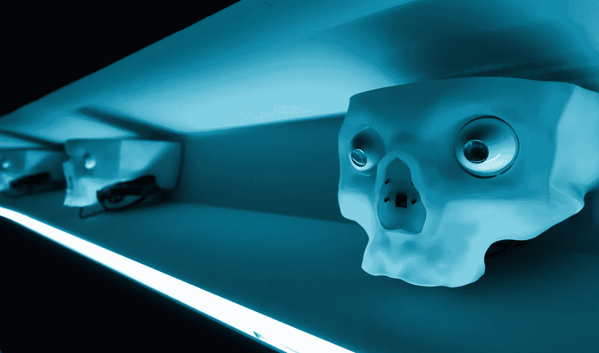
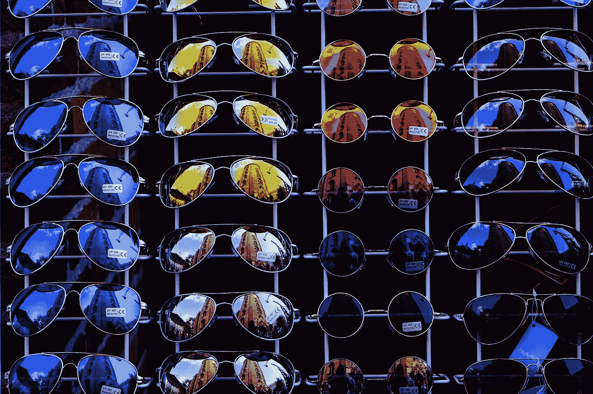
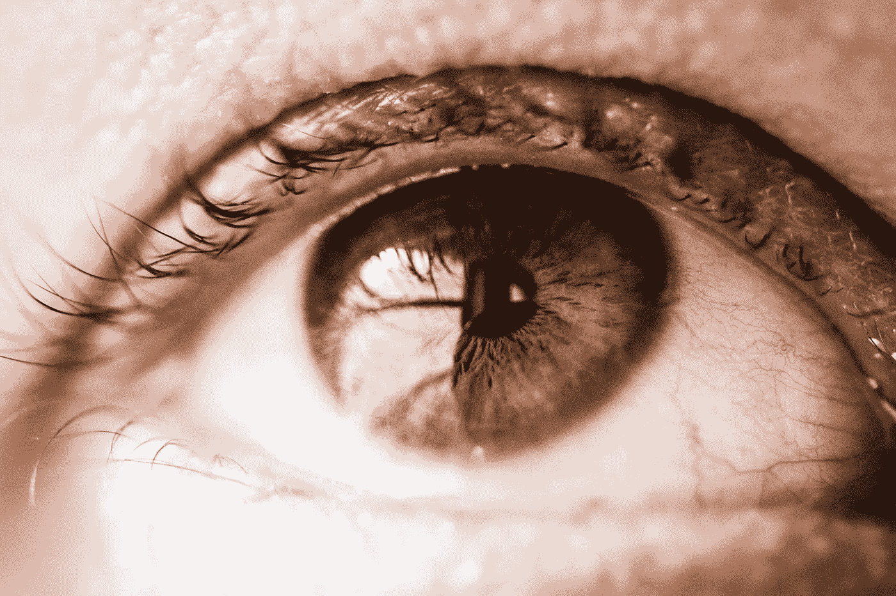

# 面部识别技术有多道德？

> 原文：<https://towardsdatascience.com/how-ethical-is-facial-recognition-technology-8104db2cb81b?source=collection_archive---------0----------------------->

Photo by Alessio Ferretti on Unsplash

虽然面部识别技术可以追溯到 20 世纪 60 年代，其创始人伍德罗·威尔逊·布莱索(Woodrow Wilson Bledsoe)进行了创新，但直到最近 10 年，它才真正获得了自己的地位。

最新的解决方案，包括在 Iflexion 创造的解决方案，能够以惊人的准确度检测人群中的人脸。因此，它们被有效地用于刑事鉴定，并有助于确定失踪人员的身份。

然而，这种解决方案也招致了许多关于其应用的合法性和道德性的批评。在本文中，我们将深入探讨围绕面部识别的问题，并看看如何使这些技术对每个人都更安全。

Photo by Steinar Engeland on Unsplash

# **面部识别技术的潜力**

为了全面评估面部识别的道德和法律方面，首先理解用例是至关重要的。下面是一些例子。

## **抓捕罪犯**

早在 2009 年，美国大约有[3000 万个监控摄像头在使用](https://www.popularmechanics.com/military/a2398/4236865/)，现在这个数字已经呈指数级增长。想象一下，如果这些据说在一周内平均拍摄 40 亿小时记录的相机与面部检测系统集成在一起。

这是对以前系统的升级，以前的系统利用数据库(DMV，犯罪数据库，甚至是借书证)将一个人与静态照片(如面部照片)进行匹配。

从理论上讲，这将是一个非常有效的系统，可以找到那些犯罪的人——想想波士顿爆炸案、校园枪击案和其他对社会构成直接威胁的罪犯。

## **寻找失踪人员**

当人们失踪时，在几率显著降低之前，找到他们的时间是有限的。许多调查的出发点之一是尽可能接近失踪时间地追踪此人的活动。

同样，当与面部检测软件结合使用时，在这里使用监控摄像头可以有效地找到这个人，并通过摄像头网络跟踪他们。

但这不是唯一的选择。2018 年，在众多批评中，[发布了创新的面部识别技术](https://www.usatoday.com/story/tech/news/2018/04/19/facebook-growing-use-facial-recognition-raises-privacy-concerns/526937002/)，该技术可以自动识别照片中的人，即使他们不是照片的主题。

在失踪人口调查中，通过捕捉一个人的最后一瞥并确定他们的确切位置，这可能会带来突破。

## **医疗用途**

面部识别技术在医学中得到积极应用。目前，面部识别技术被应用于基于面部扫描的配药，这是生物扫描的一项创新。

然而，最新的技术拥有更先进的东西——诊断能力。一些面部识别软件提供商声称，他们的产品可以通过识别关键的面部标志来帮助监测血压或疼痛程度，这可能证明是未来医生和最终用户的有用工具。

## **购买确认**

想象一下再也不用带着你的卡去商店了。这是面部识别技术的未来。只要走到柜台，你的脸被扫描以识别你和你的关联银行账户，你的购买就完成了。

虽然这听起来很神奇，但对于我们这些容易健忘的人来说，这是一个真正的问题解决方案。然而，它的实现离真实世界的体验还有一段距离。

## **广告**

个性化广告是未来。多亏了它，有一天你可以走进一家商店，看到你周围的标志根据你的需要而改变。

面部识别技术可以与在线分析和以前的购买相结合，为购物者量身定制体验，让他们更快地找到他们想要的东西。有点像亚马逊带入现实世界的网络体验。

Photo by Sebastian Pichler on Unsplash

# **面部识别技术的批评和风险**

现在我们知道了这项技术的巨大潜力，是时候更深入一点，探索那些使用面部识别的人所面临的风险。再次浏览这个列表，我们会发现它的缺点并提出改进的方法。

## **抓捕罪犯**

—毫无疑问，找到“坏人”是个好主意。然而，被设定为辅助的同一系统容易被滥用。我们来探索一下。

*   **准确性**——引用[纽约时报记者史蒂夫·洛尔](https://www.nytimes.com/2018/02/09/technology/facial-recognition-race-artificial-intelligence.html)、“如果你是个白人，面部识别是准确的。”如果你不这样做，它会变得更加不准确。该系统自然会歧视非白人、妇女和儿童，对非白人妇女的误差高达 35%。

根据美国联邦调查局的最新报告，美国白人犯罪最多，共有 5858330 起。所以这给其他种族留下了巨大的误差。

*   **监控问题**——除了准确性之外，这项技术面临的另一个重要问题是对其实施的滥用。

面部识别技术本身的功能可以被视为在一个事件中或在一个以前没有使用过的位置增加额外监控的借口。这引发了通常对“老大哥”监视社会的批评。

*   **数据存储**——一旦一个人被怀疑犯罪，他们的图像可能会被拍摄下来，通过面部识别技术在数据库中进行搜索。

虽然这本身不是一个问题，但它允许进行搜索的机构存储这些图像以供将来使用，如果这个人是无辜的，他可能会将他们的图像与真正的罪犯一起存储。

此外，它侵犯了一个人对自己形象的权利，尽管他是无辜的。

## **寻找失踪人员**

—很少有人会认为帮助那些需要帮助的人这种感觉良好的因素是一种糟糕的激励因素。然而，使用类似于脸书生产的技术背后的含义可能会产生可怕的后果。

从伦理的角度来看，这多少侵犯了每个人的私生活权利。比方说，你去商店给你爱的人买礼物，但是不小心被别人抓拍并贴上标签，破坏了惊喜。这不是一个好的结果，而且可能比一个毁了的礼物更严重。

然而，据估计，目前这项技术(DeepFace)背后的算法大约有 97.35%的准确性，这意味着这项技术可能会继续存在，无论是好是坏。

## **医疗用途**

—就药物分配而言，尽管这优化了系统，但它不考虑合格药剂师的人类知识和判断力。人类专业人员将能够检测一个人是否受到任何其他物质的影响，是否正在经历指示鉴别诊断的其他症状，或者甚至被其他人强迫获取药物。

看看其他的使用案例——血压和疼痛程度监测——虽然这些工具如果与有执照的医生一起使用，可能有助于预防疾病，但它们也可能被误用，如 WebMD，并引发不必要的健康问题。

除此之外，重要的是要记住，这种技术目前还处于早期测试阶段，可能在未来许多年都不会以任何有意义的方式随时可用。

## **购买确认**

—在现代世界，我们非常清楚信用卡和借记卡欺诈，但面部身份欺诈呢？虽然像非接触式卡一样，轻松购买的承诺很吸引人，但它也带来了安全问题。

或者，想象一下一对长得很像但收入和银行存款不同的同卵双胞胎的情况。这听起来可能像是直接来自一部疯狂的喜剧电影，但这种金融威胁是真实的，使得通过面部识别进行购买验证在安全方面成为一个非常灰色的领域。

## **广告**

—在亚马逊定制采购的启发下，面部识别广告可能成为各地营销部门的梦想。然而，对于整个社会来说，情况可能并不乐观。

在早期阶段，在识别年龄、性别和地点时，偏好可能是基本的，或者至少是基于不正确的信息。

在其发展的后期，当它变得更加个性化和与个人联系在一起时，这种类型的广告可能会通过显示购买者宁愿保密的信息和偏好而引起侵犯隐私的感觉。

此外，为了以任何方式有效，该系统将需要存储大量数据，这可能是不可行的或不道德的。

这是营销成功与社会责任的经典争论。

Photo by Sebastian Pichler on Unsplash

# **面部识别有什么法律？**

既然我们已经发现了更多关于面部识别技术的道德问题，让我们从法律的角度，通过引发批评的三个不同的镜头来看待它——歧视、隐私和民主自由。

应该注意的是，在世界各地的许多司法管辖区，立法并不是针对面部识别技术的特性而制定的。

## **歧视**

正如我们上面提到的，面部识别技术并不是 100%准确。事实上，在妇女、儿童和少数民族的情况下，这一准确率可能低至 65%。这表明该技术本质上是歧视性的，因为它的结果不太理想。

虽然随着人工智能技术扫描和“发现”更多样化的面孔，这种情况可能会随着时间的推移而改变，但目前它有可能违反种族歧视法。

## **隐私**

针对面部识别的最新法律之一是[商业面部识别隐私法案](https://www.blunt.senate.gov/news/press-releases/blunt-schatz-introduce-bipartisan-commercial-facial-recognition-privacy-act)，于 2019 年 3 月提交给美国参议院。该法案旨在实施法律变革，要求公司在获取面部识别数据之前告知。

这是继伊利诺伊州的[生物特征信息隐私法案(BIPA)](http://www.ilga.gov/legislation/publicacts/95/095-0994.htm) 之后。虽然没有特别针对面部识别，但该法案要求组织获得同意以获取生物特征信息，并且同意必须是平权行动的结果，而不是默认。

即使在今天，面部识别技术的提供商，如脸书、俄罗斯社交媒体网站 VK 和国家机构，也需要了解其管辖范围内有关个人隐私的法律，以及他们需要在内部和外部采取什么措施。

## **民主自由**

我们将讨论的最后一个法律问题是面部识别技术和民主自由的作用。民主自由背后的原则意味着拥有选择的权利，收集和分享观点的自由。尽管面部识别技术有许多用途，但这是一个被它带走的领域。

这种技术通常在云中收集和存储大量信息。这引发了信息安全问题和政府积极监视其公民的威胁。

虽然这听起来完全像乔治·奥威尔的《1984》中的东西，但目前的技术正在接近实现这一目标。这是一个需要在当前民主自由法之外进行专门立法的问题。

# **面部识别技术使用技巧**

尽管直接针对面部识别的立法尚不发达，但寻求采用该技术的公司和国家行为者应考虑这两个因素，以便站在道德和法律的正确一边:

## **提供通知**

如果您的场所、活动或应用使用面部识别技术，确保您的用户和客户知道这一点至关重要。这样做有助于告知他人这种技术已经到位。它还允许那些访问或使用您的设施或技术的人决定他们是否希望继续这样做。

## **征求同意**

积极寻求同意可以保护您和您的组织不违法，并允许您的客户控制他们的隐私并为自己做出选择。