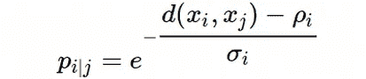
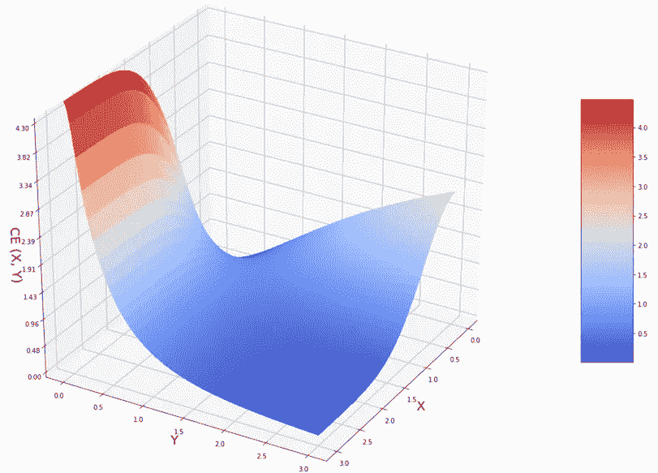

# UMAP 到底是如何运作的

> 原文：<https://towardsdatascience.com/how-exactly-umap-works-13e3040e1668?source=collection_archive---------1----------------------->

## [生命科学的数理统计和机器学习](https://towardsdatascience.com/tagged/stats-ml-life-sciences)

## 为什么它比 tSNE 更好

这是专栏 [**生命科学的数理统计和机器学习**](https://towardsdatascience.com/tagged/stats-ml-life-sciences?source=post_page---------------------------) 中的第 12 篇文章，我试图在这里涵盖生物信息学、生物医学、遗传学等常用的分析技术。今天我们将深入探讨一种令人兴奋的降维技术，叫做 [**UMAP**](https://umap-learn.readthedocs.io/en/latest/) ，它主导了当今的 [**单细胞基因组学**](https://en.wikipedia.org/wiki/Single_cell_sequencing) 。在这里，我将试着质疑关于 UMAP 的**神话**是一种**过于数学化的**方法，并用简单的语言解释它。在下一篇帖子里，我会展示 [**如何用 Python**](/how-to-program-umap-from-scratch-e6eff67f55fe) 从头开始编程 UMAP，还有(**加成！**)如何创造一种降维技术，提供比 UMAP 更好的可视化。然而，现在我们将从 UMAP 背后的直觉开始，并强调 tSNE 和 UMAP 之间的主要区别。

# tSNE 死了。UMAP 万岁！

如果你不知道 tSNE 是什么，它是如何工作的，也没有读过 2008 年的原创革命性[范德马滕&辛顿论文，你可能不需要知道，因为 **tSNE 现在基本上已经死了**。尽管总的来说，tSNE 对单细胞基因组学和数据科学产生了巨大的影响，但人们普遍认为它有一些迟早要解决的缺点。](http://www.jmlr.org/papers/volume9/vandermaaten08a/vandermaaten08a.pdf)

到底是什么让我们对单细胞基因组学使用 tSNE 感到不舒服？这里我用简短的评论总结几点:

*   **tSNE 不能很好地缩放**以快速增加 scRNAseq 中的样本大小。试图用 [**FItSNE**](https://www.nature.com/articles/s41592-018-0308-4) 加速导致**大量内存消耗**使得不可能在计算机集群之外进行分析，参见我的[banch marking for 10X Genomics Mouse Brain 1.3M 数据集](/deep-learning-for-single-cell-biology-935d45064438)。
*   **tSNE 不保留全局数据结构**，这意味着只有集群内的距离才有意义，而集群之间的相似性则无法保证，因此人们普遍认为在 tSNE 上进行集群不是一个好主意。

*   **tSNE 实际上只能嵌入 2 或 3 维**，即仅用于**可视化目的**，因此很难使用 tSNE 作为通用降维技术来生产例如 10 或 50 个组件。请注意，**这仍然是更现代的**[**fits ne**](https://www.nature.com/articles/s41592-018-0308-4)**算法**的问题。
*   **tSNE 执行从高维度到低维度的非参数映射**，这意味着它**不利用驱动观察到的聚类的特征**(也称为 PCA 加载)。
*   **tSNE 不能直接处理高维数据**，在将数据插入 tSNE 之前，通常使用自动编码器或 PCA 进行预降维
*   **tSNE 为其计算消耗了太多的内存**，这在使用**大复杂度**超参数时变得尤其明显，因为 k-最近邻初始步骤(像在 Barnes-Hut 过程中)对于减少时间变得不那么有效和重要。**这个问题不是更现代的**[**fits ne**](https://www.nature.com/articles/s41592-018-0308-4)**算法**能解决的。

# 简要回顾 tSNE 的工作原理

tSNE 是一种相对简单的机器学习算法，可以由以下四个等式涵盖:

情商。(1)定义了高维空间中任意两点之间的观测距离满足**对称规则**的高斯概率。情商。(2)引入了**困惑度**的概念，作为确定每个样本的最优 *σ* 的约束。情商。(3)为低维嵌入中的点对之间的距离声明**学生 t 分布**。学生 t 分布的**重尾**在这里是为了克服嵌入低维时的**拥挤问题**。情商。(4)给出了将高维概率投影到低维概率上的 **Kullback-Leibler 散度**损失函数，以及在**梯度下降**优化中使用的梯度的解析形式。

只看上面的图，我会说，学生 t 分布的厚尾应该提供全局距离信息，因为它们将高维度中相距较远的点推到低维度中相距更远的点。然而，这种良好的意图被成本函数(KL-divergence)的选择所扼杀，我们将在后面看到为什么。

# 多伦多和 UMAP 的主要区别

当我听说 UMAP 时，我的第一印象是这是一种完全新颖和有趣的降维技术，它基于坚实的数学原理，因此与 tSNE 非常不同，tSNE 是一种纯机器学习半经验算法。我的生物学同事告诉我，[最初的 UMAP 论文](https://arxiv.org/abs/1802.03426)太数学化了，看着论文的第二部分，我很高兴看到严格而精确的数学终于来到了生活和数据科学中。然而，在阅读 [UMAP 文档](https://umap-learn.readthedocs.io/en/latest/how_umap_works.html)和观看李兰[麦金尼斯在 SciPy 2018 上的演讲](https://www.youtube.com/watch?v=nq6iPZVUxZU&t=765s)时，我感到困惑，觉得 UMAP 是**另一个邻居图**技术，它与 tSNE 如此相似**，以至于我很难理解 UMAP 与 tSNE** 到底有什么不同。

从 UMAP 的论文来看，UMAP 和 tSNE 之间的差异不是很明显，即使利兰·麦金尼斯试图在附录 c 中对它们进行总结。我宁愿说，我确实看到了一些小的差异，但目前还不清楚为什么它们会在输出中产生如此显著的影响。在这里，我将首先总结一下我注意到的 UMAP 和 tSNE 的不同之处，然后试着解释为什么这些不同很重要，并找出它们的影响有多大。

*   UMAP 在高维度中使用**指数概率分布**，但是**不一定是像 tSNE 那样的欧几里德距离**，而是可以插入任何距离。此外，概率是**未归一化的**:

这里的 *ρ* 是一个重要的参数，表示每个第 I 个数据点到其第一个最近邻的距离。这确保了管汇的**局部连通性**。换句话说，这为每个数据点提供了一个局部自适应指数内核，因此**距离度量从点到点**变化。

*ρ* 参数是 [UMAP 论文](https://arxiv.org/abs/1802.03426)中第 2 节和第 3 节之间的唯一桥梁。否则，我看不出模糊单纯集构造，即第 2 节中的奇特的**拓扑数据分析**与第 3 节中的 UMAP 的算法实现有什么关系，因为看起来在一天结束时模糊单纯集导致最近邻图构造。

*   UMAP 没有将标准化应用于高维或低维概率，这与 tSNE 非常不同，感觉很奇怪。然而，仅从高维或低维概率的函数形式中，人们可以看到它们已经针对段[0，1]进行了缩放，并且结果是没有归一化**，如同等式中的分母。(1)，**极大地减少了计算高维图形**的时间 **，因为求和或积分是计算上昂贵的过程。想想[马尔可夫链蒙特卡罗(MCMC)](https://en.wikipedia.org/wiki/Markov_chain_Monte_Carlo) 它基本上试图近似计算[贝叶斯法则](https://en.wikipedia.org/wiki/Bayes%27_theorem)分母中的积分。****
*   **UMAP 使用最近邻居的数量而不是困惑度。而 tSNE 根据等式定义了困惑。(2)UMAP 在没有 log2 函数的情况下定义了最近邻数 **k** ，即:**

****

*   **UMAP 使用了高维概率的**略微不同的对称化****

****

**对称化是必要的，因为在 UMAP 将具有局部变化的度量的点粘合在一起(通过参数 *ρ* )之后，A 和 B 节点之间的图的权重可能不等于 B 和 A 节点之间的权重。为什么 UMAP 使用这种对称化，而不是 tSNE 使用的对称化，这一点还不清楚。我对不同对称化规则的实验(我将在下一篇文章(从头开始编程 UMAP)中展示)并没有让我相信这是如此重要的一步，因为**它对最终的低维嵌入**影响很小。**

*   **UMAP 使用曲线族 1/(1+*a* y*^(2*b*)在**低维中建模距离概率，不完全是学生 t 分布，但非常非常相似**，请再次注意**没有应用归一化**:**

****

**其中 *a* ≈1.93， *b* ≈0.79 为默认 UMAP 超参数(实际上为 min_dist = 0.001)。在实践中，UMAP 用 **min_dist** 超参数从非线性最小二乘拟合到分段函数找到 *a* 和 *b* :**

****

**为了更好地理解曲线族 1/(1+*a* y*^(2*b*)的行为，让我们为不同的 *a* 和 *b* 绘制一些曲线:**

****

**我们可以看到，曲线族**对参数*b*非常敏感，大体上 *b* 在小 y 处形成一种平台。这意味着在 UMAP 超参数 **min_dist** 以下，所有数据点都是同等紧密连接的。由于 Q(Y)函数的行为几乎类似于[亥维赛阶梯函数](https://en.wikipedia.org/wiki/Heaviside_step_function)，这意味着 UMAP 为低维空间中彼此靠近的所有点分配几乎相同的低维坐标。 **min_dist** 正是导致在 UMAP 降维图中经常观察到的**超紧密聚集的簇**的原因。****

**为了演示如何精确地找到 *a* 和 *b* 参数，让我们显示一个简单的分段函数(其中平台部分通过 **min_dist** 参数定义)并通过 Scipy Python 库的 optimize.curve_fit 使用函数族 1 / (1+ *a*y* ^(2 *b* )对其进行拟合。作为拟合的结果，我们获得了函数 1/(1+*a* y*^(2*b*)的最优 **a** 和 **b** 参数。**

****

*   **UMAP 使用**二元交叉熵(CE)** 作为代价函数，而不是像 tSNE 一样使用 KL-divergence。**

****

**在下一节中，我们将展示 CE 成本函数中的这一额外(第二)项使 UMAP 能够捕获**全局数据结构**，这与 tSNE 只能以中等困惑值对局部结构建模形成对比。由于我们需要知道交叉熵的**梯度，以便稍后实现**梯度下降**，所以让我们快速计算一下。忽略仅包含 *p* ( *X* )** 的**常数项，我们可以重写交叉熵并区分如下:****

****

*   **与 tSNE 使用的**随机法线初始化**相比，UMAP 使用**图拉普拉斯**分配初始低维坐标。然而，这**应该会对最终的低维表示产生** **的微小影响**，这至少是 tSNE 的情况。然而，这将使 UMAP 在每次运行时变化较小，因为它不再是随机初始化的**。通过图拉普拉斯算子进行初始化的选择是由林德曼和斯坦纳伯格的有趣的[假设激发的，他们建议在 tSNE 的初始阶段最小化 KL 散度**与早期夸张等价于构造图拉普拉斯算子**。](https://arxiv.org/pdf/1706.02582.pdf)****

****图拉普拉斯、谱聚类、拉普拉斯特征图、扩散图、谱嵌入等。参考实际上相同的有趣方法，该方法结合了**矩阵分解和邻居图**方法来解决降维问题。在这种方法中，我们从构建一个图(或 knn 图)开始，并通过构建**拉普拉斯矩阵**，用矩阵代数(**邻接矩阵和度矩阵**)将其形式化，最后我们分解拉普拉斯矩阵，即解决**特征值分解问题**。****

********

****我们可以使用 scikit-learn Python 库，并在演示数据集上使用 SpectralEmbedding 函数轻松显示**初始低维坐标**，该数据集为[癌症相关成纤维细胞(CAFs)](https://www.nature.com/articles/s41467-018-07582-3) scRNAseq 数据:****

********

*   ****最后，UMAP 使用**随机梯度下降(SGD)** 而不是像 tSNE / FItSNE 那样的常规**梯度下降(GD)** ，这既加快了计算速度，又消耗了更少的内存。****

# ****为什么 tSNE 只保留局部结构？****

****现在让我们简要讨论一下为什么他们说 tSNE 只保留数据的本地结构。可以从不同的角度理解 tSNE 的局部性。首先，我们在等式中有 *σ* 参数。(1)这设定了数据点彼此“感觉”的局部程度。由于成对欧几里德距离**的概率呈指数衰减，在 *σ* 的小值处，对于远点(大 X)** **基本上是** **零，并且仅对于最近的邻居(小 X)** 增长非常快。相比之下，在大的 *σ* 处，远点和近点的概率变得可比较，并且在极限 *σ* →∞处，对于任何一对点之间的所有距离，概率变得等于 1，即点变得等距。****

********

****有趣的是，如果我们在 *σ* →∞处将高维空间中成对欧几里德距离的概率展开成泰勒级数，我们会得到二次近似下的幂律:****

********

****关于成对欧几里德距离的幂律类似于[**【MDS】**](https://en.wikipedia.org/wiki/Multidimensional_scaling)多维标度的成本函数，已知其通过试图保持每对点之间的距离来保持全局距离，而不管它们是否彼此远离或靠近。人们可以将此解释为**逍遥法外 *σ* tSNE 确实考虑了数据点之间的长程相互作用，因此说 tSNE 只能处理局部距离**并不完全正确。然而，我们通常通过有限的困惑值来限制自己，Laurens van der Maaten 建议将 [**困惑值设置在 5 到 50**](https://lvdmaaten.github.io/tsne/#faq) 之间，尽管在局部和全局信息之间的一个很好的折衷可能是选择大约遵循 [**平方根定律≈*n*^(1/2**](/how-to-tune-hyperparameters-of-tsne-7c0596a18868)**)**的困惑，其中 n 是样本大小。在相反的极限中， *σ* → 0，我们在高维概率的行为中以**极端“定域性”**结束，这类似于**狄拉克δ函数**行为。****

********

****理解 tSNE 的“局部性”的另一种方法是考虑 KL-divergence 函数。假设 **X** 是高维空间中的点之间的距离，而 **Y** 是低维距离，让我们尝试绘制它:****

********

****根据 KL-散度的定义，方程。(4):****

********

****方程式中的第一项。(9)大 X 和小 X 的**是否都接近零。对于小 X，它变为零，因为指数变得接近 1，log(1)=0。对于较大的 X，这一项仍然趋向于零，因为**指数前因子**趋向于零的速度比对数趋向于∞的速度快。因此，为了直观地理解 KL-散度，只考虑第二项就足够了:******

****

**这是一个看起来很奇怪的函数，让我们画出 KL(X，Y):**

****

**该函数具有非常不对称的形状。如果高维度中的点之间的距离 **X 很小**，则指数预因子变为 1，对数项表现为 log(1+ *Y* ^2)，这意味着如果低维度中的距离 **Y 很大**，将会有一个**大的损失**，因此 **tSNE 试图在小 x 处减少 y，以便减少损失**。相反，对于高维空间中的大距离 X，Y 基本上可以是从 0 到∞的任何值，因为指数项趋向于零，并且总是胜过对数项。因此**高维空间中相距甚远的点在低维空间中可能会彼此靠近**。因此，换句话说，tSNE 不能保证高维空间中相距很远的点在低维空间中仍然相距很远。但是，它确实保证了在高维度中彼此接近的点在低维度中仍然彼此接近。所以 tSNE 并不擅长将大距离投影到低维中，所以如果 *σ* 不到达【】，那么**只保留本地数据结构。****

# **为什么 UMAP 能保留全球结构**

**与 tSNE 相反，UMAP 使用**交叉熵(CE)** 作为成本函数，而不是 KL 散度:**

****

**这导致局部-全球结构保存平衡的巨大变化。在 **X** 的小值处，我们得到与 tSNE 相同的限制，因为第二项由于预因子和对数函数比多项式函数慢的事实而消失:**

****

**因此 **Y** 坐标被迫变得很小，即 *Y* → 0，以使惩罚最小化。这与 tSNE 的行为完全一样。然而，在大 **X** 的相反极限，即 *X* →∞时，第一项消失，第二项的前因子变为 1，我们得到:**

****

**这里，如果 **Y** 很小，我们会因为对数的分母中的 **Y** 而得到很高的惩罚，因此 **Y 被鼓励变大，使得对数下的比率变为 1，我们得到零惩罚**。因此我们得到了 *Y* → ∞ at *X* → ∞因此当从高维空间移动到低维空间时**全局距离被保留**，这正是我们想要的。为了证明这一点，让我们绘制 UMAP 消费电子成本函数:**

****

**在这里，我们可以看到图的“右边”部分看起来相当类似于上面的 KL-divergence 曲面。这意味着在低的 **X** 时，我们仍然想要低的 **Y** 以减少损失。然而，在大的 **X** 处， **Y** 距离确实也想变大，因为如果它很小，CE (X，Y)损失将是巨大的。请记住，以前，对于 KL (X，Y)曲面，我们没有任何高低 **Y** 自由 **X** 之间的惩罚差异。这就是为什么 CE (X，Y)代价函数能够保持全局距离以及局部距离。**

# **为什么 UMAP 比多伦多快**

**我们知道，当涉及 a)大量数据点，b)大于 2 或 3 的嵌入维数，c)数据集中大量环境维数时， **UMAP 比 tSNE** 更快。在这里，让我们试着理解 UMAP 优于 tSNE 的优势是如何来自数学和算法实现的。**

**tSNE 和 UMAP 基本上都由两个步骤组成。**

*   **使用二分搜索法和固定数量的最近邻来构建高维度的图并计算指数概率的带宽 *σ* 。**
*   **通过梯度下降优化低维表示。第二步是算法的瓶颈，它是连续的并且[不能多线程](https://github.com/DmitryUlyanov/Multicore-TSNE)。既然 tSNE 和 UMAP 都做了第二步，为什么 UMAP 比 tSNE 做得更有效率还不明显。**

**然而，我注意到 UMAP 的第一步比 tSNE 快得多。这是因为两个原因。**

*   **首先，我们**在最近邻数量的定义中去掉了对数部分**，即不像 tSNE 那样使用全熵:**

****

**由于在算法上对数函数是通过泰勒级数展开来计算的，并且由于对数函数比线性函数慢，实际上在线性项前面放一个对数前因子并不会增加太多，因此最好完全跳过这一步。**

*   **第二个原因是我们**省略了高维概率的归一化**，也就是等式 1 中使用的归一化。(1)对于 tSNE。这小小的一步实际上对表演产生了戏剧性的影响。这是因为**求和或积分是一个计算昂贵的步骤**。**

**接下来， **UMAP 在第二个台阶上也变得更快了。这种改善也有几个原因:****

*   ****应用随机梯度下降(SGD)代替常规梯度下降(GD)** ，如 tSNE 或 FItSNE。这提高了速度，因为对于 SGD，你从样本的随机子集计算梯度，而不是像常规 GD 那样使用所有样本。除了速度之外，这还减少了内存消耗，因为您不再需要在内存中保存所有样本的梯度，而是只保存一个子集的梯度。**
*   **我们**不仅跳过了高维概率的归一化，还跳过了低维概率的归一化**。这也省略了第二阶段昂贵的求和(优化低维嵌入)。**
*   **由于标准 tSNE 使用基于树的算法进行最近邻搜索，因此生成超过 2-3 个嵌入维度的速度太慢，因为基于树的算法随着维度的数量呈指数级增长。这个问题在 UMAP 通过降低高维和低维概率的标准化得到了解决。**
*   **增加原始数据集中的维数，我们在数据上引入稀疏性，即我们得到越来越碎片化的流形，即有时有**密集区域**，有时有**孤立点** **(局部破碎流形)**。UMAP 通过引入**局部连通性 *ρ* 参数**解决了这个问题，该参数通过引入考虑了局部数据连通性的自适应指数核将稀疏区域(在某种程度上)粘合在一起。这正是为什么 **UMAP 可以(理论上)处理任意数量的维度，并且在将其插入主降维过程之前不需要预降维步骤(自动编码器，PCA)** 的原因。**

# **摘要**

**在本帖中，我们了解到尽管 **tSNE 服务** **单细胞**研究领域多年，但它有**太多的缺点**，如**速度**和**缺乏全局距离保持**。UMAP 总体上遵循 tSNE 的理念，但引入了许多改进，例如另一个成本函数以及高维和低维概率归一化的缺失。**

**请在下面的评论中告诉我，生命科学中的哪些分析对你来说似乎是 T2 特别神秘的，我会在这个专栏中尝试回答这些问题。在 Medium [关注我，在 Twitter @NikolayOskolkov 关注我，在 Linkedin](https://medium.com/u/8570b484f56c?source=post_page-----13e3040e1668--------------------------------) 关注我。下次我们将讲述 [**如何从零开始给 UMAP 编程**](/how-to-program-umap-from-scratch-e6eff67f55fe) ，敬请关注。**