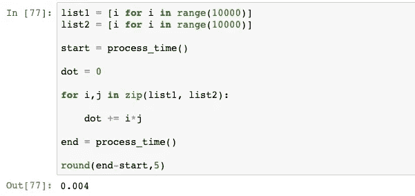
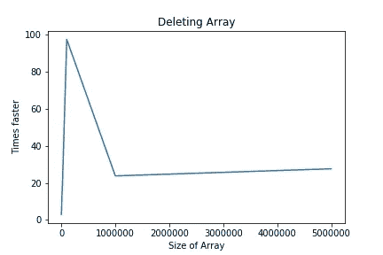

# Numpy 到底有多快，为什么？

> 原文：<https://towardsdatascience.com/how-fast-numpy-really-is-e9111df44347?source=collection_archive---------4----------------------->

## 与标准 Python 列表的比较。


Photo by [Lukas](https://unsplash.com/@goumbik?utm_source=unsplash&utm_medium=referral&utm_content=creditCopyText) on [Unsplash](https://unsplash.com/s/photos/time?utm_source=unsplash&utm_medium=referral&utm_content=creditCopyText)

最初 **Python** 不是为数值计算而设计的。随着人们开始使用 python 完成各种任务，对快速数值计算的需求也随之增加。一群人在 2005 年创建了 **Numpy** 来应对这一挑战。

在人工智能时代的今天，如果没有 Numpy 这样的快速数字库，就不可能训练机器学习算法。

以下是 Numpy 速度快背后的主要原因。

*   Numpy 数组是密集存储在内存中的相似数据类型的集合。一个 Python 列表可以有不同的数据类型，这在对其进行计算时会带来很多额外的约束。
*   Numpy 能够将一个任务分成多个子任务，并并行处理它们。
*   Numpy 函数是用 c 实现的，这也使得它比 Python 列表更快。

在这篇博客中，我们将对 Numpy 数组和 Python 列表执行以下计算，并比较两者所用的时间。

*   **添加标量**
*   **点积**
*   **串联**
*   **删除**

让我们先导入 Numpy 包。

```
import numpy as np
```

# 添加缩放器

让我们创建一个包含 10000 个元素的 Python 列表，并为列表中的每个元素添加一个标量。


现在创建一个包含 10000 个元素的 Numpy 数组，并为数组的每个元素添加一个标量。


对于这种计算，Numpy 的执行速度比 Python list 快 5 倍。

这个计算是在一个大小为 10000 的数组上执行的。让我们看看不同大小的阵列的时间是如何变化的。下图显示了 Numpy 数组在不同数组大小下速度更快的次数。


当数组大小接近 5，000，000 时，Numpy 的速度提高了大约 120 倍。随着数组大小的增加，Numpy 能够执行更多的并行操作，从而加快计算速度。

# 点积

点积是机器学习算法中最重要和最常见的运算之一。特别是在神经网络训练中，我们需要做大量的矩阵乘法。

现在我们来比较一下点积的速度。



Numpy 大约快 10 倍。让我们画出不同阵列大小的速度。


我们看到点积更快。这大约是我们转向大型阵列时的 140 倍。

# 串联

现在我们连接两个数组。我们来对比一下速度。


我们看到连接速度几乎是相似的。即使对于不同的数组大小，连接所用的时间也几乎是相似的。


Python 列表可以通过附加一个或多个列表来扩展。但是我们不能扩展现有的 Numpy 数组。当我们连接 2 个 Numpy 数组时，一个新的结果数组被初始化。所以在 python 列表中拼接操作相对更快。

# 删除

我们在这里花点时间，猜猜在执行删除操作的时候哪个东西会更快？


即使对于删除操作，Numpy 数组也更快。随着数组大小的增加，Numpy 比 Python List 快 30 倍左右。



因为 Numpy 数组由于其同构类型而被密集地打包在内存中，所以它也可以更快地释放内存。

因此，总的来说，在 Numpy 中执行的任务比标准 python 列表快 5 到 100 倍，这在速度上是一个巨大的飞跃。

在下一篇文章中，我将解释 Numpy 数据中的轴和维度。

[](/understanding-axes-and-dimensions-numpy-pandas-606407a5f950) [## 了解轴和维度| Numpy |熊猫

### 知道如何沿数据的不同轴应用函数。

towardsdatascience.com](/understanding-axes-and-dimensions-numpy-pandas-606407a5f950)