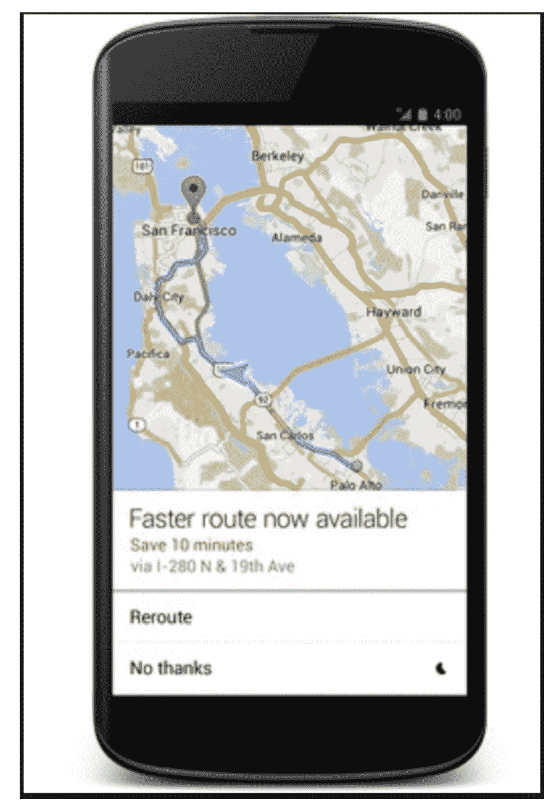
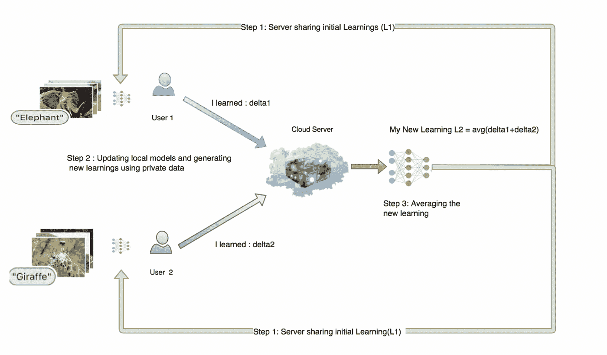

# 联合学习将如何彻底改变人工智能

> 原文：<https://towardsdatascience.com/how-federated-learning-is-going-to-revolutionize-ai-6e0ab580420f?source=collection_archive---------6----------------------->

# 介绍

今年我们观察到了一个惊人的天文现象，这是第一次看到黑洞的照片。但是你知道这个黑洞在 5000 万光年之外吗？为了拍摄这张照片，科学家们需要一个和地球一样大的单圆盘望远镜！由于实际上不可能制造出这样的望远镜，他们将世界各地的望远镜网络聚集在一起——由此制造的事件视界望远镜是一个大型计算望远镜，其孔径与地球的孔径相同。

这是分散计算的一个很好的例子，它展示了分散学习的力量，这也可以在其他领域加以利用。

基于同样的原则，人工智能中出现了一个新的框架，它有能力在数百万台设备上进行计算，并整合这些结果，以提供更好的预测，增强用户体验。欢迎来到联合(分散)机器学习的时代。

# 什么是联合(分散)机器学习？

我们一会儿就到了。但首先，我们需要了解什么是传统的或集中式的机器学习。

# 集中式机器学习

世界上有数十亿台移动设备，这是一个计算能力巨大的时代。随着廉价计算能力的发明，我们已经有了硬件容量相当于笔记本电脑的手机。用不了多久，你的口袋设备将拥有 GPU(图形处理单元)，它们将能够轻松地训练深度神经网络。

世界上几乎每个人都有个人设备，因此我们正在见证数据量的新一轮激增，这是过去从未观察到的，并且正在以指数速度增长。随着数据以不断增长的速度生成，它为提供更准确和个性化的 ML 模型开辟了新的可能性，这些模型可以增强客户体验并帮助他们做出决策。

集中式机器学习就是使用“训练数据”——样本数据——创建一种算法，以识别其中的模式和趋势。然后，机器使用算法来“学习”这种模式，并在类似于样本数据的更大数据块中识别它们(更详细的解释[此处](https://en.wikipedia.org/wiki/Machine_learning))

让我们现在进入细节。这个过程包括五个步骤

1.  问题的识别
2.  解决问题的数据准备
3.  在中央服务器或机器上训练 ML 算法
4.  将训练好的模型发送到客户端系统(或者提供公开 API 的 ML 服务)
5.  对看不见的数据开始结果预测

因此，在当前的 ML 世界中，模型训练的方法是集中的。集中式培训要求将数据存储在一个中央位置或数据服务器上，从而限制了访问权限，也增加了安全隐患(如果这些数据被黑客攻击了怎么办！).

有没有想过谷歌地图是如何在恰当的时候建议替代路线的？三个词——实时计算

谷歌在其服务器上收集了数百辆已经经过你正在经过的同一条路线的车辆的数据，计算出大多数人选择的最佳路线，并将这些信息传递给你——让你的生活变得更容易(不客气)。

# 集中学习的局限性

Figure 2: Google Maps Route Suggestions

但是这些惊人的灵活性的代价是大多数人都没有意识到的。将数据存储在中央服务器上不仅会导致侵犯用户隐私，还会带来泄露其他个人数据的风险。大多数时候，用户数据存储在大公司拥有的云上，而他们甚至不知道。通过交换隐私，用户可以获得更好的、更个性化的应用程序。

不同国家的政府已经注意到这些隐私问题，并提出了严格的措施来确保数据隐私。其中包括 HIPAA——医疗保健行业的健康保险便携性和责任法案，以及 GDPR——通用数据保护法规。这些限制了任何组织对用户数据的访问，直到用户明确许可(通常是书面许可)。

那么，依靠个人数据生存的组织会怎么做呢？！初创企业和公司越来越难以构建能够为用户提供更好的个性化结果的应用。所有的 ML 应用都基于简单的逻辑，*你输入的数据越多，它得到的数据就越准确*，它返回的结果就越好，越个性化。如果不是通过对大量用户数据进行训练来构建，这些结果通常会很差且不个性化。这导致用户群体对新应用的适应性降低。

对于用户和组织来说，这些问题都可以在联合学习的帮助下得到解决。

# 回到最初的问题——什么是联合学习，它将如何提供帮助？

联邦学习是人工智能的一个新分支，它为机器学习的新时代打开了大门。

它可以利用现代世界中可用的“分散数据”(数据不存储在一个位置，因此容易受到攻击)和“分散计算能力”，在不损害“用户隐私”的情况下提供更个性化的体验。

现在可以通过同态加密在客户端和服务器之间共享信息，而不会损害用户隐私(参见 Andreas Poyiatzis 的文章)。简而言之，通过同态加密，现在可以在远程服务器位置对加密数据执行计算(不侵犯隐私),同样加密的计算结果将被发送回客户端，客户端可以解密个性化结果，而无需担心泄露其隐私。

# 它是如何工作的？

Figure 3: How Federated Learning works?

不要被复杂的图表所困扰。事情是这样的。

典型的联合学习解决方案从在位于中央的服务器中训练通用机器学习模型开始，该模型不是个性化的，而是作为基线开始。接下来，服务器将该模型发送到用户设备(步骤 1)，用户设备也称为客户端(根据应用程序的用户群，客户端可以从数百到数百万不等)。随着客户端系统生成数据，本地模型(在各自的用户设备上)随着时间的推移而学习并变得更好。

所有客户端定期将它们的学习发送到中央服务器，而不会将用户的个人数据暴露给服务器(步骤 2)。这是借助同态加密完成的。然后，服务器汇总来自客户端的新知识，并继续改进共享模型(步骤 3)。新的共享模型再次被发送回客户端的系统，相同的循环一次又一次地重复。随着时间的推移，位于中央服务器的共享模型变得越来越好，越来越个性化。

这种从用户个人数据中学习的艺术，没有任何暴露它的威胁，在未来有很大的潜力衍生出新的可能性。

# 联邦学习的未来

自动驾驶联网汽车可以利用联邦学习来安全驾驶。如果自动驾驶汽车利用过去 1 小时内穿过同一坑洞的所有汽车的信息，而不是仅仅基于一套预定的算法和规则来避免坑洞，那么它肯定能够在乘客的安全性和舒适性方面做出更好的决定。

未来 5 年将会是联合学习非常有趣的一年。我们将看到大量新的应用程序利用联合学习，以一种前所未有的方式增强用户体验。许多公司将站出来，提供一个快速开发联合学习应用程序的平台。我们将会看到这样一个时代，用户将会因为与大公司分享他们的本地知识而获得回报。

谷歌已经以 [Tensorflow Federated](https://www.tensorflow.org/federated) 的形式分享了它的联合学习平台。目前它还处于萌芽阶段，但这是一个很好的学习平台。即将发布的版本将提供新的功能，使用户能够构建端到端可扩展的联邦机器学习模型。

[OpenMined](https://www.openmined.org/) 是一家已经在这方面开始认真工作的公司。他们的方法确保了全面的数据保护以及对客户分享其学习成果的奖励。如果你想在这个领域探索更多，我建议你访问他们的网站。