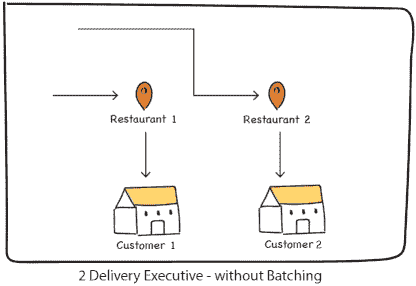

# 位置智能在食品技术行业中的应用

> 原文：<https://towardsdatascience.com/how-food-delivery-companies-leverage-location-data-to-improve-customer-experience-58470406e7ed?source=collection_archive---------12----------------------->

## 食品配送公司如何利用位置数据来改善客户体验并获得更好的市场份额

Photo by [Robert Anasch](https://unsplash.com/@diesektion?utm_source=medium&utm_medium=referral) on [Unsplash](https://unsplash.com?utm_source=medium&utm_medium=referral)

我们生活在这样一个时代，如果我们下班回家晚了，或者突然饥肠辘辘，需要速食，我们就不需要费心做饭了。从我们最喜欢的餐馆点餐从未如此简单。

从数字来看，预计食品配送市场有望在 2019 年增长至 50 亿美元，到 2023 年增长至 150 亿美元。像 Swiggy 和 Zomato 这样的公司已经在几乎所有的印度一线和二线城市开展业务，随着新的参与者采取差异化战略，这个市场可能会快速增长。

根据数据情报平台 KalaGato 的一份报告，截至 2018 年上半年，Swiggy 的市场份额为 36.40%，FoodPanda 紧随其后，份额为 32.02%。Zomato 的市场份额为 23.78%。尽管 Zomato 的市场份额较小，但它已经在全球 300 多个城市开展业务。[【来源】](https://yourstory.com/2019/06/swiggy-zomato-foodpanda-kalagato-report)

[Source](https://qz.com/india/1635965/in-2018-swiggy-beat-zomato-olas-foodpanda-uber-eats-by-a-mile/)

许多因素影响或帮助食品科技公司发展业务。实时流量、订单准备时间、交付执行效率等等。时间和距离在完成交货的各个环节中起着非常重要的作用。

[Source](https://vnexpress.net/interactive/tiki-mo-rong-quy-mo-kho-gap-600-lan-sau-10-nam-3977228.html)

我们使用地图来定位一个地方的日子已经一去不复返了。食品科技公司正在利用位置数据来改善他们组织的各个方面。让我们来看看其中的一些吧！

# 搜索和发现

食品科技公司使用位置数据来帮助他们的客户搜索或找到他们附近的新餐馆。他们通过查找哪些餐厅可以接受订单并在最长送货时间内送货上门来做到这一点。这就是所谓的 ***适用性*。**

这里的诀窍是找到合适的时间来确保送货，并提供足够多的餐厅选择，以便尽快计算出送货时间。

客户体验仍然是此类食品配送服务的重中之重。如果交付时间太长，或者如果用户没有看到很多餐馆，那么他/她可能不会在第一时间下订单！

# 交货任务

一旦你在手机上下单，离你最近的快递员就会把你的订单交给你。这背后有很多计算，例如送货主管的当前位置和餐厅之间的距离，以及到达客户位置所需的时间。

[Source](https://bytes.swiggy.com/the-swiggy-delivery-challenge-part-two-f095930816e3)

[Source](https://bytes.swiggy.com/the-swiggy-delivery-challenge-part-two-f095930816e3)

有时会出现餐馆从附近的顾客那里得到两份订单的情况。在这种情况下， ***批处理*** 的概念开始发挥作用，单个交付执行人员被分配来交付两个订单。

如果一批订单中所有订单的交货时间与承诺给每个客户的估计交货时间相匹配，则称两个订单是可分批的。

# 最后一英里递送

最后一英里送货不仅仅是从餐馆到送货地点的旅程。食品科技公司使用他们自己的地图来精确计算估计的送货时间，其中甚至包括送货主管行驶“ ***”最后一英里所用的时间(“*** 例如从社交大门到顾客门口所用的时间)。

他们利用历史数据和实时信号来构建和改进自己的地图，以满足自己的需求。

# 优化交付成本和时间

食品配送是一个需要解决的复杂问题，因为它涉及到在维持良好的客户体验和保持高效率的订单交付之间找到平衡。他们通过优化时间、成本和路线来做到这一点，即使是在不可避免的情况下(如下雨、交通问题和可用交付执行人员减少)。

他们通过减少送货员在餐馆的等待时间(当食物正在准备时)或者通过减少送货员等待分配给他/她的下一个订单所花费的时间来最小化未被利用的时间来实现这个目标。

# 云厨房位置

随着“云厨房”的出现，就规模和技术进步而言，最后一英里配送正在市场上掀起巨大风暴。

位置智能和人工智能正在帮助他们预测客户的购买模式，并在离送货上门需求更多的地方最近的云厨房中准备库存。

# 实时地理围栏

汉堡王使用实时地理围栏和位置智能来寻找任何一家门店 600 英尺范围内的客户，以便在任何一家门店点餐时提供数字优惠券折扣。

通过这种方式，他们优化了客户参与度，这有助于他们提高知名度并有效赢得客户。[【来源】](https://www.esri.com/about/newsroom/publications/wherenext/burger-king-marketing-campaign/)

# 基于位置的广告

随着消费者对他们的数据越来越放松，食品科技公司正在利用这一点，并利用实时位置在正确的时间锁定正确的客户。

基于位置的广告有许多优点，如更好的实时数据，公司从中获得的牵引力非常高。例如，在他们最常订购午餐的地方(如大学或商业场所)，他们可以对各种小吃店提供的早餐进行促销。

不仅仅是这些，公司还在使用位置智能来查找区域取消率，找到一个地区的食品和配送管理人员的需求和供应比率，并获得配送和餐厅客流量及其变化的快照。

观看这段视频，直观地了解食品科技公司如何利用地理位置来管理他们的业务！

# 折扣/优惠

一个受欢迎的餐馆预订平台 Eatigo 使用位置智能根据客户的位置和时间以及其他因素(如星期几和天气条件)向客户提供折扣。

其目的是确定客户是否愿意为获得大量折扣而旅行。例如，如果提供的折扣更高，一个人可能会旅行 10 公里左右。[【来源】](https://www.geospatialworld.net/blogs/restaurant-booking-platform-discounts-location-tech/)

# 实时交通监控

公司正在监控实时交通，以相对了解他们的商店和竞争对手之间的消费者步行交通模式。不仅如此，这些以“快速服务”闻名的品牌正在利用实时流量来更好地洞察钱包的相对份额、竞争对手的商店访问量和客户忠诚度。

实时流量监控还有助于他们跟踪任何会妨碍业务流程有效执行的不可预见的情况。它还可以帮助他们监控资源和人员流动，以便他们可以有效地处理任何危机情况，还可以减少浪费。

位置不仅仅是地图上的一个点。组织正在使用位置分析来扩大他们的业务。食品科技公司利用这些数据来识别趋势，并通过跟踪骑手活动来改善客户体验。您可以访问我们的[网站](https://www.locale.ai/)或在 [LinkedIn](https://www.linkedin.com/company/localeai/) 上与我们联系，了解更多信息。