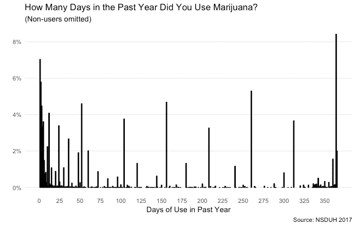
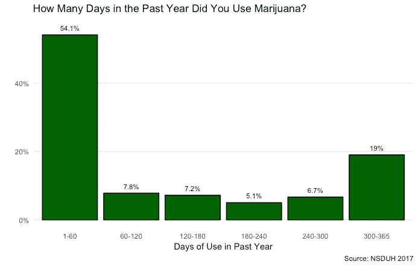
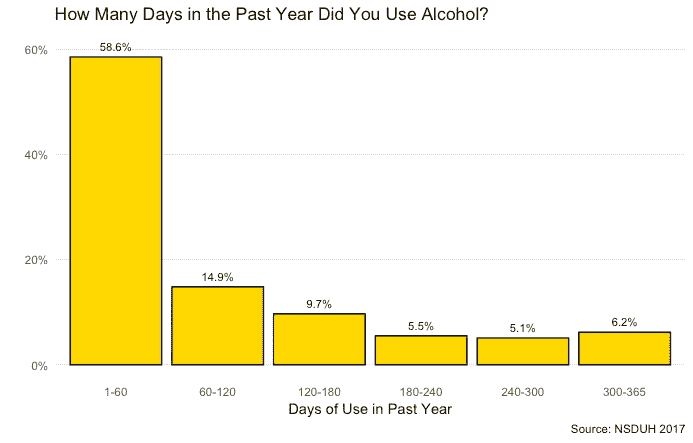
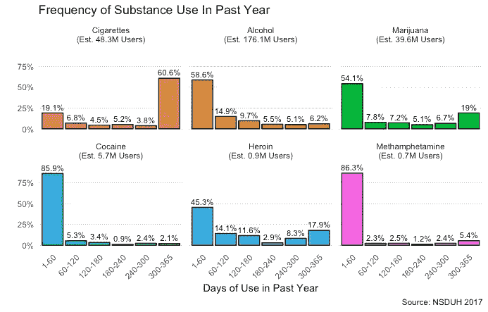
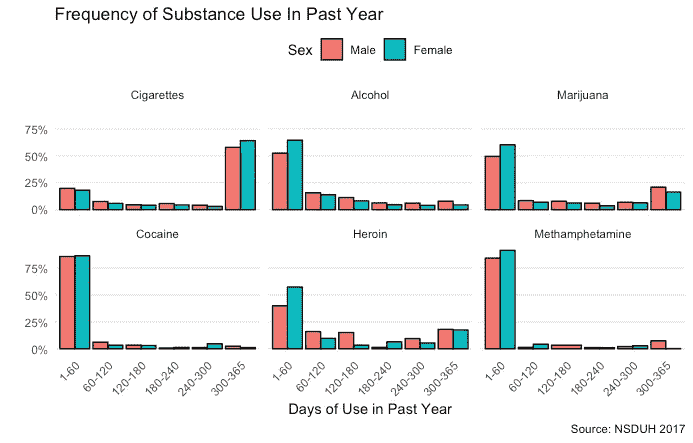
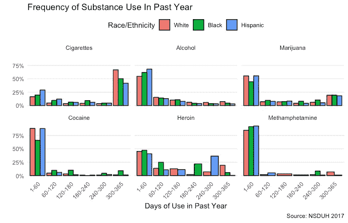
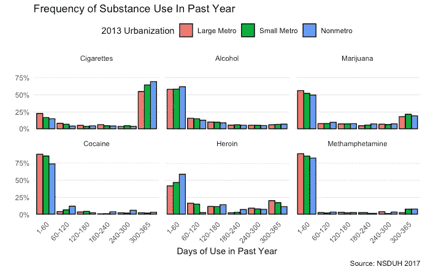
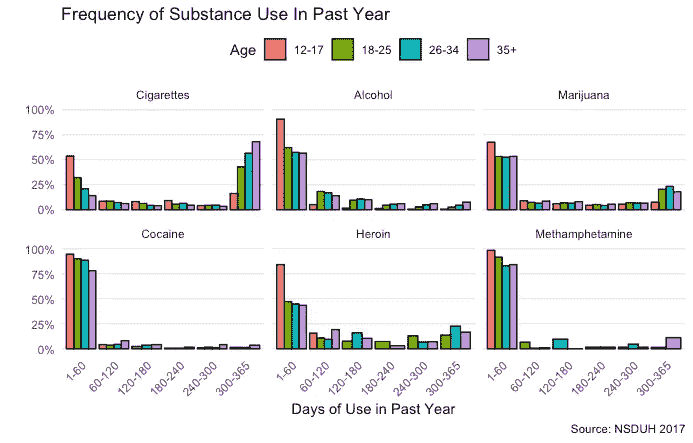

# 人们使用不同药物的频率如何？

> 原文：<https://towardsdatascience.com/how-frequently-do-people-use-different-drugs-f29255dfb339?source=collection_archive---------15----------------------->

关于 [*最令人沮丧的一件事告诉你的孩子*](https://www.amazon.com/Tell-Your-Children-Marijuana-Violence/dp/1982103663) ，来自前*纽约时报*记者[间谍小说家](https://www.amazon.com/Faithful-Spy-Novel-Alex-Berenson/dp/0345478991)的反大麻传单！)亚历克斯·贝伦森(Alex Berenson)最有趣的一点是，它最有趣的点几乎完全与其论题无关。这个中心思想——粗略地说，即[大麻导致精神病和精神分裂症](https://www.nap.edu/read/24625/chapter/14)，而[精神病导致暴力](https://journals.plos.org/plosmedicine/article?id=10.1371/journal.pmed.1000120)，因此[大麻导致暴力](http://nymag.com/intelligencer/2019/01/no-pot-legalization-probably-didnt-increase-homicide-rates.html)——无论是表面上的*还是事后的*都不令人信服。

贝伦森在这本书里花了如此多的篇幅讨论这种紧张的论点令人沮丧，正是因为它对大麻及其支持者进行了有益的批评。 *TYC* 做了一件伟大的工作，例如，指出医用大麻主要是合法化的潜在障碍。虽然这种药物有医疗用途，但它们似乎很少出现在 T21——它肯定不像某些人所说的那样具有医疗价值。

同样，贝伦森强调了一些关于大量使用大麻频率的惊人数据。为了简洁起见，我将引用他在《华尔街日报》的[*专栏*](https://www.wsj.com/articles/marijuana-is-more-dangerous-than-you-think-11546527075)*中从 *TYC* 推出的内容:*

> *大量使用大麻的美国人数正在飙升。2006 年，约 300 万美国人报告每年至少使用该药物 300 次，这是日常使用的标准。到 2017 年，这一数字增加到 800 万——接近每天饮酒的 1200 万美国人。换句话说，只有 1/15 的饮酒者每天饮酒；大约五分之一的大麻使用者经常使用大麻。*

*这些数字来自美国药物滥用和精神健康服务管理局每年对 70，000 多名美国人进行的全国药物使用和健康调查。NSDUH 是一个奇怪的生物:大约一半的样本是 12 至 25 岁的人，大概是因为 SAMHSA 对年轻人的吸毒行为比对普通人群更感兴趣。尽管如此，对于(通常不可靠的)自我报告的药物使用趋势来说，这是我们得到的最好的数据来源，所以它经常被使用/引用。*

*贝伦森关于大量高频率大麻消费者的说法让我吃惊，不是因为我怀疑，而是因为我从未想过要核实。所以我想深入研究不同物质的频率分布到底是什么样的。*

*我在这里做的一切都是基于 NSDUH 2017，标准权重(ANALWT_C)。你可以在这里得到一个. tsv 和码本[。我会尽量标记变量名。我还要说的是，这些是 2017 年的数据，因此代表了近一年的药物使用趋势。NSDUH 拥有追溯到 2000 年代早期的数据，但我使用这个数据集的原因很简单，加载完整的时间序列数据需要花费*永远*的时间，这只是一篇博客文章。尽管如此，我还是要告诫不要从一年的使用数据中得出太强的结论。](https://www.datafiles.samhsa.gov/study-dataset/national-survey-drug-use-and-health-2017-nsduh-2017-ds0001-nid17939)*

*也就是说，这里是 2017 年大麻使用者过去一年使用天数(MJYRTOT)的分布。(从技术上讲，它包括大麻*和*印度大麻脂，但是，嗯，我不知道很多印度大麻脂使用者。)*

**

*这里有几个值得注意的特点。你可以开始看到贝伦森提到的 u 形曲线——大量低频用户，大量高频用户。此外，您可以看到 NSDUH 回答者喜欢近似自己的使用，这就是为什么您会得到那些大尖峰。*

*这么大的领域，很难看出趋势。为了便于解释，我将把 x 轴分成 60 天左右的组。这有一个额外的好处，那就是界定一年 300 多天的用户，这是贝伦森早先对“日常使用”的定义。(此图表和所有后续图表不包括非用户。)*

**

*所以，是的，2017 年约有 20%的大麻使用者是 300-365 天范围内的使用者。从上一张图表中我们还知道，这主要是因为人们报告了 365 天的使用。*

*但是这和其他物质相比如何呢？[在推特](https://twitter.com/sethpo/status/1088476667893481472) , *SB Nation* 的 Seth Pollack 问我酒精(ALCYRTOT)如何比较。(注意，我的推文每个月都会删除——这也是这篇文章在 Medium 上发表的原因之一！)下面是同样的宁滨下的图表:*

**

*酒精缺乏同样的 U 型曲线:大多数饮酒者喝一点点(0-60 天=最多一天或一周左右的饮酒时间)，而那些饮酒较多的人大约平均分布。每天吸食大麻的人比喝酒的人多得多。*

*但是其他药物呢？在这里，我做了同样的事情，但用了六种主要物质——大麻、酒精、香烟、可卡因(COCYRTOT)、海洛因(HERYRTOT)和甲基苯丙胺(METHDYSYR)。*

**

*(有趣的是，NSDUH 只问上个月的吸烟情况；我刚刚把这个数字(CIG30USE)乘以 12，得出了一个年度估计值。)*

*这是怎么回事？我们已经知道酒精是什么样的了。毫不奇怪，绝大多数吸烟者每天都吸烟；相比之下，去年吸食可卡因的人很少使用。我不确定为什么后一个事实是真的——值得注意的是，我没有查看裂纹，它在 NSDUH 中被定界，并且可能显示不同的模式。事实上，可卡因和甲基苯丙胺之间的相似性表明，这两种药物的低使用频率可能是其低市场可获得性的功能——尽管正如 [I](https://www.theamericanconservative.com/articles/white-lines-black-epidemic/) 和[其他人](https://filtermag.org/2019/01/22/why-crystal-meth-has-made-a-big-comeback-in-philadelphia/)所指出的，这两种药物的使用正在增加。*

*虽然注意到这一数据的有限性，但海洛因和大麻使用模式的相似性是有趣的。这两种药物都有很大比例的非频繁使用者，还有相当数量的少数人(15-20%)每天使用。*

*大麻不像海洛因那样是一种“镇定剂”— [它被归类为兴奋剂和镇静剂。但是两者都有镇静和 T2 止痛的效果，这也是为什么大麻的支持者经常争论这种药物 T4 可能是治疗慢性疼痛的处方阿片类药物的替代品的部分原因；他们指出](https://www.ncbi.nlm.nih.gov/pubmed/3009708)[证据](https://jamanetwork.com/journals/jamainternalmedicine/fullarticle/1898878)表明，有医疗法的州阿片类药物过量率的增幅较低(贝伦森准确地指出，随后的分析显示这一趋势正在消失；其他研究[限制了](https://www.cboutlook.com/RAND_Powell.pdf)药物/阿片类药物滥用之间的联系。*

*那么，有一个有趣的问题，这两者在社会背景下的可替代性。人们大量使用海洛因，或者可能更有用的处方阿片类药物，是出于与导致他们大量使用大麻相似的原因吗？(原则上，人们可以出于同样的原因*大量*使用两种不同药物中的一种——尤其是两种都具有显著的镇静作用——而*非大量*使用人群可以出于不同的原因使用它们。)大麻和海洛因在药理上并不相似，但它们越来越多的使用可能是以不同的化学表现形式表现出来的共同社会病理的产物。*

*在推测的基础上评估这种说法需要比我在这里看到的更多的数据(至少，要梳理出一年的影响，还要看看阿片类药物和大麻的使用是否比各自与其他药物的使用更共病)。所以我想转向另一个问题:不同的群体如何使用？*

*NSDUH 人口统计变量有点糟糕——这是一项调查的功能，主要集中在年轻人人口统计上，老年人是一种事后思考。此外，如果你把调查分割得太细，你就不会有任何接近代表性的东西。尽管如此，这里还是有性别、种族/民族、城市化和年龄。*

**

*性(IRSEX):在所有这些药物的高频使用者中，男性更常见，除了香烟(显然女性吸烟更重！).这并不奇怪，因为男人通常从事更危险的行为。*

**

*三个最常见群体的种族/民族(NEWRACE2):非 Hisp。白色，非。-他的计划。黑人和西班牙人。我很确定 N 太小了，不足以得出关于海洛因/冰毒的合理结论。可卡因的使用在黑人受访者中更为频繁(正如[我在别处](https://www.theamericanconservative.com/articles/white-lines-black-epidemic/)所写的，这与非裔美国人更高的可卡因过量致死率相吻合)。有趣的是，白人受访者更有可能酗酒和吸烟；大麻在不同种族中似乎同样受欢迎，在中等使用群体中，非洲裔美国人使用大麻的频率略高。*

**

*这是城市化(COUTYP4)。农村人吸烟更频繁；每个人喝的都差不多；鉴于 n 大小的相对差异，其他一切都很难一概而论。*

**

*最后，NSDUH 的一个不可靠的年龄变量(CATAGE)。同样，对底行和顶行的亚组样本量的严重关切基本上表明，使用随着年龄的增长而增加(大麻除外，大麻的大量使用者集中在 18 至 34 岁之间)。*

*纵观这一切，我有三点建议。*

*首先:我认为[对大麻依赖](https://www.theatlantic.com/ideas/archive/2018/08/americas-invisible-pot-addicts/567886/)的担忧可能有些道理，特别是如果男性比女性更有可能是重度使用者的话(因为重度大麻使用可能与低地位男性目前面临的那种[问题](https://freebeacon.com/culture/review-man-out-andrew-l-yarrow/)并存)。*

*第二:海洛因/大麻的类比值得进一步探索，尽管我绝对不会致力于此。我深入研究了这两种药物的止痛和镇静作用，因为这些作用显然与社会/文化对逃避、脱离和压抑体验的渴望有关。Jill Jonnes (我认为)谈论了药物宏观历史中的兴奋/沮丧周期(社会在兴奋和沮丧之间摇摆不定)。如果我们处于情绪低落期，那么大麻和阿片类药物使用者的核心群体的存在是有道理的。*

*第三:我想看看可卡因使用和快克可卡因使用的长期趋势，试图理解为什么大多数可卡因使用者不经常使用。[可卡因过量死亡](https://freebeacon.com/issues/drugs-suicide-drive-american-life-expectancy-down-again/)与处方阿片类药物过量死亡一样常见，但人们似乎很少使用可卡因。这是否意味着可卡因危机真的是[仅仅是芬太尼掺假](https://ajph.aphapublications.org/doi/abs/10.2105/AJPH.2016.303627)？大多数死亡是由于快速投球，而单独使用可卡因是(相对)安全的吗？随着[在哥伦比亚](https://www.dea.gov/sites/default/files/2018-11/DIR-032-18%202018%20NDTA%20final%20low%20resolution.pdf#page=51)的产量持续增长，可卡因问题只会变得更糟——如何解释人们的可卡因消费选择？*

*(更新:感谢 Michael Josem([@ MichaelJosem](https://twitter.com/MichaelJosem))在第一张图中捕捉到一个标签错误的轴。现在已经修好了。)*