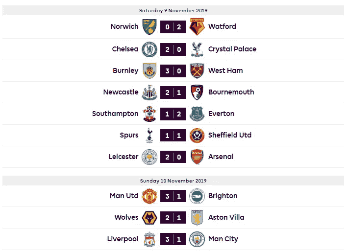
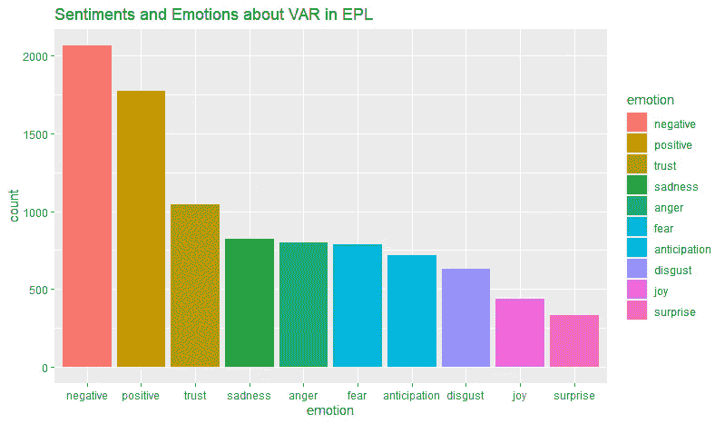
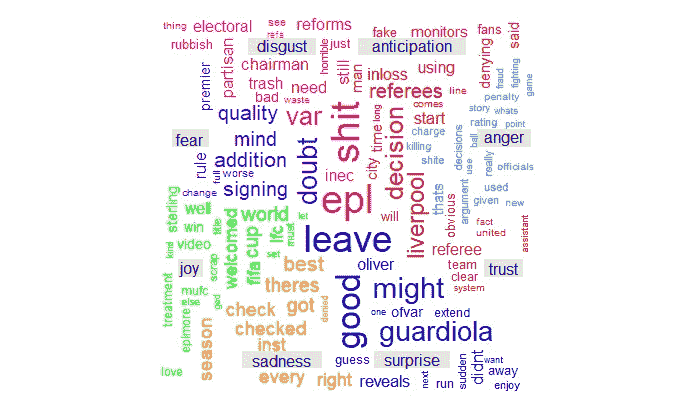
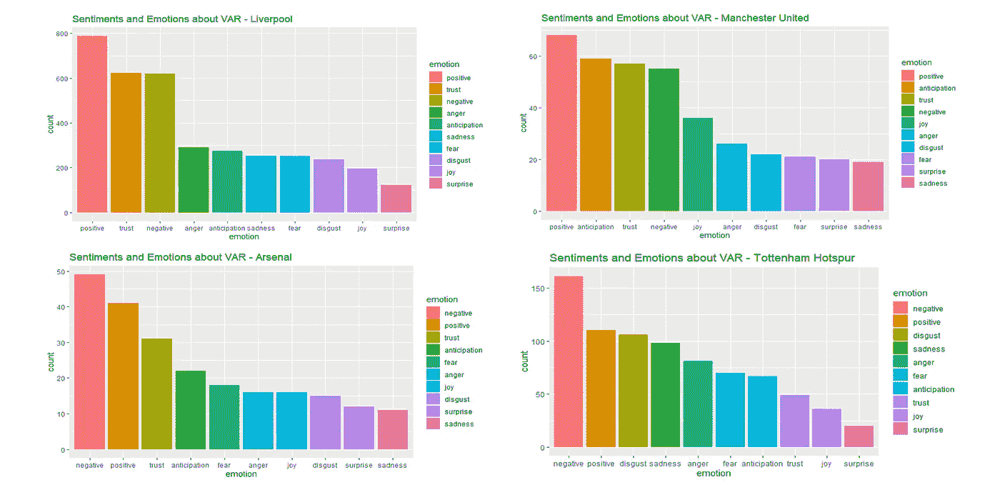

# 有 VAR 的英超球迷有多沮丧？用情感分析来观察他们的反应

> 原文：<https://towardsdatascience.com/how-frustrated-are-premier-league-fans-with-var-c8ae9c227418?source=collection_archive---------32----------------------->

## **什么是 VAR？**

国际足联引入了视频助理裁判(VAR)来支持裁判的决策过程。过去有许多有争议的事件导致了 VAR 的引入。其中一次是在 2010 年世界杯淘汰赛中，英国队以 2:1 落后于德国队，当时[弗兰克·兰帕德的](https://www.theguardian.com/football/2010/jul/05/frank-lampard-england-germany)射门击中横梁下侧，弹过了大约一码的球门线。但是裁判没看到。德国以 4 比 1 赢得了比赛，英格兰被淘汰出局。另一个是臭名昭著的[蒂埃里·亨利在 2009 年对阵爱尔兰的](https://www.theguardian.com/football/2009/nov/19/thierry-henry-handball-football-worlcup)手球。VAR 被设定为只在改变比赛的情况下使用，如进球、点球和红牌。这样，他们应该对游戏有最小的干扰。

## **为什么 VAR 出现在新闻中的原因是错误的？**

从本赛季(2019–20)开始在英超联赛中引入 VAR。自本赛季开始以来，VAR 在英超联赛中购买的争议多于解决方案。11 月 10 日利物浦对曼城的比赛中发生的两起事件(特伦特·亚历山大-阿诺德的手球和莫·萨拉赫的越位判罚)最近成为英超联赛中的热门话题。本赛季有类似的事件发生，这使得范质疑 VAR 在英超联赛中的使用。

通过对英超球迷关于 VAR 的推文进行情感分析，我试图理解:

*1。总体而言，英超球迷对 VAR 的使用持积极还是消极态度？*

*2。他们在关于 VAR 的推文中表现出什么样的情绪？*

*3。英超球迷在发关于 VAR 的微博时常用的词语有哪些？*

*4。基于他们支持的俱乐部，球迷对 VAR 的反应有什么不同吗？*

## **为什么使用 Twitter 进行情感分析？**

社交媒体已经从人们相互交谈的平台转变为人们分享观点、表达不满以及赞扬或批评机构和公众人物的媒介。在社交媒体平台中，Twitter 是人们用来评论或抱怨产品和事件以及谈论个性的主要平台。与其他写长篇故事的平台不同，由于大小限制，用户可以专注于他们的关键信息，因此很容易在 Twitter 上找到主题的脉搏。

## **如何在 R 中做情感分析？**

r 中有许多可用于分析 Twitter 情绪的软件包。下面给出了一个广泛使用的软件包的逐步流程:

**创建 Twitter 应用**

Twitter 开发了一个 API，可以用来分析用户发布的推文。这个 API 帮助我们以结构化的格式提取数据，以便于分析。这里的[给出了创建 twitter 应用程序的过程](https://iag.me/socialmedia/how-to-create-a-twitter-app-in-8-easy-steps/)。当您创建一个在分析过程中提取推文所需的 twitter 应用程序时，会生成以下四个键:

消费者密钥(API 密钥)

消费者秘密(API 秘密)

访问令牌

访问令牌秘密

**安装包并提取 tweet**

安装情感分析所需的软件包。

```
# Install packages
install.packages("twitteR")
install.packages("RCurl")
install.packages("httr")
install.packages("syuzhet")# Load the required Packages
library(twitteR)
library(RCurl)
library(httr)
library(tm)
library(wordcloud)
library(syuzhet)
```

TwitteR 包提供了对 Twitter API 的访问。 **RCurl** 和 **httr** 包提供的功能允许用户编写 HTTP 请求并处理 Web 服务器返回的结果。Syuzhet 包用于从文本中提取情感和基于情感的情节弧线。syuzhet 包下的 **nrc** lexicon 让用户在一个文本文件中计算出除了两种情绪之外的八种不同情绪的存在及其相应的效价。

由于免费的 twitter 应用程序只允许用户提取过去 7 天的推文，我分析了英超球迷对 2019 年 11 月 9 日和 10 日举行的 Gameweek 12 比赛的 VAR 的反应。以下是 Gameweek 12 的成绩:



安装必要的包后的下一步是设置 Twitter API，调用 Twitter 应用程序并使用关键字提取数据。用于提取推文的关键词是“VAR”和“epl”。

```
# authorisation keys
consumer_key = "XXXXXXXXXXXXXXXX" 
consumer_secret = "XXXXXXXXXXXXXXX" 
access_token = "XXXXXXXXXXXXXXX" 
access_secret ="XXXXXXXXXXXXXXX" 

# set up
setup_twitter_oauth(consumer_key,consumer_secret,access_token, access_secret)# search for tweets in english language
tweetVAR = searchTwitter("VAR epl", n = 10000, lang = "en")# store the tweets into a dataframe
tweetsVAR.df = twListToDF(tweetVAR)
```

**数据清理
Gsub** 功能从推文中删除不想要的内容，如标签、数字、停用词和 URL，以便推文可以进行分析。

```
#cleaning tweets
tweetsVAR.df$text=gsub("&amp", "", tweetsVAR.df$text)
tweetsVAR.df$text = gsub("&amp", "", tweetsVAR.df$text)
tweetsVAR.df$text = gsub("(RT|via)((?:\\b\\W*@\\w+)+)", "", tweetsVAR.df$text)
tweetsVAR.df$text = gsub("@\\w+", "", tweetsVAR.df$text)
tweetsVAR.df$text = gsub("[[:punct:]]", "", tweetsVAR.df$text)
tweetsVAR.df$text = gsub("[[:digit:]]", "", tweetsVAR.df$text)
tweetsVAR.df$text = gsub("http\\w+", "", tweetsVAR.df$text)
tweetsVAR.df$text = gsub("[ \t]{2,}", "", tweetsVAR.df$text)
tweetsVAR.df$text = gsub("^\\s+|\\s+$", "", tweetsVAR.df$text)
tweetsVAR.df$text = gsub("penalty", "", tweetsVAR.df$text)
tweetsVAR.df$text = gsub("football", "", tweetsVAR.df$text)tweetsVAR.df$text <- iconv(tweetsVAR.df$text, "UTF-8", "ASCII", sub="")
```

**分析情绪和可视化**

Syuzhet 根据 2 种情绪和 8 种情感对每条推文进行评分。在下一步中，我使用了一个条形图来可视化在推文中占主导地位的情绪类型。

```
# Emotions for each tweet using NRC dictionary
emotions <- get_nrc_sentiment(tweetsVAR.df$text)
emo_bar = colSums(emotions)
emo_sum = data.frame(count=emo_bar, emotion=names(emo_bar))
emo_sum$emotion = factor(emo_sum$emotion, 
                         levels=emo_sum$emotion[order(emo_sum$count, decreasing = TRUE)])# Visualize the emotions from NRC sentiments
var <- ggplot(emo_sum, aes(x=emotion, y= count, fill = emotion))+
  geom_bar (stat = "identity")+
  ggtitle("Sentiments and Emotions about VAR in EPL")var
```

## **情感分析的结果**

**有哪些关于 VAR 的感悟，展现了怎样的情绪？**

英超球迷对 VAR 的使用总体持负面看法，因为负面看法的数量高于正面看法。就表达的情绪而言，悲伤、愤怒和恐惧等负面情绪主导了喜悦和惊喜等情绪。情况可能是这样的，消极情绪在本周的比赛中特别严重，因为在几场比赛中有许多有争议的决定，特别是利物浦对曼城和热刺对谢菲尔德联队。



**英超球迷在发关于 VAR 的微博时常用的词语有哪些？**

我使用了 **wordcloud** 软件包来了解不同类型的情绪是由哪些词组成的。 **comparison.cloud** 功能可以比较不同类别中不同单词的使用频率。在这种情况下，我比较了不同类型情绪下的单词频率。

```
# Create comparison word cloud visualizationwordcloud_tweet = c(
  paste(tweetsVAR.df$text[emotions$anger > 0], collapse=" "),
  paste(tweetsVAR.df$text[emotions$anticipation > 0], collapse=" "),
  paste(tweetsVAR.df$text[emotions$disgust > 0], collapse=" "),
  paste(tweetsVAR.df$text[emotions$fear > 0], collapse=" "),
  paste(tweetsVAR.df$text[emotions$joy > 0], collapse=" "),
  paste(tweetsVAR.df$text[emotions$sadness > 0], collapse=" "),
  paste(tweetsVAR.df$text[emotions$surprise > 0], collapse=" "),
  paste(tweetsVAR.df$text[emotions$trust > 0], collapse=" ")
)# create corpus
corpus = Corpus(VectorSource(wordcloud_tweet))# remove punctuation, convert every word in lower case and remove stop words
corpus = tm_map(corpus, tolower)
corpus = tm_map(corpus, removePunctuation)
corpus = tm_map(corpus, removeWords, c(stopwords("english")))
corpus = tm_map(corpus, stemDocument)# create document term matrix
tdm = TermDocumentMatrix(corpus)# convert as matrix
tdm = as.matrix(tdm)
tdmnew <- tdm[nchar(rownames(tdm)) < 11,]# column name binding
colnames(tdm) = c('anger', 'anticipation', 'disgust', 'fear', 'joy', 'sadness', 'surprise', 'trust')
colnames(tdmnew) <- colnames(tdm)
par(mar = rep(0, 4)) 
comparison.cloud(tdmnew, random.order=FALSE,
                 colors = c("#00B2FF", "red", "#FF0099", "#6600CC", "green", "orange", "blue", "brown"),
                 title.size=1, max.words=250, scale=c(2.5, 0.4),rot.per=0.4)
```



当我最初运行代码时，我发现像“惩罚”这样的词被归类到情绪的恐惧类别下，而“足球”被归类到快乐类别下。对于一般文本的情感分析，这是有意义的，因为处罚意味着支付罚款，而足球意味着进行一项可以归类为快乐的运动。但是对于这个特定的分析，这些分类没有意义，因此使用 **gsub** 函数**将这些词从 tweets 中删除。**

**基于球迷支持的俱乐部，球迷对 VAR 的反应有什么不同吗？**

我假设英超球迷对使用 VAR 的反应取决于他们的俱乐部在特定比赛周的表现，以及使用 VAR 对他们的球队产生积极还是消极的结果。因此，我为四家俱乐部(利物浦、曼联、阿森纳和托特纳姆热刺)创建了单独的数据框架，以使用“VAR”和各自俱乐部的官方 twitter id 作为关键词来提取推文。然后我对四个俱乐部进行了情绪分析。



正如假设的那样，在利物浦和曼联的球迷中，他们的球队在这个特定的比赛周赢得了比赛，而在阿森纳和托特纳姆的球迷中，他们对 VAR 的整体情绪是积极的，而在他们各自输掉的比赛中，他们的整体情绪是消极的。

在本赛季被引入英超之前，VAR 已经在 2018 年 FIFA 世界杯和欧洲俱乐部比赛中使用。事实证明，在很多情况下，这对于帮助裁判做出正确的决定至关重要。在 2019 年 4 月的冠军联赛半决赛中，VAR 排除了拉希姆·斯特林(Raheem Sterling)最后一分钟的进球，这个进球本来可以让曼城晋级。那个进球因越位被判无效，托特纳姆反而进步了。令人惊讶的是，英超裁判从未使用过球场边的监视器来辅助裁判。最近的[股东大会](https://www.premierleague.com/news/1494932)上，英超联赛和 PGMOL 承诺改善 VAR 的实施和裁判对球场边监视器的定期使用，预计将减少围绕 VAR 的争议并改变围绕 VAR 的情绪。