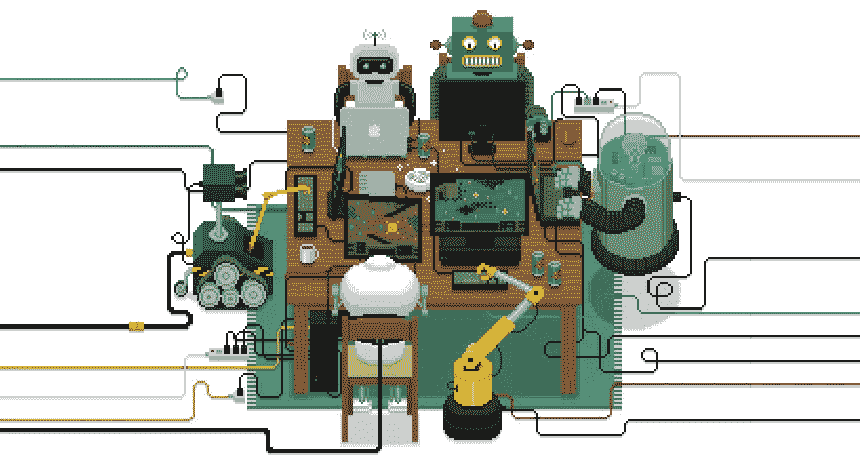

# 游戏如何改变数据科学产业

> 原文：<https://towardsdatascience.com/how-gaming-can-change-the-data-science-industry-a711e52e0fc7?source=collection_archive---------22----------------------->

## 游戏如何成为数据科学和人工智能发展的基准

AI AT PLAY — Walter Newton

## 数据科学的传播

O 在过去的几年里，数据科学变得越来越普及，越来越深入我们生活的方方面面。从亚马逊上的大规模营销活动到 YouTube 上的推荐标签，数据科学已经成为跟踪和分析日常决策的工具。即使你一开始没有意识到，数据科学也支配着我们生活的许多不同方面。这种多功能性使它成为最受欢迎的工作职位和大学专业之一。分析数据的能力已经成为任何工作的重要方面。

数据科学已经扩散到几乎每个行业，但仍有一些行业刚刚触及其表面，其中之一是游戏行业。从历史上看，游戏是一个主要以人为导向的行业。游戏一般是人类做出来给人类玩的。但最近，随着人工智能机器人的诞生，这种情况开始发生变化，这些机器人甚至可以玩最复杂的游戏，从在线扑克到大型多人游戏，如 Dota 2 和星际争霸 2。将人工智能引入游戏行业，为数据科学和这两个行业的合并开辟了一条全新的道路。

## 游戏中的数据

当想到游戏时，数据通常不是首先想到的。你可能会思考游戏背后的规则、策略，甚至是知识。但所有类型游戏的一个关键特征是数据。在玩游戏的时候，你在不断地收集数据，有意或无意地收集当前游戏状态的数据，并根据这些数据做出预测和决策。**根据数据做出预测和决策，**这就是数据科学的意义所在！游戏不仅加载了数据，而且数据本身比公共数据集更容易访问，也更有用。游戏数据也可以由个人收集，并且不需要过多的时间和资源。对于数据科学家来说，游戏是一种获得各种数据集的惊人方式，也是人工智能开发人员测试新算法和理论的绝佳方式。

## 面向数据的游戏

像《数据 2》和《星际争霸 2》这样的现代多人游戏是很好的游戏，可以将数据科学和游戏更紧密地结合在一起，使它们更容易理解。像 Dota 2 和 Starcraft 2 这样的游戏有大量的数据可以利用，然而，这些数据中有很多是对玩家隐藏的。例如，在 Dota 2 中，你并不总是知道你的约会在哪里，或者他们能看到地图的哪个部分。在星际争霸 2 中，地图以及你对手的基地和资源都是隐藏的。这种不完善的信息正是数据科学的用武之地。利用数据科学和游戏历史，你可以预测你的对手在做什么。这也是这些游戏成为训练 AI 新标杆的原因。有这么多不完善的信息，人工智能驱动的机器人需要实际学习游戏，并理解更复杂的游戏机制，如资源管理、耐心和长期战略发展。这就是为什么这些游戏是数据科学家获得大量数据进行分析和研究的绝佳机会。这些游戏也是一些全球最受欢迎和最知名的游戏，因此使它们成为将游戏和数据科学结合在一起的伟大发射台。

## 新一代游戏

有了这些数据，为什么不开发利用这些数据的游戏呢？通过创建一个围绕数据使用的游戏框架，将是为创新数据科学、机器学习和游戏创造环境的第一步。这个新的游戏框架将把数据科学、人工智能和游戏这三个行业结合在一起，并让人们有机会以一种全新的方式体验和参与人工智能开发和数据科学。随着对数据科学家的巨大需求，为那些对该领域感兴趣并积极参与的人创造一种有趣的互动方式将极大地推动数据科学和人工智能的发展。容易获取数据的另一个好处是节省时间。通过减少收集数据的时间和精力，数据科学家可以将更多时间用于创新和尝试新理论。