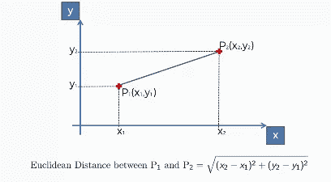
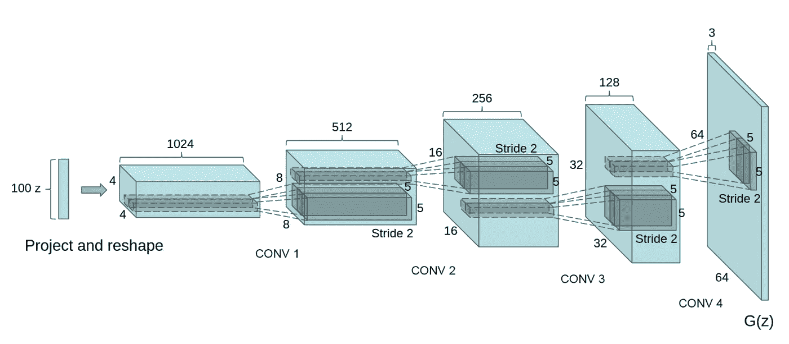
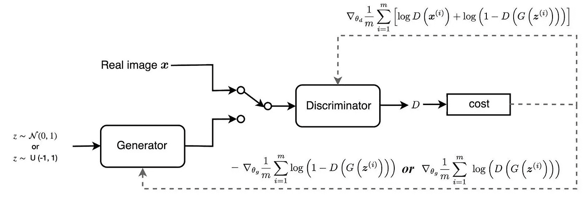

# GANs 是如何工作的

> 原文：<https://towardsdatascience.com/how-gans-really-work-2e1db1f407bb?source=collection_archive---------12----------------------->

## 通过对抗训练学习完整的概率分布

我是一名学习机器的学生，和我们一样，我听说到处都有人在研究甘、甘、甘。他们可以创造出看起来非常真实的图像。我没有真正注意，因为我当时(现在仍然)专注于强化学习，而不是计算机视觉。我当时正在批判这种“赶甘”，有一天我一头扎进去，看到了这一点。

假设你在一个空间 E 中有一个有限的点集 X，这些点集是从 E 上的一个概率分布π中采样得到的，X 是一个更大的集合 A 的子集，A 是π可以到达的整个点集(即严格正概率的点)。例如，X 由 1000 幅代表一只狗的图像组成，A 是一组完整的狗的图像。你想知道π，在给定子集 x 的情况下，π在 A 上采样。

## 可测性

如果 E 是不可测量的，也就是说，如果没有数据(例如，单词)，我们就不能将 E 的元素彼此直接联系起来，那么问题就不再是问题了。除了离散的概率分布之外，我们没有什么可以“学习”的:计算 X 中每个点的出现次数，然后除以 X 的基数。X 中的每个元素的概率都是 0。如果我给你单词列表[“你好”、“你好”、“你好”、“好”、“坏”、“猫”、“猫”]，对你来说最好的采样是什么？没有比概率 3/7 的“你好”，1/7 的“好”，1/7 的“坏”，2/7 的“猫”更好的了。

如果 E 是可测量的，就像图像一样(如果两个图像的像素接近，则它们可以是“接近的”)，即一个可以**比较**元素的空间，那么问题就变得真实了。我们可以从我们拥有的数据集(X)中提取特征，从π中生成新的样本。对于狗的图像，我们期望从我们的数据集中提取特征来生成“假的”或“新的”狗图像，也就是说来自 A \ X 的元素。

## 什么不是甘

我想很早就明确。gan 是**而不是**对“最接近”或“最适合”数据集的点进行采样。他们没有最大化单个样本的可能性，但他们最小化了真实分布和生成分布之间的总距离(如 KL-divergence，JS-divergence 等)。这造成了巨大的差异，在我看来，许多人并没有意识到这一点。看起来学习分布，这是一个非常困难的任务，在“最佳拟合”任务中取得了非常好的结果。例如看起来像狗的狗的样本图像。但是 GANs 能够从我们的数据集 X 的分布中取样，不仅仅是找到一个“好”的匹配，或者一些“看似合理”的东西。它将对**所有**狗的图像进行采样(如果数据集足够大的话)。

因此，你有一组生活在 256^(NxN)-length 空间(对于 n×n 的灰色图像)的图像，或一组生活在 12^(64)长度空间的棋盘，或一组生活在 1000^(T)长度空间的声音，你想从这个集合的概率分布中取样。比方说，你有 X = A 的狗图像，即所有代表狗的图像。这个集合定义了图像集合的概率分布，其中大多数图像的概率为 0(如飞机或黄瓜)，但一些图像(狗或相关动物)的概率较高。在实践中，我们没有**所有的狗图像**，我们假设 1000 或 10000 张图像足以近似分布。但是，我们如何学习分布，并从中取样来创建一个狗的图像呢？国际象棋棋盘也是一样:如果我们有一套最终棋(将死)棋盘，我们能知道所有**将死棋盘的分布吗？**

首先，我们需要一个生成器，一个可以对 s 元素进行采样的机器。神经网络是很好的“黑盒”机器，所以它是生成器的一个很好的选择。我们给网络高斯(或任何)噪声，它以 s 输出一些东西。下图左边的“z”是噪声，右边的 G(z)是生成的样本(此处为图像)。然后，我们将需要训练它，以便根据期望的分布进行采样。这是最难的部分。

A convolutional generator (source: DCGAN)

## 第一种方法

我们有一个生成器，一组数据 X，我们希望训练生成器从 X 的基本分布中正确采样。首先要计算输出分布和实际分布之间的交叉熵，并将其最小化。不幸的是，这两个我们都没有权限！我们不能直接计算输出密度，它只包含在发生器的参数中。真正的密度是我们试图学习的，即使训练一个网络逐点学习概率也是无用的。

我们还可以尝试使用可微分距离(交叉熵或 2 范数)将输出样本与来自 X 的真实样本进行匹配。但它只会给我们一个样本的“平均值”，就像一个重心，而不是一个真正的分布。

## 对抗方法

这个想法很简单，但是很神奇。博弈论里有个东西叫**纳什均衡**。这是非常强大的东西，它再次证明了自己的力量。如果你和某人玩一个零和游戏(也就是说，两者中只有一个能赢，另一个输)，有一个最优策略可以玩，这个策略不能被利用。因此，你不会总是赢，但你不能输。最糟糕的事情可能是平局，如果在比赛中有可能的话。这个策略被称为纳什均衡。

我们将设计一个博弈，它的纳什均衡是当生成器在真实分布(A 的分布)上精确采样时。生成器将与鉴别器进行比赛，鉴别器将确定样本是真的(来自真实分布)还是假的(来自生成器分布)，基本上为样本分配从 0 到 1 的分数。生成器的目标是欺骗鉴别器(也就是说具有尽可能高的分数)，鉴别器的目标是很好地鉴别(也就是说对于假样本具有尽可能低的分数，对于真样本具有最好的分数)。这不是一个对称的游戏，但它是零和游戏。

鉴别器被教导同时将 1 分配给一批真实样本(来自 X)，将 0 分配给另一批假样本。生成器试图最大化它的分数，所以它的损失只是减去鉴别器赋值。**收敛时，鉴频器始终输出 0.5** 和所需分布上的发生器样本。**鉴别器不输出我们的分布概率(** π)！

为什么有效？假设我们处于平衡状态，生成器没有对 X 的基本分布(即 A 的分布，或真实分布)进行采样。例如，对于某个点 x，真实概率是 0.3，生成器仅以 0.2 对其进行采样。那么在这个 x 上，鉴别器将被“输入”多于 0 的 1，因此 x 的分数将上升，超过 0.5。但是生成器想要最大化它的分数，所以由于每隔一个分数是 0.5，唯一的可能就是增加 x 的采样率，以便“攫取”这个额外的分数。

我们保证，有了一个完美的鉴别器，生成器将收敛到完美的解决方案。因此，拥有一个好的鉴别器非常重要。然而，如果鉴别器是完美的，他不会给生成器梯度，因为它的样本的分数总是 0。良好的混合是必要的

GAN algorithm

## 网络近似

另一点在遗传神经网络中至关重要:神经网络是逼近器。实际上，对抗式方法不需要近似，我们可以用“完美”模型来实现。但矛盾的是，它的力量会小得多。对于理想模型，当发生器分布是我们的有限集合 X 的分布时，就达到了最优。也就是说，生成器将只输出 X 的样本，而鉴别器将把 0.5 加到 X 的每个元素上，其他地方随机小于 0.5。但我们不想那样。我们想从 A 中取样，即“真实”集，而不是我们的数据。我们希望生成新的样本，新的情况，来描述与 x 相同的高级特征。这正是网络所做的:我们利用他们的弱点来获取利润。如果训练有素，网络不会过度拟合(令人惊讶的是，这是一个将损失降至最低的好主意)，但接近于具有良好的验证测试分数。因此，生成器将从 A 而不是 X 进行采样，因为网络并不完美，并且会尝试进行泛化。

# **实践中**

让我们看看它在实践中是什么样子的。我们将取 E = R，并尝试对特定分布进行采样。

## 建立

发生器和鉴别器是密集网络。第一个有 4 个隐藏层，每个层有 50 个神经元，中心高斯噪声作为维数 15 的输入，输出为 R。鉴别器有维数 2 的输入，3 个大小为[100，50，50]的隐藏层和一个单个乙状结肠输出神经元。除了最后一个乙状结肠激活外，所有激活都有漏洞。

学习率为 1e-5。优化器是 Adam 优化器，beta1 为 0.9，beta2 为 0.999。对于每个网络，我每个时代都采用 10 个学习步骤。这批货是 500 号的。

这个代码很大程度上是从[这个](https://github.com/aadilh/blogs/blob/new/basic-gans/basic-gans/code/gan.py)中获得灵感的。

## 离散分布

这里 A 是有限的，取 X = A。我们在 A = {(-1，0)、(1，0)}，π(a) = 1/2 上对 GAN 模型进行了测试，得到了以下结果:

如您所见，这些点很快会集中在所需的点(A)上，正如预期的那样，每个点的概率为 0.5。

## 圆形分布

这里 A 是一个以 0 为中心的圆，半径为 1。π也是 a 上的均匀分布。

这些点很快在圆上均匀分布。

## 和 VAE 呢？

让我们看看 VAE 的结果，以供比较(使用相同的参数、图层大小等)。

也许你更明白我之前说的话。vae 正在做这项工作，但结果模糊不清。

# 不收敛和模式崩溃

我有一个可怕的消息。gan 不能保证收敛。

正如我之前提到的，网络是不完美的。因此，他们可以“忘记”旧的数据点来记住新的数据点。假设 A 由 4 个点组成，(-1，0)、(1，0)、(0，1)和(0，-1)，π也是 A 上的均匀分布。第一种可能性是 GAN 收敛于π，正如我之前仅用两个点展示的那样。还有一种可能是生成器和鉴别器会一直互相追逐，永远不收敛。生成器只能生成(-1，0)，然后鉴别器将不断降低该点的分数，生成器将移动到下一个点，比如(1，0)。以此类推，无限期。这是一种可能的均衡状态，但不是纳什均衡。

让我们看看实际情况:

我稍微改变了一下网络的参数来强制不收敛。这种模式不再趋同，而是定期在三个不同的地方移动。

另一个密切相关的问题是模式崩溃。“模式”是我们发行版的主要特征。在 R 中，这实际上是不相关的，因为我们的模式是我们的 4 个点，但是例如 MNIST 图像有 10 个不同的模式，10 个可能的数字。生成器有时只生成有限数量的模式，而忘记其他模式。如果方差太小，它就走不出这个陷阱，因为梯度太小。模式崩溃在 GANs 中是一个真正的问题，而且经常发生。主要的解决方案是超参数调整，但是几年来已经有了许多有趣的尝试。

如果您想了解更多关于提高 GAN 性能的方法，我推荐您阅读本文。

# 结论

GANs 是从数据中恢复未知概率分布的强大工具。许多问题都与这个“密度估计”问题有关，因此它非常强大。

你可以在[本帖](https://medium.com/@jonathan_hui/gan-some-cool-applications-of-gans-4c9ecca35900)上看到不同类型数据的奇特应用。

[1] I .古德费勒、j .普热-阿巴迪、m .米尔扎、b .徐、d .沃德-法利、s .奥泽尔、a .库维尔和 y .本吉奥。生成对抗性网络(2014 年)，NIPS 2014 年。