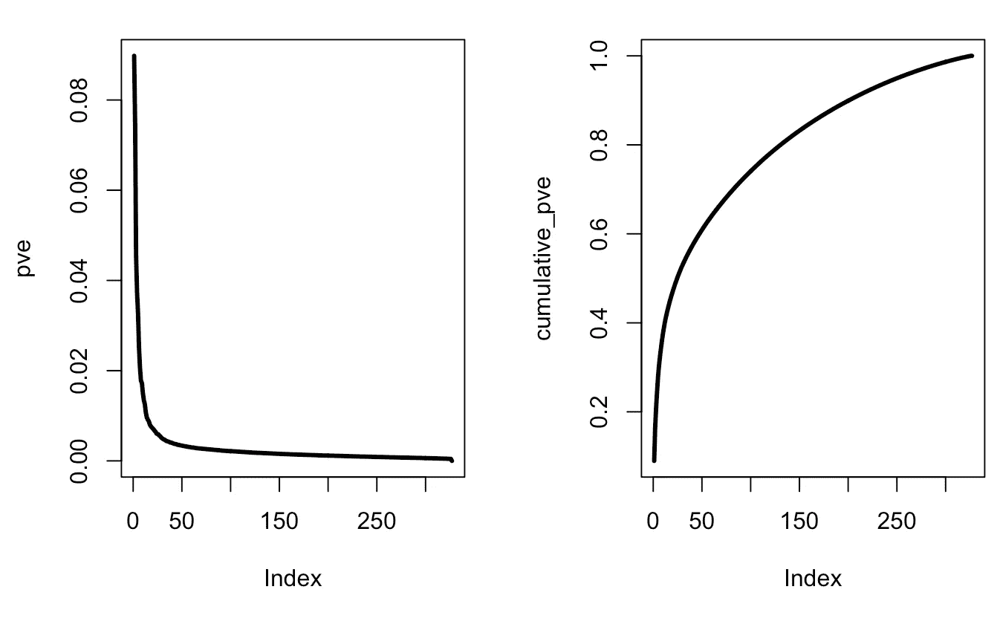
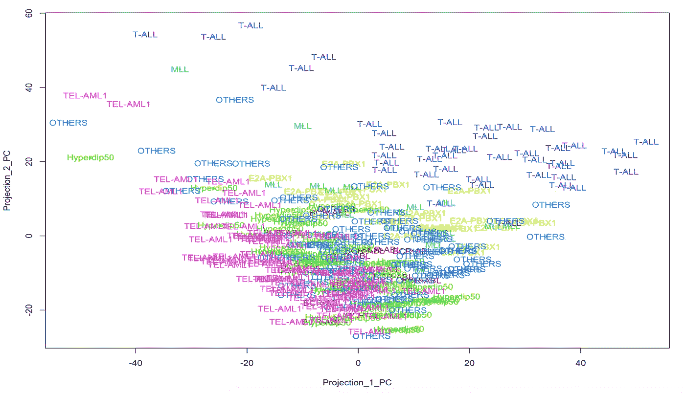
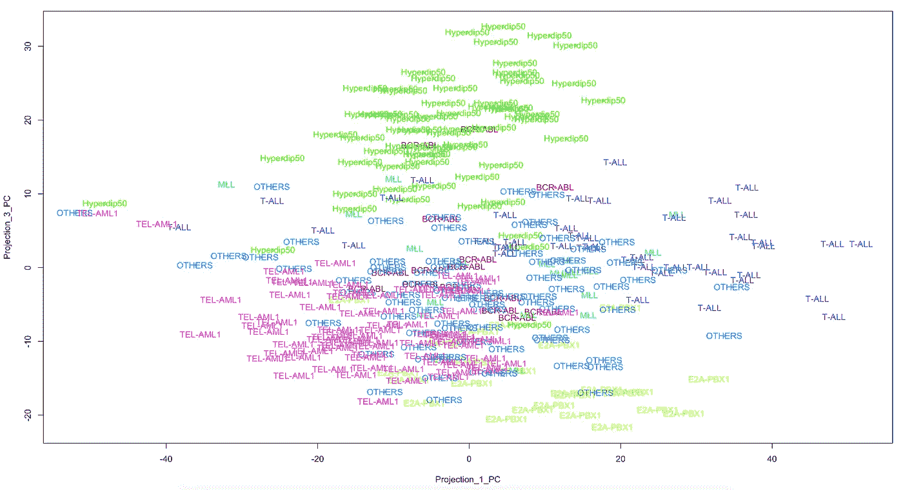
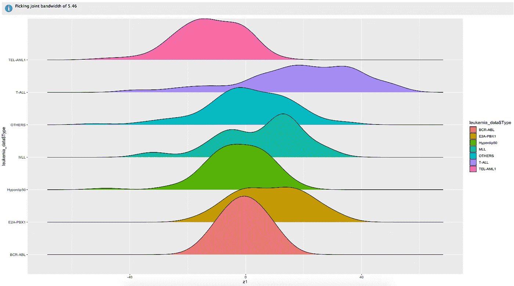
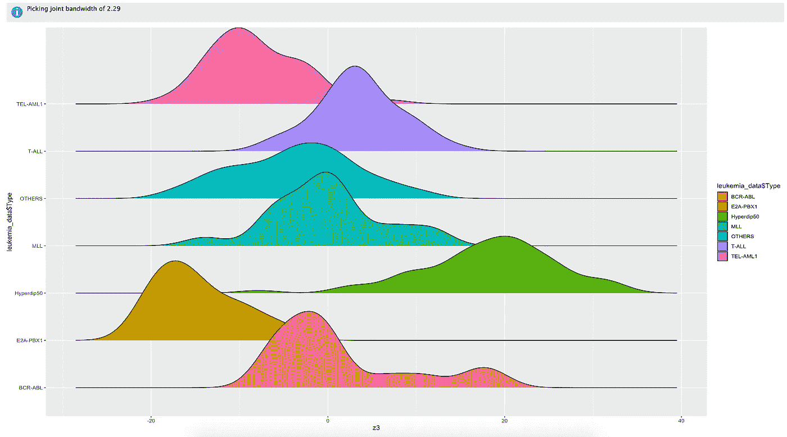
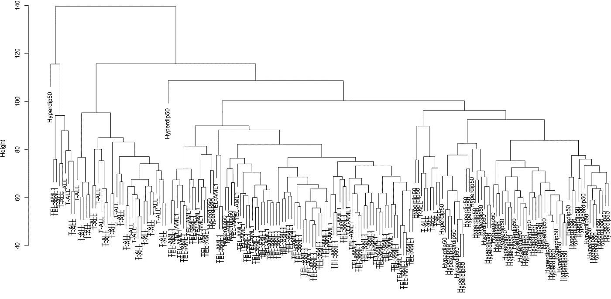

# 利用主成分分析和聚类分析基因与白血病

> 原文：<https://towardsdatascience.com/how-gene-expression-related-to-leukemia-type-using-pca-and-hierarchical-clustering-c8561303853a?source=collection_archive---------24----------------------->

## 机器学习:无监督学习

## 无监督学习的现实应用


Photo by [NASA](https://unsplash.com/@nasa?utm_source=unsplash&utm_medium=referral&utm_content=creditCopyText) on [Unsplash](https://unsplash.com/s/photos/data?utm_source=unsplash&utm_medium=referral&utm_content=creditCopyText)

在机器学习的世界中，无监督学习是在没有标记结果的情况下进行推理的过程。主成分分析和聚类是两种常见的无监督学习技术。

PCA 是将高维数据缩减为几层关键特征的过程。降维后，我们只需要处理一小部分特征，其他的就不考虑了。

聚类是将具有相似特征的数据输入分配给特定组的任务。聚类后，同一组中的数据点应该是相似的，但与其他组中的数据点明显不同。

在这篇文章中，我将把主成分分析和层次聚类应用于生命科学数据集，以分析特定基因如何影响白血病类型。

该数据集最初由 Yeoh 等人(2002 年)从 327 名患者([此处为](https://reader.elsevier.com/reader/sd/pii/S1535610802000326?token=633BF4E89E1BE8827F43547C086071F82354429A051AF7E1E9267CFBA6EBE9614E889B8005144FB14A19995A666E5388))的 7 种白血病亚型中收集了 3141 个基因。


Photo by [Dennis Kummer](https://unsplash.com/@dekubaum?utm_source=unsplash&utm_medium=referral&utm_content=creditCopyText) on [Unsplash](https://unsplash.com/s/photos/data?utm_source=unsplash&utm_medium=referral&utm_content=creditCopyText)

**#加载数据集并转换数据类型**

将 leukemia_data 的数据类型由字符型改为因子型。

```
knitr::opts_chunk$set(echo = TRUE)
library(dplyr)
library(readr)
leukemia_data <- read_csv(“leukemia_data.csv”)
leukemia_data = leukemia_data %>% 
 mutate(Type=as.factor(leukemia_data$Type))#Display different types of leukemia and count the numbers of each type
#doing explorative data analysis is always preferred for all types of researchtable(leukemia_data$Type)BCR-ABL  E2A-PBX1 Hyperdip50     MLL    OTHERS     T-ALL    TEL-AML1 
15         27         64         20       79         43         79
```

一些描述性数据:BCR-ABL 是最不常见的白血病类型，TEL-AML1 是数据集中最常见的。

**#降维**

由于有 3141 个基因，我们应该使用主成分分析来减少数量，使之易于解释。

```
# generate PCA results;
# scale=TRUE and center=TRUE --> mean 0 and variance 1
pr.out=prcomp(select(leukemia_data,-1),scale=TRUE, center=TRUE)# pr.out$sdev: the standard deviations of the principal components; 
# (pr.out$sdev)²: variance of the principal components
pr.var=(pr.out$sdev)²# pve: variance explained by the principal component
pve = pr.var/sum(pr.var)# cumulative explained variance
cumulative_pve <-cumsum(pve)# Plot them 
par(mfrow=c(1, 2))
plot(pve, type=”l”, lwd=3) 
plot(cumulative_pve, type=”l”, lwd=3)
```



PVE and Cumulative PVE

这两个图直观地说明了几个关键特征可以解释总方差的大部分。

**#问题:哪些基因在第一主成分(aka。PC1)？**

```
#project loadings on PC1
Loadings_PC_1 <- pr.out$rotation[,1]#in absolute value
Loadings_PC_1_ABS <- abs(Loadings_PC_1)#print and sort the results
print(head(sort(Loadings_PC_1_ABS,decreasing = TRUE)))SEMA3F       CCT2       LDHB      COX6C     SNRPD2       ELK3 
0.04517148 0.04323818 0.04231619 0.04183480 0.04179822 0.04155821
```

PC1 上负载最高的前六个基因是:SEMA3F、CCT2、LDHB、COX6C、SNRPD2 和 ELK3。

```
#plot the data into the first two principal component dimensions
Projection_1_PC = pr.out$x[,1]
Projection_2_PC = pr.out$x[,2]rainbow_colors <- rainbow(7)
plot_colors <- rainbow_colors[leukemia_data$Type]plot(Projection_1_PC,Projection_2_PC,cex=0.4,col=plot_colors)
text(Projection_1_PC,Projection_2_PC,labels=leukemia_data$Type,col=plot_colors)
```



只有 T-all(右上角)是从人群中挑选出来的；其他类型的白血病还粘在一起。换句话说，前两种成分并不是分离的理想选择。

让我们试试第一台和第三台电脑。

```
Projection_3_PC = pr.out$x[,3]
rainbow_colors <- rainbow(7)
plot_colors <- rainbow_colors[leukemia_data$Type]
plot(Projection_1_PC,Projection_3_PC,cex=0.4,col=plot_colors)
text(Projection_1_PC,Projection_3_PC,labels=leukemia_data$Type,col=plot_colors)
```



相比之下，第 1 台和第 3 台电脑做得更好，因为分布分散在不同的地区。

**#项目到 PCs**

```
#install.packages(c(“ggridges”,”ggplot2",”tidyverse”))
library(ggplot2)
library(ggridges)
library(tibble)#project on PC1
z1 = pr.out$x[,1]#create a new tibble where the first column is the project of the data on the first PC and the second is the leukemia type
TB_1 = tibble(z1,leukemia_data$Type)#plot it 
ggplot(TB_1, aes(x = z1, y = leukemia_data$Type, fill = leukemia_data$Type)) + geom_density_ridges()
```



z1

看来 z1 分不清不同类型。

我们试试 z3。

```
z3 = pr.out$x[,3]
TB_3 = tibble(z3,leukemia_data$Type)
ggplot(TB_3, aes(x = z3, y = leukemia_data$Type, fill = leukemia_data$Type)) +
 geom_density_ridges()
```



z3

很好，我们将 E2A-PBX1(底部的橙色分布)稍微向左移动，将 hyperdip 50(E2A-PBX 1 上方的绿色分布)稍微向右移动。

**#让我们应用层次化** **聚类对不同类型的白血病进行分组**

创建一个包括三种类型白血病的亚组:T-ALL、TEL-AML1 或 Hyperdip50。

```
library(dplyr)#subset
leukemia_subset <- filter(leukemia_data,Type==”T-ALL”|Type==”TEL-AML1"|Type==”Hyperdip50")#scale() function helps standardization
scaled_leukemia_subset <- scale(leukemia_subset[,-1],center=TRUE, scale=TRUE)#remove the first column and scale it#euclidean distance matrix
scaled_leukemia_subset_dist <- dist(scaled_leukemia_subset,method=”euclidean” )##hierarchical clustering using complete linkage
set.seed(1)
leukemia.hclust = hclust(scaled_leukemia_subset_dist,method=”complete”)plot(leukemia.hclust, labels=leukemia_subset$Type, main=’Hierarchical Clusting of Leukemia Subset Data’)
```



Hierarchical Clustering of Leukemia Subset Data, aka. a **dendrogram**

分级聚类做得非常好，因为同种类型的白血病聚集在一起，而不同类型的则远离。

# 喜欢读这本书吗？

> 请在 [LinkedIn](https://www.linkedin.com/in/leihuaye/) 和 [Youtube](https://www.youtube.com/channel/UCBBu2nqs6iZPyNSgMjXUGPg) 上找到我。
> 
> 还有，看看我其他关于人工智能和机器学习的帖子。