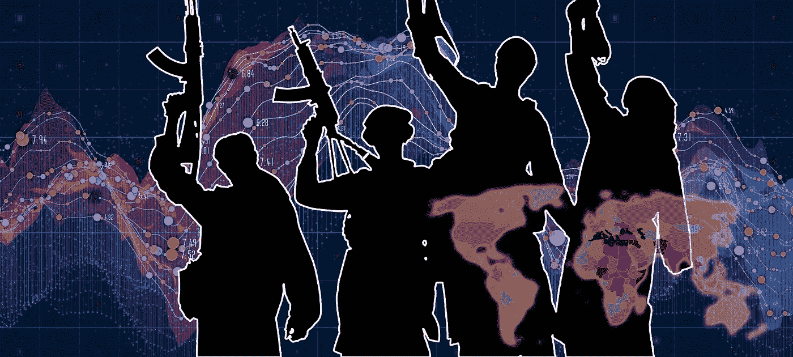

# 地理测绘如何帮助识别全球恐怖主义的趋势

> 原文：<https://towardsdatascience.com/how-geo-mapping-helps-identify-trends-in-global-terrorism-5881bf0a0659?source=collection_archive---------22----------------------->

联合国估计，到 2050 年，将近 70%的世界人口将生活在城市地区。住在城市有明显的好处，如公共交通基础设施、景点、购物和获得医疗服务。相反，缺点包括生活成本增加、噪音、光污染和空间有限。数据科学为我们提供了多种方法来量化城市住宅的利弊。该流程允许我们使用从分析流程中收集的见解做出明智的决策。

在本周的文章中，我试图确定与农村地区相比，城市是否提供了更高的安全性。如果是这样的话，我接下来想知道哪些国家提供了最安全的城市。在完成了对不同数据集的彻底比较后，我得出了这个概念。我决定围绕数据建立一个故事，而不是从叙述到数据。本文中使用的数据源包含 180，000 多条记录。这提供了足够的信息来创造一个故事，并获得有意义的见解。

试图回答城市和国家的安全问题的第一步需要选择正确的指标。这一结论是由现有数据确定的。在数据科学领域，Kaggle 因维护从葡萄酒评论到棒球统计数据的大量数据集而闻名。我选择了[全球恐怖主义数据库](https://www.kaggle.com/START-UMD/gtd)，这是一个由墨尔本大学国家恐怖主义研究联盟维护的综合数据集。该数据库包含关于伤亡、动机、肇事者和地理信息的详细信息。

下一步是在 Jupyter 笔记本上用 Python 读取 Excel 表格。这个特定的数据集包括不同级别的地理指标。为了确定哪些国家的恐怖袭击发生率最高，我决定按地区分组。这是用一个叫做 [Altair](https://altair-viz.github.io/) 的 Python 包完成的。这个可视化库提供了强大的特性集和令人印象深刻的视觉效果。

上图包含了恐怖袭击数量最多的三个地区的国家。值得注意的是，法国、英国和美国等地被排除在外，因为它们各自所在地区的攻击数量相对较少。这种视觉效果不是使用原始数字，而是给出了攻击最常发生的位置，并确定了最大的区域贡献者。

在大致确定了攻击发生的位置后，下一步包括探索数据以利用另一个指标。下图中的饼图描述了不同类型攻击的比例。虽然数据源按类型对攻击有不同级别的详细信息，但为了简单起见，只使用了最高级别的分类。另一个 Python 库 Matplotlib 包括一种称为“爆炸”的技术，它允许楔形突出。

当处理饼图中特别细的切片时，这种技术可以提供简单的视觉直觉。条形图为显示相关组提供了另一种选择，但是，我觉得饼图更好地展示了比例性。

虽然我们已经大致了解了全球攻击的主要国家，但只有地图才能提供这种情况的确切答案。全球恐怖主义数据库从其他数据库中脱颖而出，因为它包含了每个记录的经度和纬度坐标。这些坐标无疑是最精确的地理测绘选项。在全球制图范围内，歧义、不完整的名称和拼写的变化极大地限制了使用其他指标(如城市和城镇)的能力。Tableau 等程序擅长使用这些指标来确定位置，但是，在超过 180，000 条记录的规模上，必须采取其他方法。在这种特殊情况下，仍然有大约 30，000 行程序无法解释。

 [## 恐怖分子地图

### 恐怖分子地图

TerroristMappublic.tableau.com](https://public.tableau.com/shared/SHZQDP26C?:display_count=no&:origin=viz_share_link)