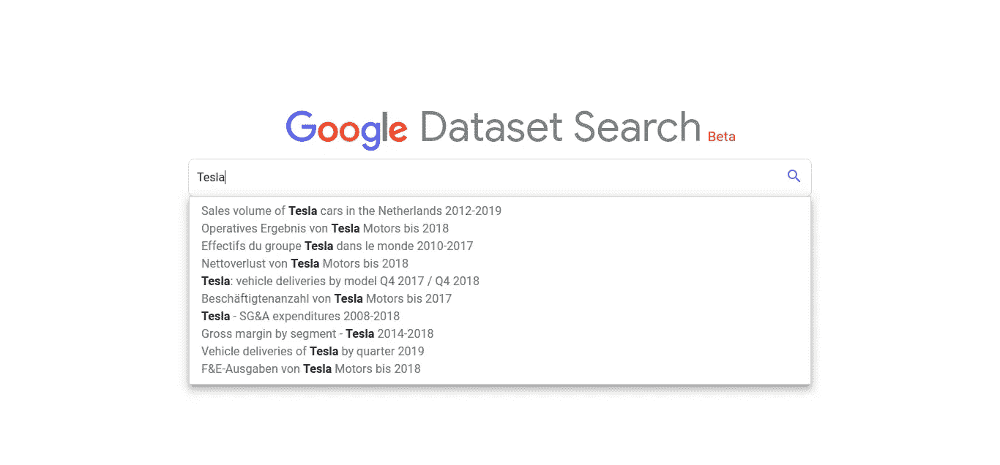
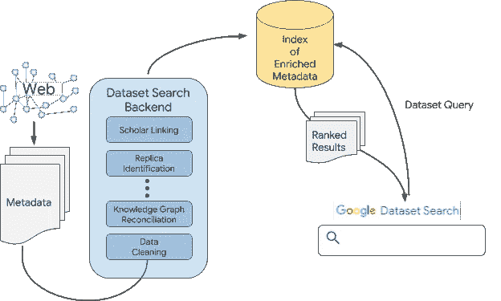
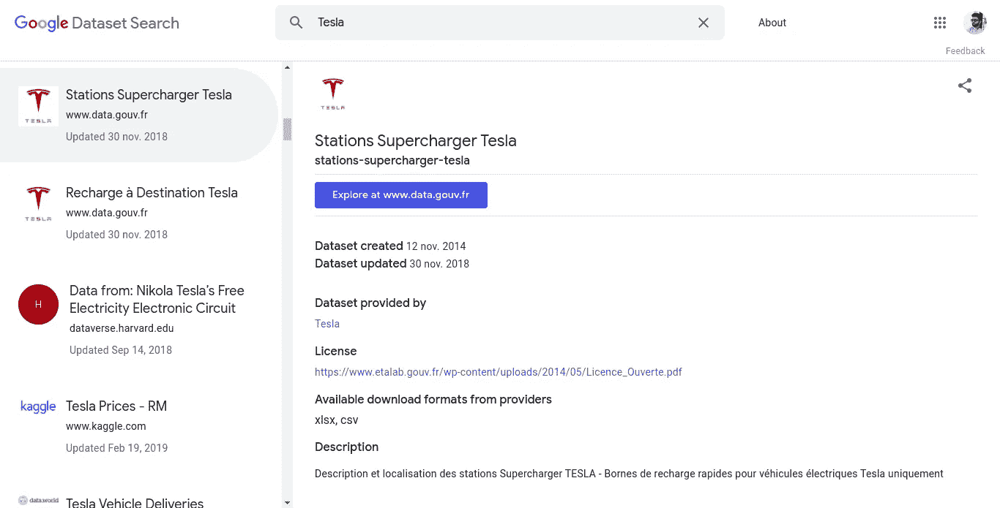

# 谷歌的数据集搜索引擎是如何工作的

> 原文：<https://towardsdatascience.com/how-googles-dataset-search-engine-work-928fa5237787?source=collection_archive---------24----------------------->

## 以及如何让它变得更好

[谷歌数据集搜索](https://toolbox.google.com/datasetsearch)出来已经一年了。工作起来很有魅力，但尽管付出了所有的努力，它仍然处于测试阶段。这篇文章的目的是让你知道它是如何工作的，以及你可以如何做得更好。

你一天在谷歌上搜索多少次？也许 10 次？或者可能超过 100 个，这取决于你的工作，没人会统计。但是我们对几乎每一个我们不知道的问题的基本直觉是——“谷歌一下”。

数据集也是一样，每当我们需要为我们的下一个项目找到一个强大的数据集时，我们经常求助于谷歌或任何其他你经常去的数据仓库，例如 UCI。对来自这些存储库的数据的关注是所有的数据集都被优先使用和探索。在谷歌上找到一个新的数据集不像你找到一部电影、一本书或一份工作那么容易。谷歌知道这一点。

数据集已经建立了很长一段时间，并且采用了不同的格式。没有办法从互联网深处找到原始数据或与这些数据集相关的元数据，这正是谷歌试图解决的问题。当每个人都试图从数据中获得*洞察力时，谷歌试图一劳永逸地解决*找到数据*的问题。*

# 具体是怎么运作的？

[Source](https://ai.googleblog.com/2018/09/building-google-dataset-search-and.html)

当数据集具有支持信息(如名称、描述和分发格式)时，更容易找到数据集。谷歌严重依赖数据集提供商，无论大小，[使用开放的](https://ai.googleblog.com/2017/01/facilitating-discovery-of-public.html)[schema.org/Dataset](https://schema.org/Dataset)标准在他们的网站上添加结构化元数据。元数据指定了每个数据集的重要属性，从中可以很容易地找到数据集。

然后，数据集搜索工具使用这些元数据，将其与 Google 上的其他可用资源相链接(识别数据集的副本，通过查看 Google scholar 找到数据集的原始作者)，并为这些丰富的元数据建立索引。一旦建立了索引，Google 就可以开始回答用户的查询，并在这个过程中了解哪些结果最符合查询。

Google Dataset Search

然而，虽然谷歌确实解决了大多数技术问题，但该项目在首次发布 1 年后仍处于测试阶段，如果你是一个每天或每周处理数据的人，你可以帮助谷歌，或者我敢说，帮助人类。

# 以下是你可以提供帮助的方式

有一些适用于所有结构化数据的通用准则。遵循这些准则将有助于谷歌轻松定位你的数据集，并将其包含在搜索结果中。

## 结构化数据指南

尽管谷歌不保证你的数据会出现在搜索结果中，但有一些最佳实践会给你最好的机会。

**技术指南**

为了有资格获得丰富的结果，使用三种支持的格式之一来标记您的网站页面将对您有很大的帮助。那些格式是， **JSON-LD** (推荐)，微数据，RDFa。

**质量方针**

质量指南通常不可使用任何工具进行测试，但是不遵守这些指南可能会阻止语法正确的结构化数据在 Google Dataset 搜索中显示为结果。这些指南包括内容、相关性、完整性、位置、特异性和图像。要知道你到底能如何坚持这些指导方针，请跟随谷歌的这个[指南](https://developers.google.com/search/docs/guides/sd-policies)。

## 那么，如何将你的数据添加到谷歌数据集搜索中呢？

如果您有自己的描述数据的网页(或网页),那么在数据集中包含以下内容会对您有所帮助

1.  [必需]将 schema.org 中的元数据添加到包含数据集的每个页面。记住，这是一个*必需的步骤* ，有一个[文档](https://developers.google.com/search/docs/data-types/dataset)可以帮你完成。
2.  使用[结构化数据测试工具](https://search.google.com/structured-data/testing-tool)验证标记产生结构化数据。
3.  [可选]对于那些有多个页面的人，创建一个站点地图，并将该站点地图添加到 Google 搜索控制台。

_______________

**参考文献**

1.  构建谷歌数据集搜索并培育开放的数据生态系统([链接](https://ai.googleblog.com/2018/09/building-google-dataset-search-and.html))
2.  促进公共数据集的发现([链接](https://ai.googleblog.com/2017/01/facilitating-discovery-of-public.html))
3.  数据集文档([链接](https://developers.google.com/search/docs/data-types/dataset))
4.  结构数据指南([链接](https://developers.google.com/search/docs/guides/sd-policies))
5.  常见问题—数据集的结构化数据标记([链接](https://support.google.com/webmasters/thread/1960710))