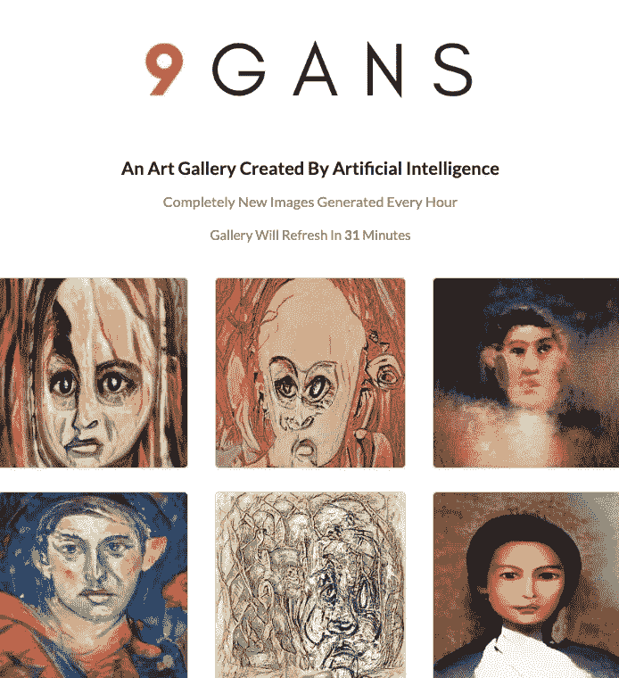
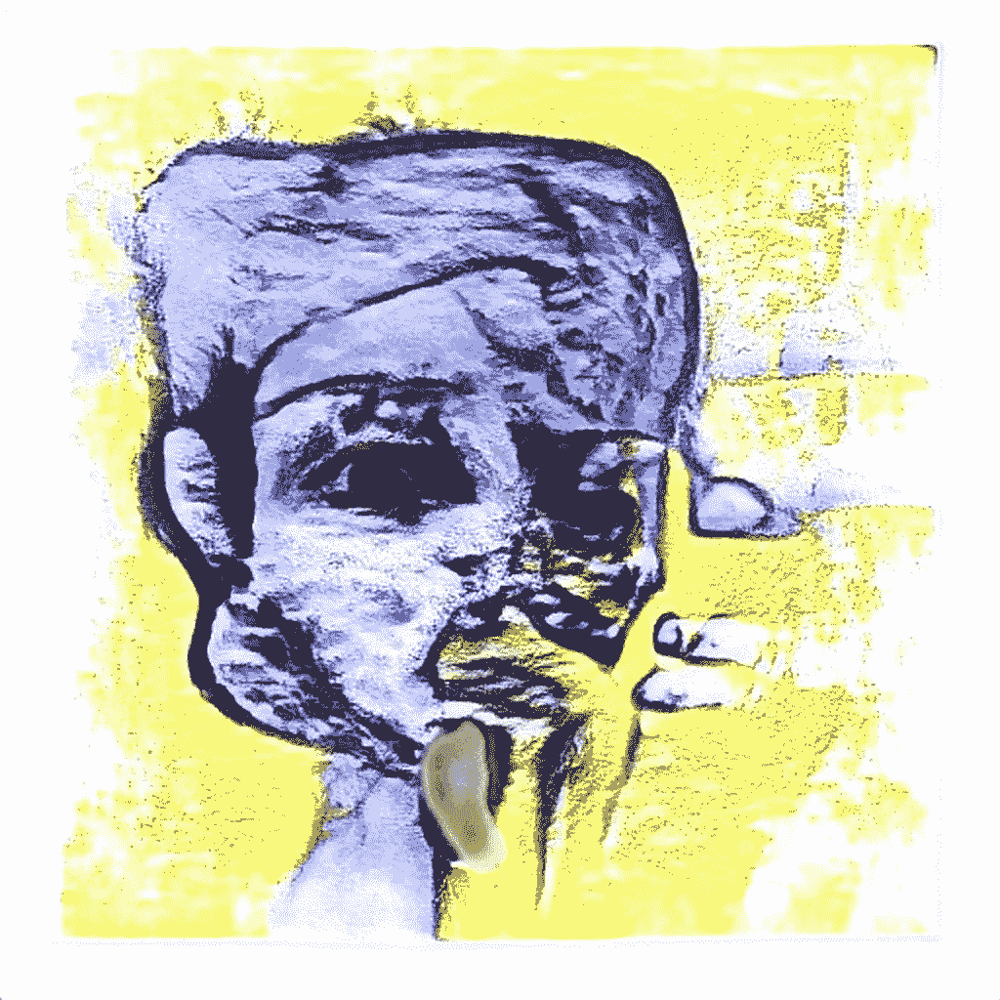

# 我如何建造 9 GANS:人工智能生成的艺术画廊，第 1 部分

> 原文：<https://towardsdatascience.com/how-i-built-9-gans-an-ai-generated-art-gallery-app-part-1-277b24718e2?source=collection_archive---------22----------------------->

这个系列是我用来构建 9 GANS 的技术的高级概述。

9 GANS 是一个展示 9 件艺术品的应用程序/网站，类似于一个画廊。不同的是，它使用 AI 每小时生成 9 张新图像，并删除旧图像。

这是一个与众不同的画廊，因为它是动态的，一直在变化。这件艺术品很快就会永远消失，这就产生了一个稀缺因素。

你可以在 https://9gans.com/查看

第一个版本只包括网站设置，但在第二个版本中，我添加了电子商务功能，即能够购买海报和画布上的印刷品。这需要一些技巧，但是对于本系列，我将主要关注我如何构建版本 1。

9 号楼 GANS 的主要阶段是:

1.  准备，训练，从人工智能模型生成图像。
2.  建立一个网站
3.  增加了每小时刷新一批图像的功能。

在这篇文章中，我将把重点放在第一步。

## 这个想法

这一切都是从我发现这个开始的:

 [## 此人不存在

### 此人不存在

这个人不是 Existthispersondoesnotexist.com](https://thispersondoesnotexist.com/) 

该网站在今年早些时候发布时引起了轰动。你可以不断刷新页面，得到看似无穷无尽的不真实的人脸。

这让我很快找到了网站背后的算法:

 [## NVlabs/stylegan

### 图片:这些人不是真实的-他们是由我们的允许控制不同方面的发生器产生的…

github.com](https://github.com/NVlabs/stylegan) 

NVIDIA 的 StylegGAN 在发布时是最新最棒的 GAN 模型，能够生成非常逼真的图像。

然而，大多数人错过了它带来的最大突破。它最终解决了 GANS 的迁移学习问题。

在这种情况下，迁移学习是指采用已经训练好的模型，并根据您的数据集对其进行重新训练/微调的能力。

在那之前，像我这样没有价值数千美元的计算能力来从头开始训练一个 GAN 的平民是无法生成像这样酷的图像的。使用 StyleGAN，我不仅可以生成这些人脸(他们好心地发布了预先训练好的模型)，还可以根据我自己的数据集对其进行微调。

StyleGAN 上迁移学习的例子很快就出现了。令人惊叹的 Gwern 发布了一个动漫版本:

如果你仔细看这个，你会发现生成的动画图像是肖像。这不是巧合。他从人脸模型开始，然后根据他的数据集将其微调为动画人脸。他有一个很棒的博客，里面有如何做到这一点的详细说明，我建议你去看看。

 [## 用 StyleGAN 制作动漫脸

### 生成神经网络，如 GANs，多年来一直在努力生成质量不错的动漫人脸，尽管…

www.gwern.net](https://www.gwern.net/Faces) 

我也想使用这个新工具，看看我能创造什么。我缺乏想象力的头脑自然而然地转向了艺术。

艺术的美妙之处在于，与人类的图像不同，图像中的缺陷(如头部形状怪异等)被认为是一种特征，而不是缺陷(谢谢达利)。我不需要花费无数的时间和计算来得到完美的艺术品。我只需要几天的训练就可以得到足够好的东西。

## 数据

我首先必须得到一个好的数据集。我用 Flickr 作为我的来源。

我在他们的 API 上使用了一个简单的 python 包装器来提取图像。这个 API 有它的局限性，但允许我进行基于单词的搜索，甚至过滤掉受版权保护的作品。即使创作出来的艺术品看起来是“原创的”,我也不想冒被起诉的风险。

我推荐一个 4-5K 图像的好起点。

## 模型

我所有的训练都是在 Google Colab 中完成的。如果你看过我的其他文章，你知道我是一个粉丝男孩。Google Colab 是一个超级容易运行的笔记本环境(一键打开)，它给你一个免费的 GPU(每 12 小时重置一次)和大量的硬盘空间(GPU 设置超过 300 Gigs)。这是最好的免费训练方式。

一旦我有了数据，我就把 StyleGAN repo 克隆到 Colab 笔记本上。

我按照 Gwern 的说明(见上面的链接)设置代码和 hyper 参数，并使用最初的 NVIDIA 预训练的人脸模型作为我的起点。我对我的数据集进行了微调，几天后……嘣——我有了艺术作品。

AI burpppp

现在我有了一个模型，它能够生成可以作为艺术传递的图像，第二步是构建一个能够显示这些可爱之处的 UI。