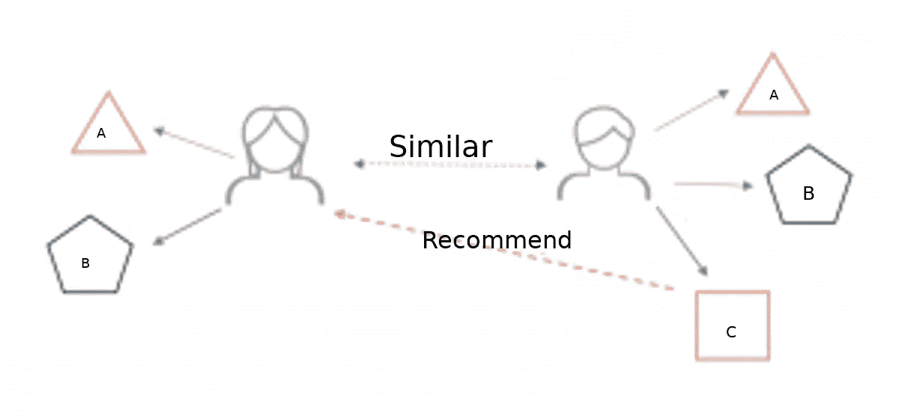
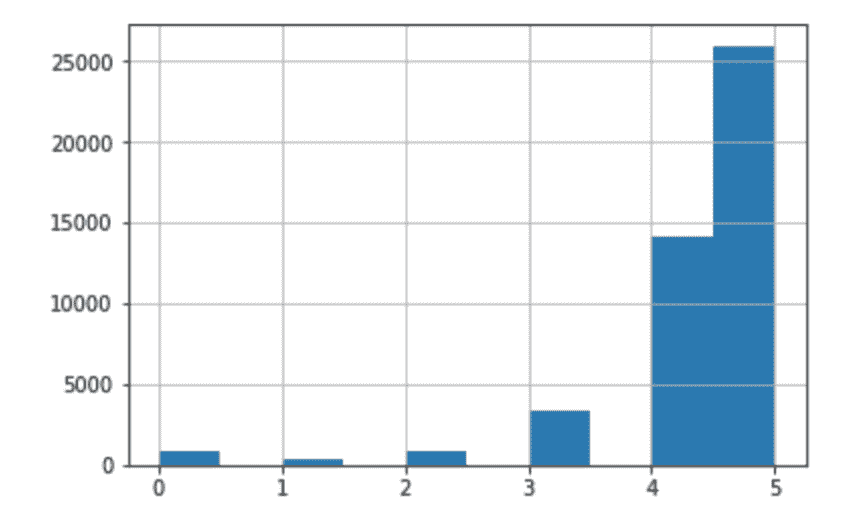
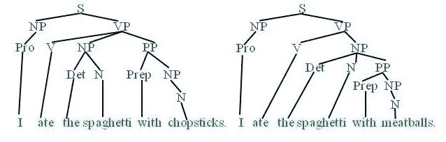
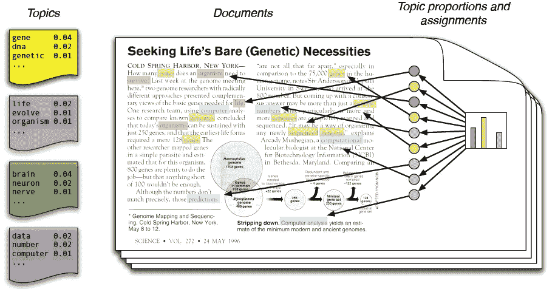
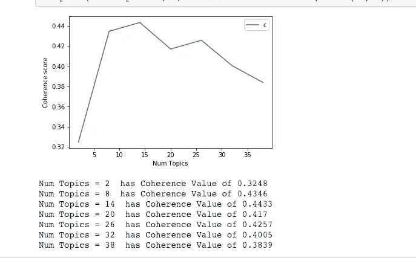
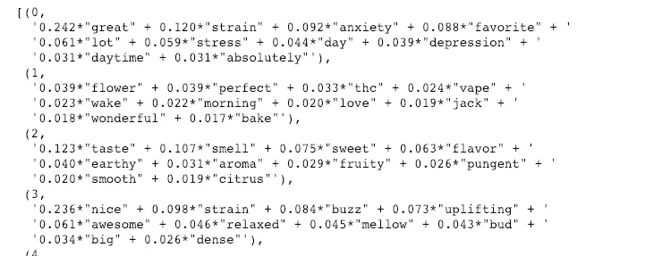
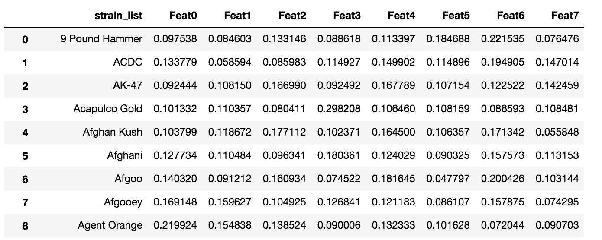

# 我如何使用主题模型和潜在 Dirchlet 分配(LDA)构建大麻推荐应用程序~非技术性~

> 原文：<https://towardsdatascience.com/how-i-built-a-cannabis-recommendation-app-using-topic-models-and-latent-dirchlet-allocation-lda-999598987ded?source=collection_archive---------14----------------------->

How I built www.[rightstrain](http://www.rightstrain.co).co, a cannabis recommendation tool that used by online dispensaries

# **背景:**

2018 年 10 月 17 日，大麻在加拿大成为*合法*。

作为一名企业家，我总是阅读最新的科技创业公司，关注市场的发展，发现新兴机会。作为一名数据科学家，我一直在寻找数据驱动的解决方案来解决我发现的问题。

作为多伦多的居民，很自然地，我开始关注 T4 的大麻市场。

下面这篇文章将简要总结我是如何构建一个大麻推荐系统的。我会让它保持实用的技术性，这样那些想要建立一个类似应用程序的人可以遵循代码——而那些只是感兴趣的人仍然会发现它读起来很有趣。

# **问题:**

2013 年，关于大麻在加拿大合法化的谈判开始。正是在这个时候，我知道合法化将会发生，所以我成为了一个早期投资者，并跟上了市场。

快进到 2018 年合法化，利用我在行业内的网络，我与一些大麻药房通了电话，了解到他们都有*一个问题*在*常见*。

当客户在网上订购时，发现他们最喜欢的商品(例如某种大麻品种)售罄，他们会停止购物，在另一家零售商那里找到相同的商品。

*我了解到，这被称为***的购物车废弃，据* [*统计*](https://www.statista.com/) *成本超过电商店铺销售额的 75%。**

*做进一步的研究，我发现亚马逊将其收入的 35%归功于推荐系统。*

*所以我建立了一个大麻产品的推荐系统。*

# *建立推荐系统 101:*

*什么是推荐系统？*

*基本上，出于电子商务的目的，推荐系统只是找到与购物者正在购买的产品相似的产品，并推荐相似的商品，希望增加销售额。*

*那么，它是怎么做到的呢？*

*假设你在亚马逊上拥有一家销售家居饰品的电商店铺。你会注意到，当顾客购买卫生纸(A)时，他们也会购买毛巾(B)。此外，您会发现这种模式会在不同的客户群中重复出现，只是略有不同。*

*当其他顾客购买产品 A、B 和新产品 c 时，就会发生这种变化。*

**

*了解了这种模式，我们现在可以向传统上只购买产品 A 和 b 的客户推荐产品 C。*

*就是这样！*

# *如何建立推荐系统:*

*首先，你需要从数据入手。*

*在我的案例中，我想为大麻产品建立一个推荐系统，所以我需要市场上各种大麻品种的数据。我快速搜索了一下，发现了一些包含大麻品种评论的数据库。*

*为了获取数据，我编写了一个简单的 Python Scraper，并在 Tor 网络下建立了隧道。这使得铲运机可以持续运行，并减少你的 IP 被禁止的机会。请看我写的关于开发 python 抓取工具(TBA)的文章。*

**

***重要提示:** *从互联网上抓取数据时，请尊重你抓取的服务器，因为你很容易压倒一个没有准备好处理大量请求的服务器。**

# *探索性数据分析:*

*我设法收集了 50 万条包含 1-5 星评级和评论的评论。我想我可以通过观察用户对每种菌株的评分模式来创建一个推荐系统(见上一节的逻辑)。*

*然而，看看这些数据:*

**

*Figure 1: Ratings of cannabis strains (x-axis) vs number of reviews (y-axis)*

*我发现了一个严重的范围限制。换句话说，大多数评论都在 4-5 星的范围内。*

**我猜大麻爱好者很容易被打动:)**

*鉴于这一发现，我决定不使用定量评级，因为推荐系统基本上会推荐其他评级高的菌株——实际上所有菌株的评级都很高。*

*这将违背推荐系统的目的。*

# *输入自然语言处理:*

**自然语言处理(NLP)* 是*人工智能*的一个子领域，专注于使计算机能够理解和处理人类语言。*

*那么，计算机是如何阅读人类语言的呢？*

*先来了解一下计算机是如何……*计算*的。基本上，计算机用二进制、1 和 0 来思考。这使得事情变得复杂，因为单词不是数字。*

*那么 NLP 是如何工作的呢？*

*最简单的形式，NLP 的工作原理是将单词转换成数字！例如，如果我们有一个文档，其中有三个单词，“狗吃食物”，每个单词都将被转换为一个向量(例如，将其视为一串数字)。所以单词“dog”可以用(1，0，1，1，1，0)来表示，“eats”可以用(1，1，0，0，0，0)来表示..等等。现在你可以想象一下，一旦所有的单词都被矢量化，计算机现在就可以识别出一个矢量(1，0，1，1，1，0)代表单词“狗”。*

**

*现在棘手的事情是让计算机理解*的意思*。这个主题已经超出了本文的范围，但是我可能会继续撰写关于这个主题的另一篇文章。虽然 NLP 可以成功地将单词矢量化，以允许计算机识别单词，但让计算机理解单词的含义是极其困难的。如果你对这个话题感兴趣，请阅读更多关于[深度学习和 NLP](https://medium.com/dair-ai/deep-learning-for-nlp-an-overview-of-recent-trends-d0d8f40a776d) 的内容。*

# *主题建模和潜在目录分配:*

*现在我们所有的文本数据都已经被矢量化了，我们开始在数据中寻找模式。*

*主题建模非常适合这种类型的任务，它是一种统计建模技术，用于发现文档集合中出现的抽象“主题”。对此的一个非常简单的解释是，它梳理整个文档并识别:1)最频繁出现的单词和 2)出现在那些频繁出现的单词旁边的单词。这里的逻辑是，如果这些词总是一起出现，它们一定会形成某种主题。*

**

*现在你可能想知道，算法产生了多少主题？*

**嗯，这取决于你。**

*当您选择想要在模型中保留多少主题时，主题建模的艺术就开始发挥作用了。*

*我通常看两件事:1)相干值和 2)侵入者测试。让我们详细阐述一下这两者。*

*连贯性值可以被认为是每个主题成为“好”主题的概率。要了解更多信息，请查看这篇关于[一致性价值的文章。](http://qpleple.com/topic-coherence-to-evaluate-topic-models/)*

**

*为了选择最佳拟合模型，您需要使用*入侵者方法*对每个主题进行定性评估。*

*上面，我已经画出了主题的数量和它们相应的一致性值。请注意，在 14 个主题之后，出现了大幅下降。根据一致性值，这里的最佳模型将是 14 个主题，然而，8 个主题的模型仅减少 CV 1 点。出于简洁和解释能力的考虑，我总是选择坚持使用更简单的模型。*

**那么入侵者有什么方法呢？**

*侵入者测试是使用一致性值的一个很好的后续测试。一旦你决定了你想要多少个主题，你就可以单独地看这些主题，并对它们进行定性评估。换句话说，你想问..*“哪些词不属于这些话题？”**

**

*我们来看一下主题 1(或者本例中的 0)。这有点令人困惑，因为我们看到像“*棒极了*”、“*最喜欢的*”这样的词，但也有像“*压力”*、*抑郁”*这样意思相反的词。这是一个人类不太能理解的主题的例子，但是在潜在的 Dirchelet 分配(LDA)中得分很高。这意味着我必须微调模型的超参数，以获得更好的输出。*

*让我们看看主题 2(模型 1)，这个主题更清楚地说明了它的含义。看起来它可能指的是“受欢迎程度”这样的话题。*

*对于模型中的主题数量，您不断地这样做，逐个评估它们，寻找可能适合或不适合某个主题的单词。*

# *创建推荐系统:*

*虽然从上面可能看不清楚，但我的最终模型产生了 8 个主题，其中有一些非常有趣的见解。例如，我发现大麻消费者喜欢吸烟有几个原因:1)一些人吸烟是因为他们喜欢大麻的味道和香味；2)另一些人吸烟是因为这让他们感到有创造力；3)另一部分使用者吸烟是因为这让他们感到精力充沛；最后 4)大多数使用者吸烟是因为这有助于缓解疼痛。*

**

*太酷了！*

*从本质上讲，主题模型所做的就是将我的数据分成不同的客户群。如果我从事营销和/或撰写文案的工作，我会更好地利用这些信息锁定目标客户群。*

*总之，回到数据科学。*

*利用这 8 个主题，我预测了每个菌株的综述中有多少包含这些主题。这样做给了我 8 个特征来区分我的菌株。换句话说，我基于每种菌株(例如，我正在与 200 多种菌株一起工作)在我发现的主题上的不同之处创建了一个数据集(例如，据报道，一些菌株提供了更多的创造性思维能力，而另一些菌株增加了能量)。*

**

*一旦完成，我就准备创建基于相似性的推荐系统。*

# *选择相似性度量:*

*现在我们有了 8 个不同的特征(例如，主题)来描述我们的品系，是时候选择我们如何推荐它们了。有许多相似性度量可以使用(例如，余弦相似性、欧几里德距离、曼哈顿距离)。*

*在选择距离度量时，重要的考虑因素是:1)它在高维空间中如何处理？(例如，欧几里德距离在高维中开始失效)以及 2)推荐的准确度如何？*

*这给我们带来了一个问题，我们如何验证一个推荐系统？*

*有许多方法可以做到这一点。我认为最划算的方法是对你的数据进行回溯测试。例如，假设我们的数据集包含购买了产品 A、B、C & D 的客户 A 的数据。*

*一种验证方法是使用客户 A 的数据，预测他们在购买产品 A 后会购买什么，然后根据他们实际购买的东西进行验证！*

# *结论*

*我使用主题建模和 LDA 方法来寻找新兴大麻市场的客户群。由此，我创建了一个推荐系统。这个项目最困难的部分是获取和清理数据——这在所有数据科学项目中都很常见。*

*如果我对这篇文章有足够的兴趣，我会写一篇技术文章，分享我的 MVP 代码。该产品已经发展，目前正在被许多药房使用！看看这里:[www.rightstrain.co](http://www.rightstrain.co)*

*如果你想看技术文章，请在评论中告诉我！*