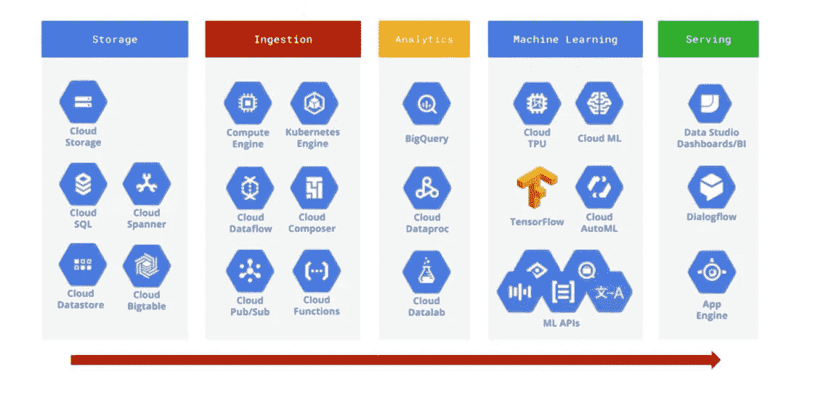
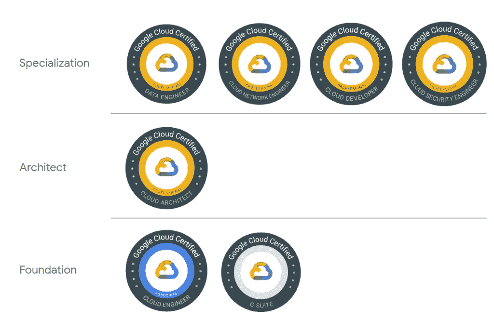
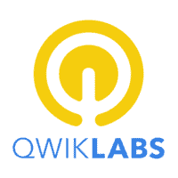
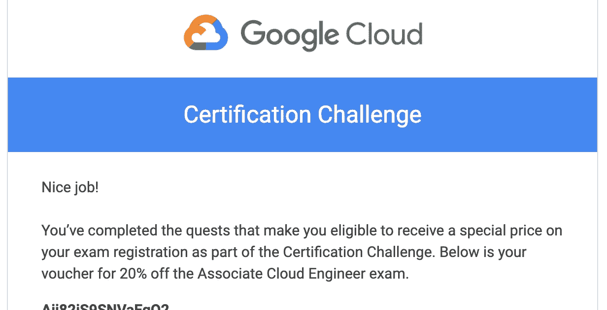
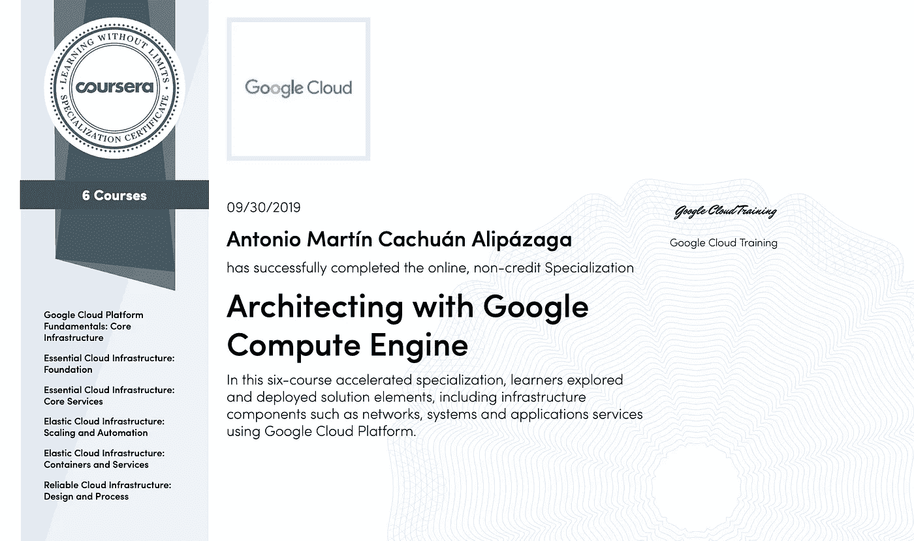
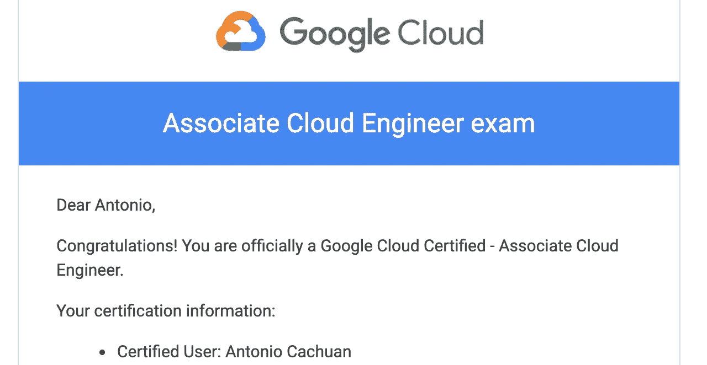
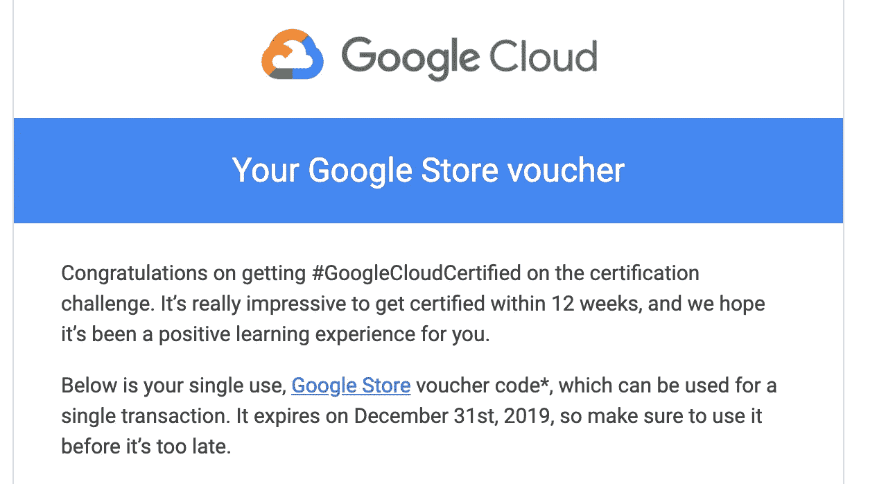

# 我如何完成谷歌云认证挑战？

> 原文：<https://towardsdatascience.com/how-i-could-achieve-the-google-cloud-certification-challenge-6f07a2993197?source=collection_archive---------3----------------------->

经过谷歌推荐的 12 周准备，我通过了云工程师助理考试，以下是我学到的可以帮助你的东西。

这个故事开始于 3 个月前，当我每天查看我的 Linkedin feed 时，我看到了来自 Google Cloud 的一篇关于[认证挑战](https://cloud.google.com/blog/topics/training-certifications/get-google-cloud-certified-in-3-months)的帖子。我第一次读到这本书的时候，我正在考虑进行云专业化，并想知道我应该选择三个主要竞争对手中的哪一个。

# **我为什么选择谷歌云？**

首先，当时的决定不是技术上的，因为我在 Azure、AWS 或 GCP 方面没有丰富的经验，只是 Azure 的基本项目和 GCP 大数据产品的一些步骤。我对 GCP 和他们的产品组织的第一印象是它感觉干净、简单和容易理解(UX ),并且对一个干净的控制台 UI 很重要。

Big Data and ML products in GCP [[maelfabien](https://maelfabien.github.io/bigdata/gcps_1/#which-service-to-choose)]

在那段时间里，我还回忆起了我日常使用的所有谷歌产品(youtube、谷歌助手、照片等)。)和工作得有多好，我从《连线》杂志上找到了这句话:

> 这就是谷歌之所以成为谷歌的原因:它的物理网络，数千英里的光纤，以及成千上万的服务器，这些加在一起就是所有云之母。[连线]

所以带着这些想法，我准备在 GCP 开始新的学习竞赛！

# **谷歌云挑战到底是什么？**

嗯，再次阅读这篇文章后，我了解到谷歌云有 [7 个主要(也有其他测试版)认证](https://cloud.google.com/certification/):

*   助理云工程师
*   专业数据架构师
*   专业数据工程师
*   专业云开发人员
*   专业云网络工程师
*   专业云安全工程师
*   专业协作工程师。

**挑战(在一年内发起一项或多项)包括通过这些认证中的任何一项**，为了实现这一点，谷歌帮助您获得了一些免费和付费资源的学习途径，在某些情况下，还提供了官方书籍和考试费用的折扣，此外，如果您在注册后的 3 个月内获得了认证，谷歌还会给您 100 美元的谷歌商店优惠券。

Google Cloud Certification Badges [[Jhanley](https://www.google.com/url?sa=i&url=https%3A%2F%2Fwww.jhanley.com%2Fgoogle-cloud-certification-badges%2F&psig=AOvVaw2LxuQTEjyzphVyAuwcPOVn&ust=1573014928248000&source=images&cd=vfe&ved=0CAMQjB1qFwoTCIid7rKf0uUCFQAAAAAdAAAAABAl)]

对我来说，我决定参加云工程师助理的入门级认证。该认证不需要以前的经验，并为您提供所有谷歌云平台组件的概述，如 IaSS、Kubernetes、PaSS、无服务器或托管服务。

# 协理云工程师认证谷歌推荐什么？(以及我的真实意见)

在第一个月，存在两个主要步骤 Qwiklabs 和预订您的认证。

## [qwiklab](https://www.qwiklabs.com/)

在我看来，**是在真正的谷歌云** **项目**(也叫 AWS)中实践的最佳平台之一。当我注册挑战时，谷歌给了我 1 个月的 Qwiklabs 无限制积分(1 个积分约 1 美元)，所以我尽可能多地使用(直到今天我完成了超过 [50 个实验室](https://www.qwiklabs.com/public_profiles/74ff594e-13b7-42aa-8f71-8c1a1b06699c))此外，你可以将所有完成的任务添加到你的 Linkedin。在这里，谷歌建议完成:

*   [GCP 必需品 Qwiklabs quest](https://www.qwiklabs.com/quests/23?catalog_rank=%7B%22rank%22%3A1%2C%22num_filters%22%3A0%2C%22has_search%22%3Atrue%7D&search_id=3737982)
*   [云架构 Qwiklabs quest](https://www.qwiklabs.com/quests/24?catalog_rank=%7B%22rank%22%3A1%2C%22num_filters%22%3A0%2C%22has_search%22%3Atrue%7D&search_id=3737985)

这两个任务是相辅相成的，如果你刚到 GCP，这是一个很好的起点，对我来说，完成这两个任务花了我将近 3 周的时间(每周 4 小时)。

A good resource to practice [[Linkedin](https://www.google.com/url?sa=i&url=https%3A%2F%2Fwww.linkedin.com%2Fcompany%2Fqwiklabs-inc-&psig=AOvVaw13BZVSWkn_5HMKSw-osl-A&ust=1573018640361000&source=images&cd=vfe&ved=0CAMQjB1qFwoTCLjXw5yt0uUCFQAAAAAdAAAAABAI)]

**预订您的认证**

这是一件看起来微不足道的事情，尽管它很有帮助，因为它让你有了最后期限，并迫使你计划你的学习时间。在我的情况下，在我完成任务后，我收到了一个 25 美元的折扣代码来购买考试，所以最终价格是 100 美元。此外，这个代码作为一个链接来证明你正在完成挑战，所以记得这样做。

Voucher

[**Coursera 专精**](https://www.coursera.org/promo/CertChallenge19ACE)

在第二个月，谷歌给了我一个月的谷歌计算引擎专业化设计，这包括来自不同主题的 6 门课程，并不都与考试有关，但是，我建议完成所有课程，因为它给了你更多的实践经验(也包括更多的 Qwiklabs)和日常工作所需的良好理论知识。完成所有课程花费了我大约 1 个月的时间，我再次强烈建议您完成最后一门课程，在这门课程中，您将开发一个完整的云应用程序。

Coursera Specialization

这是谷歌推荐的三个主要资源，从我的角度来看，它们不一定足够，所以我想用我的个人经验来补充。

# **我如何为完成挑战做好准备？**

当然，我遵循谷歌的三条建议，并补充如下:

*   买[官书](https://amzn.to/2NNfBmF)(谷歌也给八折买)。这本书有很好的理论信息，真正的考试题，练习练习，都遵循为考试准备的课程。
*   参加[实践考试](https://docs.google.com/forms/d/e/1FAIpQLSfexWKtXT2OSFJ-obA4iT3GmzgiOCGvjrT9OfxilWC1yPtmfQ/viewform)，您不需要预约或支付任何费用，只需进入并开始回答。
*   查看[官方文档](https://cloud.google.com/docs/)，特别是要了解定价方法和谷歌针对实际问题的最佳实践。
*   练习！谷歌给你 300 美元的信用点用于 GCP，这样你就可以访问所有的产品，也有一个免费层。这是探索所有组件的绝佳机会。

到了第三个月，有了这些信息，我就可以准备考试了。

# **考试怎么样？**

关于考试的一些有趣的信息是:

*   慢慢来，你有 2 个小时(相信我，回答所有问题是准确的，验证几个问题需要几分钟)和 50 个问题(大多数情况下，你需要找出使用 GCP 产品的最佳选择)。
*   结果不会马上显示出来，你必须等待 1 到 10 天。
*   你必须亲自到认可的考试中心参加考试。
*   结果不显示你的分数

# **奖励**

你所有的努力都有回报，所以当我收到结果时，我感到非常满意:)

另外，我收到了承诺的礼券。

Gift voucher

PS 如果你有任何问题，或者想要澄清一些事情，你可以在 [Twitter](https://twitter.com/thony_ac77) 和 [LinkedIn 上找到我。](https://www.linkedin.com/in/antoniocachuan/)另外，如果你正在考虑参加**Apache Spark 的 Databricks 认证**，我写了一篇技术文章描述了我的建议。

 [## 获得 Apache Spark 的 Databricks 认证后，我的 10 条建议

### 几个月前，我开始准备获得 Apache Spark 的 Databricks 认证。这不是…

towardsdatascience.com](/my-10-recommendations-after-getting-the-databricks-certification-for-apache-spark-53cd3690073)