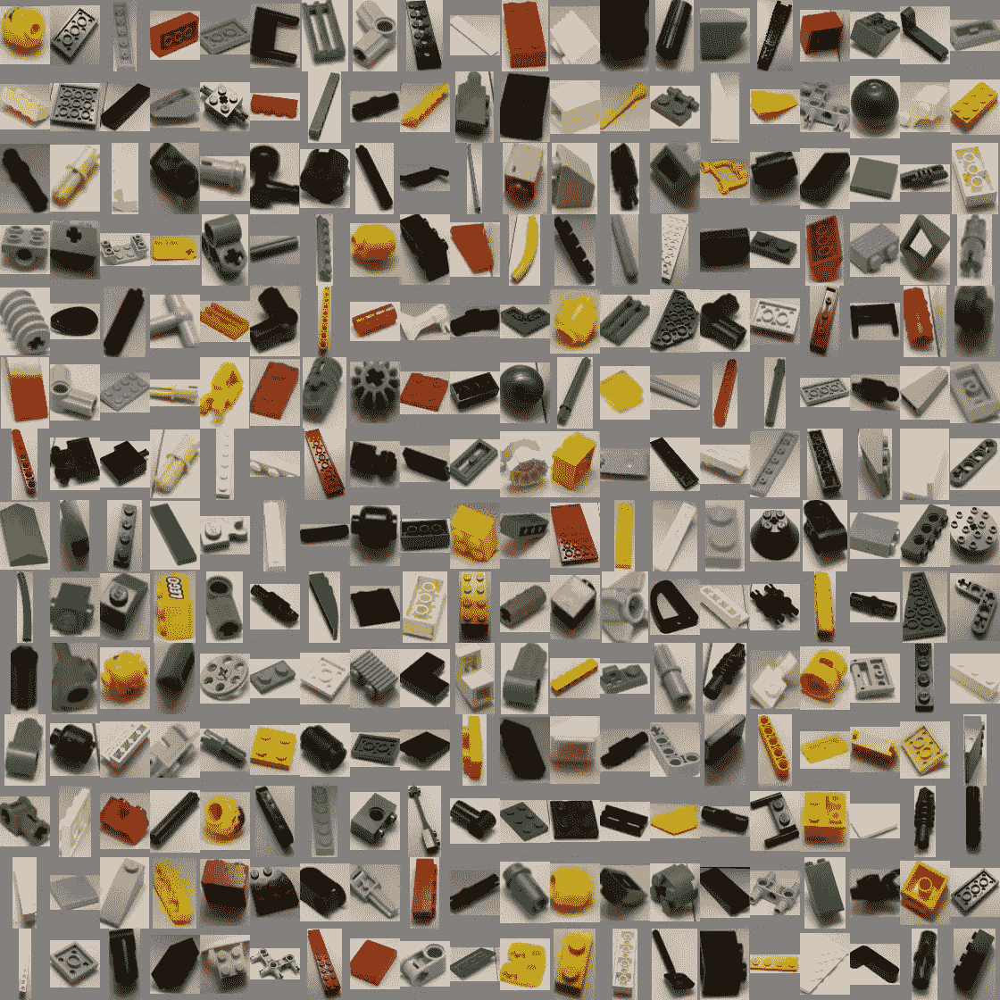
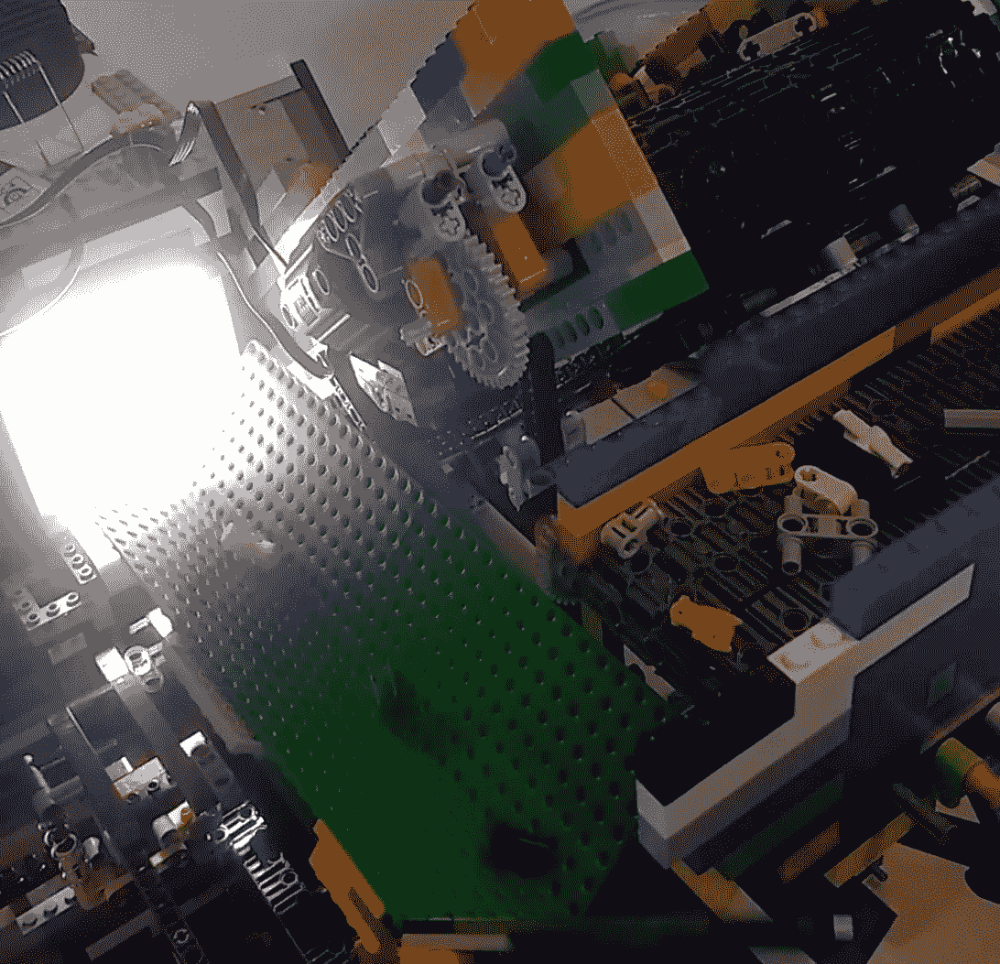
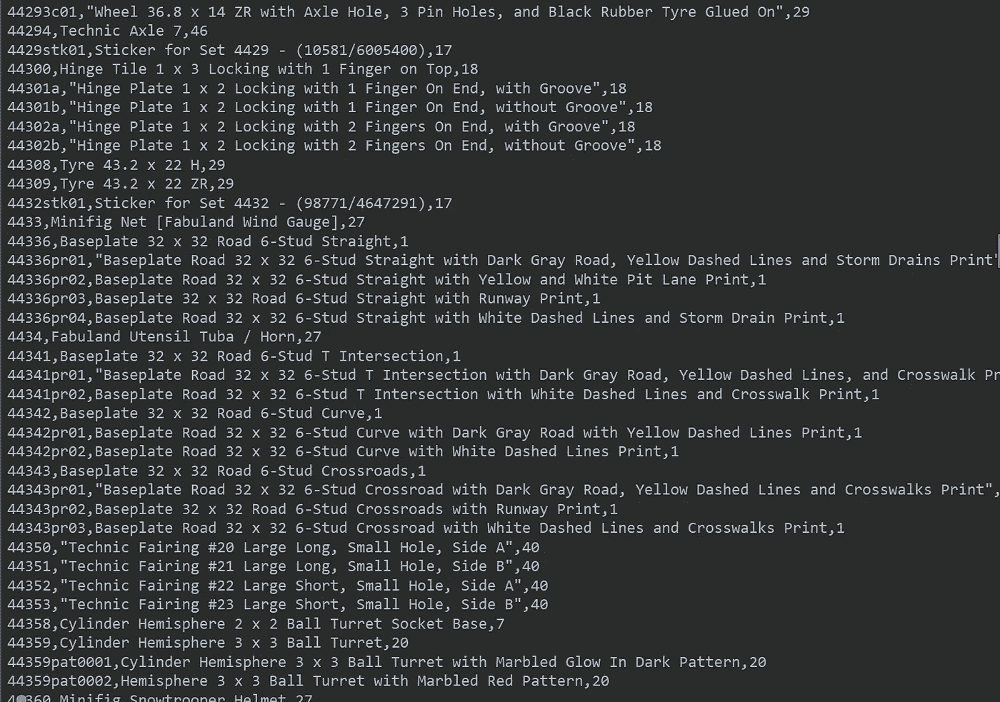
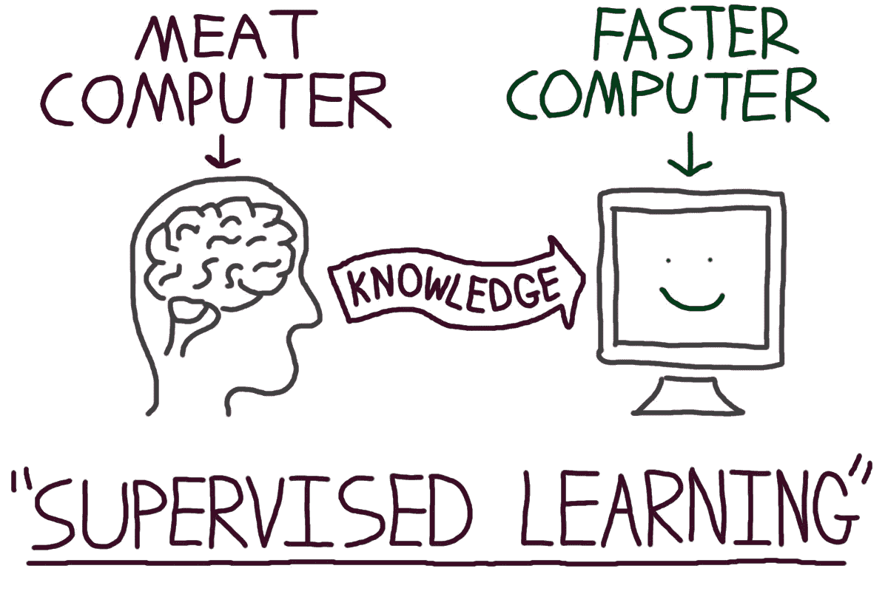
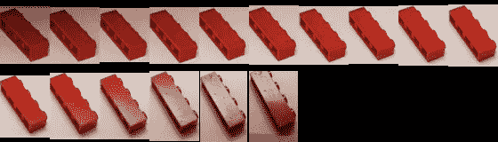
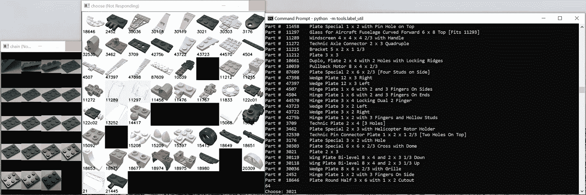
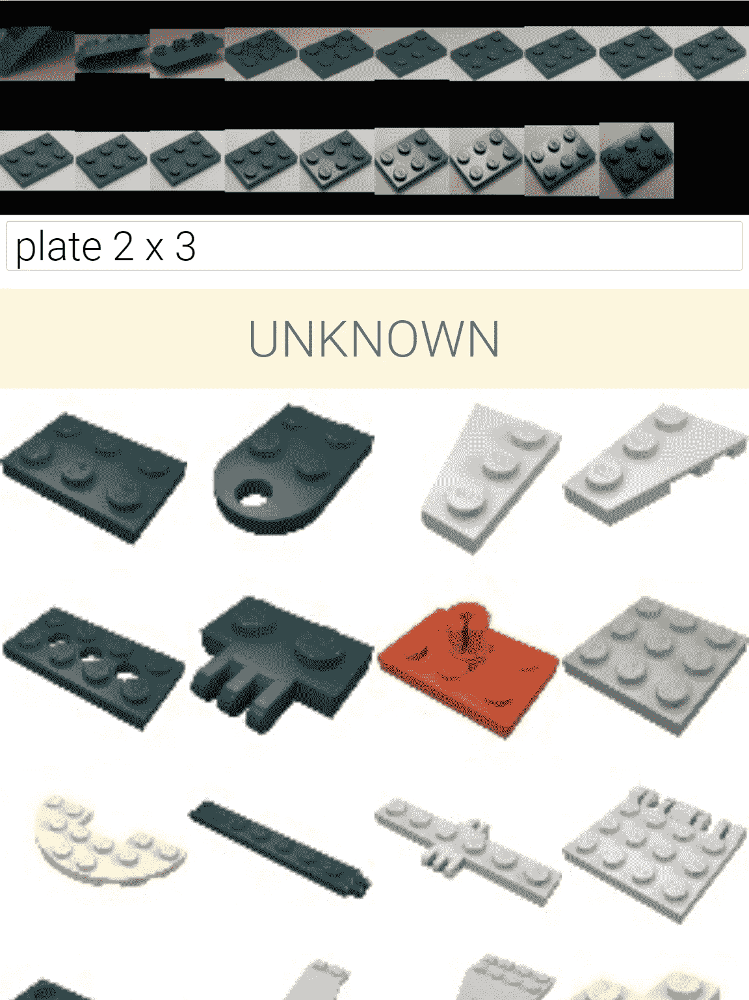
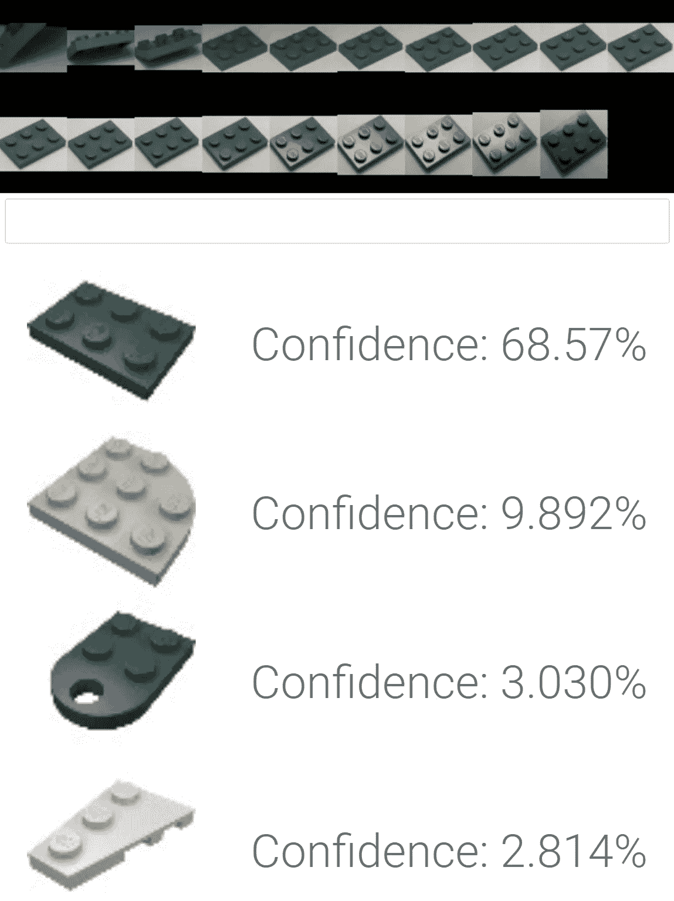

# 我是如何创建超过 100，000 个带标签的乐高训练图像的

> 原文：<https://towardsdatascience.com/how-i-created-over-100-000-labeled-lego-training-images-ec74191bb4ef?source=collection_archive---------3----------------------->

Some of the 300,000+ images I captured while leaving the machine running for a few days.

如果你是一个业余爱好者或从事人工智能项目的研究人员，很可能你已经遇到了不得不生成大量带标签的训练数据的不幸情况。当然，在花费了所有资金从一个不修边幅但心存感激的比特币矿工手中拿走一些粗略的 GPU 之后，你现在负担不起外包你的注释管道。

作为我寻求建造一个通用乐高分类机的一部分(更多文章随后！)，我自己也碰到过这个问题。虽然大部分训练数据是自动生成的，但该项目仍然需要相对较少但相当数量的由人类标记的良好的旧地面实况图像。

大多数深度学习教程和教育似乎都假设你总是会得到一个漂亮整洁的数据集，准备好并等待处理，但对于大多数现实世界的应用程序来说，你不会将居中的手写数字归类到 0 到 9 的类别中。在一个真正的人工智能项目中，一些(如果不是大部分)艰苦的工作是处理简单的数据采集。我经历过这方面的艰难，我认为分享一些我学到的经验和技巧会有所帮助。

A sneak preview of the LEGO sorting machine prototype in action.

## 问题是

乐高分拣机的识别组件的工作原理是沿着摄像头下方的传送带，一次一个地收集乐高元素。为了开始标记过程，我让机器运行了几天，收集了大约 30 万张乐高元素的未标记图像。我可能无法将它们全部标记出来，但是，嘿，这些图像很容易收集。为什么不去疯？

有成千上万个不同的乐高零件编号，机器有可能被训练识别。然而，我已经排除了一些类别——目前我不在乎区分“瓷砖，圆形 2 x 2 与比萨饼图案”和“瓷砖，圆形 2 x 2 与中国新年汤图案”。但是，在你开始认为我显然让事情变得太简单之前，在一天结束时，我仍然有超过 2500 个零件类别。

Dealing with all these part numbers is definitely overkill — deduplication was heavily used.

(如果你想喝点中国新年的汤，你现在可以在 brick link 上为自己买一块 2 x 2 的瓷砖，只需 22.07 澳元)。

无论如何，为了获得用于训练的标记数据，我现在需要从 2500 多个可能的零件号中手动分配一个给机器运行时相机拍摄的每个乐高元素图像。

所有监督学习的目的是将现有黑盒神经网络(在这种情况下，是人脑)的知识转移到新的神经网络(通常在计算机上运行)。你的人脑黑盒分类器在教学任务中很棒，但不幸的是它非常慢。对于其他我们还不知道如何卸载到运行在亚马逊仓库中的 GPU 的任务，它也可能是需要的。

We might start getting into trouble if we do too much of this.

我们的总体目标是降低我们的大脑分类器标记一幅图像的时间。我可以采取 3 个关键步骤来大大加快这个过程。与所有伟大的工程解决方案一样，这三个步骤的共同主题是**尽可能避免大量工作**。

## 第一步:作弊(又名:解决问题)

让您能够有效标记大量数据样本的最佳方法是首先利用生成样本的方式。通常，您对样本生成过程有一定程度的了解，尽可能多地滥用这种能力是个好主意。
在我的例子中，我注意到相机有一个大约 10–20 帧的窗口，用来拍摄零件在传送带上移动时的照片。因此，相机不是只拍摄一张图像，而是拍摄零件完全可见的每一帧图像，并将 10-20 张图像存储在一起。

An example bundle.

因此，虽然我的 30 万张左右的图像都没有标签，但我仍然可以访问一组非常有价值的元信息，这些信息告诉我每捆 10-20 张图像必须有相同的标签。这意味着，与尝试单独标记每张图像相比，我的标记速度提高了 10-20 倍。

顺便说一句:捕捉每个部分的多个图像也让我在实际分类性能方面获得了巨大的好处。我将在以后的文章中介绍更多的细节，但是如果您觉得您可以在自己的项目中实现类似的东西，请尝试一下！

## 第二步:懒惰(又名:简化过程)

对于任何实际情况，通过手动将值一次一个地放入“labels.csv”来创建注释，往好了说会非常慢，往坏了说则完全不切实际，尤其是当您的注释比简单的标签(例如，边界框或分段遮罩)更复杂时。因此，在几乎所有情况下，预先花点时间创建一个注释实用程序是值得的。

我的第一个版本的乐高标签工具非常简单，但却是让我以相当快的速度完成标签的最低要求。由于我不知道哪个零件号与特定的零件名称相关联，所以我需要添加一个简单的文本搜索实用程序，当出现一组要标记的新图像时，它将允许我搜索“砖 2 x 4”或“板 1 x 2”之类的内容。如果没有搜索工具，我将不得不使用谷歌或滚动我的零件数据库来查找一个元件的正确零件号。

The bare minimum for usability, but we can do better.

我很快就厌倦了必须手动输入零件号，而且坐在电脑前完成这一切有点麻烦。因此，我决定利用我的 web 开发经验，花几个小时组装一个简单的 web 应用程序。这最终成为一个巨大的胜利——不仅用户体验更加流畅，这意味着我能够更快地标记，而且因为它在我的手机上运行，我还能够用标记乐高积木来代替我通常在 Twitter 上无意识滚动的一些时间。这实际上是相当平静的体验(尤其是与 Twitter 滚动相比)。

Label Utility 2.0: Search, then tap the icon that matches the bundle at the top.

与手动搜索零件号并将其输入 labels.csv 相比，使用简单的标签应用程序的速度平均提高了约 2-5 倍，这还不包括能够在任何地方进行标签的便利性。

使用 web 应用程序作为标签应用程序还有一个非常有吸引力的第二个好处:只需给他们一个链接，就可以很容易地开始将其他人包括在标签过程中。我还没有尝试过这个项目，但是我很想尝试一下，尤其是在下一步的时候。

## 第三步:让其他人来做这件事(又名:使用人工智能辅助注释)

当你在标记你的数据的时候，你一直在原型化你的实际模型，并且在边上做模拟训练，对吗？你当然有！一旦你注释了大量的数据(比如说你的成品需要的 10-30%)，你应该有能力训练你的网络来完成你的任务。例如，如果你正在构建一个分类器，你可能不会得到 95%的前 1 名准确率，而是得到 90%的前 5 名准确率。
这是我使用前两种策略手工标记了大约 30，000 张图片后发现自己所处的情况。我意识到，通过将这个“原型分类器”连接到我的标签实用程序，我可以进一步大幅提高我的标签速度。我不需要对每一束图像都进行文本搜索，我可以首先给出来自原型分类器的最高猜测，其中一个在 90%的情况下都是正确的。

Label Utility 3.0: Just choose one of the AI’s suggested options! The text search is still there for when the AI fails.

这又给了我 2-10 倍的速度提升——对于我不容易记住名字的奇怪部分尤其有效。我现在能够平均 1-2 秒钟标记一整捆图像。这相当于每秒 5-10 张图片！对人类来说还不错！

通过在我的标记管道中实现上述关键步骤，我能够在注释管道中实现 40-1000 倍的加速。在没有任何外部帮助的情况下，我已经标记了超过 100，000 张图片，而且这主要是在我通常浏览社交媒体的业余时间。

最后，这里有一个标签实用程序的实际使用视频。