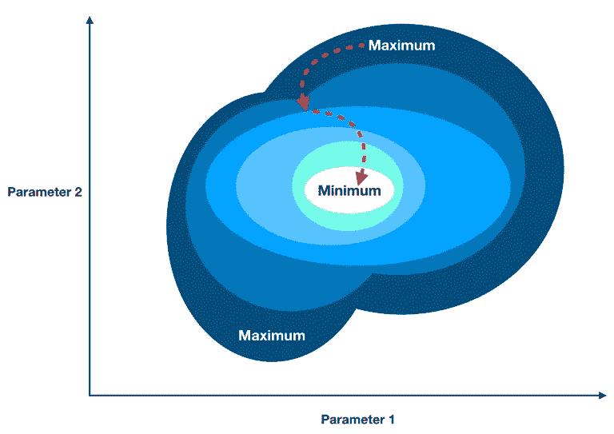

# 我对数据科学和 Metis 训练营的感受

> 原文：<https://towardsdatascience.com/how-i-feel-about-data-science-and-the-metis-bootcamp-experience-398b171289d0?source=collection_archive---------18----------------------->

## 在 Metis 训练营接近尾声时，记录我的数据科学相关想法

夏天到了，我的数据科学训练营也快结束了，它非常有趣、有见地、有收获，我会非常想念这种学习环境和我的 Metis 团队的其他成员(保持联系，伙计们！).在我们骑着马奔向夕阳之前，我想为后人记录下过去几个月的一些重要收获。

所以它来了——我的第一篇文章…

# 1.找出正确的问题是最难的部分。

让您的数据以一种干净且可用的格式存储可能是一件困难的事情。选择正确的模型和调整超参数有时也很有挑战性(hello grid search！).但老实说，很多时候最难的部分是找到一个有趣的、值得攻击的问题。

在训练营期间，我参与了四个大项目。我最纠结的一个是我的自然语言处理(NLP)项目。我怀着最美好的愿望开始了这个项目，但也不知道如何处理我的数据。

> “我要从 Reddit 上下载一堆东西，用它做一些超级酷的东西！”我以为。

在我所有的项目中，这是最糟糕的一个。其他每个项目都有一个明确的目标:

*   可靠地预测贷款违约，以构建一个干净的贷款组合，可以赚取巨大的回报。
*   找出电影票房表现的驱动因素，这样电影公司就能更可靠地盈利。
*   用[神经网络](/understanding-neural-networks-19020b758230)预测短期股票收益，战胜股市。

但是，尽管我学习了主题建模、情感分析和推荐系统，我并没有产生实质性的实际结果。这都是因为我不知道我要回答的是什么问题——因此也没有明确的努力目标。

> 经验教训—问题应该驱动我收集哪些数据，而不是相反。

# 2.冒名顶替综合症很严重。

在训练营，你基本上有三个月的时间从数据科学新手到训练深度神经网络。在此期间，你会被行业专业人士的资历所吓倒，也会被同学们的创造力所惊叹。在整个过程中，你会努力忽略那个声音——

> “你将无法完成这一职业转型。你想为之工作的公司不会雇用你作为数据科学家，因为你没有合适的资格证书，或者因为你缺乏相关的经验。”

事实是我担心面试。在我签下那份工作之前，我会为找工作感到相当大的压力。

但是当我回头看的时候，我为我所学到的和付出的努力感到骄傲。虽然我们可能还有很长的路要走，但我和我的同学也已经走了很长的路。

冒名顶替综合症可能永远不会完全消失。但我相信，我和我的同学们不会屈服于这种不充分的感觉，而是会把它作为燃料，更快地学习，更努力地工作。

# 3.即使在数据科学领域，MBA 仍然有发展空间。

如今，尤其是在硅谷，MBA 们的名声很差。但是，对企业如何赚钱以及我们可以利用什么杠杆来赚更多的钱有一个直观的理解仍然是至关重要的。

探索数据、训练模型和预测事物都是非常有趣的。但大多数时候，我们仍然使用分析和数据科学来支持某种业务目标。

> 对这个问题的洞察将如何帮助我的公司变得更加成功？

有商业背景的人相对擅长用金钱来描述数据科学问题，并且经验丰富。所以对你当地的 MBA 好一点，即使他或她分不清[熊猫](https://pandas.pydata.org/)和[熊猫](https://people.com/pets/baby-panda-cubs-photo-debut-china/)的区别。

# 4.如果有一个梯度，那么我们可以下降。

Gradient descent is a versatile optimization method for finding minimum values

我数不清训练营中有多少关于特定算法的讲座是以这样的话结束的:

> “最后，我们可以指定我们的成本函数，并使用梯度下降来最小化它，并估计模型的参数。”

在我看来，有两件事将几乎所有的数据科学联系在一起:

1.  **相关性** —数据科学就是寻找各种事物之间的联系。我之所以这么说，是因为与传统统计不同，我们经常处理杂乱的非结构化数据，如文本或图像。但在本质上，我们仍然在寻找我们杂乱的数据和我们关心的解释或预测的事情之间有趣而有见地的联系(信号)。
2.  **梯度下降** —因为我们经常最终需要分析大量杂乱的非线性数据，所以我们需要一种同样通用的方法来最小化成本函数(我们寻求最小化模型的成本函数，以便获得其最佳参数值)。梯度下降正是如此。它快速、有效、适应性强，是从逻辑回归到神经网络的动力。

如果你想对梯度下降有更深入的解释，[我在我的关于神经网络的帖子](/understanding-neural-networks-19020b758230)中写了它(你将不得不向下滚动一段路，或者只是阅读全文，呵呵)。

# 5.收集正确的数据并雇用正确的人来从这些数据中挖掘见解，这可能是一个真实而持久的竞争优势。

我本质上是一个价值投资者，当我分析一家公司时，我习惯于寻找竞争优势的传统来源(如[规模经济](https://en.wikipedia.org/wiki/Economies_of_scale))。因此，在早期，我绝对不习惯将一家公司的数据和分析视为竞争优势的持久来源。

我之前持怀疑态度的原因是，几乎每个公司都有一些关于其客户的有趣的专有数据。所以我认为能够更好地分割数据或更好地预测是不可持续的——你的竞争对手自己可以雇佣更好的工程师和更好的模型，并轻松赶上。

但是像谷歌、脸书和亚马逊这样的公司证明这是非常错误的。据我所知，这三家公司和其他类似的公司通过使用以下渠道建立了巨大的竞争优势:

1.  收集几乎所有东西的大量数据。
2.  构建用于存储和清理所述数据的基础设施。
3.  雇佣成千上万真正聪明勤奋的人来建立模型，挖掘所有可用见解的数据。
4.  使用新收集到的见解向人们出售物品或让他们购买物品(资本家！).
5.  从步骤 4 中的所有交互中收集更多的数据，以便迭代和改进模型以及生成的洞察。
6.  不断重复步骤 3、4 和 5，直到竞争被远远甩在身后。

虽然并非大数据和机器学习的所有承诺好处最终都可能实现，但聪明运营的公司已经证明，通过数据科学，他们可以从以前认为毫无价值的数据中提取大量价值。

我从梅蒂斯训练营得到的另一个令人惊奇的东西是[这个博客](https://medium.com/@tonester524)。如果没有以前 Metis 学生的一些[好例子](https://medium.com/@frederickaarond)和导师的督促，我可能不会有时间写这么多。但现在我喜欢它，并将继续不畏艰难地写作。

祝我好运，因为我准备开始一个新的职业生涯(我对此非常兴奋)。感谢阅读！干杯！

[*从我这里查看更多。*](https://medium.com/@tonester524)