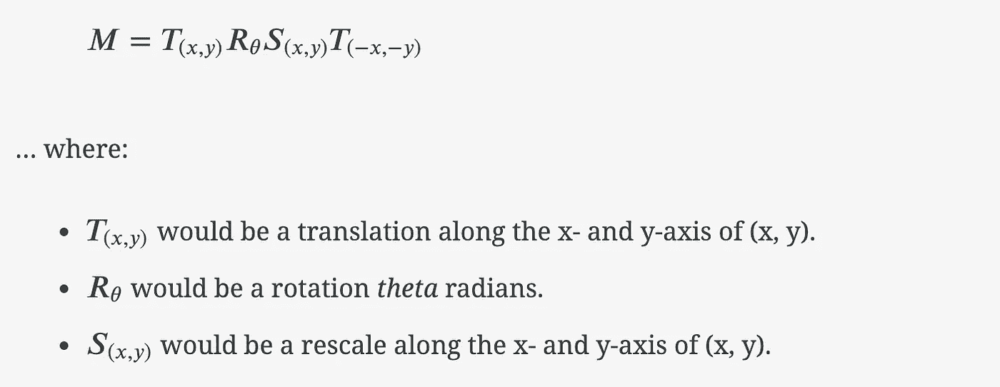
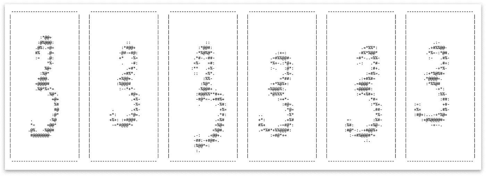

# 我如何通过数据扩充提高 1%的准确率

> 原文：<https://towardsdatascience.com/how-i-got-1-better-accuracy-by-data-augmentation-2475c509349a?source=collection_archive---------14----------------------->

放下你所爱的东西是很难的。是的，在本系列的第 5 篇文章之后，我真的以为我已经完成了，但是……来自[和 MNIST 例子](/part-5-training-the-network-to-read-handwritten-digits-c2288f1a2de3)的准确性/误差指标开始困扰我，我非常确定我可以通过实现另一个简单的技巧来改进它们:*数据增强*。事实证明这很容易实现，而且效果非常好。

当你读完这篇文章，你可以试试我在这个[互动 MNIST 游乐场](https://machinelearning.tobiashill.se/extra-2-a-mnist-playground/)上训练的一个小型神经网络！

此外，请查看该系列的所有零件:

*   [第一部分:基础](https://medium.com/@tobias_hill/part-1-a-neural-network-from-scratch-foundation-e2d119df0f40)。
*   [第二部分:梯度下降和反向传播](https://medium.com/@tobias_hill/part-2-gradient-descent-and-backpropagation-bf90932c066a)。
*   [第 3 部分:用 Java 实现](https://medium.com/@tobias_hill/part-3-implementation-in-java-7bd305faad0)。
*   [第四部分:更好更快更强](https://medium.com/@tobias_hill/part-4-better-faster-stronger-dd6ded07b74f)。
*   [第 5 部分:训练网络读取手写数字](https://medium.com/@tobias_hill/part-5-training-the-network-to-read-handwritten-digits-c2288f1a2de3)。
*   [Extra 1:我如何通过数据扩充提高 1%的准确率](https://medium.com/@tobias_hill/extra-1-how-i-got-1-better-accuracy-by-data-augmentation-2475c509349a)。
*   MNIST 游乐场。

# 数据扩充

数据扩充就是从你实际得到的数据中制造更多的数据——在不丢失数据携带的信息的情况下增加方差。这样做降低了过度拟合的风险，并且通常可以提高看不见的数据的准确性。

在图像作为输入数据的特定情况下(如 MNIST 数据集中的情况)，增强可以是例如:

*   仿射变换(旋转、缩放、平移等。)
*   弹性变形
*   卷积滤波器(例如，在 MNIST 的例子中，通过使用最大或最小内核使数字变得更粗或更细)
*   添加噪声

我决定进行仿射变换。我以前在 CG 中使用过很多次，知道它们非常简单明了。

# 仿射变换

仿射变换将一个仿射空间映射到另一个仿射空间。更具体地说，我们可以说仿射变换可以通过旋转、缩放和平移等操作来变换特定的坐标，并告诉我们这些变化后的坐标是什么。仿射变换可以被表示为矩阵，并且可以被组合，使得一系列变换仍然可以被表示为单个矩阵。

例如(这里是二维描述的),我们可以这样构成变换 M:

当我们得到这个 M 时，只需将它与输入坐标相乘，就可以得到它们在目标空间中的新位置，如 M 所定义的。相反，我们可以将目标空间的坐标与 M 的倒数相乘，以返回到原始空间。

在 Java 中，创建这些仿射变换矩阵就像这样简单:

这就是我们将原始 MNIST 数字中的坐标转换为新的虚构数字中的坐标所需要的全部内容，这些数字是原始数字稍加修改的版本，用于训练网络。

该方法作为一个整体，是 DigitData-entity 上的一个 mutator(参见[第 5 部分](/part-5-training-the-network-to-read-handwritten-digits-c2288f1a2de3))，看起来像这样:

正如您在第 29–41 行中看到的，上面的代码还具有插值功能，这使得转换后的结果更加平滑。

此外，还会进行一项检查，以查看生成的数字是否可能以某种方式进行了转换，使其部分溢出到目标 28×28 数组之外。当情况似乎是这样的时候，我们放弃那个改变并且再试一次。如果我们不能在 5 次重试内达到一个好的转换数字，我们跳过这一轮的转换，退回到原始数字。这很少发生。下一轮我们可能会更幸运，得到一个有效的转换。

说到巡房。我们多久改变一次输入数据？在每个训练时期之后，我像这样变换整个数据集:

这样，神经网络就不会两次看到同一个数字(如上所述，除了少数运气不好的变换尝试之外)。换句话说:*通过数据扩充，我们已经创建了一个无限的数据集。*当然，从严格的数学意义上来说，这是不正确的……但对于我们所有的训练目的来说，我们为随机仿射变换选择的分布方差绝对足以创建一个独特的数据流。

# 结果呢

我选定的那个小型神经网络(只有 50 个隐藏神经元，[见前一篇文章](/part-5-training-the-network-to-read-handwritten-digits-c2288f1a2de3))的错误率平均下降了 1%，现在可以稳定地训练到 1.7%-2%的错误率。

零钱。影响很大！

请在我创建的一个小型 [MNIST 游乐场](https://machinelearning.tobiashill.se/extra-2-a-mnist-playground/)上测试一下这些训练有素的网络表现如何。

此外，如果你想仔细看看代码在这里:[https://bit bucket . org/Tobias _ hill/mnist-example/src/Augmentation/](https://bitbucket.org/tobias_hill/mnist-example/src/Augmentation/)

*原载于 2019 年 1 月 26 日*[*machine learning . tobiashill . se*](https://machinelearning.tobiashill.se/extra-1-data-augmentation/)*。*