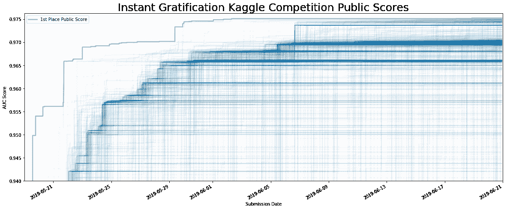
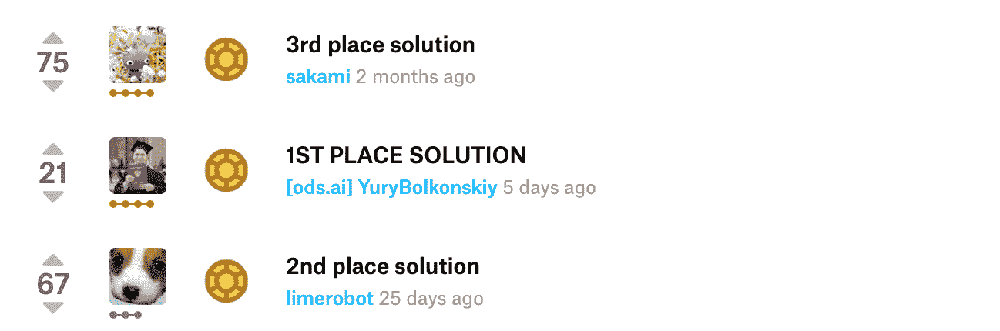
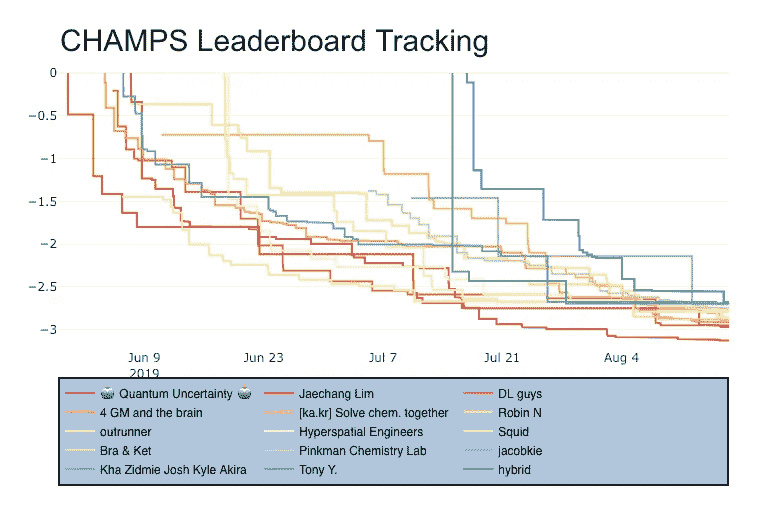
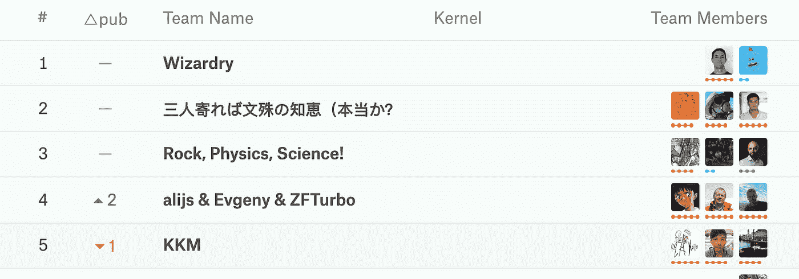
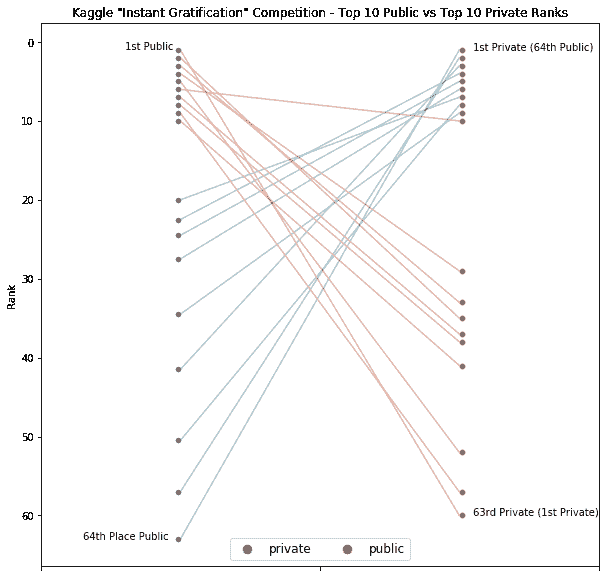

# 我是如何开始 Kaggle 竞赛的(这并不难)

> 原文：<https://towardsdatascience.com/how-i-got-started-with-kaggle-competitions-its-not-that-hard-7666f25e9f93?source=collection_archive---------12----------------------->

数据科学社区的大多数人都知道 Kaggle 是一个学习和增长技能的地方。从业者提高的一个流行方法是在预测挑战中竞争。对于新人来说，跳进网站并在实际的挑战中竞争可能是压倒性的。至少，我一直是这么觉得的。

在旁观之后，我决定在 2018 年底最终涉足 Kaggle 竞赛竞技场。在很短的时间内，我学会并磨练了许多数据科学技能，否则我将无法实践这些技能。令我惊讶的是，我还发现竞争可以带来很多乐趣——即使是作为一名新人。

在这篇文章中，我试图揭开 Kaggle 竞赛的一些组成部分的神秘面纱，对于第一次参加竞赛的人来说，这些部分可能不会立即显现出来。总的来说，我希望展示 Kaggle 比赛可以成为一种有趣而有效的方式，在这一领域积极学习。

# **公共排行榜跟踪社区进度**

让我们为任何不熟悉该平台的人介绍一下 Kaggle 101:在一个典型的 Kaggle 比赛中，数据科学家被提供了 ***训练*** 和 ***测试*** 组数据。训练数据提供有竞争者试图预测的标签，而测试集没有标签。你的工作是编写一个算法来预测测试数据的标签。

在比赛过程中，Kagglers 可以提交他们的预测， ***这些预测的一部分*** (我稍后会解释为什么这很重要)会被评分并显示在公共排行榜上。这是一个很好的方式，让竞争对手在比赛过程中了解自己的实力。作为一个临时的竞争对手，在整个比赛过程中观看排行榜顶部的动态也很有趣。

在这张图表中，[我绘制了最近一场名为“即时满足”的 Kaggle 比赛的公共排行榜](https://www.kaggle.com/robikscube/a-race-for-instant-gratification)。每条蓝线代表每个团队，橙色线显示领先团队的分数(在这场比赛中，得分指标 1 将是满分)。

# **公共笔记本保存共享的知识**

当你追踪上面的情节时，你可能会问自己，为什么这么多的团队看起来彼此跟踪得如此之近。大量团队分数汇聚的深蓝色线条可以部分地通过公共 Kaggle 笔记本(以前称为 Kaggle 内核)来解释。

以前没听说过 Kaggle 笔记本？它们是一种基于云的方式，让社区分享关于他们预测模型的代码和想法。对于新手来说，这是一个很棒的设置，因为不需要构建本地环境、下载数据、安装包，也不需要陷入管理的泥潭。此外，这些虚拟机通常比一个人的本地笔记本电脑更强大。笔记本可以是私有的(只有您和/或您的团队可以看到)或公共的。Kaggle 的一个令人兴奋的方面，以及一个真正的“游戏中的游戏”及其自身的奖励，是一个人的公共笔记本被社区成员投票支持的可能性。

在每场比赛中，都会有由社区成员创建的公共笔记本，以帮助探索给定用例的基准模型。数据科学家使用这些笔记本来获得社区的认可，修补其他人的工作，并在隐喻性地牵着你的手前进的同时，一步一步地通过另一个人的代码。

那么，那些所有 Kaggle 分数汇聚的蓝色粗线？那就是当一个突破性的内核发布后，整个竞争领域都采用某人的代码或视角。在 2018 年的场外，我看到了笔记本的魅力，并最终在实际参加比赛之前，开始自己写作和出版它们。

# **论坛提供背景**

如果你不想马上深入内核，那么你可以将注意力转向 Kaggle 论坛。他们是另一个开始的好地方。在这里，数据科学家分享他们的想法，提出问题，并进行对话。

Discussion posts by the top teams in the “Jigsaw Unintended Bias in Toxicity Classification” competition

比赛结束后，获胜的团队通常会发表他们的观点，以改善整个社区。

# **各种类型的戏剧都有**

每场比赛都有意想不到的时刻:例如，处于劣势的球队跃居积分榜首位，或者戏剧性的数据泄露。

很多时候，在一场比赛中，一两支队伍会从排行榜的其他队伍中脱颖而出。根据社区对顶级竞争对手如何达到这一目标的猜测，最近被称为“寻找魔力”，通常是竞争对手和观察者的煽动者。

Tracking the CHAMPS competition public leaderboard (lower score is better)

[在最近的几场比赛中，我创造了一些有趣的笔记本来跟踪公共排行榜](https://www.kaggle.com/robikscube/the-race-to-predict-molecular-properties)。在“CHAMPS Molecular Properties”竞赛的上图中，你可以看到一个团队找到了脱离人群的方法的例子。

# **组队升军衔**

在 Kaggle 上，合作是一个重要且常见的策略。它允许数据科学家在安全的环境中协作，并在其预测模型中获得协同动力。我通常通过设定个人目标和关注个人成功来开始比赛。一旦我缺乏改进我的模型的想法，我会考虑拓展业务，和其他人一起努力(但不是太多其他人——谷歌“[林格曼效应](https://www.google.com/search?q=ringelmann+effect)”)。

All teams at the top of the leaderboard for the “Santander Customer Transaction Prediction” competition

Kaggle 的这一方面与个人职业生活中其他领域的项目合作没有什么不同。-它需要信任、道德取向和合作的心态。或者，在单人比赛中获得高分被广泛认为是 Kaggle 上最难做到的事情之一——事实上，[为了获得比赛大师的地位](https://www.kaggle.com/progression)，你必须获得一枚单人金牌，总共 5 枚金牌。

# **重组带来最终结果**

任何给定 Kaggle 比赛中的公共排行榜仅在测试集的一部分上评分。可能会无意中创建在公开评分的测试集部分表现非常好的模型，[但它们的模型准确性实际上并不能很好地转化为私有排行榜](http://blog.kaggle.com/2012/07/06/the-dangers-of-overfitting-psychopathy-post-mortem/)。这就是为什么有一个不仅准确，而且对公共和私人排行榜都通用的模型很重要。

社区将这种现象称为“过度适应公共排行榜”。当最终的结果被制成表格时，这种调整的效果有时会非常引人注目！上面的图显示了最近一次比赛中前 10 名的公共和私人团队-正如你可以看到的那样，公共前 10 名中只有一个团队留在了最终排名中。[相对于一些著名的人事变动](https://www.kaggle.com/pednoi/visualize-the-shakeups-of-10-recent-competitions)，这个例子实际上是相当温和的，在那些变动中，团队发现他们自己移动了数百个，有时是数千个位置。

# **健康竞争中的娱乐、学习和社区**

排行榜、笔记本、论坛、戏剧、团队和最终结果:如果你决定参加 Kaggle 比赛，你会遇到很多事情。我想不出比加入一个更好的方法来提高我们的专业机器学习技能。推动您的预测解决方案策略的极限，与社区互动，并享受这一过程。

在 [Kaggle](https://www.kaggle.com/robikscube) 或 [Twitter](https://twitter.com/rob_mulla) 上联系我，我会在排行榜上看到你。