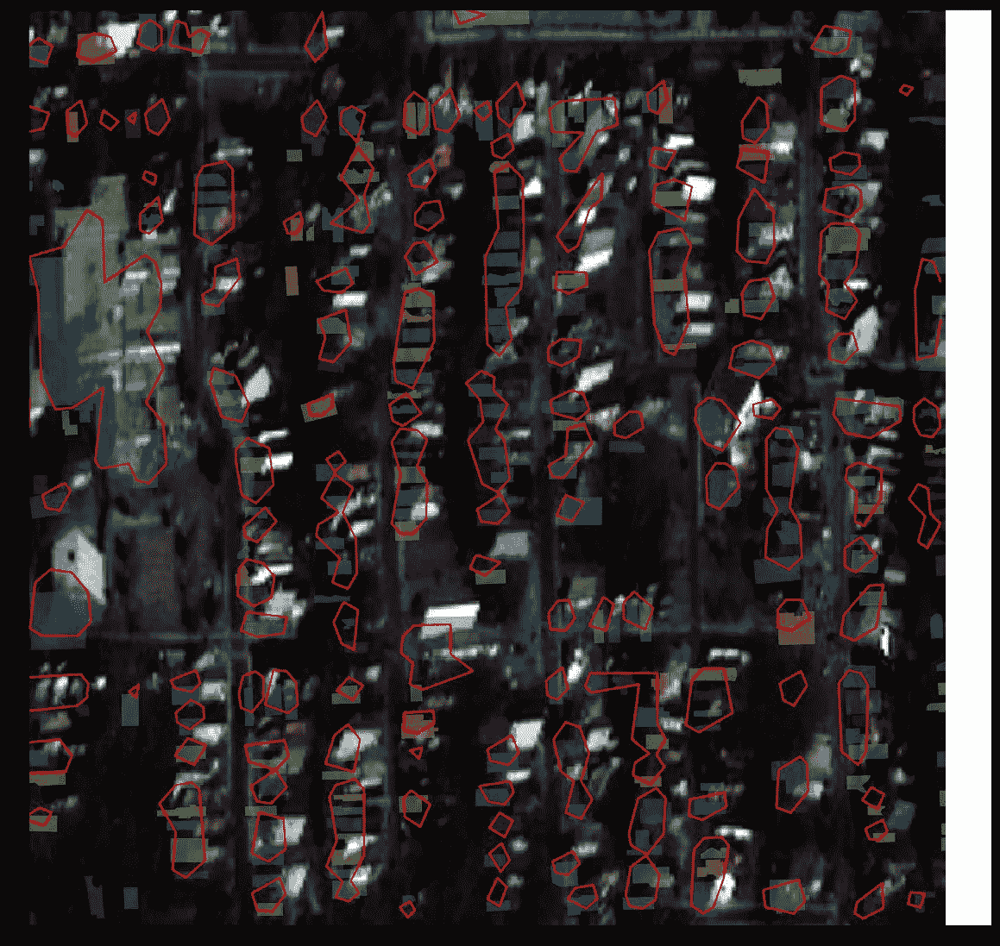

# 我如何在 Spacenet 4 挑战赛中进入前 10 名

> 原文：<https://towardsdatascience.com/how-i-got-to-top-10-in-spacenet-4-challenge-5dbf020b6ffb?source=collection_archive---------20----------------------->

*比赛主持人的一些插图*

*挑战的任务简单地说就是*

对我来说， *Spacenet4* 成为了第一个严肃的 DL 比赛。老实说，很多事情都出错了，但我获得了一次愉快而有益的经历，并设法提高了自己的技能。

可能是我在这次比赛中教会的最重要的事情:**排行榜是唯一的真理**。任何地方都容易犯错误，你发现和改正错误的速度决定了你的胜算。

# TLDR

如果你错过了去年关于
@snakers41 参加类似挑战的帖子:
[Spacenet 三:道路探测器](https://spark-in.me/post/spacenet-three-challenge)和[人群 AI 地图挑战赛](https://spark-in.me/post/a-small-case-for-search-of-structure-within-your-data)

**域**——从不同视角拍摄的亚特兰大郊区卫星图像(*最低点*)分为三组:最低点、偏离最低点、非常偏离最低点。

**任务的核心** —识别所有的建筑足迹。

**最终进场**

*   带 augs 的 4 通道图像；
*   具有迁移学习的 uresnext 101(UNet+resnext 101)；
*   每个最低点类别三个头；
*   Adam 优化器+ lr 衰减；
*   用边界掩模和分水岭进行后处理；
*   多边形近似；

*示例模型性能*

# 挑战

所有以前的 Spacenet 竞赛的一个关键挑战是在卫星图像上找到物体。这一次，参与者必须**在卫星从不同视角(天底、离天底、非常离天底)和目标方位角拍摄的图像中识别所有建筑物**。不仅仅是建筑，还有脚印。

*将最低点从 39 更改为 53*

数据集有 27 个采集点——同一地点的照片——最低点在 7 度到 54 度之间。

*收集无建筑*

嗯，收集，现在听起来没那么有挑战性了。我们可以拍摄最小的天底图片，对其运行一些分割管道，并通过稍微滑动蒙版来获得所有 collect 图像的足迹。组织者也是这么想的，他们从公开测试中删除了所有 collect 的图片，只保留了一个例子。

*因此，我们不得不面对所有与建筑物倾斜和分辨率下降有关的非常糟糕的问题。这里的黄色多边形是预测遮罩*

然而，天底本身在标题中是硬编码的，这使得在我的模型中使用角度作为特征成为可能，这已经完成了，但在下面会有更多。
关于数据集和比赛的更多信息，您可以在组织者的[文章](https://medium.com/the-downlinq/introducing-the-spacenet-off-nadir-imagery-and-buildings-dataset-e4a3c1cb4ce3)中阅读。

# 我的基线

如果基线需要一些复杂的技术，它就不是基线了。

## 模型

分割任务的标准方法:Unet-like 架构+从 Imagenet 迁移学习。
在 3 通道 896*896 图片上启动，检查发生了什么。

*基线表现。看起来还不错但显然不够完美*

## 失败

复合二元交叉熵+骰子损失

# MOAR 头

此外，作者发表了[文章](https://medium.com/the-downlinq/a-baseline-model-for-the-spacenet-4-off-nadir-building-detection-challenge-6b7983312b4b)，其中有一些开放基线的有趣实验。他们为每一组训练了三个独立的模型:天底、离天底和非常离天底的图像。
结果并不令人惊讶:

1.  非常低的预测比其他预测更差；
2.  每个模型显示了来自同一组的图像的最佳质量，即，仅在偏离最低点的图像上训练的模型检测到远离最低点的图像，但是在其他图像上失败。

*文章*中的三个开放基准模型评估性能

顺便说一句，指标也被算作三个最低点类别的平均值。

# 三头模型

三个独立的模型是一个好主意，但是三个头**共享编码器层的模型更好(也更快)。**

最终这个模型+下面的几个其他的黑客成为我的最终提交。

*某些 3 头模型实验的局部验证指标*

# 五头模型

除了视角，还有一个方位——天底是一样的，但是卫星是从另一边飞过来的。事实上，这是我的模型的另一个自由度和两个头。

*不同方位的天底= 25°和天底= 34°。多边形是地面真理*

# 已经尝试了一些其他的技巧

# 模型和数据处理

*   一大堆各种各样的编码器是最有趣的；
*   从我目前的个人经验来看，注意力不会让事情变得更糟，所以在这里它也有帮助；
*   Ofc **MOAR 层层**给了一些加分；
*   使用 **4 个图像通道**而不是 3 个图像通道进行输入——指标提高了很多；
*   标准图像**增强**——移位、裁剪、对比度等——我没有做足够的实验；
*   TTA——比分没有太大变化

此外，与本次挑战赛中的其他竞争对手相比，我们的模型收敛速度慢了 2-3 倍，这可能是由于非理想增强或 LR 机制。

# 优化器和损耗

*   **损失加权**考虑建筑物大小和相互距离—无改善；
*   [OpenAI **AdamW**](https://spark-in.me/post/%D1%81%D1%81%D1%8B%D0%BB%D0%BE%D1%87%D0%BA%D0%B0) 而不是 Adam optimizer——如果你正在为产品训练模型，效果很好，但对于竞争——缺乏最后 3-5%的性能；
*   **LR 衰变**。从高值开始，学习率在一定条件下逐渐降低(例如，损耗平台)。大概是我的模型一直过拟合，因为快速 lr 衰减提高了分数。

我想尝试许多其他想法/启发，比如外部数据集、处理遮挡房屋、集合等等，但是没有时间做所有的实验。

# 后处理和失败案例

嗯，那真的很痛苦。通过设置另一个阈值，提交分数可能会发生显著变化。大多数失败案例都是由于低质量而导致的非常低的图像。

# 失败案例

*关天底图片的高层建筑遮罩(黄色)*

密集建筑物和高阈值遮罩合并为一个，低阈值大建筑物被分成几个较小的。

*非常低的密集建筑区，阈值较高。基线模型。红线-遮罩边界，多边形-gt。*

# 流域

所有这些与门槛相关的问题引发了一些思考。

预测建筑物的边界也是必要的，我在模型输出中添加了边界遮罩

对于分割任务，我们需要稍微复杂一点的技术——例如，**分水岭**。在示例[这里](http://scikit-image.org/docs/dev/auto_examples/segmentation/plot_watershed.html)中可以找到一个默认用法，在我的例子中，它打破了一切。通过添加一些启发法解决了这个问题，例如，防止大房子(面具)的分割。

# 提交格式

…是**多边形**。这意味着我必须找到旧的库，并花一些时间进行近似调优。实际上，遮罩可以被扔进所有尖角的多边形中，不需要任何近似，但是它需要更多的时间，并且输出文件更重。

*从 skimage 得到的多边形近似*

第一个不愉快的时刻是，算法是随机的，并且从尝试到尝试的结果并不完全相同。第二个不愉快的时刻——一条近似的线在里面->面积变小->大概是借据<0.5 ->的错误

# 最终提交

我已经参加了比赛，第一次提交有点晚了。大多数错误，例如，错误的本地验证，必须立即更正。结果，一堆很酷的想法仍然没有得到验证。而且，因为我不想在最后一刻冒险进入前 10 名，所以最佳单人模特而不是合奏模特进入了最后的决赛。

*最终排名*

最终的**第九名**使得即使在重组后也不可能抓到前五名的怪物。然而，我仍然是一个 5 年制的学生，最大的动力是学生奖——最佳大学团队/参与者奖。因此，我振作起来，全力以赴，按照 TopCoder 指南提供了一个 dockerized 解决方案，这也有点挑战性。

老实说，我有点担心和害怕错过什么，所以我给 Topcoder 团队写了一封信，希望找到一些组织方面的东西，比如截止日期和学生的奖励要求。却没有得到回答。**很长一段时间以来，我一直在竞争论坛和电子邮件中询问，但还没有从顶级程序员管理员那里得到任何关于一些问题的确切答案**。这似乎有点令人沮丧，但我仍然不知道学生的奖项排名和我在私人验证中的最新分数。

*原载于 2019 年 3 月 3 日*[*spark-in . me*](https://spark-in.me/post/spacenet4)*。*