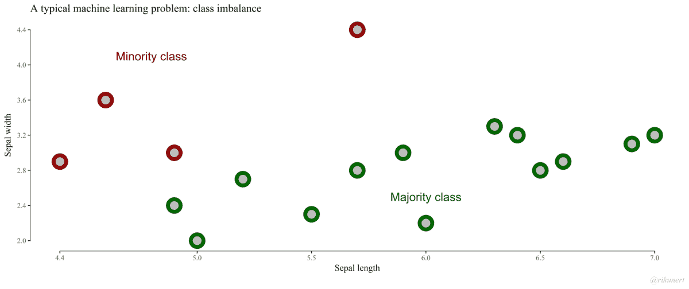

# 我如何处理不平衡的文本数据

> 原文：<https://towardsdatascience.com/how-i-handled-imbalanced-text-data-ba9b757ab1d8?source=collection_archive---------7----------------------->

## 解决人工智能中最常见问题之一的蓝图

Photo by [Form](https://unsplash.com/@theformfitness?utm_source=medium&utm_medium=referral) on [Unsplash](https://unsplash.com?utm_source=medium&utm_medium=referral)

不均衡类分布问题在数据科学领域普遍存在，ML 工程师经常遇到。我是 IMImoble Pvt Ltd 的聊天机器人开发人员，最近在培训意图分类模块时遇到了这种情况。现实世界的用户可以访问的任何实时业务聊天机器人都必然会吸引大量超出范围的查询以及与它被设计来执行的任务相关的消息。即使在相关的面向任务的消息中，不平衡也是可以预期的，因为机器人涵盖的所有主题不可能同样受欢迎。例如，在一个银行用例中，余额查询将超过房屋贷款申请。

Bot 构建不同于传统的应用程序开发。虽然后者相对稳定，更新频率较低，但前者需要频繁更新，以改善用户体验和机器人的智能。不平衡数据集是指属于一个类的数据明显高于或低于属于其他类的数据的问题。大多数 ML/DL 分类算法不能处理不平衡的类，并且倾向于偏向多数类。

# **为什么在不平衡数据集的情况下准确性是虚假的**

仅针对不平衡数据集的高准确度可能会适得其反，因为像决策树和逻辑回归这样的标准分类器算法不具有处理其中包含的不平衡类的能力。这导致了对较大类的严重偏向，而具有较少数据点的类被视为噪声并经常被忽略。结果是与多数类相比，少数类的错误分类率更高。因此，当评估基于不平衡数据训练的模型的性能时，准确性度量并不相关。

考虑以下情况:您有两个类-A 和 B。A 类占数据集的 95 %, B 类占另 5%。通过简单地每次预测 A 类，您可以达到 95%的准确率，但是这为您的预期用例提供了一个无用的分类器。相反，正确校准的方法可能会实现较低的准确性，但会有更高的真实阳性率(或召回率)，这确实是您应该优化的指标。

[这篇](https://www.analyticsvidhya.com/blog/2017/03/imbalanced-classification-problem/)文章解释了几种处理不平衡数据集的方法，但是它们中的大多数都不适用于文本数据。在这篇文章中，我分享了我用来平衡数据集的所有技巧和技术，以及将 f1 分数提高 30%的代码。

# 处理不平衡数据集的策略:

你能收集更多的数据吗？

您可能认为这不是您正在寻找的解决方案，但是收集更有意义和多样化的数据总是比采样原始数据或从现有数据点生成人工数据要好。

**删除数据冗余:**

1.  删除重复数据——我处理的数据集包含大量相似甚至重复的数据点。“我的订单在哪里”和“订单在哪里”的语义是一样的。删除这些重复的信息将有助于你减少多数班级的人数。
2.  有许多消息具有相同的语义，例如，考虑以下传达相同含义的消息。保留一两个这样的话语，去掉其他的，也有助于平衡阶层。那么，您可以在验证集中使用这些消息。有很多方法可以找到文本相似性，但我使用了 Jaccard 相似性，因为它非常容易实现，并且在计算相似性时只考虑唯一的单词集。你可以看看[这篇](https://medium.com/@adriensieg/text-similarities-da019229c894)文章中的其他技巧。

我可以更改送货时间吗？

我可以更改送货时间吗？

我可以更改送货时间吗？

3.合并少数民族类-有时多个类具有重叠的要素。还不如合并那几个小众班。这个技巧帮助我提高了超过 10%的 f1 分数。

**重采样训练数据集:**

修复不平衡数据集的最简单方法是通过对少数类的实例进行过采样或对多数类的实例进行欠采样来平衡它们。使用像 SMOTE(合成少数过采样技术)这样的高级技术将帮助你从少数类创建新的合成实例。

1.  欠采样——努力从多数类中随机剔除数据点，直到类达到平衡。存在信息丢失的可能性，这可能导致较差的模型训练。
2.  过采样—这是随机复制少数类实例的过程。这种方法可能会过度拟合，导致对测试数据的预测不准确。
3.  SMOTE-SMOTE 通过获取每个少数类样本并沿连接任意/所有 k 个少数类最近邻的线段引入合成样本来生成合成样本，如下图 GIF 所示。更重要的是，这种方法有效地迫使少数类的决策区域变得更普遍。查看[这篇](http://rikunert.com/SMOTE_explained)文章，了解简单的解释。不幸的是，这种技术不能很好地处理文本数据，因为从文本创建的数字向量是非常高维的。

[SMOTE Illustration](https://rikunert.com/SMOTE_explained)

如果很难收集到更多的数据，并且上面的技巧没有显示出有希望的结果，那么这里是最后的手段。

**数据扩充:**

数据增强是计算机视觉中常用的一种技术。在图像数据集中，它涉及通过变换(旋转、平移、缩放、添加一些噪声)数据集中的图像来创建新图像。对于文本，数据扩充可以通过将文档标记为句子、将它们混排并重新连接以生成新的文本，或者用同义词替换形容词、动词等以生成具有相同含义的不同文本来完成。任何预先训练好的单词嵌入或者 NLTK 的 [wordnet](http://www.nltk.org/howto/wordnet.html) 都可以用来寻找一个单词的同义词。

Kaggle 竞赛中使用的一个有趣的想法是将英语文本转换为任何随机语言，并使用神经机器翻译转换回英语。这一招帮我把 f1 成绩提高了 17%。检查这个 GitHub repo，找到关于使用语言翻译、spacy、 [spacy_wordnet](https://pypi.org/project/spacy-wordnet/) 和单词嵌入的数据扩充的[代码](https://github.com/kothiyayogesh/medium-article-code/tree/master/How%20I%20dealt%20with%20Imbalanced%20text%20dataset)。

**结论:**

在处理不平衡数据集时，没有一站式的解决方案来提高评估指标。可能需要尝试几种方法来找出最适合文本数据集的技术。如果你曾经遇到过这样的问题，请告诉我你是如何解决的。

你想要更多吗？在[中](https://medium.com/@kothiya.yogesh)、 [LinkedIn](https://www.linkedin.com/in/yogeshkothiya/) 、 [GitHub](https://github.com/kothiyayogesh/) 上关注我。

 [## kothiyayogesh/medium-商品代码

找到我所有媒体文章的代码。](https://github.com/kothiyayogesh/medium-article-code)