# 我如何用特征工程改进我的文本分类模型

> 原文：<https://towardsdatascience.com/how-i-improved-my-text-classification-model-with-feature-engineering-98fbe6c13ef3?source=collection_archive---------3----------------------->

## 高级文本分析可提高您的模型准确性


Photo by [William Iven](https://unsplash.com/@firmbee?utm_source=unsplash&utm_medium=referral&utm_content=creditCopyText) on [Unsplash](https://unsplash.com/s/photos/data-analysis?utm_source=unsplash&utm_medium=referral&utm_content=creditCopyText)

在本文中，我将向您展示如何进行文本分析，以提高模型的准确性，并发现数据中的几个事实。为此，我将使用在`Kaggle`可用的数据集。
该数据集由“维基百科的谈话页面编辑”中的评论组成，它提供了发布评论的用户的标识符，但我们没有关于评论页面或用户个人数据的信息。然而，我们有 6 种不同的手写标签(有毒、严重有毒、身份仇恨、淫秽、威胁、侮辱)。

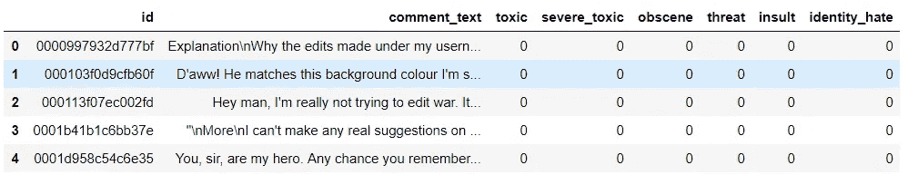

为了进行我们的分析，我们将根据标签分离我们的语料库。我们将简要地看看不同标签在数据库中的分布，然后看看这些子集本身，它们对应于上面列出的标签。

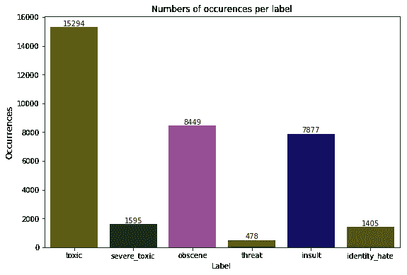

可以看出，毒性评论的语料库是最大的，并且训练语料库中大约 10%的评论具有该标签，而威胁性评论的语料库较小。然而，这并不意味着 25%的评论是恶意的，因为一个评论可以有几个标签。我们可以看到，不到 5%的评论只有一个标签，大约 7%的恶意评论至少有两个标签。

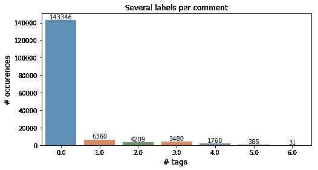

为了创建相关指标来改进我们的模型，我们将关注我们语料库的内在特征，以我们对不同语料库的假设词汇和语法分布的先入之见为指导。我们会问自己，是否有重复出现的模式可以作为标志来丰富我们的模型。我们将定义一些属于每个评论的统计特征。

# 统计分析

在开始分析这些文本统计数据之前，我假设制作这些统计数据会很有趣，可以将这些数据与我的预想进行比较。也就是说，我假设(根据经验)一个意图恶意的评论，会有更高比例的大写单词，更不发达的词汇和更多数量的感叹号。带着这些想法，我计算了一些变量的中值，并把它们放在同一个刻度上，为了图的可读性，我没有取所有的变量，所以我保留了我最感兴趣的变量。我用感兴趣的变量创建了第一个雷达图，以获得我的语料库之间的相关标志。这里的形状比已经标准化的值更重要(即，变量已经被转换以使它们的平均值集中在 0 上，它们的方差集中在 1 上)，以获得变量之间一致的图形。

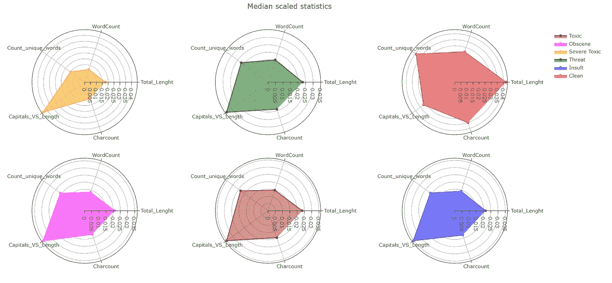

因此，在这张图上我们清楚地看到，我的一些先入之见是正确的。与没有恶意的评论分布相比，大写单词与句子长度的比率是显而易见的。我们还注意到，没有不良意图的评论，有更高数量的独特词，更多的句子和更长的句子。这证实了不怀好意的评论可能提供了不太丰富的词汇，我们稍后将试图证实这一假设。另一方面，大多数评论差
有类似的分布，除了严重中毒的语料库，这是这种词汇贫乏的一个案例。

此外，真实数值显示，平均而言，恶意评论中感叹号的数量是合规评论中感叹号数量的十倍。还有一种不太发达的标点符号。在不符合的语料库中，句子的长度缩短了 20%,大写字母的单词数平均为 43 个大写字母，是符合的评论的 14 个的 2.5 倍。与平均句子长度相关，在不符合的评论中，平均 11%的单词是大写字母，而在符合的评论中，平均只有 4%的单词是大写字母。基于“独特”词的数量的词汇贫乏也是如此，也就是说，在这种类型的语料库中，对于平均 33 个独特的词，不同于其他词的词汇贫乏是 1.5 倍，而在兼容的语料库中是大约 50 个。我们可以问自己一些关于词汇贫乏的更深刻的问题，让我们看看单词唯一百分比更低的评论±30%。

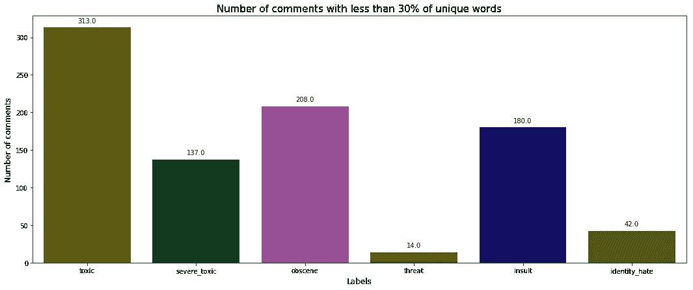

这些大多是有害的评论，如果我们查看细节，我们会发现这些
评论通常是“垃圾邮件”。这个信息对我们的模型很有意义，我们将定义一个垃圾邮件指示器。

在第二部分中，我们将在文本数据上使用词性标注器(一种定位属于语料库中每个单词的语法类别的算法),以便以与之前相同的方式提取信息。我认为，恶意评论肯定会呈现出与符合语料库不同的词汇和/或语法结构。我使用了一个由不符合任何标签的评论组成的语料库和一个仅由不存在任何问题的评论组成的语料库。

# 语言和语法分析

首先，让我们分开我们的语料库，看看我们的词性标注算法的算法部分。

```
toxic = train[train["toxic"] ==1]
svr_tox = train[train["severe_toxic"] ==1]
identity_hate = train[train["identity_hate"] ==1]
obscene = train[train["obscene"] ==1]
threat = train[train["threat"] ==1]
insult = train[train["insult"] ==1]
clean_com = train.loc[(train['toxic'] == (0)) 
                      & (train['severe_toxic'] == (0))
                      & (train['obscene'] == (0)) 
                      & (train['threat'] == (0))
                      & (train['insult'] == (0))]text_severe_tox = " ".join(svr_tox.comment_text)
text_tox = " ".join(toxic.comment_text)
txxt_identity_hate = " ".join(identity_hate.comment_text)
txxt_obscene = " ".join(obscene.comment_text)
txxt_threat = " ".join(threat.comment_text)
txxt_insult = " ".join(insult.comment_text)
clean_text = " ".join(clean_com.comment_text)
```

感谢`nltk` 库，我们不需要从头开始写所有东西，我们将标记我们的语料库。

```
splitter = Splitter()
#example
print(txxt_threat[:30])
'Hi! I am back again!\nLast warn'
print(splitter.split(txxt_threat[:30]))[['Hi', '!'], ['I', 'am', 'back', 'again', '!'], ['Last', 'warn']]
```

然后，我们将应用我们的词性标注算法。

```
lemmatizer = WordNetLemmatizer()
splitter = Splitter()
lemmatization_using_pos_tagger = LemmatizationWithPOSTagger()
tokens = splitter.split(txxt_threat)
treat = lemmatization_using_pos_tagger.pos_tag(tokens)
print(treat[:30])[[('Hi', 'Hi', 'NN'), ('!', '!', '.')],
 [('I', 'I', 'PRP'),
  ('am', 'be', 'VBP'),
  ('back', 'back', 'RB'),
  ('again', 'again', 'RB'),
  ('!', '!', '.')],
 [('Last', 'Last', 'JJ'), ('warning', 'warning', 'NN'), ('!', '!', '.')],
```

我们可以看到，我们的算法做了三件事，它标记化，它引理化(给定一个转换的动词，它返回动词的词根)，他给我们标记的动词/语法参考。然后，给定已标注语料库，我们可以突出显示语料库的动词/语法分布。我们将对每个标签进行计数，并对它们进行加权。

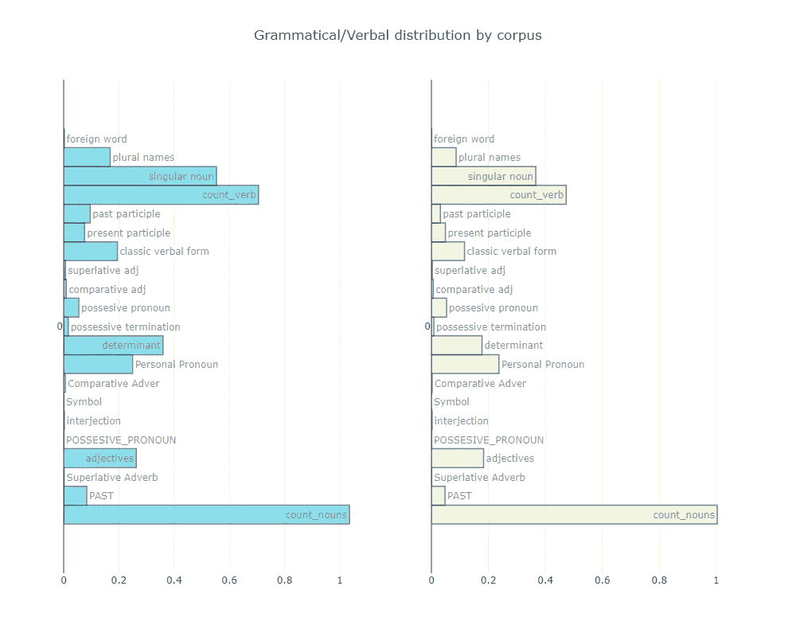

令我惊讶的是，我们注意到这两个语料库非常相似，它们在常规语料库中使用过去分词和决定因素的比率上有所不同，并且通常常规语料库的语法丰富度更高。唯一有很大不同的一点是，在语料库的句子语法结构中，人称代词的使用。这只证实了我的一个假设，而否定了其他的。

因此，我们将特别关注这些代词，在这种情况下，它们将表征恶意评论的语料库。现在，我们将对来自词性标注的数据进行更微观的分析。根据这个图表，我想看看子标签中最常用的词会很有趣:动词、名字、人名和外来词。

让我们创建一个大字典，它将包含我们研究中感兴趣的几个变量。

然后，我们将定义一个函数，找出这些动词形式中最常见的 25 个单词，并绘制出来。

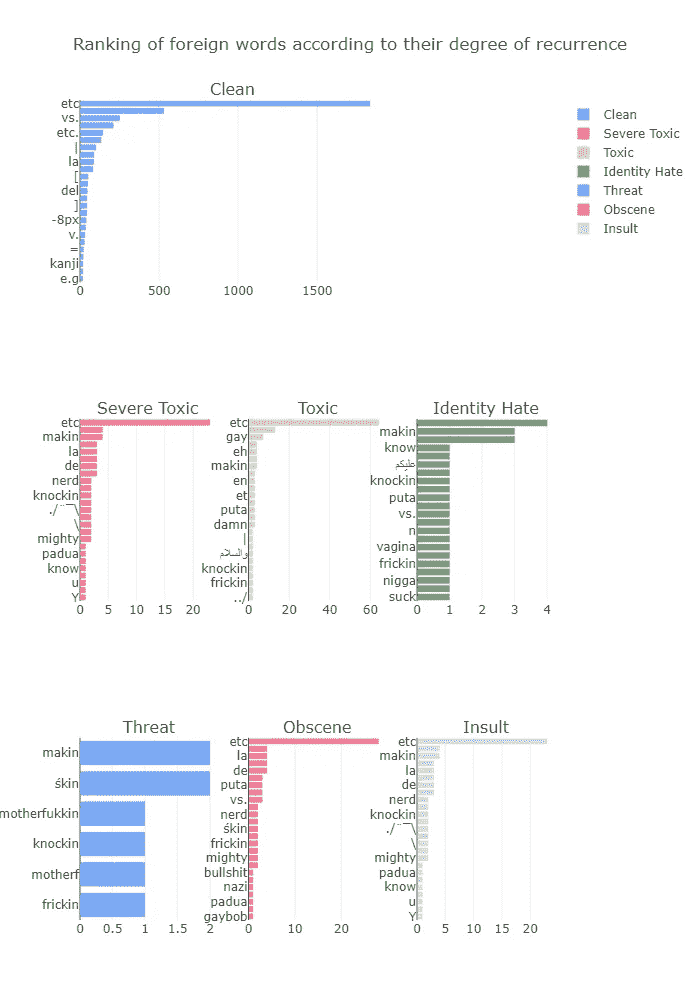

对外来词的*微观*分析给了我们更多兴趣点的一瞥，我们看到了几个东西，与语料库相关联的词，将它们集成为变量会很有趣，例如“puta，Nazi，mother，fukkin”。还有一些符号是作为重复出现的单词出现的，说明上面创建的符号数量的文本统计一定会对以后的算法产生影响。

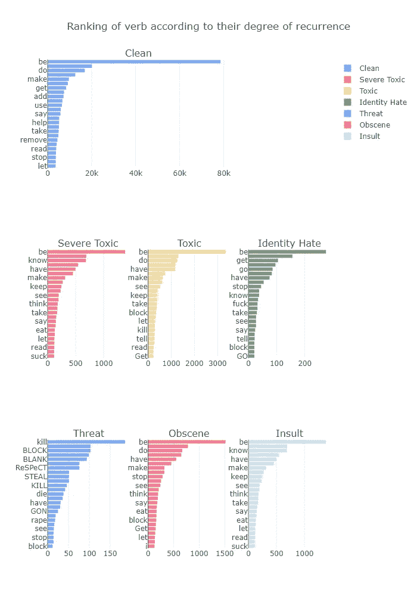

在所有语料库中出现频率最高的动词中，只有 *kill* 和 *suck* 突出，否则动词出现在整个语料库中基本上是相同的，这并没有给我们提供非常有趣的信息，但仍然可以证实我对语料库之间动词差异的先入为主的看法是错误的。

我们将对此标签分析进行重复数据删除，以找到适合最终模型的相关变量。我们将直接分析二元模型，三元模型。

# 单|双|三元分析

为此，我们将使用`[TFIDF](https://scikit-learn.org/stable/modules/generated/sklearn.feature_extraction.text.TfidfVectorizer.html)`方法构建一个单词矩阵，通过限制 ngram 的数量并引入`[Logistic Regression](https://en.wikipedia.org/wiki/Logistic_regression)` 来查看变量的重要性。

分数越高，特征就越重要(我按毒性值排序，这意味着第一个词属于排序的标签越高)

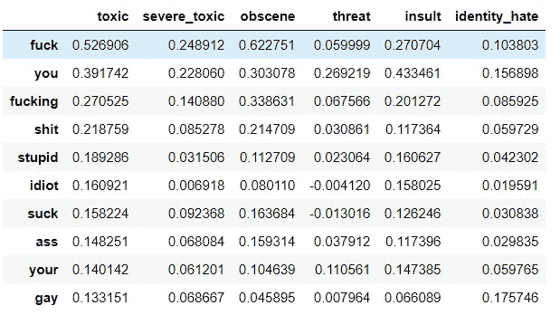

例如，在评论中出现“他妈的”这个词会增加 52%的属于有毒标签的概率，而“你”对整个语料库的强烈影响在于，它是作为威胁标签的单字的主要触发器。

```
var_imp = get_feature_importances(model, analyzer='word', ngram=2, ngram2 =2, lowercase=True)
var_imp.head(10)
```

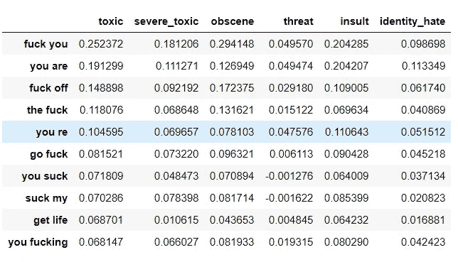

在二元语法分析中，我们总是发现单词“fuck”，有趣的是，我们发现我们的人称代词在标签分析中是有区别的。因此，我们可以看到，它们通常是由“滚开”组成的侮辱，或者与“未来”的人身伤害“你是”区分开来。然而，我们注意到大框架在模型中已经不那么重要了。

```
var_imp = get_feature_importances(model, analyzer='word', ngram=3, ngram2 =3, lowercase=True)
var_imp.head(10)
```

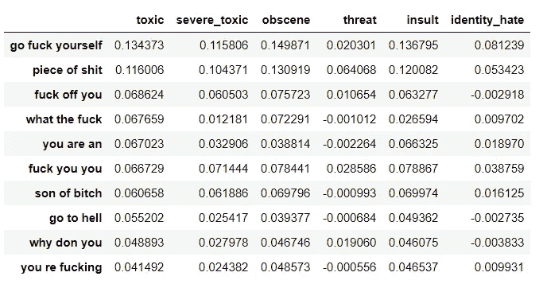

通过向三元组发展，我们注意到你的优势，三元组中的重要词主要是单词和双词的延续。有趣的是，在术语频率中发现的重复出现的单词不一定是对影响语料库的概率具有最大影响的单词，这可能是由于在文档中出现的频率较低。

我们的整个分析将允许我们创建新的训练变量，我认为这些变量将对我们的模型产生重大影响。因此，我们将首先仅使用文本作为变量来对我们的数据进行建模，我们将用文本分析的行话创建一个`[Bag of Word](https://en.wikipedia.org/wiki/Bag-of-words_model)` ，并将其用作我们的分类器的训练基础。这个矩阵是以这样的方式构建的，单词变成列，评论 id 是行，每行由 0 或 1 组成，这是单词存在的指示符，所以我们面对的是一个稀疏矩阵。然后，我们将使用我们的文本知识来提高对我们的分类器的理解，并看看这对我们的模型是否有真正的影响。

并用作我们的分类器的训练基础。这个矩阵是以这样的方式构建的，单词变成列，评论 id 是行，每行由 0 或 1 组成，这是单词存在的指示符，所以我们面对的是一个稀疏矩阵。然后，我们将使用我们的文本知识来提高对我们的分类器的理解，并看看这对我们的模型是否有真正的影响。

让我们定义我们在分析过程中发现的特征，第一个是本文顶部计算的统计特征，然后我们计算一些词性标记的特征，最后是通过一元二分三元组分析的一些特征。

```
for dframe in tqdm([train, test]) : 
    regex_features(dframe)
```

然后我们将创建一个没有特征工程的矩阵和另一个有特征工程的矩阵

因此，我们将我们的算法应用于我们的两个矩阵，并计算模型的准确率。首先，没有特征工程的模型。

```
terms = vectorizer.get_feature_names()
var_imp = pd.DataFrame(index=terms)
for label in lab:
    print('... Processing {}'.format(label))
    y = sample_train[label].values
    classifier = LogisticRegression()
    classifier.fit(train_text_matrix, y)
    y_pred_X = classifier.predict(test_test_matrix)
    print('Valid Accuracy is {}'.format(accuracy_score(y, y_pred_X)))
    var_imp[label] =  np.sqrt(scaler.var_) * classifier.coef_[0]

var_imp = var_imp.sort_values('toxic', ascending=False)
```

如果没有特征工程，结果如下:

```
Toxic | Obscene | Identity Hate | Severe Toxic | Insult 
79.7  | 88.9    | 98.7          |  98.5        | 91.9
```

使用特征工程:

```
Toxic | Obscene | Identity Hate | Severe Toxic | Insult 
89.3  | 83.9    | 99.6          |  98.7        | 94.3
```

可以看出，具有研究变量的模型表现得更好。我们可以看到，该算法对不可忽略的有毒标签的预测高达 9 分以上。这意味着在整个语料库中 9.5%的标记为有毒的评论中，即大约 15，000 条评论中，预测 89.3%的标签而不出错意味着大约 13，500 条评论将被很好地预测，相比之下，在没有文本分析的情况下应用的算法中只有不到 12，000 条评论，即需要避免 1500 条额外的有毒评论。这种新算法在所有标签上执行，并改进了对某些已经非常好的标签的检测，例如仇恨语料库，它仍然获得一个点并接近完美的预测。

我们现在将更精确地查看我们的研究的影响，通过检查我们的逻辑回归系数，我们可以确定从最强到最弱对我们的模型有最大影响的变量。下表总结了影响给定标签从 0 到 1 的评论的每个变量(单词)的能力。也就是说，这些单词在句子中的存在将对算法执行的标注产生累积触发效应。

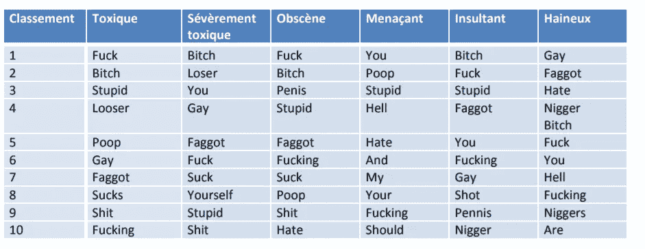

Ranking

那么使用特征工程，特征的重要性就变成了:

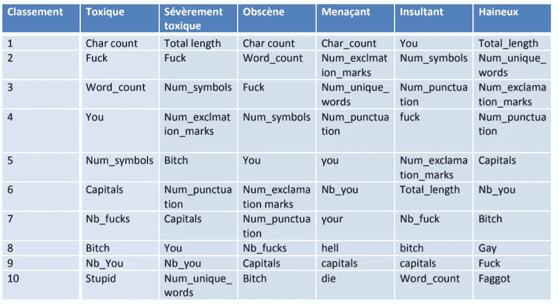

Ranking

总之，我们可以说，对文本数据的深入分析代表了模型学习中的一个重大挑战，并为我们的数据集带来了一个新的维度。一方面，它可以让你在我们的数据中发现更多，并肯定或否定先入之见。另一个优点是可以从对训练和验证数据的文本分析中生成这些指标，另一方面，这项研究向我们证明了所确定的指标与建模目的相关。