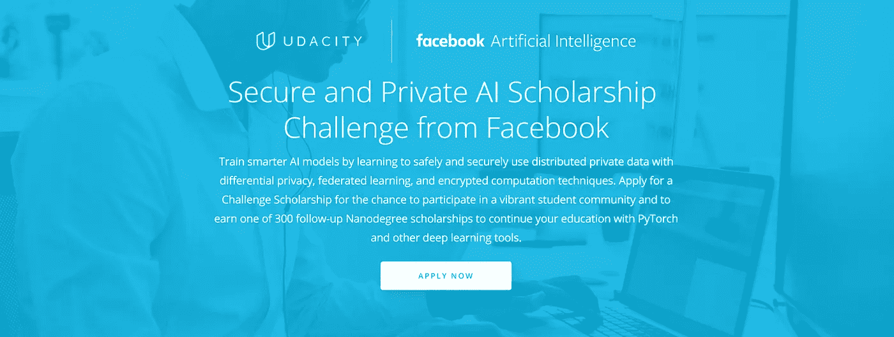
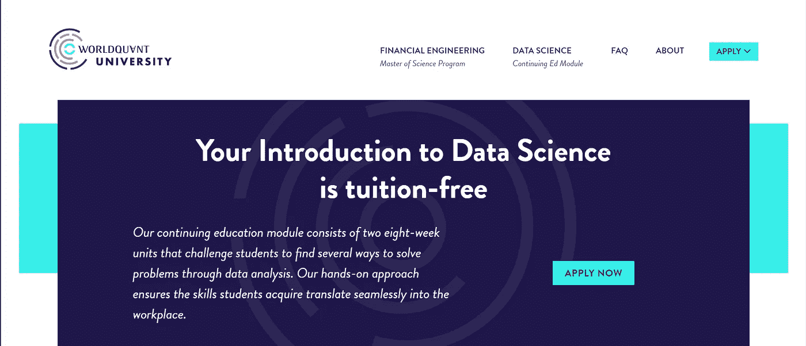
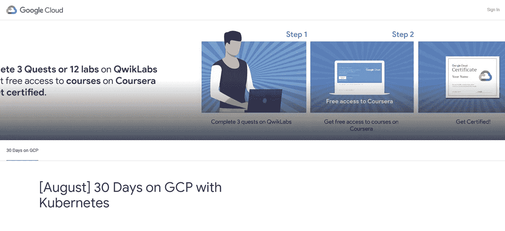

# 我如何利用奖学金和免费学习来学习最新技能

> 原文：<https://towardsdatascience.com/how-i-leveraged-scholarships-and-free-learnings-to-learn-latest-skills-5ad26228bb22?source=collection_archive---------12----------------------->

## 你也可以！

> 任何停止学习的人都老了，不管是三十岁还是八十岁——亨利·福特。

T2:如果你是科技界的名人，这一点尤其正确。几个月前，我完成了我的学位考试，和我一样，我相信你们中的许多人一定有同样的感受——这不是学习的终点；这只是开始。

> 在这个博客里，我分享了我的学习之旅，贴出了一个传统的大学学位，很少有奖学金&免费学习(还有链接+技巧)，你也可以访问它来提升自己的技能。事实上，当我在开始我的旅程三个月后写这篇博客的时候，我的学习追求还没有完成，它已经远远超出了头脑可以伸展的范围，感谢所有的机会！

# 安全和私人人工智能挑战奖学金由脸书人工智能和乌达城

> 收到 Udacity 的邮件让我兴奋不已，因为我被选中参加这个挑战课程，我确实花了一些时间来摆脱我的“*时刻*”(准确地说是几天。)

## 程序的一般演练—

> 挑战课程分为两个阶段，从第一阶段中选出的参与者有机会进入第二阶段。下面提到的细节会让你对第一阶段有所了解。第二阶段的结果将于 9 月公布。

1.  该课程历时 3 个月，选定的参与者有机会学习如何将隐私保护工具和技术应用于深度学习，以便您可以利用 Pytorch(脸书的深度学习框架)解决更困难的问题，并创建更智能、更有效的人工智能模型。
2.  学生们有机会进入 Udacity 充满活力的学生社区，并有机会参与他们的各种社区活动，如#60DaysofUdacity，在这里你可以连续 60 天发布你的学习成果，以及#ama_sessions(向我提问会话)，Project Showcase Challenge 等。
3.  人们也可以选择参加这些# UdacityFacebookScholars 私人举办的竞赛，如黑客马拉松、博客写作竞赛、智力竞赛等。符合比赛的语境。
4.  被选中的 300 名参与者将有机会免费获得 Udacity 的深度学习或计算机视觉纳米学位，并获得证书！🎁

***虽然挑战赛第一阶段的报名已经截止(早在 5 月份)，但您可以在这里访问免费课程—***[***https://www.udacity.com/course/secure-and-private-ai-ud 185***](https://www.udacity.com/course/secure-and-private-ai--ud185)

***如果你对 Udacity 的这些奖学金挑战感兴趣，请在这里报名通知—***[***【https://www.udacity.com/scholarships】***](https://www.udacity.com/scholarships)

> 更新:我已经被选为安全和私人人工智能挑战的获胜者，现在将继续深度学习纳米学位！

# WorldQuant 大学的数据科学

> 我选择的第二个学位课程是 WorldQuant 大学的数据科学学位课程。它有一个课堂外的方法来教授数据科学，无论你是初学者还是想增加你的知识的人，这个课程都是继续学习的完美选择。

## 一般演练—

1.  本课程由两个模块组成，根据您在第一个模块中的表现，您将被选择参加第二个模块。
2.  要被选中参加学位课程，你可以填写表格，并根据你的 Python 和数学基础知识回答问题。
3.  一旦选中，你就可以开始你的免费课程了！关于该计划的所有其他详细信息将通过您的电子邮件地址与您分享。
4.  他们每年开 4 次会。
5.  如果您愿意申请 9 月 30 日开始的下一期课程，请在 9 月 9 日前申请。快点！

***此处适用—***[***https://wqu-apply.thedataincubator.com/***](https://wqu-apply.thedataincubator.com/)

***你也可以在这里查看他们的金融工程模块—***[***https://wqu.org/programs/mscfe***](https://wqu.org/programs/mscfe)

# 谷歌云 30 天

## 一般演练—

> 使用谷歌云平台**免费了解谷歌云架构！**

1.  你必须在每个月底之前完成 3 个任务(注册后你会收到一封关于这些细节的邮件。)
2.  完成后，你可以期待——得到谷歌开发人员的认可，得到酷酷的 schwags。
3.  获得 1 个月免费参加 [Coursera 的 ML GCP 专业化认证课程](https://www.coursera.org/specializations/machine-learning-tensorflow-gcp)。
4.  完成 Coursera 课程后，获得 [GCP 认证](https://cloud.google.com/certification/cloud-engineer)的折扣。

***敬请关注即将到来的 30 天 GCP:***[***【bit.ly/30daysongcp】***](http://www.bit.ly/30daysongcp)

***跟随***[***@ Google devsin***](https://twitter.com/GoogleDevsIN)***进行全部更新！***

## 一般常见问题和提示

1.  因为课程的费用是包括在内的，所以你需要投入大量的时间来彻底地学习所有的东西，并且参与他们的社区，如果有的话。
2.  这些课程不限制任何年龄组或背景的注册，只要你的基础清楚，或者你可以从他们社区的其他参与者那里寻求帮助，你都可以申请。
3.  每门课程都有专属优惠——有了 WorldQuant，你可以将课程推迟到下一节课，有了 Udacity，你可以接触到社区参与者共享的大量机会。✌

> 我希望这能帮助任何想学习新东西的人，也许对最新的趋势和技能保持乐观，或者申请一个新的角色——任何理由都是开始的好理由！

# 祝大家学习愉快！👨‍🎓👩‍🎓

> **疑问？** [**把他们引到这里:contact.shubhangijena@gmail.com**](http://contact.shubhangijena@gmail.com)
> 
> **在 LinkedIn 上联系我:**[**www.linkedin.com/in/shubhangijena**](http://www.linkedin.com/in/shubhangijena)