# 我如何利用数据科学、机器学习、信用风险和 TALF 贷款在 3 年内获得 37%的年回报率

> 原文：<https://towardsdatascience.com/how-i-made-37-a-yr-in-profits-for-3-yrs-using-data-science-machine-learning-and-talf-loans-6fe8c133e3ec?source=collection_archive---------7----------------------->

在本文中，我将继续我的一系列数据科学的实际应用。这次是一个涉及**数据科学、投资管理、保险和金融量化分析**的实际应用，分析固定收益工具中的风险/回报机会。

此练习指的是 2009 年初定期资产贷款工具(或“TALF”)产生的机会。TALF 是一项政府计划，旨在以非常低的利率向合格投资者提供高达 1 万亿美元的贷款，最终目的是在 2008 年金融危机后启动经济。

此处说明的练习数据来自于 2009 年 2 月初 TALF 创建后的普遍市场情况。美联储和美国财政部向合格投资者发放的首批贷款已于 2 月底到位。

为了理解这个机会，一些证券化市场(资产支持证券)和金融危机起源的基本知识是必要的，因此这将在下面解释。如果你想了解更多，在我之前的文章**“使用数据科学的阿尔法一代&定量分析——ABS/TALF】**中讨论了金融危机关键技术要素的大量背景，你绝对应该阅读[(此处为](/alpha-generation-using-data-science-quantitative-analysis-abs-talf-part-1-eade08b075c))**，以获得关于该过程关键要素**的更多知识。事实上，机会的根源在于这些因素:1)世界经济停滞不前，2)世界经济与 ABS 市场的联系。****

# **导致危机的证券化市场有多大？谁是资产支持型证券市场的领导者？**

**从 1985 年成立到 2007 年，美国证券化市场经历了几乎 19%的年增长率，达到约 1.2 万亿美元发行的峰值。图 1 显示了证券化市场的增长及其与利率的关系。**

**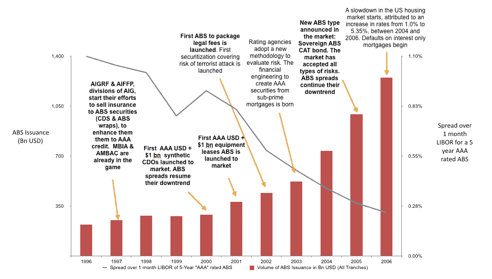**

****Figure 1:** The availability of a growing supply of fixed income instruments backed by uncorrelated asset classes helped bring down financing costs.**

**投资银行的美国定量分析师开发的证券化技术允许生产商获得运营和扩张的廉价融资。事实上，从 1985 年到 2007 年，5 年期 AAA 级 ABS 的平均息差从 120 个基点(1.20%)下降到 20 个基点(0.20%)。**

**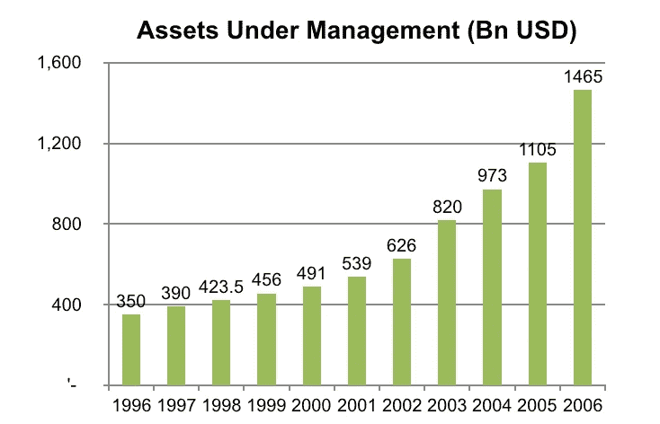**

****Figure 2**: Fueling the purchase of risky pieces of Asset Backed Securities (and other securities) was the staggering amount of assets under management by hedge funds, which grew from USD $350 bn in 1996 to USD $1.4 tr in 2006 (almost 3% of the world’s GDP that year). Source: SAGA Capital, LLC.**

**对冲基金管理的资产(AUM)惊人地增长，从 1997 年的约 3500 亿美元增长到 2006-2007 年超过 1.4 万亿美元的峰值，支撑了这种廉价融资的爆炸式增长(图 2)。对冲基金为向全球市场注入大量廉价资本做出了贡献，因为相当数量的对冲基金通过收购风险较高的部分(通常是评级低于投资级的股票)来支持 ABS 发行。**

**与此同时，对冲基金的 AUM 达到顶峰，证券化交易量在 2006 年达到顶峰，每年发行超过 1 万亿美元。花旗、雷曼兄弟、美国银行、JP 摩根和其他几家美国银行承担了全球 1/3 以上的流量(图 3)。**

**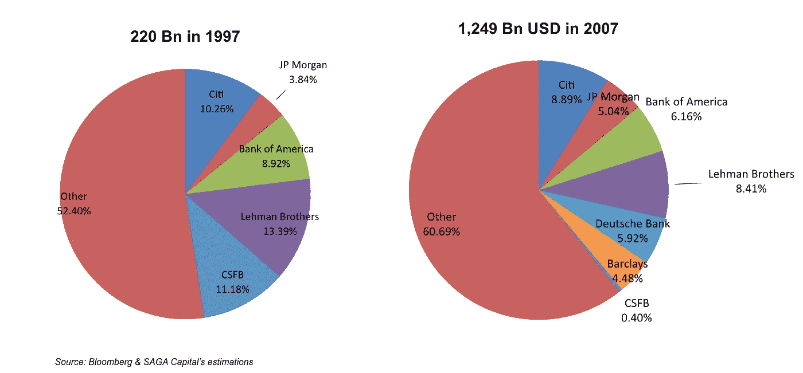**

****Figure 3:** The numbers of dominant banks with the know-how and resources to create ABS grew from less than a dozen in 1996, to more than 50 in 2006\. Still the largest players remained the ones shown in the chart, with Lehman Brothers among the leaders. Source: SAGA Capital, LLC.**

# **资产支持型证券对国内和全球经济有什么影响？**

**从自上而下的角度来看，证券化市场有助于产生新的货币化资产，并间接有助于提高美国和世界其他地区的就业率，以及国内和全球经济的扩张。在美国证券化市场经历增长和创新的同时，普通美国公民的债务负担急剧增加，从 1958 年占个人可支配收入(PDI)的 50.4%增加到乔治·w·布什政府时期占 PDI 的 100%以上。**

**在同一时期，美国公民降低了个人储蓄率，以支持更高的消费支出，从罗纳德·里根政府时期 PDI 的 11.20%降至乔治·w·布什政府时期的 0.25%。**

**美国消费者支出在世界经济中的重要性及其与美国 GDP 的关系并不为人所知。2008 年，美国经济是迄今为止世界上最大的经济体，美国消费者支出占美国 GDP 的 70%。为了了解它有多重要，图 4 中的图表显示了美国消费者支出与几个国家 GDP 的对比。**

**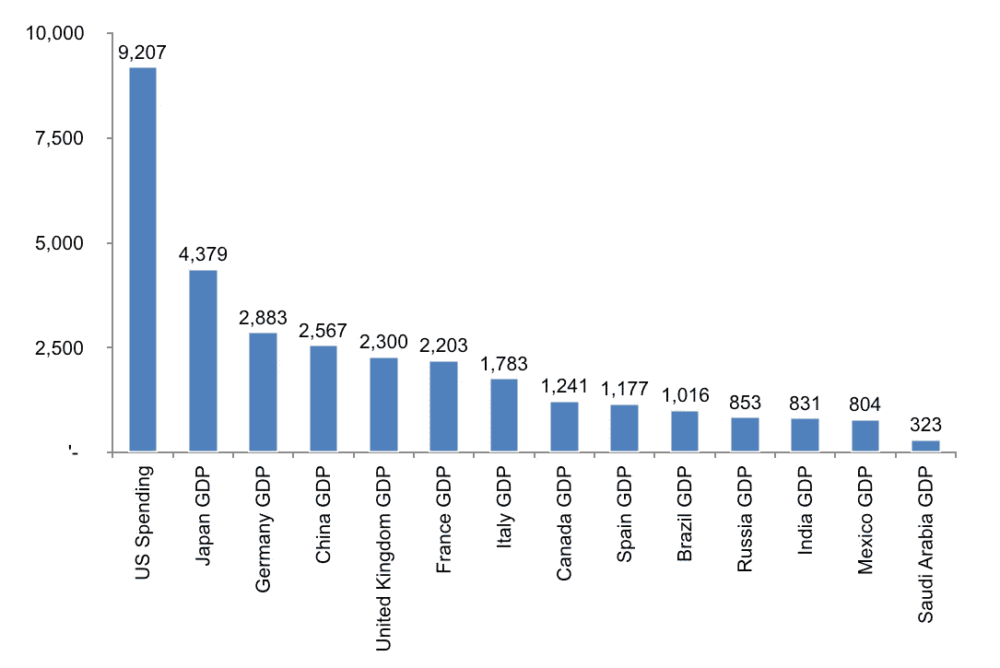**

****Figure 4**: Top GPD’s (2007), in billions of USD vs just one of the components of US GDP: consumer spending. Source: SAGA Capital, LLC.**

**在危机前的 15 年里，美国经历的宽松信贷市场刺激了美国和世界其他地区的大部分 GDP 增长，这是一种我解释为图 5 所示的循环。美国消费者支出推动的工业增长对全球市场的公司利润产生了直接影响，事实上现有的每一家股票交易所的市值增长就是证明。**

**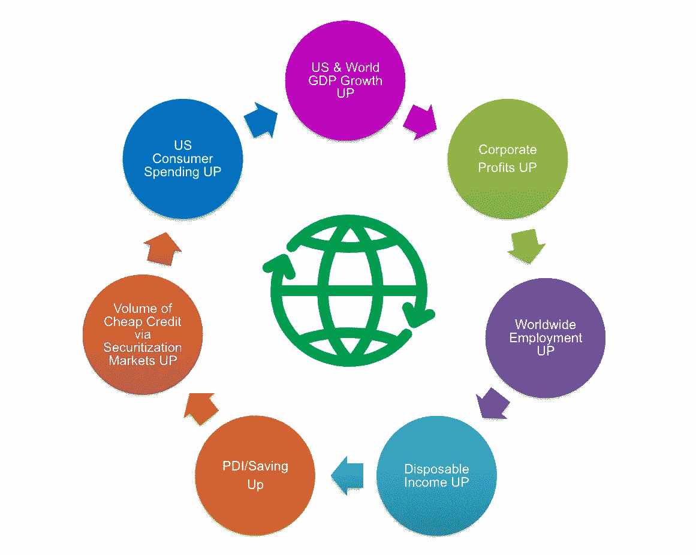**

****Figure 5:** US Consumer Spending & Securitization fueling the world’s economic growth. Source: SAGA Capital, LLC.**

> **美国消费者通过信用卡或即时互联网批准的房屋净值贷款获得的简单、随时可用的信贷，鼓励消费者减少储蓄，增加消费，并通过购买新房、汽车、更好的教育和其他商品和服务来提高生活质量。**

**在 2007 年中期，证券化市场中一种急剧增长的资产类别开始显示出问题的迹象。该资产类别是次级抵押贷款，这种贷款在一些投资银行、养老基金和对冲基金中非常受欢迎，因为在证券化中，它的一些部分被认为风险低，回报诱人。**

**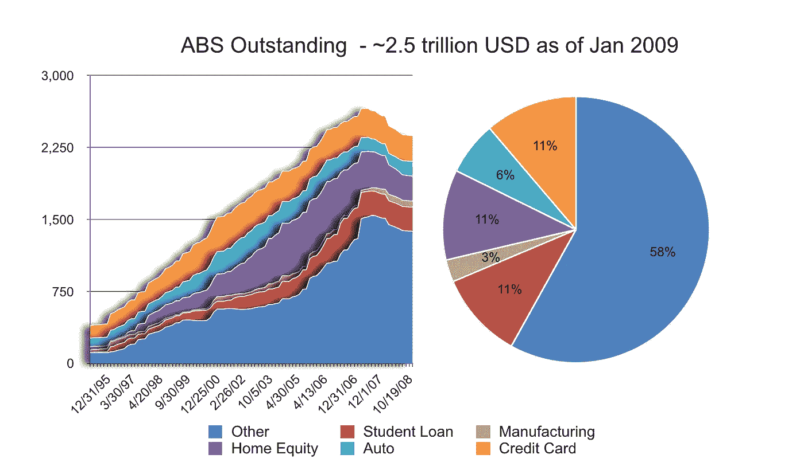**

****Figure 6:** ABS Outstanding as of 2009\. Source: Federal Reserve Bank of Chicago**

**图 6 显示了从 1995 年到 2008 年末未偿资产支持证券的增长情况。我们可以清楚地看到，“其他”和“房屋净值”占总市场的 2/3 以上。**

**“其他”类别包括衍生工具，如 ABS of ABS、CDO、CDOs squared 等。一旦某个特定资产类别出现问题，包含该资产类别的资产支持证券就会出现问题，包含该资产的资产支持证券也会出现问题。**

**下图 7 显示，典型的 3 年期信用卡 AAA 级证券化的利差从 2007 年初的约 0.2%高于 LIBOR，上升至 2009 年 12 月的近 6%。同样，市场上的证券化交易量从 2006 年的 1.2 万亿美元下降到 2009 年第一季度的不到 300 亿美元，与峰值相比下降了 98%。**

> **两家美国金融机构的问题导致了资产支持型证券利差的增加:1)美国第五大银行贝尔斯登，和 2)第四大银行雷曼兄弟。这两家公司都拥有资产支持型证券的自有资本，此外还大量参与了全球各类证券化产品的创建**

**这种可用于融资的资金的急剧减少及其相关的融资成本的增加造成了全球金融僵局，需要当局加以解决。**

**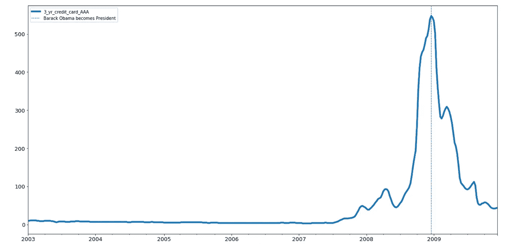**

****Figure 7**: Spreads for AAA rated credit card ABS (as well as all other ABS) skyrocketed in late 2008 and peaked as Barack Obama became President of the US. Issuance of credit card ABS were fueling the domestic and global economies. Source: SAGA Capital, LLC**

**为了启动国内经济，并试图扭转其正在经历的普遍趋势，两项新计划开始实施:**1)TARP 或问题资产救助计划**，在老布什政府的最后几天实施，以及**2)TALF 或定期资产贷款工具计划**，在奥巴马总统就职几天后由奥巴马政府宣布。**

> **问题资产救助计划实质上是对所有人的救助，除了雷曼兄弟，这是布什政府设计的。TALF 是奥巴马政府设计的美国经济再激活计划，但是它对接受 TARP 救助的机构有一个固有的第 22 条军规。**

# **美联储启动了经济**

**2008 年 12 月 15 日，巴拉克·奥巴马宣誓就任美国总统。2009 年 2 月 2 日，美国美联储宣布了 TALF 的主贷款和担保协议，概述了该计划的规则。**

**尽管在布什政府执政的最后几天向美国银行系统注入了大量资金，但消费者贷款或支出并没有增加。**

**奥巴马政府时期的美国美联储和财政部认识到，重振 ABS 市场对于恢复消费者信贷流动至关重要。因此，美联储和财政部推出了 TALF 计划——一项 1 万亿美元的计划，旨在吸引投资者购买由特定资产类别支持的传统和新发行的 AAA 级证券化产品。**

**通过为投资者的购买提供大部分融资，美联储和财政部希望对 ABS 的新需求将压低发行银行和金融公司的信用利差，并鼓励投资者购买，促进贷款的进一步证券化。反过来，这会让更多的消费者以更低的利率获得更多的贷款。**

**TALF 计划提供了购买合格债券所需的高达 95%的资金，利率(固定或浮动)为 1-3 年期 LIBOR 加 1%，最低贷款额为 1000 万美元。**

**TALF 计划通过提供真正的无追索权贷款，提高了投资者的风险回报水平。因此，实质性的杠杆作用是可能的，从而大大提高了潜在回报。损失没有被杠杆化，因为这些是真正的无追索权贷款，不需要提交额外的抵押品或强制赎回抵押品。**

**为了启动这一流程，一家符合美国政府要求的美国投资公司(无论是新成立的还是现有的)必须在一级交易商处开立账户，并确定投资者想要购买的合格债券。**

# **TALF 采购走查**

**为了理解当时程序的逻辑，让我们来看一个假设的购买。**

**首先，让我们假设我们回到了 2009 年初宣布 TALF 计划的第一周。让我们假设高盛公司的一个假设的固定收益投资组合经理(PM)检查他的彭博屏幕，看到类似下表的东西，在数以千计的 TALF 合格证券的第一页下面:**

**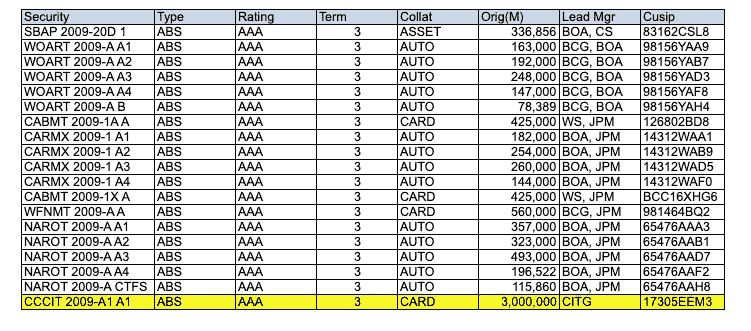**

**A few of TALF eligible securities. Source: SAGA Capital**

**高盛项目经理认为，花旗集团发行的价值 30 亿美元的 CCCIT 2009-A1 A1 AAA 信用卡贷款证券化是一个值得购买的好债券。检查伦敦银行同业拆放利率和利差的时候，他可能看到过:**

**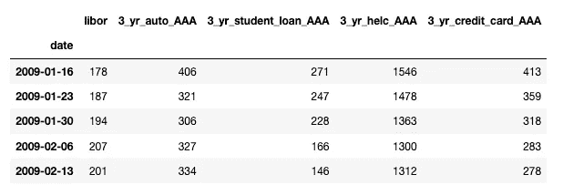**

**ABS spreads**

**高盛的总理决定购买价值 1 亿美元的债券，期望他的 1 亿美元投资在 3 年内获得大约 **4.79%** (278bps + 201bps)的年回报率。对于固定收益投资组合经理来说，这还不错。**

**对冲基金经理呢？3 年 4.79%的年回报率不是对冲基金寻求的那种回报，尤其是当最低回报率超过 5%的情况并不少见的时候。**

**但 TALF 杠杆 ***彻底改变了风险的分配*** ，让低收益的 AAA 级 ABS 安全成为最好的游戏，也是华尔街最不为人知的游戏。**

**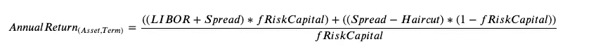**

**After checking all the documentation, requirements, etc., the expected annual returns under no loss scenario when buying TALF eligible securities could be summarized in the above formula.**

**继续我们假设的高盛 PM，他要求他的 Jr .分析师获得 TALF 杠杆的当前列表，并发现对于 3 年期信用卡 AAA ABS，美联储通过 TALF 可以以 LIBOR 负 100 个基点的利率，以 1000 万美元的最低投资，为他承诺的每 6 美分贷出 94 美分。**

**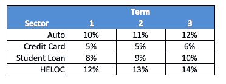**

**Actual TALF leverage for eligible securities in February 2009**

**应用上面的公式，项目经理看到，在接下来的 3 年中，购买该债券的预期年回报率(在零违约情况下)从 **4.79%变为 32.67%** ！**

```
((((2.01% + 2.78%)*0.06) + ((2.78%-1.00%)*(0.94)))/0.06) = 32.67%
```

**现在，这种回报甚至对那些连 ABS 都不看的多空对冲基金来说也很有趣。但是，如果对冲基金度过了危机，他们最不想做的事情就是将基金锁定在 3 年的买入并持有策略中。**

**此外，在多空对冲基金中模拟股票市场运动和/或进行高频算法交易的定量分析师往往不太了解证券化部分、信用迁移模型、二项式扩展模型、copulas 等。他们迷路了，很高兴他们还有工作。“不，谢谢，我过了”可能是他们在偶然遇到机会时的想法。**

**对投资经理来说，TALF 计划最好的部分是，杠杆资本是一种无追索权的贷款，这意味着在违约的情况下，来自美联储的贷款不必偿还！**

**所以，也许利用这个机会的最佳人选是我们假设的高盛(或美国银行，或摩根大通，或任何其他公司)的项目经理。)毕竟他们有知识有资金对吧？**

**不对。由于高盛以及大部分银行业都直接或间接地接受了布什的 TARP 计划的救助，他们被排除在奥巴马的 TALF 计划之外。如果你不知道，布什对高盛的救助计划(通过 AIG 救助)是由时任财政部长和高盛前首席执行官亨利“汉克”保尔森策划的。(几年前，我曾在美国国际集团风险金融部工作过，所以我很了解当时的情况)。**

**因此，实际上，这个机会最初被少数高净值个人、少数了解资产支持型证券并愿意承担风险的对冲基金和家族理财室，以及更少数量的量化分析师(或数据科学家，尽管他们当时不叫这个名字，而是“特殊机会量化分析师”或“风险金融量化分析师”)所利用，他们了解模型，拥有领域专业知识，并集合他们的资源来满足投资要求。**

**在机构方面，太平洋投资管理公司和贝莱德是两个最大的资产管理公司，它们确实充分利用了这个机会(在游戏的后期)，但这是另一回事了。**

# **系统的 TALF 采购计划的预期收益——使用 Python、Pandas、Numpy、SciPy 和 Statsmodels 时间序列分析的蒙特卡罗模拟**

**因此，我们回到 2009 年，让我们想象以下场景:我是一名定量分析师/数据科学家，为一家从未投资过低收益率 ABS 的家族理财室提供建议。**

**家族办公室的投资经理想知道，为什么我认为投资 1 亿美元于 TALF 合格证券是个好主意。为了决定他们是否会为我的想法提供资金，我的模型需要回答以下问题:**

*   **如果家族理财室在 4 周内投入 1 亿美元，预期年回报率的分布是什么？我建议第一周 4000 万美元，第二周 3000 万美元，第三周 2000 万美元，第四周 1000 万美元。**
*   **如果他们承诺用 1 亿美元的资金购买所有债券，而不考虑购买时的利差，那么亏损的概率有多大？**
*   **在 TALF 合格证券中，我们能期待有多少个[堕落天使](https://www.investopedia.com/terms/f/fallenangel.asp)？**
*   **如果我们根据购买时的利差和杠杆来区分购买哪些债券，那么获得超过 5%的最低回报率的可能性有多大？**
*   **假设没有债券违约，这种策略的预期年回报率中值是多少？**
*   **在提议的投资组合中，以基点表示的预期违约是多少？**
*   **家族理财室能指望什么样的平均杠杆？**
*   **ABS 的投资组合的平均买入持有期是多少？**

**我将在本文中回答一些与我的模型在现实生活中的性能有关的最后问题:**

*   **我的利率模型有多符合现实？**
*   **我的模拟相关性表现如何？**

**在回答这些问题之前，我要说的是，该模型的行为符合预期，并且实现了回报，您将在本文的其余部分了解到这一点。这不是一次学术练习，而是一次真实的交易，是的，数千亿美元可以以 LIBOR 负 1%的利率借入 3 年期资金。**

# **系统模型化**

**本文长话短说，我假设 1 年期和 2 年期伦敦银行同业拆放利率与 3 年期伦敦银行同业拆放利率相同，并根据模拟的 3 年期伦敦银行同业拆放利率进行所有计算(保守假设，因为 3 年期利率通常比 1 年期或 2 年期利率更贵)。**

**一年期 ABS 息差等于三年期 ABS 息差减去这两个期限之间的平均历史差异(截至 2009 年 2 月 18 日)。两年期 ABS 息差将是这一差额的一半。**

**整个分析的步骤如下:**

1.  **模拟信用卡、学生贷款、房屋净值信用额度(HELOC)、汽车贷款和伦敦银行同业拆借利率的 N 条相关 3 年期 AAA 利差路径，每周取样，从 TALF 主贷款协议宣布之日开始。**
2.  **从 3 年期价差重新创建 1 年期和 2 年期价差。**
3.  **对于为期 4 周的购买计划的每一周，模拟购买 4 种合格资产中的一种，概率由截至 2009 年 1 月的 ABS 未偿资产分布给出。将美联储折减应用于相应的资产，并使用上面 1 和 2 中计算的资产类别的利差来估计无损失预期回报。**
4.  **模拟债券从最初的 AAA 评级到其他评级和违约状态“D”的迁移。跟踪债券在其生命周期中的信用质量变化。**
5.  **ABS 不进行交易，而是由美联储作为贷款的抵押品持有，直到到期或债券违约。**
6.  **策略是买入并持有，因此一旦在模拟中收购了一项资产，我们就不需要对市场价格波动建模。没有市价标记。**
7.  **展示相关分布回答问题。**

## **训练、测试、分割**

**2000 年至 2010 年的时间序列如下所示:**

**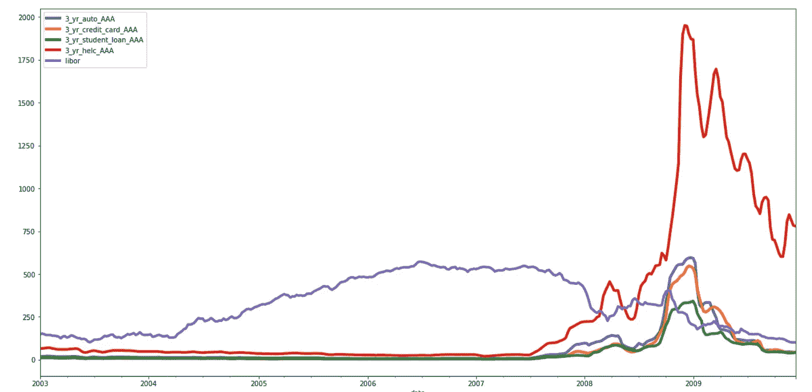**

**我将数据分为两部分:TALF 公告之前(用于培训)和 TALF 公告之后。列车数据是我在 TALF 宣布的时候所能得到的。**

**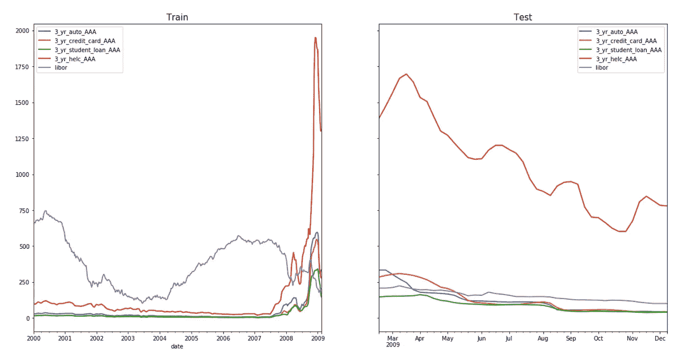**

**危机时期如下。测试阶段从最后一条黑色虚线开始，在奥巴马总统上任后，息差从峰值开始下降后不久。**

**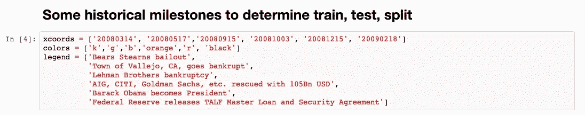******

**Milestones of the financial crisis**

## **均值回归和自相关**

**均值回归是一种假设，即资产价格将趋向于某个长期平均值。这可能会发生在利率、商品、货币等方面。与平均水平的偏差有望恢复到平均值。**

**自相关或串行相关是信号与自身的相关，作为时间延迟的函数。它常用于信号处理中分析函数或一系列数值。**

**以下是汽车贷款、信用卡贷款、学生贷款和 HELC 贷款 AAA 级证券化的 LIBOR 和 3 年期利差的自相关图。**

**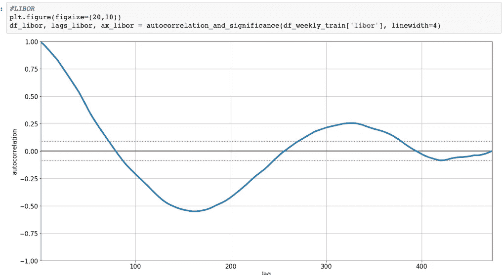**

**Auto correlation for LIBOR rate**

**通过检查伦敦银行同业拆放利率的滞后，我们可以看到有几个滞后具有统计意义的积极和消极的自相关。它们都是基于自身的许多滞后参数来预测未来 LIBOR 利率的良好候选对象。我决定使用一个简单的自回归模型，因为模拟冲击的更复杂的模型可能会显示失真，因为我们已经处于冲击情景中。我可以使用的另一个模型是 [Vasicek 模型](https://en.wikipedia.org/wiki/Vasicek_model)，它包含了诸如逆转速度等因素。**

**通过我决定使用的简单自回归模型，今天的 LIBOR 利率可以设置为某个平均值，加上昨天值(phi)的一部分，再加上一些噪声。对于稳定的进程，phi 值需要在-1 和+1 之间。**

**如果这个过程只是噪声，φ= 0，而如果是一个[](https://en.wikipedia.org/wiki/Random_walk)**的随机游走，φ= 1。如果 phi 为负，该过程显示**均值回复**。如果 phi 为正，过程显示**动量**。****

****下图中，rt 是利率的时间序列。利用上述 LIBOR 利率的自相关数据，我们可以将未来利率定义为其滞后期的函数。第一个是 AR1，第二个是 AR2 等等。****

****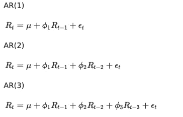****

****以下是 ABS 价差的自相关图:****

********

****Auto-correlation for auto loans and student loans time series****

****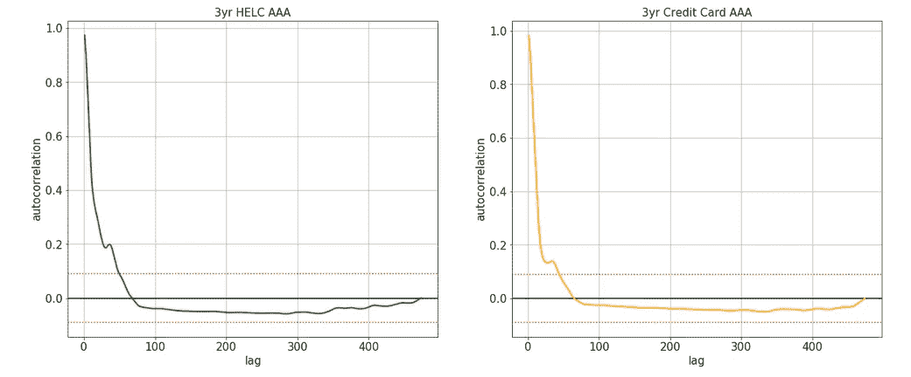****

****Auto-correlation for HELC and credit cards time series****

****生成上述自相关和显著性图的代码在下面的要点中，进一步扩展了 pandas 自相关功能，以便返回数据帧以及显著性约为 1.96 标准差的滞后列表:****

****Auto-correlation and significant lags for time series****

****通过检查 ABS 和 LIBOR 利率的滞后，我们看到有许多滞后我们可以使用，但我们如何避免过度拟合或欠拟合我们的时间序列模型？****

## ****自回归模型的阶数****

****尽管我们可以对所有资产使用所有有效的滞后，但我们可能会过度拟合我们的模型。****

****一个解决方案是拟合许多模型(AR1、AR2、AR3 等。)，测量每个模型的[阿凯克信息准则](https://en.wikipedia.org/wiki/Akaike_information_criterion) (AIC)和/或[贝叶斯信息准则](https://en.wikipedia.org/wiki/Bayesian_information_criterion) (BIC)，并确定 AR 的哪一阶给出我们最低的 BIC 或 AIC。****

****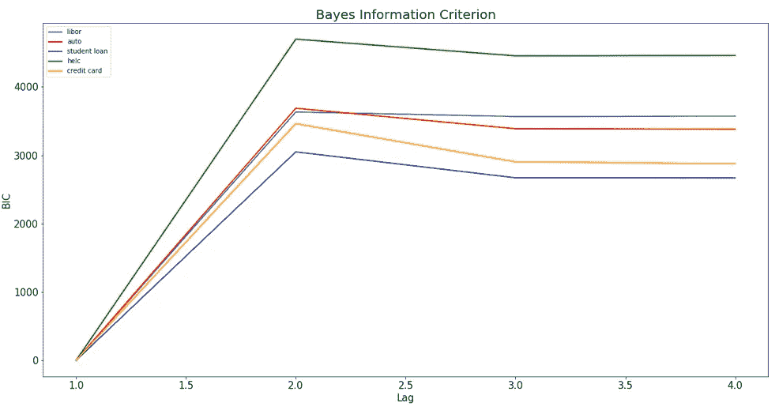****

****BIC for LIBOR and selected AAA ABS spreads****

****根据他们的 AIC 或 BIC，高于 AR1 的模型可能会过度拟合我们的模型，因此，我将使用 AR1 模型模拟所有资产的利率。****

****确定最佳参数的代码如下:****

****一旦我确定了要使用的最佳滞后，我就为所有 ABS 利差和 LIBOR 利率创建了一个 AR 参数字典。****

## ****相关****

****MC 模拟需要生成保持其历史相关性属性的模拟速率。****

****为简单起见，我计算了相同到期日的不同资产类别之间的相关性，并假设，例如，3 年汽车 ABS AAA 利差和 1 年汽车 AAA ABS 利差的相关性为 100%(这与现实生活中的行为在大多数情况下是接近的)。****

****对于多元随机数生成器，我最初使用 scipy 函数[这里使用](https://docs.scipy.org/doc/numpy/reference/generated/numpy.random.multivariate_normal.html)，但是发现使用[乔莱斯基分解](https://en.wikipedia.org/wiki/Cholesky_decomposition)在计算上更有效。****

****我还将生成一个 date_index，它将包含我们分析的所有未来日期，直到我们将购买的模拟债券的潜在最长到期日。****

****代码如下:****

****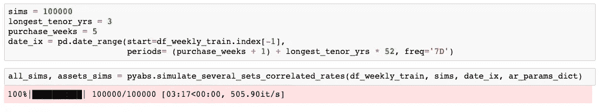****

## ****AAA 级资产在持有期内被降级或违约的概率****

****为了估计这一点，我创建了一个函数，基于 AAA ABS 在一年内的一般历史转移概率定义了一个转移矩阵，不包括抵押贷款。****

****这一 1 年的转换矩阵可用于模拟从任何初始状态(AAA、AA、A、BBB、BB、B、CCC)到任何其他状态加上“D”的转换，使用单状态马尔可夫过程。****

****然后，我们可以通过将 1 年过渡矩阵添加到以时间为参数的递归函数中，来估计给定年限内的过渡概率。有了这个，我们可以在模拟中导出运行函数的许多转移向量，这将帮助我们估计概率。****

****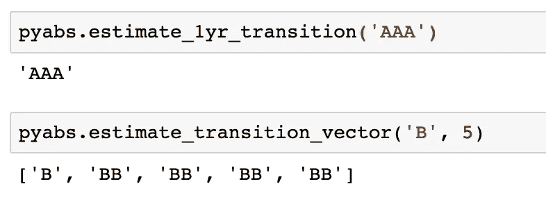****

****pyabs, credit migration estimation****

## ****单一利率情景下的模拟杠杆购买****

****这里的过程如下:利用模拟的和适当相关的 LIBOR 利率和利差情景之一，我们在第一周模拟购买 4 个合格资产类别中的任何一个，以模拟显示的任何普遍市场利率，并利用美联储提供的杠杆作用。****

****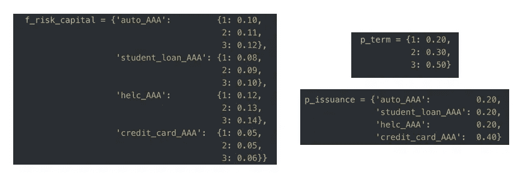****

****TALF leverage per type of ABS as a function of term (f_risk_capital), probabilities of 1, 2, and 3 years issuance (p_term), and probabilities of acquiring each of the asset classes (p_issuance)****

****有了这些模拟市场条件，我们可以估计无损失回报，并决定是否购买。然而，我们不知道我们是否会在这些购买中遭受损失。为了了解这一点，我们需要对违约进行建模，但我们不会将这一知识用于我们的购买决策。我们将只使用预期年回报率和最低预期回报率。****

********

****Example of a run of the simulated purchase program under one of the simulated and properly correlated interest rate and spread scenarios****

****在上面的模拟场景中，在 2009 年 3 月 6 日的第 3 周(指数 2 ),我们可以购买 2012 年 3 月 2 日到期的 1 . 66 亿美元的 AAA 汽车贷款 ABS，仅承诺 2000 万美元的资本和 1 . 46 亿美元的美联储贷款。在这种普遍的市场条件下，我们的预期年回报率为 7.82%。****

****假设最低回报率为 10%，我们就不会购买那种特定的债券。此外，我们模拟的 3 年马尔可夫转移表明，债券在其生命周期内保持 AAA 评级。因此，在这个特定的场景中，我们会购买指数为 0，3 和 4 的债券。这些模拟市场条件将允许我们锁定 2.5 亿美元(25.42%)3 年，1.66 亿美元(63.09%)1 年，1 亿美元(20.46%)1 年。结果是只有 6000 万美元资本的 5 . 16 亿美元投资。****

****这个特定的模拟显示，第一个债券遭受了从 AAA 到 AA 的模拟降级，这可能会轻微影响其在降级之日的市场价格，但这与我们无关，因为 TALF 的购买必须持有至到期，按市场定价不是问题。****

****以下代码生成了一个熊猫 df 字典，您可以将它传递给解决方案数据框来回答您的所有问题:****

****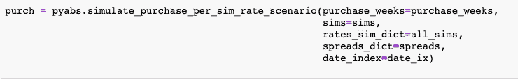********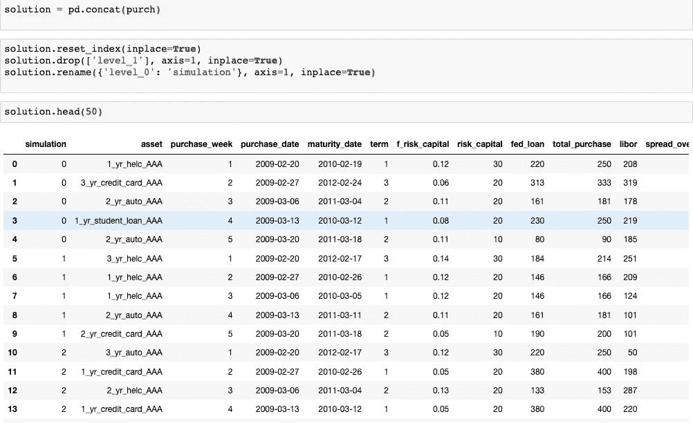****

## ****结果****

****回报及其百分位数的分布:****

*   ****如果我们承诺向购买计划投入 1 亿美元，预期年回报的分布是怎样的？****

****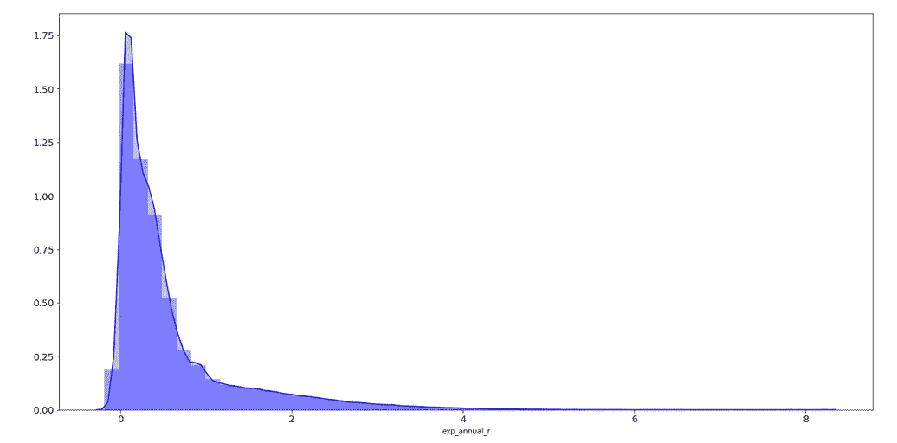****

*   ****如果我们承诺用我们的资本购买每一种债券，而不考虑购买时的利差，那么亏损的概率是多少？****

```
**len(solution[solution['exp_annual_r']<0])/(sims*purchase_weeks)0.049836**
```

*   ****在 TALF 合格证券中，我们能期待有多少堕落天使？(过渡到 BB、B 和 CCC 评级)****

```
**solution['final_rating'].value_counts(normalize='True')

AAA    0.884480
AA     0.101102
A      0.011288
BBB    0.001516
BB     0.000852
B      0.000418
CCC    0.000214
D      0.000130**
```

*   ****如果我们根据购买时的利差和杠杆来区分购买哪些债券，那么获得超过 5%的最低回报率的可能性有多大？****

```
**strategy_df = solution[solution['exp_annual_r']>0.05]
len(strategy_df)/(sims*purchase_weeks)0.881436**
```

*   ****这种策略的无损失年回报率的中位数是多少？****

```
**strategy_df['exp_annual_r'].median()0.37166140387288993**
```

*   ****基点中的预期默认值是多少？****

```
**(strategy_df[strategy_df['final_rating'] == 'D']['total_purchase'].sum()/strategy_df.total_purchase.sum())*100001.2697864542783506**
```

*   ****对于每 1 美元的采购，我们期望投入的平均资本比例是多少？****

```
**strategy_df['risk_capital'].sum()/strategy_df['total_purchase'].sum()0.0854416650602756**
```

*   ****投资组合的平均寿命是多少？****

```
**sum(strategy_df['term']*strategy_df['total_purchase'])/sum(strategy_df['total_purchase'])2.241573279710343**
```

****有了所有这些结果，2009 年 2 月向家族办公室提出的建议是向 TALF 计划投入资金，在不亏损的情况下，预计 2 到 3 年的年回报率为 37%。基本策略是，只有在模拟市场条件下，根据真实定价数据(息差、杠杆和到期日)考虑的债券允许他们获得大于 5%的年回报率时，才进行投资。****

****预期违约被建模为不到 10 个基点，他们可以预期每 8.5 美分的 TALF 合格资产支持证券的多元化投资组合获得约 91.5 美分的杠杆。****

****利率和利差保持在模型的置信区间内。****

## ****我的利率模型有多符合现实？模拟的相关性表现如何？****

****下面你可以看到橙色的实际 3 年信用卡 AAA 利差，绘制在许多模拟路径上，虚线代表中间值、第 25 和第 75 个百分点。****

****虽然购买策略集中在 TALF 的前 4 周，但图表显示了 10 周的结果。实际利率保持在预期范围内。****

****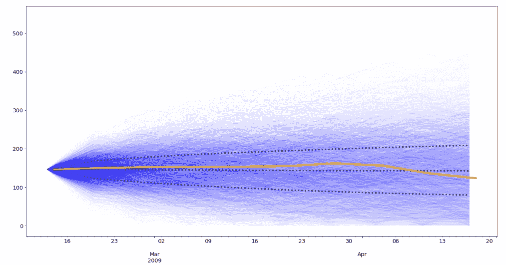****

****Simulated spreads for 3 years AAA student Loans****

****所有其他已实现的比率都接近模型的预期。****

****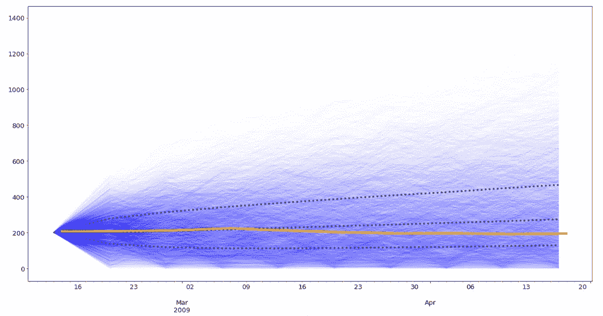****

****Simulated LIBOR rate****

****查看上图的另一种方法是绘制购买计划最后一周的价差分布，并将实际值与 AR1 模拟模型的预期中值进行比较。****

****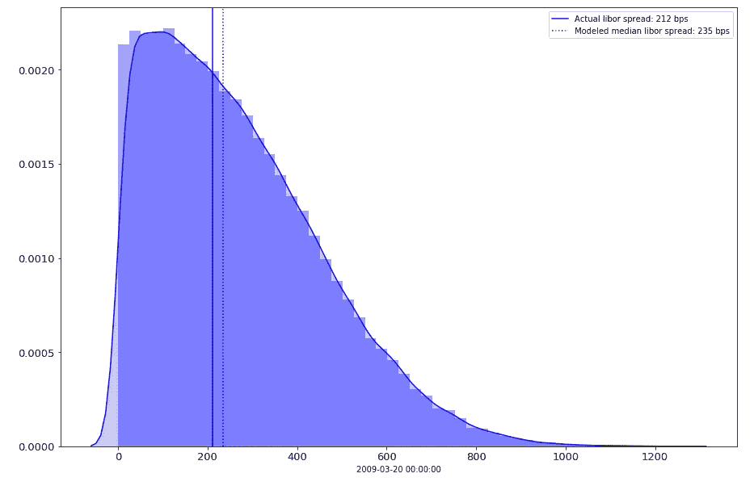****

****LIBOR****

****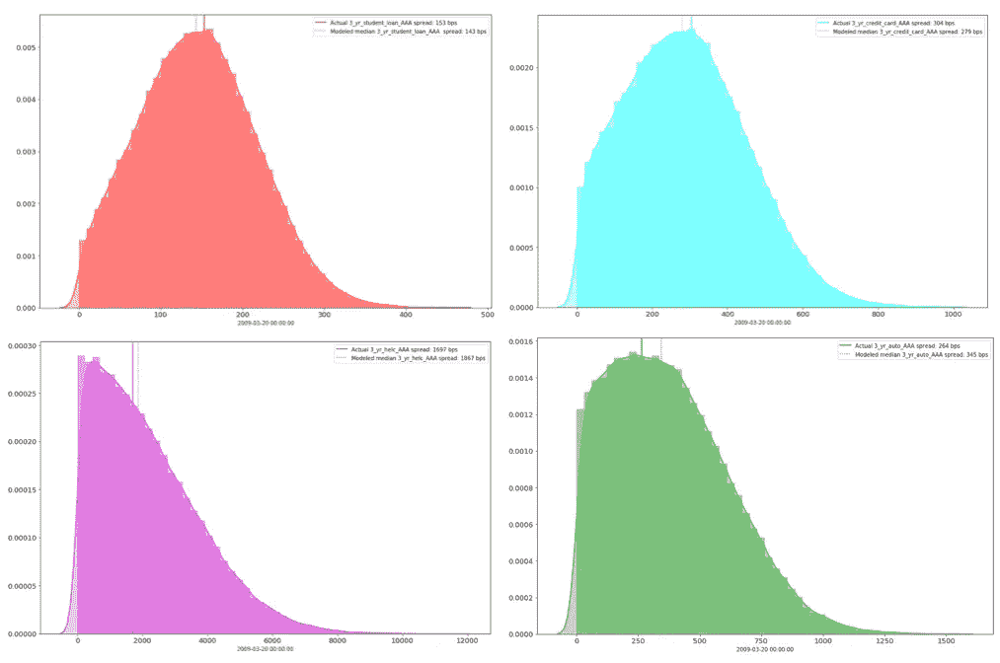****

****student loans, credit card, helc, auto****

****更好的可视化，伦敦银行同业拆放利率预测值变化分布的动画:****

****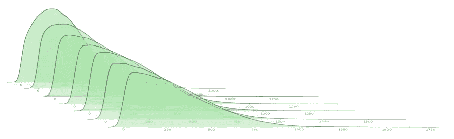****

****Time series: Distribution of forecasted LIBOR rates****

****随着我们预测时间的推移，我们开始看到分布形状的长尾，但这并不影响我们的短期预测。****

****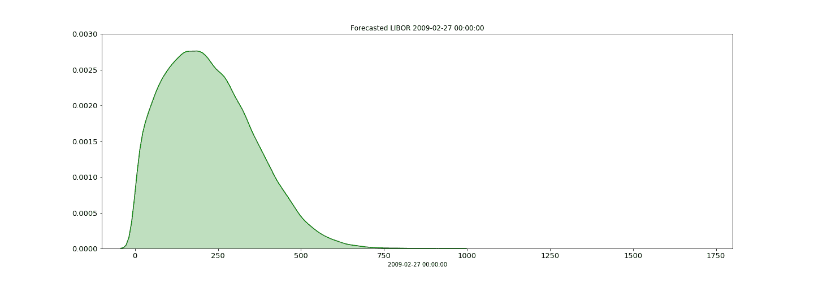****

****Animation showing distribution of expected LIBOR rates, from the Monte Carlo simulation and at different points in time****

****正如我们之前看到的，模拟的中值很好地估计了实际实现的值。****

****模拟相关性也在预期范围内。下图显示了随机选择的 100，000 个模拟场景中的一个场景与实际场景的相关性。****

****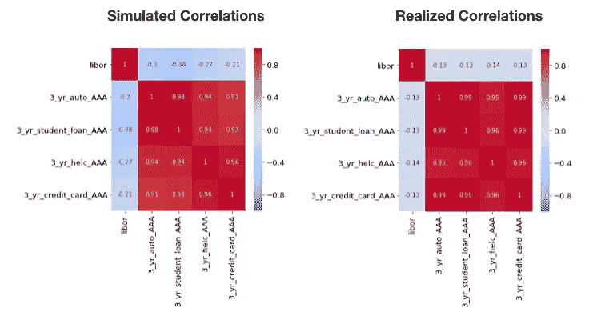****

****Simulated vs realized correlations****

****违约和过渡保持在模型预期范围内。****

****贷款期限约为 3 年；然而，最丰厚的回报是在项目第一年的投资中获得的，当时的利差相对于后来几年来说很高。****

****据我所知，没有投资者遭受损失。****

****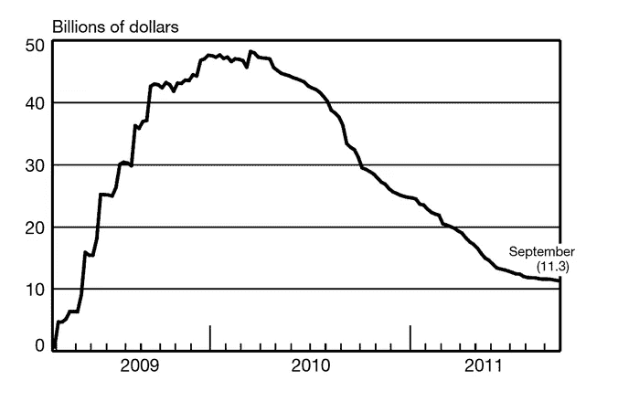****

****Outstanding TALF loans from inception of program to end. Source: Federal Reserve Statistical Release****

# ****回想起来，TALF 计划好吗？****

****芝加哥联邦储备银行不久前发表的一篇论文得出结论，TALF 计划阻止了美国经济陷入比实际更深的困境。****

****该论文引用了一些学者的研究，他们在研究中发现，当使用家庭层面的数据和综合数据时，融资条件和汽车销售之间有很强的联系。****

****具体来说，他们发现 2007 年至 2009 年间汽车销量下降的 38%可以归因于新车贷款利率的上升和家庭对信贷条件不利的看法。****

****可能面临借贷限制的家庭的购买对信贷条件的变化极其敏感，但对预期的收入变化不敏感。研究发现，利率每增加 1 个标准差，汽车总销量就会下降 13 万辆。****

****该研究表明(直接或间接)通过让消费者更容易获得和负担得起信贷，TALF 支持了汽车销售和整体经济。****

# ****还有其他类似 TALF 的机会吗？我们怎样才能找到他们？****

****金融危机总是伴随着机遇，但就我而言，领域专业知识、快速原型开发/编码和快速决策是发现和利用金融机遇的唯一途径。****

****(目前)还没有通用的人工智能来指出围绕信用风险、大宗商品、激进主义等特殊机会的投资。创业公司开发的所有“信用风险人工智能”都只是重新利用 Scikit-Learn 和/或谷歌的 TensorFlow 代码，大部分是由金融领域专业知识很少或为零的机器学习工程师拼凑而成的。他们的主张在非定量分析师看来不错，但我向你保证:他们的主张在紧张的现实生活中是站不住脚的。这些开发人员不分析尾部风险和变化的相关性:他们不知道如何分析。****

****在许多情况下，开发人员甚至不知道他们的一些创造已经内置了技术缺陷。例如，Marcos López de Prado 博士在其著作《金融机器学习的进步》中记录了 Scikit-Learn 交叉验证中的一个 bug。那段代码是内置在我所见过的许多人工智能的信用风险中的。****

****您可以查看以下问题:****

****[](https://github.com/scikit-learn/scikit-learn/issues/6231) [## 评分函数不知道类 _ Issue # 6231 sci kit-learn/sci kit-learn

### 与 pydata/patsy#77 的@amueller 讨论(评论)。建议:将可选的“标签”参数添加到…

github.com](https://github.com/scikit-learn/scikit-learn/issues/6231) 

当然，也有一些例外，有一些产品是好的。

关于独特的投资机会，是的，我计划在未来的文章中写一些有趣的机会，在机会被套利出去之后。由于显而易见的原因，在具体的机会出现时写下它们是不明智的。

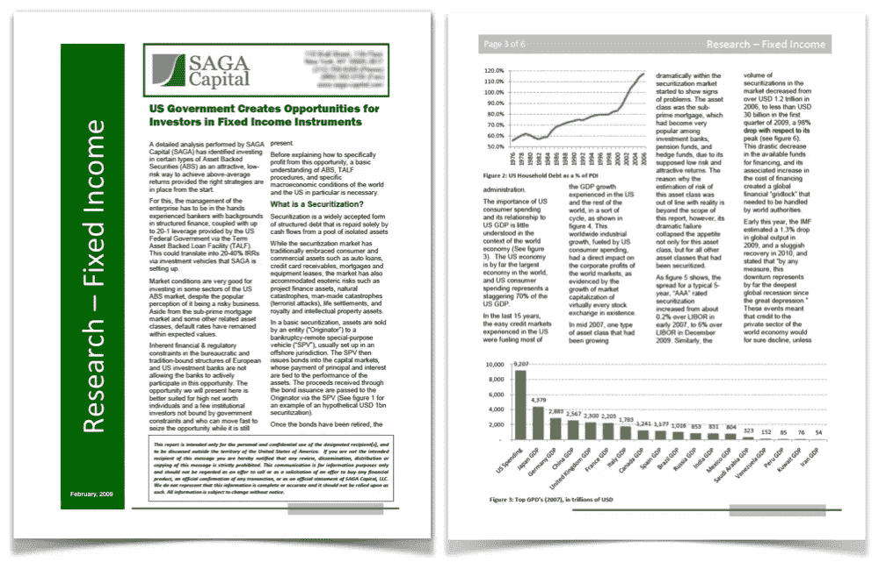

The TALF opportunity analyzed by my advisory firm back in early 2009

事实上，你在这里学到的几乎所有分析和建模都是在 10 年前完成的，当时 TALF 宣布成立。我正积极地试图筹集资金以利用这个机会，背景信息加上本文中的所有模拟都是我向感兴趣的各方介绍的一部分。

目前，我正在 Bitbucket 中为我的私人回购协议编写专有代码，并分析几个机会，这些机会就像 TALF 支持它们一样令人兴奋。

但除了潜在的交易和结构化事件，我所看到的从数据科学中获利的一些最佳机会是存储在大公司和政府机构的筒仓中的原始数据，这些数据可用于产生新的收入来源。在大多数情况下，拥有这些数据金矿的公司出于多种原因对此无所作为。

我希望这篇文章能帮助你理解奥巴马政府时期的政策带来的最佳投资机会之一，以及模拟模型如何在不确定的情况下帮助决策。

您可以在我的 Github repo 中找到本文中介绍的所有代码，以及一个 Jupyter 笔记本 [here](https://github.com/lmsanch/pyABS/blob/master/TALF.ipynb) 中的使用示例。

如果你喜欢这篇文章，请告诉我，分享这个故事，并在下面留下你的反馈。

```
All the images, code, and graphs in this article belong to and/or have permission for distribution.
``` 

****来源:****

1.  ****美国政府为固定收益工具的投资者创造机会。世家资本，2009 年 2 月。****
2.  ****资产支持证券市场、危机和 TALF。苏米特阿加瓦尔，杰奎琳巴雷特，水晶村，和玛丽克里斯蒂娜德纳尔迪。芝加哥联邦储备银行。****
3.  ****定期资产支持证券贷款工具:常见问题。纽约州美联储银行，2009 年。****
4.  ****美联储统计发布 H.4.1，“影响
    准备金余额的因素”，表 1。****

*******来自《走向数据科学》编辑的提示:*** *虽然我们允许独立作者根据我们的* [*规则和指导方针*](/questions-96667b06af5) *发表文章，但我们不认可每个作者的贡献。你不应该在没有寻求专业建议的情况下依赖一个作者的作品。详见我们的* [*读者术语*](/readers-terms-b5d780a700a4) *。*****