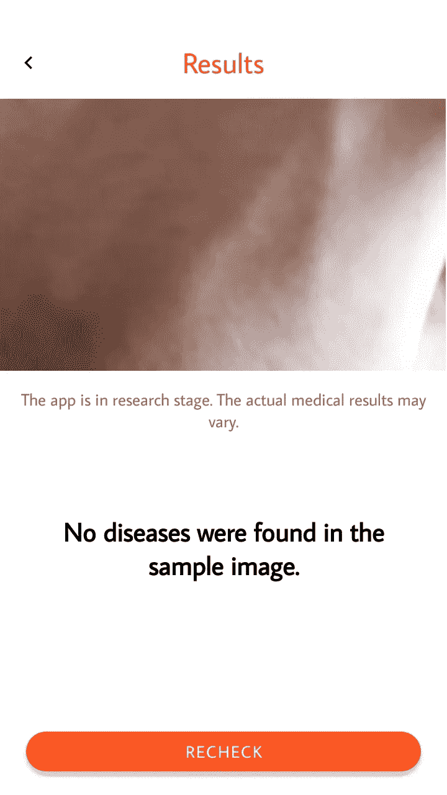

# 我如何在 Android 中为黑色素瘤检测制作 Skinly

> 原文：<https://towardsdatascience.com/how-i-made-skinly-for-melanoma-detection-in-android-6ad00f0bd26d?source=collection_archive---------20----------------------->

## 将计算机视觉和 Android 与 TensorFlow Lite 和 Keras 以及所有定制数据相集成。


Medical Science and Computer Science have a great match!

[机器学习(ML )](https://www.expertsystem.com/machine-learning-definition/) 在医学科学和健康行业创造了奇迹。经验丰富的医生获得的专业知识现在可以通过 ML 算法来学习，这些算法是用几行代码创建的。我将分享我关于 *Skinly* 的故事，这是一个可以检测[黑色素瘤](https://www.skincancer.org/skin-cancer-information/melanoma)(一种常见的皮肤癌)的安卓应用程序。

[](https://play.google.com/store/apps/details?id=com.health.inceptionapps.skinly&hl=en) [## skinly—Google Play 上的应用程序

### Skinly 是一个研究项目，旨在通过您的 Android 设备检测黑色素瘤等疾病。它使用…

play.google.com](https://play.google.com/store/apps/details?id=com.health.inceptionapps.skinly&hl=en) 

**此外，我将参考各种提示，引导您找到包含相关代码的 Python 和 Java ( Android)文件。**

GitHub Python 项目->[https://GitHub . com/Shu bham 0204/Melanoma _ Classification _ with _ TF](https://github.com/shubham0204/Melanoma_Classification_with_TF)

GitHub Android 项目->[https://github.com/shubham0204/Skinly_for_Melanoma](https://github.com/shubham0204/Skinly_for_Melanoma)

互动 Google Colab 笔记本->[https://Colab . research . Google . com/drive/1t 1 syfzt _ OE 974 yti0 xqp 5 Tet 5 dhvo 77 f](https://colab.research.google.com/drive/1T1SYfzT_Oe974YtI0xqp5tET5dhVo77f)

# 当然是从 Python 和 TensorFlow 开始！

我想到的第一个问题是图像数据。一个人如何能够获取成千上万的黑色素瘤图像？

## 收集图像数据

我使用我一直最喜欢的 [Fatkun 批量下载图片](https://chrome.google.com/webstore/detail/fatkun-batch-download-ima/nnjjahlikiabnchcpehcpkdeckfgnohf?hl=en)扩展，设法从互联网上提取了数百张图片。这个 Chrome 扩展允许我将谷歌搜索结果中的图片提取到我的电脑中。

1.  为了训练，图像被调整到 32 * 32 的尺寸。
2.  由于图像数量较少，对图像进行了[增强](https://keras.io/preprocessing/image/)，以便模型能够更好地概括。
3.  在彩色图像(3 通道)上训练该模型。

*提示:查看存储在 NumPy 文件(。npy)*[此处](https://github.com/shubham0204/Dataset_Archives/blob/master/dis_recog_imgs_processed.zip) *。同样，对于查看图像预处理这个* [*文件*](https://github.com/shubham0204/Melanoma_Classification_with_TF/blob/master/DataProcessor.py) *。*

## 训练模型(使用 Keras)

该模型需要足够聪明，能够区分健康皮肤和有黑色素瘤斑点的皮肤。为此，我选择了暹罗卷积神经网络。

[](https://medium.com/predict/face-recognition-from-scratch-using-siamese-networks-and-tensorflow-df03e32f8cd0) [## 使用暹罗网络和张量流从零开始进行人脸识别

### 人脸识别已经成为移动应用程序和许多其他机器中的常见功能之一…

medium.com](https://medium.com/predict/face-recognition-from-scratch-using-siamese-networks-and-tensorflow-df03e32f8cd0) 

这些网络也用于人脸识别和许多其他应用。

Code for building the Siamese model in Python

*提示:参考这个* [*文件*](https://github.com/shubham0204/Melanoma_Classification_with_TF/blob/master/Model.py) *。*

## 将模型转换为 TensorFlow Lite 模型

为了让这样的模型在 Android 上工作，我们需要将 [Keras](https://www.tensorflow.org/guide/keras) 模型(. h5)转换为 [TensorFlow Lite](https://www.tensorflow.org/lite) 模型(。tflite)文件。然后，这个文件被加载到我们的 Android 应用程序中，我们在其上执行推理。

Conversion of Keras model to TensorFlow Lite model

*提示:使用* [*岗位培训量化*](https://www.tensorflow.org/lite/performance/post_training_quantization) *帮助我大幅减少了模型大小。还有，参照这个* [*文件*](https://github.com/shubham0204/Melanoma_Classification_with_TF/blob/master/TFLiteBufferConverter.py) *进行换算。*

# 开发 Android 应用程序(使用 Java)

Android 应用程序被赋予了美丽的颜色和设计，因此看起来很友好。Android Jetpack 的 [导航](https://developer.android.com/topic/libraries/architecture/navigation.html)和 [ViewModel](https://developer.android.com/topic/libraries/architecture/viewmodel) 组件让工作变得更加简单快捷。

## 下载图像进行比较

如果你以前使用过暹罗网，你会知道它需要一些数据来进行比较以产生一个分类。

> 假设，我们建立了一个暹罗神经网络，用于狗和猫之间的分类。神经网络将输入图像与狗和猫的图像进行比较，并输出显示最大相似性的类别。两张猫的照片会显示出更多的相似性。


Firebase Cloud Storage

对于 Android 来说，Firebase 云存储是存储图像然后下载它们的合适地方。

*提示:参见* [*Firebase 云存储文档 Android*](https://firebase.google.com/docs/storage/android/start) *。还有，请看这个* [*文件*](https://github.com/shubham0204/Skinly_for_Melanoma/blob/master/app/src/main/java/com/health/inceptionapps/skinly/MainActivity.java) *中的代码。*

## 运行模型

TensorFlow Lite(版本=1.13.1)依赖项帮助我们加载。Android 中的 tflite 模型。您可以将其添加到您的`build.gradle`文件中。

```
dependencies {
    // Other app dependenciesimplementation **'org.tensorflow:tensorflow-lite:1.13.1'** }
```

然后，下面的代码获得范围为[0，1]的相似性得分。该方法逐步将输入图像与所有下载的图像进行比较，然后遵循以下步骤:

1.  获取每个图像与输入图像的相似性得分。
2.  分离具有最高相似性得分的前 K 个(值=5 或任何其他奇数)图像。
3.  解析这五幅图像的类别。
4.  输出五个图像类别中具有最高多数的类别。

Code for fetching similarity scores by running the model.

*提示:加载时，TFLite 模型参见* [*此处*](https://github.com/shubham0204/Skinly_for_Melanoma/blob/master/app/src/main/java/com/health/inceptionapps/skinly/TFRecognizerClasses/SkinDiseaseRecognizer.java) *，投票/分类参见此* [*文件*](https://github.com/shubham0204/Skinly_for_Melanoma/blob/master/app/src/main/java/com/health/inceptionapps/skinly/ResultActivity.java) *。*

## 最终应用

最终的 Android 应用程序如下所示:



> 该模型可以根据较少的数据进行训练，但这种技术和想法可以扩展并进入主流生产。欢迎您的任何建议！

# 还有呢！

# 仅此而已！

使用 Android 和机器学习的医学可以达到很高的高度。谢谢大家，机器学习快乐！