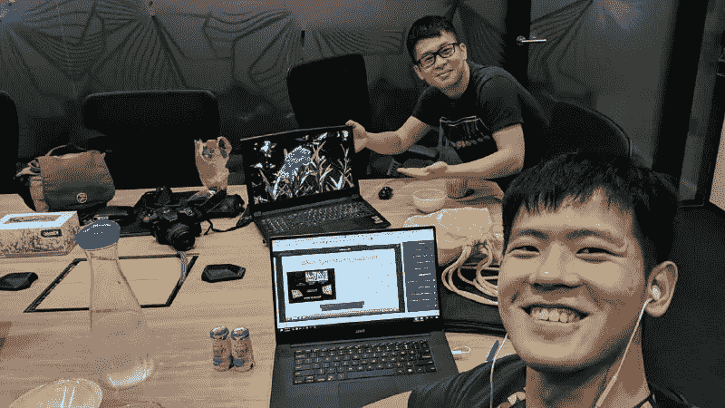
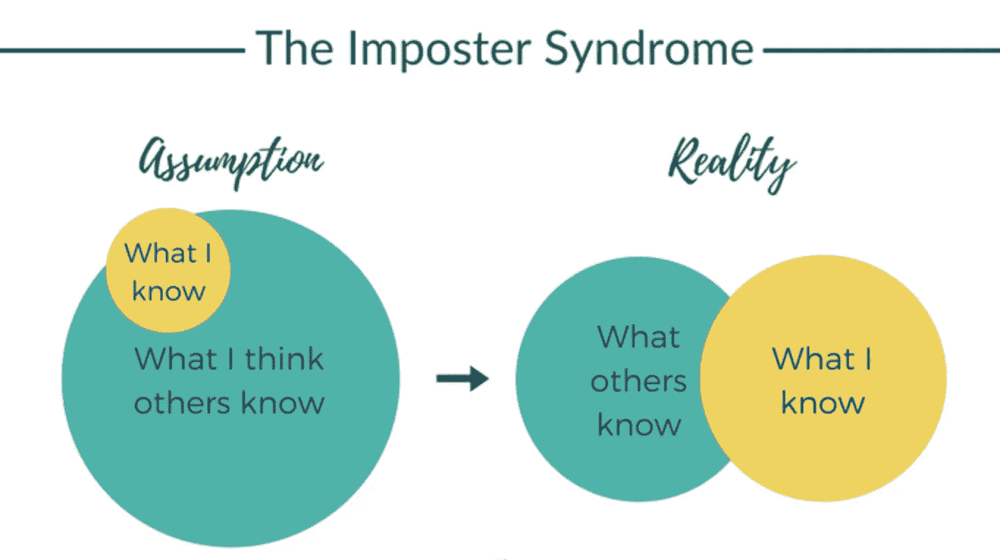

# 我如何克服数据分析中的骗子综合症

> 原文：<https://towardsdatascience.com/how-i-overcome-imposter-syndrome-in-data-analytics-8f6103be820b?source=collection_archive---------10----------------------->

## 我对数据专业人员真诚而简单的建议

## 在谷歌和维萨这样的数据和科技公司找到自己的位置

Source ([Unsplash](https://unsplash.com/photos/5QX2efxtQWE))

> “恭喜恭喜！谷歌是一个工作和提高你的数据分析技能的好公司！！你会遇到非常聪明、有干劲的人，他们在做重要的大事。”我在 Visa 的同事向我表示祝贺。

2019 年 7 月，[我被 Google 聘为数据科学家](/ace-your-data-analytics-interviews-ef114606c5d7)，与 ML 一起对抗滥用。

之前在 Visa 的同事听到我跳槽到 Google 的消息后，都调侃我很特别。对他们来说，谷歌是真正聪明的技术和数据专业人士的最终“朝圣”目的地。毕竟是“谷歌”，实现了那么多突破，从 DeepMind、Alpha Go 的科学成就，到量子计算至上。[在他们的心目中，谷歌因其惊人的福利、薪酬和影响力而成为 2019 年的梦想雇主](https://www.forbes.com/sites/sarahhansen/2019/10/18/the-worlds-best-employers-2019-alphabet-takes-top-spot-followed-by-microsoft-and-red-hat/#737f960952ef)。在我任职的几天内，我在 LinkedIn 上收到了许多信息，要求推荐我进入谷歌。被谷歌聘为数据科学家是一个绝好的机会，总能激发我的同事们的梦想，包括我的同事。这太神奇了！我曾和这么多聪明且有动力的专业人士一起工作过。我有影响数十亿人生活的项目，我有惊人的津贴和学习机会。

但有时，我担心自己不够好。

# 冒名顶替综合症。

> *尽管取得了明显的成功，但这种不满足感仍然存在。冒名顶替者遭受长期的自我怀疑和一种智力欺诈感，这种感觉压倒了任何成功的感觉或他们能力的外部证明。—哈佛商学院*

简单地说，冒名顶替综合症是一种持续的自我怀疑，将自己与他人进行比较。

事实上，统计学家表明，世界上超过 70%的人承认患有冒名顶替综合症。他们遍布各个行业，如医药、商业和教育。

就我而言，我有时会把自己比作更有能力的资深同行，他们也是 Kaggle 和 ML 的超级明星。我有时对自己的技能有自我怀疑；有一次，我花了很长时间破解密码，只要我开口，这些密码就唾手可得。我担心有一天 HR 会来说我在谷歌严格的招聘过程中是假阳性。在 Visa 和谷歌等大型科技公司，我有时会面临这种想法。

如果这种情况发生在你身上，那么你并不孤单。

在技术和数据领域，人们会通过你的影响对你进行客观评估。你将接受绩效评估，并与他人进行比较。由于数据分析一直在发展，您需要不断学习和提升您的技能。你今天所知道的，不一定是下个月的最佳实践。这就是为什么冒名顶替综合症在数据和技术领域更为普遍的原因，在这个领域，竞争非常激烈，人们总是需要不断地学习和产生结果。

# 把冒名顶替者当成你最好的朋友

在大型跨国数据和科技公司工作了 3 年后，我学会了一些克服这种自我怀疑的关键技巧。令人欣慰的是，我正在成长，生活得很好。

因此，我真诚地希望这篇文章能成为一个休息点，让你在数据分析的旅程中休息、成长和超越。这种方法对我很有效，我真诚地希望它对你和我的数据同事也有效。我相信你可以用**的坚定**、**的谦逊**、**的专业**面对你的冒名顶替者。

## 信念:了解你建造房屋的基础

Source: [Unsplash](https://unsplash.com/)

> 聪明人把房子建在岩石上。愚蠢的人在沙子上盖房子——摘自《马太福音》7:24–27，世界英语圣经

马太福音 7:24-27 是一段伟大的圣经经文，它一直是我的生活灵感，它谈到了骗子综合症的核心，你的“身份”。

就像智者如何把他的房子建在岩石上一样，你应该把你的个人身份建立在不可动摇的基础上，而不是建立在转瞬即逝的愿望上。对我来说，我的身份是作为一个基督徒，我已经通过耶稣基督的血称义。

遗憾的是，我在数据和技术领域的许多同事不幸将自己的抱负建立在成就、职业发展和金钱之上。他们对自己有很高的期望，当他们得不到想要的东西时会变得焦虑。

让我与你分享更多这方面的内容。分析就业市场增长非常快。就在几年内，许多大学开始提供数据科学学位，来自世界各地的成千上万的人注册。如今，这个学位已经变得和进法学院和商学院一样难了。

不幸的是，有太多的不确定因素影响着这种兴奋感的走向。数据科学家的就业市场正变得越来越饱和和虚幻。[许多初创公司开始意识到，在没有坚实的工程和业务基础设施的情况下，他们在数据科学方面发展太快了。](https://medium.com/@anandr42/the-data-science-delusion-7759f4eaac8e)

因此，我认为，尽管需求不断上升，供应市场的竞争将会越来越激烈。这将成为你找数据分析工作的巨大威胁。

如果你看重高薪和职业发展，你会失望的。在我与新加坡国立大学等顶级大学的会谈中，我收到了一位研究生学者的提问，她非常想在分析领域找到一份好工作。外面的世界很残酷。

作为一个基督徒，我把自己当成一个教育者。我的目标是学习、分享和教育我的同行，因为我喜欢用分析解决业务问题。数据分析领域日益激烈的竞争成为我学习和分享的新领域。[这就是我擅长数据分析的原因。](/data-analytics-is-hard-here-how-you-can-excel-aa2a99d0fad0)

而不是利用工资、福利和灵活性等短暂的动机。我会用我的信仰、影响力和教育等持久的动机来继续学习和教学。

最后，我把自己描述成一名教育工作者，而不是数据工作者/专业人士，从而为 Visa 和谷歌提供了更多的价值。我代表两家公司参加了许多内部和外部会议，同时解决分析问题。

同样，你应该把你的身份(房子)建在岩石上，而不是沙滩上。你需要追求长期的影响，而不是短期的放纵。

## 谦逊:承认自己的弱点，寻求帮助

Albert (My best friend) and I study for OMSCS together on Saturday morning

> 承认自己的弱点，人无完人。找到能帮助你的人，并感谢他们。你的人际关系是你最大的资产，让你不断前进。

不要隐藏你的弱点。相反，揭露他们并寻求帮助。这将增长和提高你克服大挑战的韧性。

作为一个不会说英语的人，我缺乏沟通技巧来流利地表达我的想法。知道自己的弱点后，我从内部写作班和演讲会寻求帮助，以克服我浓重的口音和薄弱的语法。在不断的帮助下，我克服了口吃，说话流利了。[在谷歌和维萨这样的公司工作，我的写作和沟通技巧已经成为我最大的财富。](/data-analytics-is-hard-here-how-you-can-excel-aa2a99d0fad0)

学习分析，我总是邀请我的朋友一起学习。在我深陷困境的时候，他们还是和我站在一起的朋友。此外，[我有优秀的经理，我可以和他们分享我的缺点，并一起坚持下去。没有上帝的恩典和这些人际关系，我不可能超越今天的我。](https://medium.com/swlh/5-life-lessons-i-wish-i-knew-when-i-started-working-7873f8b1ec6)

你应该承认自己的弱点。发现的瑕疵越多，就越应该寻求帮助，克服自己的差距。这是你成长的方式。

## 自信:掌握你最大的专长

[Source](https://blog.usejournal.com/3-questions-to-ask-yourself-to-overcome-imposter-syndrome-a773b9f07201)

> 不要认为你比别人知道的少。你应该认为你可以为他人贡献巨大的价值。找到并专注于这个价值。

你应该找到能为你的公司带来的核心价值。它很重要，因为它给了你建立专业知识(SME)的空间。

对我来说，我在谷歌专门研究视觉识别网络钓鱼。我的座右铭是“大规模打击网络钓鱼滥用”。我的主要结果将集中在如何提高 ML 模型的质量来捕捉钓鱼网站。这是对我的核心表现唯一重要的事情。我非常重视所有权，并花了大部分时间来学习它。

通过拥有一项专长，并在重要的小事上成为主题专家，你会知道你的立场，并对你的工作负责。

# 骗子综合症的治疗:承认我们是人类

与冒名顶替综合症的斗争非常艰难。这不是身体上的，而是情感上的。它的源头是看不见的，通过你自我感知的心理缝隙渗透进来。治愈的方法是承认我们是人类，因此我们是有限的。

1.  追求稳定而持久的信念，而不是有形而短暂的目标。
2.  谦逊地承认我们充满了缺陷，然后寻求帮助，而不是隐藏它们。
3.  拥有**信心**去做重要的小事，并作为数据专业人员对自己的影响负责。

所有这些技巧都很简单却很难…我鼓励你和我们一起踏上[在数据分析方面出类拔萃的旅程。](/data-analytics-is-hard-here-how-you-can-excel-aa2a99d0fad0)

索利·迪奥·格洛丽亚。

# 最后…

Source: [Unsplash](https://unsplash.com/photos/d1eaoAabeXs)

我真的希望这是一本很棒的读物，是你发展和创新的灵感来源。

请**在下面评论**提出建议和反馈。就像你一样，我也在学习如何成为一名更好的数据科学家和工程师。请帮助我改进，以便我可以在后续的文章发布中更好地帮助您。

谢谢大家，编码快乐:)

# 关于作者

Vincent Tatan 是一名数据和技术爱好者，拥有在 Google LLC、Visa Inc .和 Lazada 实施微服务架构、商业智能和分析管道项目[的相关工作经验。](https://bit.ly/2I8jkWV.?source=post_page---------------------------)

Vincent 是土生土长的印度尼西亚人，在解决问题方面成绩斐然，擅长全栈开发、数据分析和战略规划。

他一直积极咨询 SMU BI & Analytics Club，指导来自不同背景的有抱负的数据科学家和工程师，并为企业开发他们的产品开放他的专业知识。

文森特还在[10 日至 8 日](https://somtrbdynishjjjdkn.10to8.com/)和 [BestTop](https://www.besttopcareer.com/mentors-datascience) 开设了他的一对一导师服务，指导你如何在谷歌、Visa 或其他大型科技公司获得你梦想的数据分析师/工程师工作。 [**如果你在寻找良师益友，请点击这里**](https://somtrbdynishjjjdkn.10to8.com/) **与他预约。**

最后，请通过[**LinkedIn**](http://www.linkedin.com/in/vincenttatan/?source=post_page---------------------------)**，**[**Medium**](https://medium.com/@vincentkernn?source=post_page---------------------------)**或** [**Youtube 频道**](https://www.youtube.com/user/vincelance1/videos?source=post_page---------------------------) 联系文森特