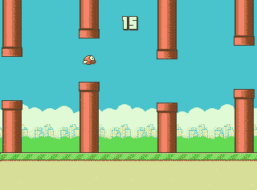
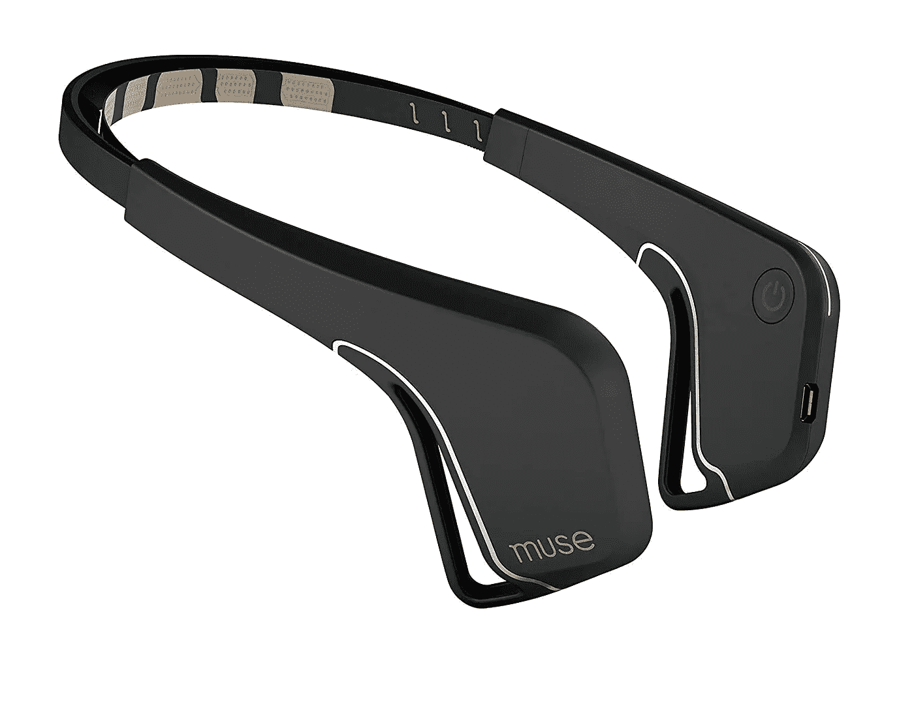
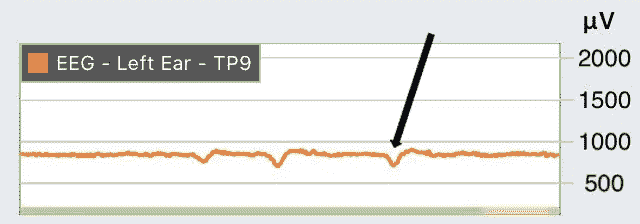

# 我是如何用我的思想玩“拍打鸟”的

> 原文：<https://towardsdatascience.com/how-i-played-flappy-bird-with-my-mind-e1e5b4da59ce?source=collection_archive---------48----------------------->

## 用我的脑电波控制经典手机🧠

玩过这个游戏吗？还记得它引起的挫败感吗？



“Game Over”

嗯，Flappy Bird 实际上已经从 App Store 中删除了，因为它太容易上瘾了。但是你猜怎么着？我创造了我自己的版本，你可以用你的大脑玩😉

# 等等，怎么会？

所以这之所以可能是因为一种叫做脑机接口的新兴技术。脑机接口(BCI)允许我们将大脑与外部机器或物体连接起来。

基本上，我们的大脑使用称为神经元的神经细胞在全身传递信息。神经元“开火”是为了将信息传递给下一个，就像连锁反应一样，直到信息到达大脑，反之亦然。这种神经活动导致大脑发出电磁波。


You can’t actually see the waves

这就是脑机接口发挥作用的地方——它们通过获取这些脑电波，分析它们，然后将其转化为命令。

# 获取脑电波

你可能想知道我们如何获得脑电波——毕竟，你看不见也感觉不到它们。嗯，一种用来记录大脑电活动的流行方法叫做脑电图(或 EEG😅).我选择的设备是 Muse 头带，用于冥想，但也可以用于开发应用程序。



Just wear it around your head and you’re good to go

头带连接到 Muse Direct 应用程序，该应用程序使用[开放式声音控制](http://opensoundcontrol.org/introduction-osc)协议将数据传输到我的电脑。

# 处理数据

因此，来自应用程序的数据被一个 [Python](https://www.python.org/) 程序成块接收(几乎每毫秒左右)，它看起来像这样。

```
b'Muse-C2C0/notch_filtered_eeg\x00\xacDX\x13rDO\x1f\xe3'
b'Muse-C2C0/variance_eeg\xd5\xf2CJ1\x83C\x8e\xf2{DG\xect'
b'Muse-C2C0/eeg\xb8\x7f\xc0\x00\x00\x7f\xc0\x00\x00'
b'Muse-C2C0/elements/blink\x00,i\x00\x00\x00\x00\x00\x00'
b'Muse-C2C0/elements/jaw_clench\x00,i\x00\x00\x00\x00\x00\x00'
```

这到底是什么意思？🤔嗯，数据是以十六进制形式接收的，这意味着我们必须将其转换为十进制，然后对其进行处理。我就是这么做的——这个过程涉及到一点数学，所以我就不解释了，把代码[链接到这里](https://github.com/karmdesai/Brain-Controlled-Flappy-Bird)。在转换数据后，我注意到每当我眨眼时都有大的尖峰信号。



I blinked three times during this recording

# 移动鸟

在这一点上，我们知道每当数据中有一个大的峰值时，用户就眨眼了。然而，情况并非总是如此——有时尖峰是由其他运动或活动引起的。

为了确定用户是否真的在眨眼，我们可以使用带通滤波器。虽然这看起来很复杂，但它基本上只是意味着识别与眨眼相关的频率范围👁️.就我而言，我做了一些测试，通过反复试验，我找到了一个相当好的范围。

最后一步是只要用户眨眼，这只鸟就会“扇动”——就这样！

Skip to 1:35 for a demo of the game

很酷，是吧？这只是冰山一角。从[诊断抑郁症](https://www.hindawi.com/journals/bmri/2017/1695290/)到[帮助瘫痪的机器人控制手臂](https://news.brown.edu/articles/2012/05/braingate2)，脑机接口拥有巨大的潜力！