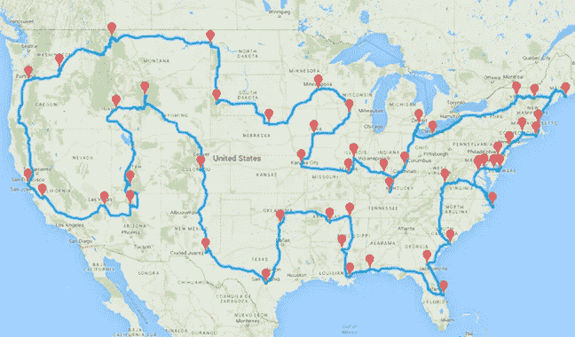
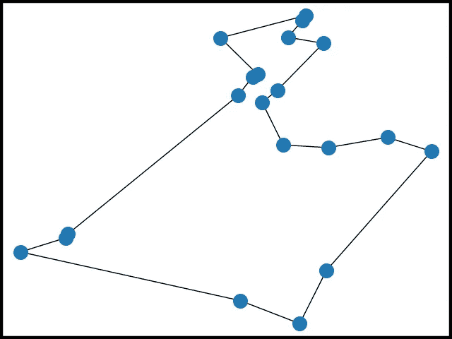
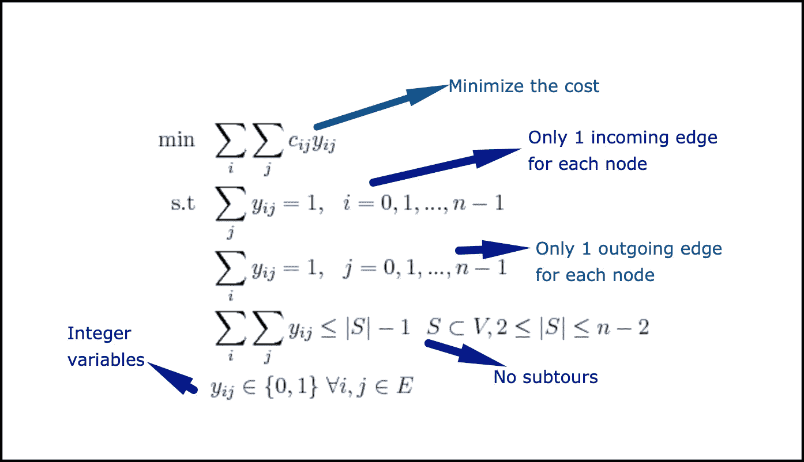
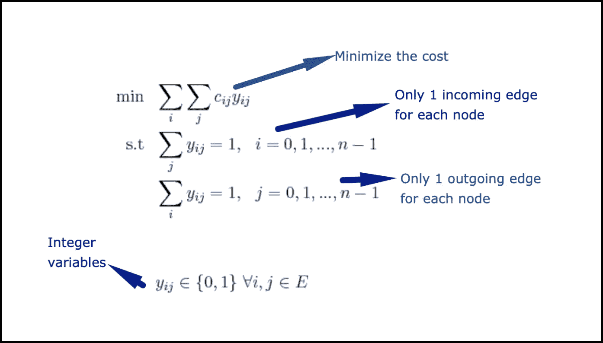
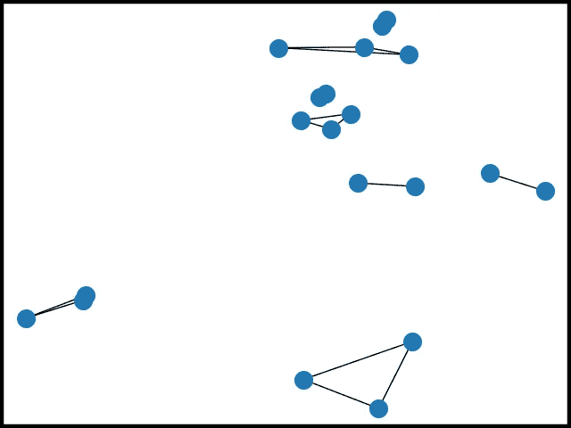
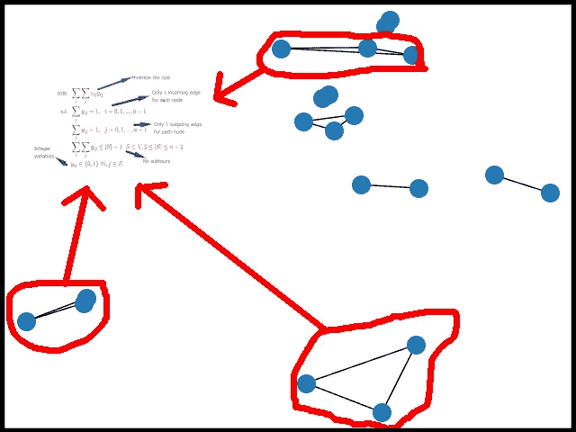
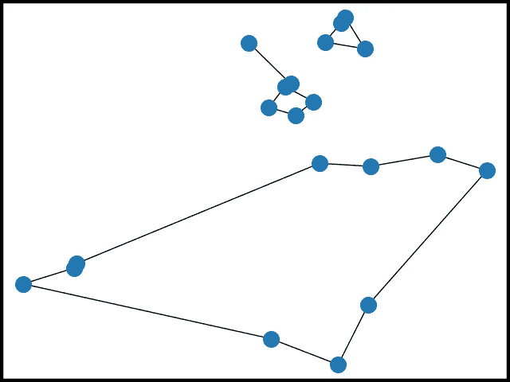
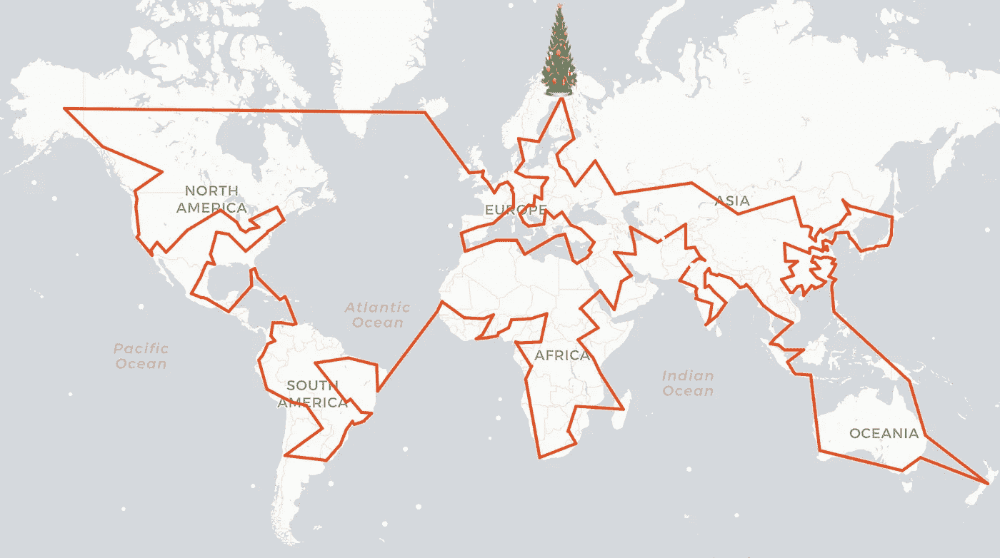

# 我是如何用旅行推销员问题拯救圣诞节的

> 原文：<https://towardsdatascience.com/how-i-saved-christmas-with-the-travelling-salesman-problem-3d85c190ed9d?source=collection_archive---------14----------------------->

## 圣诞老人最佳旅行的美好想象


Photo by [Mitya Ivanov](https://unsplash.com/@aka_opex?utm_source=unsplash&utm_medium=referral&utm_content=creditCopyText) on [Unsplash](https://unsplash.com/s/photos/santa?utm_source=unsplash&utm_medium=referral&utm_content=creditCopyText)

一切都开始于一个下着雨的周六，我正在狂看网飞的一部新圣诞电影，突然听到有人在我公寓外面大声喊我的名字。**我打开门，我看到一个高大的身影穿着红色外套，红色裤子，戴着一顶滑稽的红色帽子**。我一生中从未如此惊讶过:盯着我看的那个人是**圣诞老人本人！！！**

**TL；DR；他想从我这里得到的是一个软件来优化他 12 月 24 日的交货。他的要求是找到给定 342 个城市的最短路线。他需要一条始于拉普兰的循环路径。**

这里有个视频方便大家看！【JavaScript 视频直播的链接在文末！

接下来是我和圣诞老人的对话！

# 圣诞老人的问题

安德里亚:嗨，圣诞老人，让我准备一杯茶，同时，你为什么不向我解释一下你的问题呢？

**圣诞老人**:吼吼吼！嗯，你知道每年 12 月 24 日至 25 日的晚上，我需要向全世界运送数十亿件玩具。这是一项非常具有挑战性的任务，安德里亚。我想知道计算机科学是否能简化我的生活。如何以最短的距离游览每一个城市？

安德里亚:好的，这听起来很熟悉，你能详细说说你的问题吗？

**圣诞老人**:当然。我有一份 307 个城市的名单，这些城市拥有最多的人口。我想知道**哪条是只去这些城市一次的最短路径**。你可能知道，我需要**从我在拉普兰的家**出发，而**拉普兰也是我此行的最后一站**！显然，我需要接触的城市不止 307 个，但我要的是战略规划，而不是运营。一旦我到达了主要的地方，我会和驯鹿一起想出如何移动到附近的城镇！

安德里亚:好的，圣诞老人。我认为你的要求很明确。实际上你描述的是计算机科学中一个非常经典的问题:它被称为 [**旅行商问题(TSP)**](https://en.m.wikipedia.org/wiki/Travelling_salesman_problem) ，它的定性表述和你刚才告诉我的差不多。不过我有个坏消息:**这很难解决！**让我画一个小草图，看看我们是否同意任务是什么！

假设我们只想关注美国的主要城市，那么您要寻找的路线如下所示:



圣诞老人:哦，安德里亚，这正是我想要的！**只要记住我会飞**！对了，你能给我解释一下为什么这么难吗？

**安德里亚**:TSP 属于一类被称为[**NP-完全问题**](https://en.wikipedia.org/wiki/NP-completeness) 的问题。不确定你是否想知道数学定义，但是从实践的角度来看，在一百多年的研究中，没有人找到快速解决这些问题的方法，这些解决方案也不太可能存在。

圣诞老人:能有多难？

Andrea :如果你对你所要求的问题运行一个强力算法(这意味着测试所有可能的解决方案并挑选出最好的一个)，它可能需要**字面上的** **数百或数千年才能得到结果！即使有现代科技。幸运的是，有一些更聪明的方法来处理许多 TSP 实例！**

**圣诞老人**:吼吼吼！这是个好消息！**我比那天掉进棉花糖池还开心**！你能告诉我有哪些选择吗？

安德里亚:当然。有一些策略:

*   如果你只是想要一个“足够好”的解决方案，我们可以使用**启发式算法**:这些方法通常**非常快，但是它们导致的解决方案可能不是(并且通常不是)最优的**。
*   我们可以使用一些聪明的**“精确的”算法**:潜在地，这将花费永远的时间，通常**他们在可接受的时间内解决小问题**，但有时他们很难实现。在这种情况下，解决方案总是最优的。
*   我们可以用**混合整数线性规划:**如果按照这条路线，**我们只需要写一个数学模型，然后用一个 MILP 求解器作为黑箱，就可以得到最优解。**

在给你推荐之前，我可以知道你的**预算**是多少，你的**截止日期**是什么时候吗？

哦，不幸的是，我的最后期限很紧，我需要在周日晚上得到解决方案，所以你有一天半的时间来实施一切。另一方面，我有一个**无限的预算！圣诞国家银行可以印出我想要的那么多魔法美元！**还要注意，我只想要 307 个城市中的最佳路线！

安德里亚:嗯……好的。实际上，截止日期已经很近了；因为你需要最优路线，我们将使用[混合整数线性规划(MILP)](https://en.wikipedia.org/wiki/Integer_programming) 。有很多工具我们可以使用，其中一些是商业的，像 [CPLEX](https://www.ibm.com/analytics/cplex-optimizer) 或者 [Gurobi](https://www.gurobi.com/) 。其中一些仅用于学术研究，如 SCIP。其中有一些是开源的，比如 [GLPK](https://www.gnu.org/software/glpk/) 和 [CBC](https://projects.coin-or.org/Cbc) 。

现在，你告诉我你有无限的预算，但是**不幸的是，Gurobi 和 CPLEX 不接受魔法美元作为货币**，所以我们需要使用 GLPK 或**CBC**；后者通常更快，可以和 Python 一起使用，所以我想我们有自己的基础工具！

# 圣诞老人造型

**圣诞老人**:呜！神奇的安德里亚！那我们开始吧。很多人不知道很久以前我毕业于数学系。如果你能解释一下这个模型，我会很高兴的。

安德里亚:哦，太好了，写下一些公式总是很有趣，这让我感觉更聪明！首先，让我们看看我们在一个示例场景中寻找的解决方案:



这可以大致描述如下:

*   **这是最优的**，事实上，如果我们考虑节点之间所有可能的连接，我们只选择那些行驶到最短周期的节点。
*   **每个城市只被访问一次**，这意味着我们在每个城市只进入一次，从每个城市退出一次(**更正式地说，我们可以说每个节点正好有一条输入边和一条输出边**)。
*   **我们只有一个周期！**

为了使用线性规划表达这个解决方案，我们需要定义一些变量:假设我们有 *n* 个城市，我们可以为每对城市 *i* 和 *j* ，yᵢⱼ *创建一个变量。*

**现在， *yᵢⱼ* 将等于 1，如果在我们的最佳路线中，我们需要从城市 I 直行到城市 j(直接，不首先通过另一个城市)， *yᵢⱼ* 将等于 0，如果没有选择连接**。cᵢⱼ是连接城市 *i* 和城市 *j.* 的成本让我来写这个模型:



**Santa，这个对象的问题是关于“没有子旅程”**约束(例如*见上图*)。**子游是一个周期，不访问所有城市**，而只是一个子集。我们希望有一个周期，**，所以这些不等式旨在消除有多个周期的可能性**。

为了实现这个模型，我们应该为每个节点子集编写一个大致的“No sub-tour”约束。**如果我们有 *n* 个节点，这将意味着 *2ⁿ-2* 个约束，这些约束不可能在计算机内存中表示(例如，n=300，约束的数量将是 20 . 370 . 359 . 763 . 344 . 860 . 862 . 684 . 456 . 884 . 093 . 781 . 510 . 514 . 514 . 364 . 6644 . 62 . 684 . 484 . 0993 . 381 . 514 . 514 . 514 . 514 . 514 . 514 . 514 . 5**

这就是为什么我们需要找到一个更好的策略。

我们能做的是应用以下算法:

1.  **我们从模型**中移除了“无子旅程”的约束，获得了所谓的“宽松模型”。
2.  **我们求解松弛模型到最优**。这个解决方案很可能包含子旅游。
3.  我们**在当前的解决方案中找到所有的子旅程，并且我们将禁止这些子旅程的约束添加到模型中。**
4.  我们转到点 2 和**迭代，直到没有子巡回检测到。**

也许以后我们应该画个草图来阐明这些步骤。

圣诞老人:哦，那真是太棒了，安德里亚！谢谢解释！因此，我们的想法是移除大量的约束，只添加那些在单个周期内获得解决方案所必需的约束。啊甜蜜的回忆！这是解决这个问题的最好方法吗？

安德里亚:当然不是圣诞老人。**我们可以将许多其他类型的约束添加到模型中，以减少达到最优解所需的迭代次数**(它们被称为“切割”，来自切割)。**但是你告诉我我们只有两天时间，所以我们要走最简单的路。**

# 绘制算法

**圣诞老人**:呵呵安德里亚，我也想**看一些代码**。你知道，我们在圣诞老人家里的整个 IT 系统是用 Pascal 写的，我们真的需要一些更新。我们能不能做一些古老而珍贵的结对编程，这样我就可以开始钻研 Python 了？

安德里亚:哦，哇，绝对是圣诞老人。让我们一起来实现这一点。

正如我告诉你的，我们需要放松模型，消除“没有子行程”的不平等(这些在技术上称为**秒，子行程消除约束**)。我们的模型如下:



正如我之前解释的，如果我们解决了上面的**，我们可能会有那些非常著名的子旅游**。例如，下图是使用 18 个城市的宽松模型的**解决方案:**



如您所见，该解决方案满足所有约束:它是最优的，并且每个城市只有一条输入边和一条输出边。**但是我们不想要子周期！**如我所说，我们需要:

1.  **识别所有的“连接组件”**(直观地所有连接在一起的节点组)。
2.  **用禁止那些组件的所有不等式更新模型。**

让我画一个图表:



现在我们已经添加了所有新的切割，让我向您展示一下如果我们解决了这个问题会发生什么:



我们开始看到解决方案的形状！**最后，如果我们迭代这个过程……嘣！**


# 实施

安德里亚:是时候写些代码了。首先，我们需要一些图书馆。最重要的是 [**浆**](https://pythonhosted.org/PuLP/) 。来自他们的网站: *PuLP 是一个用 Python 写的 LP 建模器。纸浆可以生成 MPS 或 LP 文件，并调用 GLPK，硬币 CLP/CBC，CPLEX，和 GUROBI 来解决线性问题。*纸浆与 CBC 捆绑在一起。我们还需要 [**networkx**](https://networkx.github.io/) ，一个 *Python 包，用于创建、操作和研究网络的结构*(我们需要它在优化过程中识别子旅程)。

让我们创建一个 Python 类来解决这个问题。首先，我们需要读取城市([这里我们可以有世界城市的人口和地理坐标列表](https://simplemaps.com/data/world-cities))。**因为你的房子位置不在列表中，圣诞老人，我们会把它添加到数据中；此外，我们将增加一些城市，以提高全球覆盖:**

**现在，我们需要一个函数来** [**计算两个位置**](https://stackoverflow.com/questions/19412462/getting-distance-between-two-points-based-on-latitude-longitude) (使用经纬度坐标)之间的距离。你的交通工具是由神奇的驯鹿拉着的**雪橇，因此直线距离将是一个很好的近似值**:

不错！我们可以编写函数来构建模型:

很好。复杂的部分到了。

我们必须得到当前的解，并建立相应的图形。我们将用 [networkx](https://networkx.github.io/) 。之后，我们需要一个函数来:

*   **检测连接的部件**
*   如果这些大于 1(意味着我们有子旅程)，那么**向模型**添加新的约束。如果我们只有一个连通分量，那么我们就找到了最优值。

我们准备写求解模型的函数了！

完成了，亲爱的圣诞老人，我们只需要调用方法！

**圣诞老人**:我等不及要执行代码了！

安德里亚:我也是！让我们看看需要多长时间以及需要添加多少秒的约束才能得到解决方案！我们将使用JavaScript 来可视化结果；更具体地说**我们将使用** [**传单**](https://leafletjs.com/) **以及** [**传单. motion**](https://github.com/Igor-Vladyka/leaflet.motion) **插件**在地图上实现视觉效果！

我将在我的笔记本电脑上运行代码:

```
MacBook Pro (13-inch, 2019)
Processor: 2.8 GHz Quad-Core Intel Core i7
RAM 16 GB 2133 MHz LPDDR3
```

首先我们会尽量用你的 [308 城市](https://gist.github.com/aialenti/f4a40b11d4b58c36504b84ee8828059e) (307 加上你在拉普兰的房子):


Santa’s optimal route with [308 cities](https://gist.github.com/aialenti/f4a40b11d4b58c36504b84ee8828059e)

```
Execution Time: **556**
Number of SEC constraints: **380**
Solution cost (a.k.a. cycle length): **142.190 km**
```

正如你所看到的，我们没有覆盖一些国家，让我们包括更多的城市。考虑到我们现在有 [342 个城市](https://gist.github.com/aialenti/239256ed508a45aac87f20806c844ec2) (341 个加上你在拉普兰的房子):



Santa’s optimal route with [342 cities](https://gist.github.com/aialenti/239256ed508a45aac87f20806c844ec2)

```
Execution Time: **543 seconds**
Number SEC constraints: **352**
Solution cost (a.k.a. cycle length): **162.373 km**
```

**在这种情况下，当我们添加更多要访问的城市时，找到解决方案所需的时间会减少**。当使用线性规划解决 TSP 时，这并不是不常见的结果。当然，节点的数量(以及由此产生的变量和约束的数量)会对执行时间产生影响，**，但是通常使问题变得困难的是地图上城市的实际布局**。甚至增加一个城市(**或者删除一个！**)会让性能急剧恶化！

## **我来给你看看现场版:**[**https://santa-tsp.herokuapp.com/**](https://santa-tsp.herokuapp.com/)

# 结论

**圣诞老人**:吼吼吼！安德莉亚。那真是太神奇了！我欠你很多！每个人都会准时收到礼物！你帮助我让人们更快乐！

安德里亚:嗯，圣诞老人，实际上已经有亚马逊在做类似的事情，但是，你知道，他们也不接受神奇的美元，所以我认为我们在给定的条件下做得很好！

圣诞老人:谢谢。我不明白为什么没有人接受我的魔法钱，但我很高兴你接受了！

谢谢你拯救了圣诞节！再见！

> 嗬！嗬！嗬！

## 后手稿

这是我的故事。很高兴能帮助圣诞老人了解这些概念。

谢谢你读到这里，如果你需要一些多余的魔法美元，请联系我！

> 圣诞快乐！

## 链接到 JavaScript 版本[https://santa-tsp.herokuapp.com/](https://santa-tsp.herokuapp.com/)

[](/clustering-pollock-1ec24c9cf447) [## 聚类波洛克

### 杰森·布拉克绘画的聚类分析——如何利用 k-means 进行色彩分组

towardsdatascience.com](/clustering-pollock-1ec24c9cf447) [](/the-art-of-joining-in-spark-dcbd33d693c) [## 火花中加入的艺术

### Spark 中加速连接的实用技巧

towardsdatascience.com](/the-art-of-joining-in-spark-dcbd33d693c)