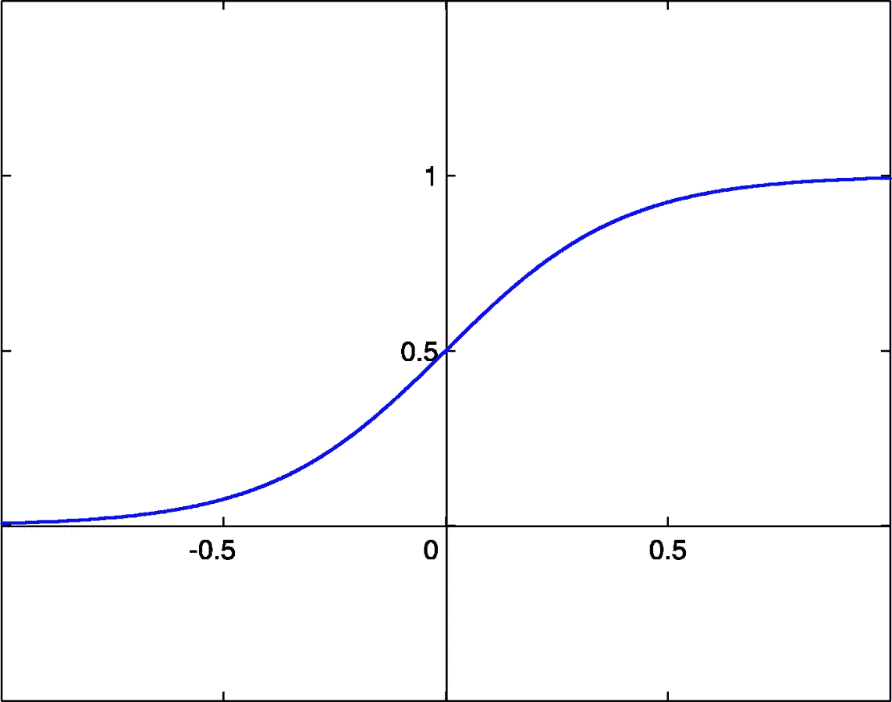

# 我是如何在几个月内学会计算机视觉的

> 原文：<https://towardsdatascience.com/how-i-sort-of-learned-computer-vision-in-a-month-c3faec83b3d6?source=collection_archive---------12----------------------->

十年即将结束，回头看，我做得还不够。所以我搜索了一些流行词，遇到了“计算机视觉”并尝试了一下，心想，“伙计，这能有多难？我打赌我能学会这些东西，并且做得更好。”

是的，我完全错了。

我没有扎实的统计背景，或者任何机器学习技能。学习比我想象的要困难得多。我想过在多个点停下来，但出于某种原因，我继续前进。现在我做了这个指南来节省初学者的时间，因为这是一个非常酷的主题。

# 那么什么是计算机视觉呢？

计算机视觉用来模仿人类的感知系统。我的主要动机是了解它的汽车应用，但实际上它可以应用于安全、医疗和国防工业。

在最底层，它通过过滤、寻找线条或改变图像的大小来改变图像的属性。然而，在更高的层次上，它训练一个模型来预测图像组件的类别和位置。图像处理算法涉及线性代数(特征向量、雅可比)、微积分(梯度、拉普拉斯)、统计和信号处理(卷积)的混合。

好了，现在你已经被警告了，继续行动，后果自负。

# 简要概述

该列表涵盖了整篇文章中的主题及其顺序:

*   数字图象处理
*   支持向量机
*   神经网络
*   目标检测(CNN)
*   对象分割(区域提议网络)

Python 是我的首选语言，因为它易于实现和配置。如果内存优化是你的目标之一，那就用 C++。包括 OpenCV、Tensorflow、Keras、Numpy 在内的库是应用必不可少的。

# 成为一个形象意味着什么？

所有的[图像](https://www.mathworks.com/help/matlab/creating_plots/image-types.html)都是由红、绿、蓝(RGB)三个通道组成。还有其他颜色方案，如 HSV(色调、饱和度、值)，但 RGB 是最受欢迎的。

每个通道都是使用强度函数计算的强度值(像素)矩阵。强度是衡量每种颜色显示强度的标准。它将图像位置作为输入:I(x，y)。强度范围从 0 到 255。因此，您可以将图像想象为三个矩阵的叠加(每个颜色通道一个矩阵)。


Source: Hernandez D., et al via [Journal of Aerospace Mgmt and Tech](http://www.scielo.br/scielo.php?script=sci_arttext&pid=S2175-91462016000300339) (CC); Contained in Each Element is Intensity-Value

# 过滤能力

[滤镜](https://www.mathworks.com/help/images/what-is-image-filtering-in-the-spatial-domain.html)(或内核)用于找出更多关于图像通道的信息或对其进行转换。这些较小的矩阵在图像上“滑动”,在每个中心像素上进行加权求和。这个操作是一个 [2D 卷积](https://www.youtube.com/watch?v=C_zFhWdM4ic)，允许你模糊图像，锐化图像，最重要的是找到边缘。


Source: Plotke, M., via [Wikimedia](https://commons.wikimedia.org/wiki/File:3D_Convolution_Animation.gif) (CC); Demonstration of Weighted-Sum via Kernel

# 但是到底什么是优势呢？

[边缘](https://www.cse.unr.edu/~bebis/CS791E/Notes/EdgeDetection.pdf)是图像中强度从低到高或从高到低过渡的区域。因此，当搜索它们时，采用提供强度变化率的方向和幅度的像素梯度。更大的梯度表示更强的边缘(参见(a))。名为 [sobel](https://www.youtube.com/watch?v=uihBwtPIBxM) 算子的滤波器通过使用数值方法(使用[向前、向后或中心差分](https://www.youtube.com/watch?v=Jqa-aFE9-GI))来近似强度梯度的幅度来实现这一点。


Illustrated by me; Step Edge Sharp Intensity Gradient

边缘对于将图像分割成多个部分的图像分割来说非常重要。我们的眼睛很容易处理这项任务，这让我们能够识别事物，但必须以艰难的方式教会计算机。


Source: Thomas, M. via [Wikimedia](https://commons.wikimedia.org/wiki/File:Image-segmentation-example.jpg) (CC); Image Segmentation Post-Processing

# 跟踪运动

现在事情变得真正令人兴奋，因为我们可以用数学来看看像素是如何移动的。好吧，这听起来有点扯，但是听我说完:拍一段视频，然后把它分割成帧。在非常小的时间间隔内，帧根本不会改变。这就是[光流约束](https://users.cs.cf.ac.uk/Dave.Marshall/Vision_lecture/node47.html)。


Illustrated by me; I(x+dx, y+dy, t+dt) = I(x, y, t) by op flow constraint, therefore terms cancel

请记住，每一帧都是一个强度值的矩阵，因此通过一些神奇的数学(不完全是，这是一个[泰勒级数展开](https://youtu.be/5VyLAH8BhF8?t=776))公式简化为强度变化的时间(随时间)和空间(沿 x，y 轴)速率。参数 u、v 是特定像素随时间的位置变化率(注意它们不是偏导数)。求解 u，v 是通过估计一个矩阵变换来完成的。由于关于强度值的信息很容易检索，所以给出了其它成分。


Illustrated by me; After cancellation get left with this


Illustrated by me; u = dx/dt, v = dy/dt

所以最后，视频的运动矢量可以被求解以确定物体如何运动。我不想用数学吓走你，但是要提醒你，从现在开始它只会变得更丑陋(以一种有趣的方式)！

# 高效地跟踪运动

[金字塔](https://www.youtube.com/watch?v=NiGcuurpV5o)用于寻找图像特征或通过向上或向下采样来帮助[光流](https://www.youtube.com/watch?v=5VyLAH8BhF8)。这仅仅意味着在保持分辨率的同时缩小或放大图像(拜托，我们不可能有土豆质量的图片)。通过匹配的角和吊杆画线！你有一个金字塔。


Source: Cmglee via [Wikimedia](https://commons.wikimedia.org/wiki/File:Image_pyramid.svg) (CC); Pyramid Structure — Notice Features Maintained Despite Blur

物体运动在非常小的尺度上得到估计，每个方向向量使用金字塔增大，这增加了运动的长度。这允许跟踪对象。

通过找到连续帧之间的像素对齐来完成跟踪。通过最小化像素的估计位置与其真实位置之间的误差，可以密切跟踪感兴趣的点。这涉及使用来自光流约束方程的 u，v。

这些概念的详细解释可以通过沙阿博士的[讲座](https://www.youtube.com/watch?v=715uLCHt4jE&list=PLd3hlSJsX_Imk_BPmB_H3AQjFKZS9XgZm&index=1) (2 — 11)和[拉德克博士的](https://www.youtube.com/watch?v=UhDlL-tLT2U&list=PLuh62Q4Sv7BUf60vkjePfcOQc8sHxmnDX) (6 — 7，10 — 12)找到。关于通过代码应用这些概念的内容可以通过 [PySource](https://www.youtube.com/watch?v=29vWJ1c9LX8&list=PL6Yc5OUgcoTmTGACTa__vnifNA744Cz-q) 找到。

# 如何对图像进行分类

假设给你一个两类数据的散点图，你的任务是把它分开。通常，可以画一个函数来做这件事，比如直线或抛物线。然而，对于重叠或必须由非线性函数分隔的数据(例如圆圈)，使用支持向量机(SVM)。它将[更高维度](http://courses.washington.edu/ling572/winter2017/teaching_slides/class16_svm_p2.pdf)添加到数据中，以确定功能解决方案。


Source: Learner M., via [Wikimedia](https://commons.wikimedia.org/wiki/File:Nonlinear_SVM_example_illustration.svg) (CC); SVM — Notice Added Dimension Allows Data to be Separated by Hyperplane

支持向量机在图像处理中用于这种分类任务。他们接受正面和反面例子的训练，通常是为了确定随机图像是否属于某一类。

# 如何对图像进行分类，但更好

特征是图像的不同部分。有效的特征可以通过使用梯度方向的直方图来发现。他们把图像的结构分解成一个向量矩阵。

一个固定输入大小的图像被分割成一个固定的网格，在每个位置找到梯度的大小和角度。然后，180 度的角度范围被量化为九个仓或部分(每个包含 20 度的范围)。

形成包含图像上梯度角分布的直方图。面元中心用于说明落在面元之间的角度，它们必须相应地分开。


Source: Theiler, M. via [Wikimedia](https://commons.wikimedia.org/wiki/File:HOG_scikit-image_AngelaMerkel.jpeg) (CC); Kernel Applied Over Fixed Grid on Image -> Grid of Gradients -> Histogram

通过对一群特定类别的猪(如车辆)训练 SVM，它将学习对新图像进行分类。利用图像结构，可以做一个更强的分类器！

# 更多分类？我听到的是神经网络吗？

我一直提到“分类”这个词，因为它有点重要。[神经网络](https://www.youtube.com/watch?v=FK77zZxaBoI&list=PLZbbT5o_s2xq7LwI2y8_QtvuXZedL6tQU&index=4)是另一种分类工具，只是它们可以处理具有数千个特征的多个类别。

然而，应用它们的一个主要警告是它们是硬件密集型的，通常需要强大的 GPU(不是 CPU，因为我们同时处理许多事情)。这是当前工作被应用于更有效的算法或更好的硬件的地方。

在进入细节之前，理解神经网络的结构是重要的。有不同类型的网络，现在我们将着眼于深度(全连接)神经网络。总体结构分为三个部分:

*   输入层
*   隐蔽层
*   输出层


Source: Burgmer, C. via [Wikimedia](https://commons.wikimedia.org/wiki/File:MultiLayerNeuralNetworkBigger_english.png) (CC);

数据在输入层提供给一个节点(称为神经元)。每个节点都连接到下一个隐藏层的每个节点。这种连接是加权的，意味着输入乘以一些标量(权重)。因此，输出层的每个节点成为其输入(来自前一层的节点)的加权和。为了将数据保持在相同的范围内，需要应用一个激活函数。有许多类型的[激活](https://www.youtube.com/watch?v=m0pIlLfpXWE&list=PLZbbT5o_s2xq7LwI2y8_QtvuXZedL6tQU&index=5)，现在我们将使用一个 Sigmoid 函数来限制值为[0，1]。



Source: Chris, L.B via [Wikimedia](https://commons.wikimedia.org/wiki/File:SigmoidFunction.png) (CC); Sigmoid function limits all values over domain to [0,1]

[损耗](https://www.youtube.com/watch?v=Skc8nqJirJg&list=PLZbbT5o_s2xq7LwI2y8_QtvuXZedL6tQU&index=8) 在每个节点进行计算，作为预期和真实输出之间的差值。神经网络的目标是通过找到这样做的成本函数(权重)的参数来最小化这种损失。看那波浪表面证明它很难找到极值。我们的下一个最佳选择是通过使用梯度(指示下降点)迭代地找到极值，然后更新权重。


Source: Derbyshire, S. via [Wikimedia](https://commons.wikimedia.org/wiki/File:Surface_with_path_of_greatest_slope.png) (CC); Red Line Shows How Minima are Found Iteratively Via Gradient Descent, Avoiding Saddle Points Along the Way

为了求解神经网络的梯度，使用了一种称为[反向传播](https://www.youtube.com/watch?v=XE3krf3CQls&list=PLZbbT5o_s2xq7LwI2y8_QtvuXZedL6tQU&index=23)的方法。

# 一种图像分类器

现在我们将使用神经网络对图像进行分类。但是这并不是一件容易的事情，所以我们将使用一种特殊的类型:一个[卷积神经网络](https://www.youtube.com/watch?v=BFdMrDOx_CM)。注意，这是用来对整个图像进行分类的。

其思想是取一个输入图像，用一个固定大小的核对其进行多重卷积。该组输出将是第一卷积层。然后重复这个过程。一堆内核得到应用，以增加随机性，并找到更多独特的功能！


Source: CodeEmporium via [Youtube](https://www.youtube.com/watch?v=m8pOnJxOcqY) (CC); Multiple Filters Convolved with Same Image Produce Depth

随着网络了解到更多区分不同图像的特征，每个卷积层的复杂性都会增加。

例如，第一层可以找到线条和边缘。然而，通过第三层，它确定了定义鼻子和眼睛的线条和边缘的集合和方向。然后到了第五个阶段，它会计算出鼻子和眼睛的组合来定义一张脸。事实上，这就是模型如何被训练来分类人脸，通过阅读 [haar-cascade 分类器](https://www.cs.cmu.edu/~efros/courses/LBMV07/Papers/viola-cvpr-01.pdf)了解更多。

这个过程就这样继续下去，这样网络就学会了对图像进行分类。在卷积层之间插入一个池层，对输出进行下采样并减少计算(基本上只记住重要的特征)。

每一步都有深度，因为同一个图像应用了多个内核。


Source: Aphex34 via [Wikipedia](https://en.wikipedia.org/wiki/Convolutional_neural_network#/media/File:Typical_cnn.png) (CC); Pooling occurs at Subsampling Layer and Repeats until Flattened

到了最后一层，一系列独特的、习得的过滤器就形成了。为了将这从空间输出转换为类预测，它被展平为矢量，并最终通过全连接层馈送。然后，基于训练数据，CNN 提供图像预测(从馈送到全连接层的输出向量中挑选一个类别)。然而，它不能提供图像位置。不要担心，这个以后会改进的。

# CNN 的一些细节

请注意，在每一层，图像尺寸变小。在边缘处不能进行卷积，因为内核以输入图像的像素为中心，但是其边界(虚线)之外的值是未知的。为了解决这个问题，这些像素的亮度假定为零。这在前面显示的卷积图中很明显。

它被称为[零填充](https://www.youtube.com/watch?v=qSTv_m-KFk0)，用于保持图像大小和空间信息。然而，一些算法不实现它，再次导致收缩。

# 如何编码 CNN 101

下面显示的是使用 Keras(构建在 Tensorflow 之上)实现的 CNN。

是的，真的很简单。

请注意，该程序遵循上面所示的 CNN 结构，通过应用 2D 卷积，然后是池化(pool_size 表示下采样的内核有多大)，最后是展平层。然后，它使用全连接(Keras 称之为“密集”)层对输出进行分类。

```
model = Sequential()*#Apply 2D conv using 32, 3x3 kernels per image with dimensions 64x64x3 (RGB), then pooling layer, then flatten output*model.add(Conv2D(32, (3, 3), input_shape = (64, 64, 3), activation = 'relu'))
model.add(MaxPooling2D(pool_size = (2,2)))
model.add(Flatten())*#Use node-vector to act as input to fully-connected layer
#Expect 128 nodes in hidden layer, add dense layer*model.add(Dense(units=128, activation='relu'))*#Binary classification, output layer*model.add(Dense(units=1, activation='sigmoid'))
model.compile(optimizer='adam',loss='binary_crossentropy',metrics=['accuracy'])
```

要了解更多关于神经网络的知识，可以搜索一下[深蜥蜴](https://www.youtube.com/watch?v=gZmobeGL0Yg&list=PLZbbT5o_s2xq7LwI2y8_QtvuXZedL6tQU)和[斯坦福大学的系列讲座](https://www.youtube.com/watch?v=vT1JzLTH4G4&list=PL3FW7Lu3i5JvHM8ljYj-zLfQRF3EO8sYv)。

# 图像各部分的分类器

这用于对图像的部分进行分类，也称为对象分割。在这一点上，我们非常接近许多现代计算机视觉算法背后的架构。

这个架构是一个[全卷积网络](https://people.eecs.berkeley.edu/~jonlong/long_shelhamer_fcn.pdf)，它提供图像预测和定位，这是典型的 CNN 无法做到的。

这些网络通过使用一种[编码器-解码器](https://www.youtube.com/watch?v=1icvxbAoPWc)方案来全程使用卷积。首先是编码器部分，它输出一个分类器向量。解码器利用这一点对展平向量进行上采样(通过去卷积)并预测像素的类别。输出将是掩膜或要素地图。


Source: [LISA Lab](http://deeplearning.net/tutorial/fcn_2D_segm.html) (Copyright 2008–2010); Decoder Network Completes Pixelwise Categorisation

上采样对于重新获得图像的空间信息(分类像素的映射)是必要的。来自编码器网络的较浅层的信息用于寻找图像位置，较深层的信息用于分类。 [FCNs](https://people.eecs.berkeley.edu/~jonlong/long_shelhamer_fcn.pdf) 允许预测图像的部分，增加了更高的准确性和复杂性。获得图像遮罩被称为语义分割。

# 为什么物体检测是棘手的事情

必须对视频的每一帧进行分析以找出可能的类别，并且必须在预测的对象周围包裹一个边界框。典型地，滑动窗口用于寻找匹配的特征并识别图像的部分。但是用 CNN 做这个会花太多时间。

相反，我们得到了地区提案！目标是找到可能包含对象的“blobby”区域，然后搜索它们。这有许多实现方式，如下所示:

*   美国有线电视新闻网地区频道
*   快速 R-CNN
*   更快的 R-CNN
*   你只看一次(YOLO)
*   屏蔽 R-CNN

现在我们将讨论 R-CNN，因为其余的(除了 YOLO)都是建立在这个概念之上的。

# 一种有效的图像部分分类器

哈哈思科[R-CNN](https://www.youtube.com/watch?v=nDPWywWRIRo)效率不高。它们有点快，但仍有改进的空间。

然而他们的架构被改进为开发速度快、[更快、](https://papers.nips.cc/paper/5638-faster-r-cnn-towards-real-time-object-detection-with-region-proposal-networks.pdf)、[屏蔽](https://arxiv.org/pdf/1703.06870.pdf)算法的变体，所以他们派上了用场。

使用诸如选择性搜索的算法在图像中搜索斑点(感兴趣的区域)。然后将子区域扭曲(改变大小、倾斜或镜像)为固定大小，并对每个提议的区域应用 CNN，最后使用 SVM 对其进行分类。这解决了确定对象类别和位置的问题。

这是 FCNs 的替代架构。

一个问题是同一对象会出现多个边界框。[非最大抑制](https://www.vision.ee.ethz.ch/publications/papers/proceedings/eth_biwi_01126.pdf)是一种为每个区域设置置信度得分的算法。分数较低的区域被丢弃，然后使用 union (边界框之间的错误检查器)的[交集来找到最准确的区域。](https://giou.stanford.edu/)


Source: Rosebrock, A. via [Wikimedia](https://commons.wikimedia.org/wiki/File:Intersection_over_Union_-_object_detection_bounding_boxes.jpg); Intersection of Union Finds Best Bounding Box by Comparison

子区域必须被扭曲，因为它们可以是不同的大小。一旦感兴趣的区域被找到并分类，它就被包围在一个边界框内。

# 现在你完全是初学者了！

这篇文章是一堆不同主题的混合体，旨在给初学者一个开始编程的基本基础。经历这一切可能需要几个星期到几个月的时间，所以时间投入很少。

链接到更严格的材料已被放置在整个，我强烈建议通过他们工作。在一天结束时，设置 OpenCV、Keras 和它们所使用的算法是非常容易的。重要的是知道它们是如何工作的，以便最终改进它们或者选择正确的一个。