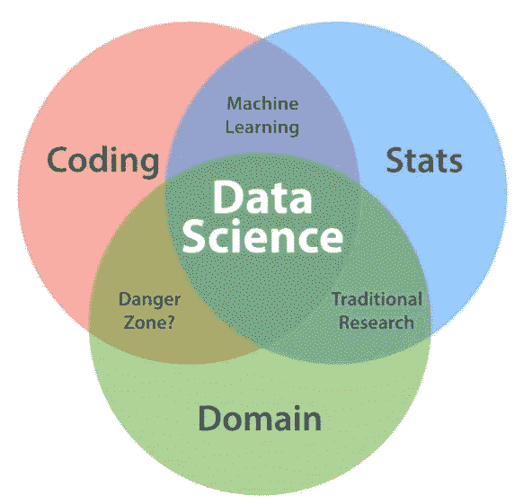

# 我是如何自学编码并获得数据科学职位的

> 原文：<https://towardsdatascience.com/how-i-taught-myself-to-code-and-a-landed-data-science-role-b2b801bf7779?source=collection_archive---------12----------------------->

这篇文章讲述了我如何自学编码、统计、商业，并将这些知识转化为数据科学家的经历。这些问题大部分来自几个人直接在 [LinkedIn](https://linkedin.com/in/lester-leong-mba-mafm-lssbb-09000165/) 上发消息给我[这篇文章](/starting-out-data-science-never-coded-b79ed985e661)。由于许多人有类似的问题，我决定在上面贴一篇文章来帮助其他有同样问题的人。

# 从你个人的为什么开始

我个人的原因是避免我不想要的东西，并围绕这个概念找到一种生活方式。我出身贫寒，父母是高中毕业生和低技能工人。金融危机期间，我们失去了家园，我也没有去顶尖的本科项目。我只是想避免因选择有限而带来的痛苦。

你自己的原因不必和我的一样。你可以通过其他各种方式成为数据科学家，例如渴望成为最好的，对人工智能的强烈好奇心，相信这是支持家庭的最佳方式，等等。关键是理性必须激励你。别人怎么看不重要，重要的是你怎么看。最重要的是，你相信它。

我之所以强调你个人对数据科学的信念和承诺，是因为这份工作可能非常困难。就我个人而言，有时我发现在商业环境中创造创新的解决方案是非常具有挑战性和令人讨厌的(例如，没有合适的人，没有合适的资源，没有来自管理层的支持，等等)。).在我早期，这种压力很大。随着我获得更多的经验，我已经学会享受这类问题。对于我解决的每一个难题，这都使我的技能比以前更上一层楼，而且这个解决方案通常在手边的问题之外有各种应用。这一成就促使我不断前进。

我的小咆哮的寓意是找到你可以相信的东西，这将是你在日常发展成为伟大的数据科学家的正常斗争中的指路明灯。现在来看问答的汇编。

# 制作我的代码

**当你对技术或编程感兴趣的时候，你多大？**

我第一次接触技术是在高中的时候，是以编码的形式。我有一个老师，他也是一名 IT 顾问。有趣的是，我只和他一起工作过，因为一次州编码竞赛给了前三名获胜者一次免费的旅行，去一家豪华的酒店参加全国竞赛。

我从来没有去过很多地方，我发现这个机会是一个看世界更多地方的机会。所以，我拿了。那是一场 C++编码比赛。我进来时以为老师会指导我如何改进 C++语言。可悲的是，事实并非如此。这更像是参加一场纸牌游戏比赛，让你自己想办法解决问题。除了 Kaggle 之外，您还可以学习其他内核和论坛。幸运的是，我以第三名的成绩勉强赢得了州比赛。

但是我赢的方式更有趣一点。基本上，我只知道非常基本的 C++命令。问题语句要求某种类型的程序需要一些条件语句和 for 循环。那时候，我一点都不知道那些东西。我所做的是看他们想要什么类型的输出和用户界面。我制作了一个非常基本的代码来回答他们的问题，但不是以他们想要的方式。基本上，我赌了一把，假设他们会问什么，这样代码就不会被破解。它得到了回报，我得到了一次免费旅行。当然，在国家舞台上，我失败得很惨，但当时我实现了我的目标。直到那时，我已经很久没有写代码了。我的“为什么”不够强大，无法长期持续下去。这只是一个短期的目的——免费旅行。我只是在读 MBA 期间，在研究生院重新开始学习编程。

是什么让你想学习如何编码？

除了计算我在 C++中的小任务，我真的从听到 quants(定量分析师的简称)的故事中获得了对编码的真正热情。对于那些不在金融领域的人来说，在数据科学家这个术语出现之前，定量分析师基本上就是专门研究金融的数据科学家。第一批著名的定量分析师实际上是前火箭科学家，他们想赚更多的钱，或者发现金融市场是一个需要解决的有趣问题。我了解到，最好的公司制造的人工智能交易模型在金融市场上表现出色(赚钱)。

由于生长在一个工人阶级家庭，我想也许在下一世，我可以在一些先进的科学领域获得博士学位，并将统计学、计算机科学(编码)和商业知识结合到一个量化职业中。然而，至少在某个地方尝试一下(统计、编码或商业)会很有趣，看看它是否能让我成为一名定量分析师。我知道，如果我采取任何行动，都会比什么都不做(100%没有机会)给我一个机会(至少是一个非常小的机会)。

**你用什么样的学习方式自学编码，你在学习中遇到了什么挑战？**

幸运的是，当我开始(再次)学习如何编码时，整个数据科学领域开始崛起。我拿起我能拿到的所有东西。数据科学在线订阅课程、经过测试的数据科学训练营试用版、MOOCs、书籍等。一开始，我完全迷失了。这非常令人沮丧。我很难理解每件事都做了什么，也很难运行基本的包。我唯一拥有的就是我没有放弃，尽管我一直都喜欢这样。让我坚持下去的是一个非常遥远的梦想，那就是有一天成为一名金融数据科学家，并建立一个人工智能交易模型。

# 积累商业知识和学习统计学

当我在学习编码的过程中给自己施加痛苦时，我意识到数据科学家了解统计和业务(或领域专业知识)，这也可以在下图中看到[1]:

为了提高我的统计和商业技能，我做了几件事。在统计学方面，我实际上回顾了 Khan Academy 的一些主题，并做了一些应用统计学的有趣项目。这些有趣的兼职项目之一是与我的职业扑克玩家朋友合作。他们教我如何将理论统计概念应用到实际实践中，这在风险管理和金融预测方面有商业应用。当然，附带的激励福利还包括赢钱。

在商业方面，我在攻读 MBA 的同时，还从事了一些小型咨询工作。现在大多数人不需要读 MBA，但是，在我的特殊情况下，我认为这是获得商业咨询工作的必要条件。我有一个哲学本科学位，所以大多数招聘经理只是扔我的简历，直到我开始一个 MBA 项目。我记得过去招聘人员告诉我，由于我的哲学背景，我在商业上什么也做不了。就我个人而言，我认为这是错误的——你可以增加动力来提高自己的另一种方式。在主题业务中，每种类型的业务都有细微差别，但作为数据科学家，你可以增加的主要价值是找出如何做两件事情中的至少一件:为公司带来更多的钱或节省更多的钱。如果你能把你的数据科学技能应用到其中任何一个方面，你将会在商业上走得很远。

# 构建职业生涯

**你是如何将你的数据科学技能转化为高薪职业的？**

数据科学有趣的一点是，构成数据科学家的三个主要组成部分可以让他独自获得高薪职业。编程可以让你成为一名伟大的软件工程师(例如，科技公司可以支付高达 40 万美元以上)。统计学可以让你在所有的概率问题上占据优势(比如扑克玩家——非常规或者教授/顾问——常规)。成为一名优秀的商业分析师本身也是一条多样化的职业道路(例如，投资者、投资银行家、金融分析师等)。).我基本上在这三个领域都辗转过，直到我得到了一个集这三者于一身的角色——数据科学家。

**就你的数据科学技能而言，你是通过什么途径获得一份 6 位数的工作的？**与我在数据科学领域的同行相比，我无疑拥有一条有趣的职业道路。我不是某个决定转向数据科学的数学或科学天才。我只是选择了一个发展方向，并且每天尽我所能做到最好。所以，我不能直接进入数据科学的角色。我所做的是业务分析师路线，并将其转换为数据科学角色。在我的业务分析师咨询工作中，我比我的同行工作得多，最终获得了数据科学的机会。一旦我做到了，我的数据科学技能增长到一个重要的水平，在那里我找到了一份工资超过 6 位数的数据科学工作。

**对于那些有兴趣自学数据科学的人，你会推荐他们采取哪些步骤？对于那些想以创造六位数为起点的人，你会给他们什么建议？我间接地讨论了别人可以做些什么来让自己成为六位数的角色。我一般意义上的建议是，真正找到一个你为什么要做数据科学的理由。实际上原因并不重要，重要的是它对你的影响。如果这个理由可以激励你，帮助你在发展成为数据科学家的各种挑战中前进，那么这个理由就是为你准备的。接下来是获取数据科学技能。所以，学 Python，SQL，Hadoop/Spark，统计学，还有一个专门的业务领域。了解代码和统计数据只会让你成为机器学习专家，但商业知识将启动一个利润丰厚的职业生涯，成为数据科学家。**

# 结论

我从未想过我会成为一名数据科学家。我原以为我只是一名商业分析师，以后会成为一名投资者。通过持续的数据科学日常开发和附带项目，我实际上获得了被聘为数据科学家的必要技能。作为一个之前没有数据科学背景，在本科毕业后才开始工作的人，你也可以。真正的问题是，不管你面临什么样的困难或问题，你是否愿意日复一日地坚持自我发展的原则？

*免责声明:本文陈述的所有内容均为我个人观点，不代表任何雇主。*

[1] B. Poulson，数据科学基础:5 部分系列(2019 年)，[https://datalab.cc/foundations/toc](https://datalab.cc/foundations/toc)