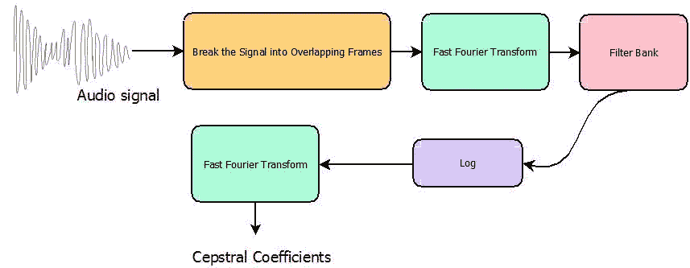
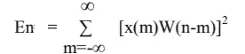
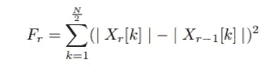

# 我是如何理解的:训练音频文件时需要考虑哪些特性？

> 原文：<https://towardsdatascience.com/how-i-understood-what-features-to-consider-while-training-audio-files-eedfb6e9002b?source=collection_archive---------8----------------------->


[Designed by Gstudioimagen — Freepik.com](http://freepik.com)

## **简介**

对于任何机器学习实验来说，首先需要收集数据。接下来的主要任务是将数据转换成特征，然后输入算法。这篇文章旨在简要介绍一些最重要的特性，这些特性可能是为音频分类任务建立模型所需要的。下面还展示了使用 Python 提取的一些特征。

## 一些主要的音频功能:

## **(1) MFCC(梅尔频率倒谱系数):**

又名“最常考虑的系数”，MFCC 是一个你会在任何涉及音频文件的机器学习实验中看到的特征。
正如这篇[文章](https://medium.com/prathena/the-dummys-guide-to-mfcc-aceab2450fd)中正确提到的，人类发出的任何声音都是由其声道的形状决定的(包括舌头、牙齿等)。如果这个形状能够被正确地确定，那么产生的任何声音都能够被准确地表现出来。语音信号的时间功率谱的包络代表声道，而 MFCC(它只不过是构成*梅尔频率倒谱* ) 的系数)精确地代表了这个包络。

通常，MFCC 的前 13 个系数(较低的维度)被作为特征，因为它们代表光谱的包络。而被丢弃的更高维度表达了光谱细节。对于不同的音素，包络线足以表示差异，所以我们可以通过 MFCC 来识别音素。



Flowchart for obtaining MFCC coefficients

(考虑阅读这篇关于 MFCC 的[文章](https://medium.com/prathena/the-dummys-guide-to-mfcc-aceab2450fd)以深入了解它。)

```
import librosa
y, sr = librosa.load(librosa.util.example_audio_file(), offset=30, duration=5)
print(librosa.feature.mfcc(y=y, sr=sr))
```

## **(2)过零率:**

过零率是对给定时间间隔/帧中语音信号的幅度通过零值的次数的度量。这个特征在[语音识别](https://en.wikipedia.org/wiki/Speech_recognition)和[音乐信息检索](https://en.wikipedia.org/wiki/Music_information_retrieval)中被大量使用，是对打击乐声音进行分类的关键特征。它还广泛用于其他音频[应用领域](https://www.sciencedirect.com/topics/computer-science/application-domain)，如音乐流派分类、精彩片段检测、语音分析、音乐中的歌唱声音检测以及环境声音识别。区分浊音和清音的最简单方法是分析过零率。大量的过零点意味着没有主要的低频振荡。

```
import librosa 
y, sr = librosa.load(librosa.util.example_audio_file())
print(librosa.feature.zero_crossing_rate(y))
```

## **(3)能量**

语音信号的短时能量提供了反映幅度变化的便利表示，并且可以定义为



语音信号的短时能量反映了振幅的变化。在一个典型的语音信号中，我们可以看到它的某些特性会随着时间发生很大的变化。例如，我们可以观察到信号峰值幅度的显著变化和语音信号中有声区域内基频的显著变化。这些事实表明，简单的时域处理技术应该能够提供有用的信号特征信息，例如强度、激励模式、音调，甚至可能是声道参数，例如共振峰频率。

## (4)光谱衰减

这是功率谱右偏量的一种度量。频谱滚降点是功率谱中 85%的功率处于较低频率的频段的分数。也就是说，滚降是 85%的累积频谱幅度集中在该频率以下。像质心一样，对于右偏光谱，它具有更高的值。

```
import librosa
S, phase = librosa.magphase(librosa.stft(y))
print(librosa.feature.spectral_rolloff(S=S, sr=sr))
```

## (5)光谱通量

它由跨频率求和的频谱幅度矢量的帧间平方差给出，即



它提供了对局部光谱变化率的测量。光谱通量的高值指示光谱量值的突然变化，因此在第 r 帧处可能存在片段边界。

```
import librosa
y, sr = librosa.load(librosa.util.example_audio_file(), duration=10.0)
onset_env = librosa.onset.onset_strength(y=y, sr=sr)
print(onset_env)
```

## (6)谱熵

在语音活动检测中，熵被用于检测语音的无声区和有声区。这一特征的区别特性使其在语音识别中得到应用。熵可用于捕捉分布的共振峰或峰值。共振峰及其位置被认为对语音跟踪很重要。因此，熵的峰值捕捉能力被用于语音识别。

## (7)色度特征

在音乐中，术语 ***色度特征*** 或 ***色度图*** 与十二个不同的[音高等级](https://en.wikipedia.org/wiki/Pitch_classes)密切相关。基于色度的特征，也称为“[音高类别简档](https://en.wikipedia.org/wiki/Harmonic_pitch_class_profiles)”，是一种分析音乐的强大工具，这些音乐的音高可以有意义地分类(通常分为十二类)，并且其调音接近于[等度音阶](https://en.wikipedia.org/wiki/Equal_temperament)。色度特征的一个主要属性是它们捕捉音乐的谐波和旋律特征，同时对音色和乐器的变化具有鲁棒性。下面列出了两个主要的色度特征:

(a) *色度向量:*
频谱能量的 12 元素表示，其中面元表示西方类型音乐的 12 个相等调和音高类别(半音间距)。
(b) *色度偏差:*
12 个色度系数的标准偏差。

```
import librosa
y, sr = librosa.load(librosa.util.example_audio_file())
print(librosa.feature.chroma_stft(y=y, sr=sr))
```

## (9)音高

音高是一种听觉感受，其中听者主要根据他们对振动[频率](https://en.wikipedia.org/wiki/Frequency)的感知，将[乐音](https://en.wikipedia.org/wiki/Musical_tone)分配到[音阶](https://en.wikipedia.org/wiki/Musical_scale)的相对位置。音高与频率密切相关，但两者并不等同。频率是一个客观的、科学的属性，可以测量。音高是每个人对声波的*主观感知*，无法直接测量。然而，这并不一定意味着大多数人不会同意哪个音符更高和更低。

```
import librosay, sr = librosa.load(librosa.util.example_audio_file())
pitches, magnitudes = librosa.piptrack(y=y, sr=sr)
print(pitches)
```

“那都是乡亲们！”，音频分类的一些最常用功能介绍到此结束。