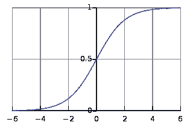
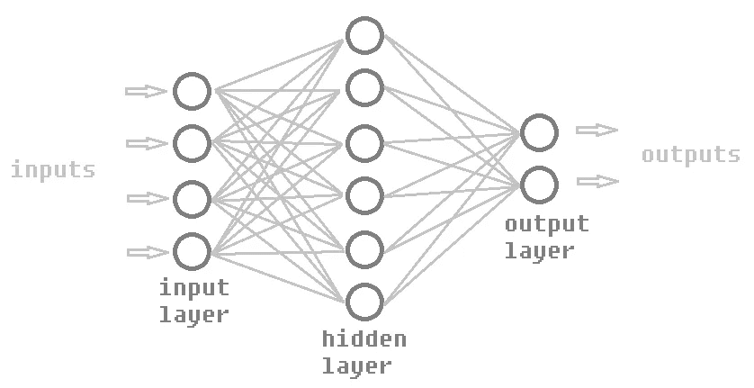

# 一个神经网络如何发现我游戏的漏洞？

> 原文：<https://towardsdatascience.com/how-i-used-ai-to-accidentally-find-a-loophole-in-my-game-dd56f40c8553?source=collection_archive---------20----------------------->

## 神经进化导论

## 进化出一个 AI 来玩游戏，它却选择了嘲讽！

Photo by [Adam Muise](https://unsplash.com/@muiseadam?utm_source=unsplash&utm_medium=referral&utm_content=creditCopyText) on [Unsplash](https://unsplash.com/s/photos/robot?utm_source=unsplash&utm_medium=referral&utm_content=creditCopyText)

在你研究*一个人工智能如何*操控我的游戏之前，让我们先熟悉一下**【神经进化】**的基础知识，以理解*为什么*会发生这种情况。

> **神经进化**
> **1 主要涉及 2 件事。**遗传算法
> **2。**神经网络

# 遗传算法

这种算法背后的概念受到达尔文进化论的启发。

这些是遗传算法的主要阶段…

1.  生成一个**随机群体**
2.  计算群体中每个成员的**适应度**
3.  执行**自然选择**
4.  与自然选择的成员进行**交叉**
5.  作为杂交的结果，对后代随机应用**突变**
6.  新的种群被创建，丢弃旧的一代并转到 ***步骤 2***

看，你可能会从人类或其他生物的现实世界进化中得到这种直觉，但毕竟要记住，遗传算法基本上是一种搜索算法。

考虑这个图，假设你想搜索一个(x，y)点，使得**‘z’**值最大。最初，该图将是完全未被探索的，所以除了初始点之外，你不能真正确定图中任何其他点的**‘z’**值。

我们可以应用许多搜索算法来帮我们做到这一点，但是让我们看看遗传算法是如何做到的。

## 步骤:随机总体

首先，在 GA(遗传算法)中，我们将从几个随机点开始，或者我们可以说是来自解空间的随机猜测。例如，在上图中，我们看到**‘x’**值可以是从-3 到+3 的任何值，同样的范围也适用于**‘y’**。

所以我们的随机猜测可能看起来像…

如果我们就 GA 而言，那就是*随机人口* 一代。我们基本上生成了一个(x，y)对的随机群体，每个都有一些**‘z’**值。这些**‘x’**值和**‘y’**值可以认为是**基因**。

## 步骤:适合度计算

现在是*适合度计算*，这是因为我们想要判断哪个随机猜测比其他的更好，我们需要一些具体的比较。
所以我们必须定义一个**适应度函数**，它将表示随机猜测的适应度。在这个例子中，非常简单，因为我们需要具有最大“z”值的(x，y)对，所以对于一些随机猜测，它们的“z”值可以作为它们的适合度分数。

> 适应度(x，y) = z 值

因此，现在考虑适应度函数，我们查找每个点的 z 值，并得到它们之间的关系，如下所示。

> 健身( **-2.2，2.3** ) >健身( **0.1，-2.4** ) >健身( **2.0，1.4** ) >健身( **1.0，2.0** )

## 步骤:自然选择

现在我们执行*自然选择*，也就是随机选取随机猜测中的一个，但是随机选取是基于概率分布的。这意味着具有更高适应值的那些将更有可能被自然选择**。**体能非常低的可能不会被选中。

> “适者生存”——查尔斯·达尔文

比如说 pairs **(-2.2，2.3)** & **(0.1，-2.4)** 得到选择。

## 步骤:交叉

下一步是*杂交*或者简单地说，这两个自然选择对的基因混合在一起，形成一个新的杂交对*，也就是后代！*

( Crossover )

上图说明了本例中交叉是如何发生的。它混合父母双方的基因，形成一个单一的后代。我们多次重复自然选择，进行杂交来产生后代。

## 步骤:突变

现在，在这些新的后代身上，我们进行**‘突变’**，这意味着随机改变它的基因值。虽然突变的发生取决于**突变率**，但是如果突变率为 100%，那么所有产生的后代都会发生突变，如果突变率为 5%，那么只有 5%的后代会发生突变。

( Mutation )

上图显示了**‘y’**值如何随机突变为-2.3。变异是为了保持种群的多样性，因为如果种群保持不变，那么我们就不能尽可能多地探索图表，结果，我们就不会到达最高点。

现在，在应用突变后，我们有了一个全新的后代群体，这可能比上一代群体更好，或者我们可以说是上一代，因为我们倾向于从一个群体中选择更好的成员(通过自然选择)，然后混合他们的基因(通过杂交)。

在这一点上，我们将丢弃旧的代，并开始在这个新的代上从适应性计算再次执行相同的步骤。

(that’s the rough big picture of GA)

随着这个循环的继续，一段时间后，所有成员将收敛到同一点，这将是解决方案空间的最高点，这是我们的目标，这是当这个算法停止。

👇关于这个话题的推荐视频👇
[遗传算法:简介|编码训练](https://www.youtube.com/watch?v=9zfeTw-uFCw)
[学习:遗传算法|麻省理工学院开放式课程](https://www.youtube.com/watch?v=kHyNqSnzP8Y)

# 神经网络

Biological Neuron (Image source: Wikipedia)

神经网络的想法来源于人脑本身。这个概念解释了我们如何学习东西，基于我们可以应用同样的概念让计算机学习东西！

人工神经网络是以生物神经网络为基础的，虽然它们不完全相同，但人工神经网络可以看作是实际生物神经网络的抽象。

## 神经元

神经网络是由一堆相互连接的神经元组成的。因此，在研究神经网络之前，让我们先来看看我们在人工神经网络中使用的单个“神经元”。我们将这种人工神经元命名为**感知器**，因为它们的实现略有不同，但为了保持生物学上的类比，我们还是继续称它为神经元吧。

( Artifical neuron )

把这个神经元想象成一个函数，它接受一堆输入(实数)并给出一个输出。所以现在的问题是这个函数对它的输入做了什么来产生输出。
你可以在上面的神经元图中看到，每个输入值都通过一条边传递给神经元，这条边有一个**“权重”**与之关联。

即，如图所示，当输入“x1”通过权重为“w1”的边到达神经元时，神经元的值变为 x1 * w1。

( Operations happening inside a neuron )

然后，将从不同输入边缘接收的所有此类值相加，然后还有一个名为**‘bias’**的值与神经元相关联，从该总和中减去该值，然后将该结果传递给**激活函数。**

这个激活功能是什么？这个有很多选项，假设是一个 **sigmoid 函数。**

Sigmoid function (Image source: Wikipedia)

该函数接受任何实数，并将其压缩到 0 到 1 之间。

所以，这个激活函数的输出就是神经元的输出。该偏差用于在进入激活功能之前设置阈值。

好吧，一个神经元没问题，但是有什么用呢？
例如，你可以用一个神经元实现**与门**！

由于输出是由 sigmoid 函数给出的值，它的范围可以从 0 到 1。所以，如果我们得到 ***输出<****0.5，我们就认为 ***结果= 0*** 同样如果 ***输出> 0.5*** ，我们就认为 ***结果= 1****

> *设 **w1 = 2.0** ， **w2 = 2.0** 和**偏差= 3.0***

*现在让我们用所有的输入来测试一下*

> *如果 **x = 0，y = 0**输出
> = sigmoid(x * w1+y * w2-bias)
> = sigmoid(0 * 2+0 * 2-3)
> = sigmoid(-3)
> = 0.04743*
> 
> ***输出< 0.5，结果= 0***
> 
> *如果 **x = 0，y = 1**
> 输出
> = sigmoid(x * w1+y * w2-bias)
> = sigmoid(0 * 2+1 * 2-3)
> = sigmoid(-1)
> = 0.26894*
> 
> ***输出< 0.5，结果= 0***
> 
> *如果 **x = 1，y = 0**
> 输出
> = sigmoid(x * w1+y * w2-bias)
> = sigmoid(1 * 2+0 * 2-3.5)
> = sigmoid(-1)
> = 0.26894*
> 
> ***输出< 0.5，结果= 0***
> 
> *如果 **x = 1，y = 1**输出
> = sigmoid(x * w1+y * w2-bias)
> = sigmoid(1 * 2+1 * 2-3.5)
> = sigmoid(1.0)
> = 0.73106*
> 
> ***输出> 0.5，结果= 1***

*但是我们是怎么发现这样的**权重**和**偏差**的呢？这个**‘设置权重和偏差’**部分就是**学习**逻辑的全部所在。在建立输入和输出模式之后，我们需要做的就是为这些权重和偏差找到合适的值！基本上，学习就是这么简单！我们将很快回到学习部分。*

*现在，你可能会觉得，*“gate 很无聊…我们不能做一些更酷的东西吗？”*
当然！我们当然会，但在此之前让我告诉你，单个神经元不足以解决所有类型的问题，因为它们只能解决**线性可分的**问题。*

**

*非正式地说，你需要更多的神经元来做酷的事情！*

## *多层人工神经网络*

*多层安来救援了！
它有 3 种层次:*

1.  *输入层*
2.  *隐蔽层*
3.  *输出层*

**

*( Multilayer artificial neural network )*

*可以有多个隐藏层，这取决于用例。每层中神经元的数量也取决于用例。每个神经元都连接到下一层的所有神经元(尽管它们可以部分连接)。每个神经元都有一个偏差值，每个连接都有与之相关的权重。从输入到输出逐层处理的过程称为**前馈**。*

*为了理解它，把整个神经网络想象成一个**函数**，它可以接受输入并返回输出。
例如，你可以设计人工神经网络，将矩形的边作为输入，矩形的面积作为输出，但我们可以通过简单的逻辑自己完成。
但是我们使用神经网络推导一个直截了当的逻辑并不那么容易。考虑编写一个计算机程序的问题，该程序拍摄手写数字的照片并猜测它是什么数字。在这种情况下，输入神经元将是所有像素，输出将是所有数字的 10 个神经元，您可以试验隐藏层。*

**

*Handwritten digit classifier ANN’s feedforward (Source: 3blue1brown)*

*好的，这个输入和输出部分很好，但是权重和偏差是怎么回事？这就是使这些输出成为可能的东西，没有正确的权重和偏差，神经网络只是一个愚蠢的东西！*

**

*ANN with random weights and biases (Source: 3blue1brown)*

## *那么，神经网络是如何学习的呢？*

*对此有几种方法。其中之一是用随机权重初始化人工神经网络，并用一些带标签的数据集训练它，根据误差，我们通过反向传播不断调整它的权重和偏差，反向传播使用一种称为梯度下降的概念。这种学习被称为**监督学习**。*

*我们也可以用**强化学习**。在这里，代理开始在其随机初始化的状态下执行，并根据其动作的结果不断调整。我们可以应用遗传算法来实现这种行为，让我们在下一节看到这一点。*

*👇关于这个话题的推荐视频👇
[但是什么是神经网络呢？| 3 蓝色 1 棕色](https://www.youtube.com/watch?v=aircAruvnKk)*

# *神经进化*

*使用**遗传算法**进化**神经网络**是“神经进化”。话虽如此,“神经进化”这个术语还是有道理的，对吧？*

> *神经网络+进化=神经进化*

*首先，我们确定问题陈述并设计合适的神经网络架构。但是为了让它正确地工作，我们需要为它找到正确的权重和偏好，所以现在 GA 就出现了。*

*我们为它们的连接生成多个初始化了随机权重的人工神经网络，从而得到人工神经网络的随机群体。所以，这里所有这些随机产生的权重会导致一些愚蠢的人工神经网络，但是因为它是随机的，一些人工神经网络会不那么愚蠢，一些会更愚蠢。我们知道这个神经网络应该做什么，所以通过它的性能，我们可以计算它的**适应度**。在这里，权重和偏差就是人工神经网络的基因。基于适应值和概率分布**，自然选择**将会发生。对于**交叉**，自然选择的人工神经网络的权重和偏差将被混合以形成混合人工神经网络。在**突变**期间，一些权重和偏差会发生轻微的随机变化。通过自然选择、交叉和变异，随着新一代的发展，人工神经网络开始在适应度函数的指导下进行改进。*

**

*(Basic neuroevolution algorithm)*

*尽管它仍然是一个搜索算法。早些时候，当我们试图使用 GA 找到最佳的 **(x，y)** 点时，我们实际上是在探索 X 轴*和 Y 轴*的二维空间。类似地，这里假设人工神经网络的每个连接的权重和每个神经元的偏差有一个维度，很难直观地想象，但基本上我们正在探索所有权重&偏差的维度空间，并试图在该空间中找到最佳权重和偏差向量。*

*当我们保持这个循环运行时，最终人工神经网络应该按照我们预期的方式运行。*

*👇关于这个话题的推荐视频👇 [神经进化导论|编码序列](https://www.youtube.com/watch?v=lu5ul7z4icQ)*

# *神经网络的恶作剧*

*我受到了这个[Flappy Bird with neuro evolution](https://www.youtube.com/playlist?list=PLRqwX-V7Uu6Yd3975YwxrR0x40XGJ_KGO)编码挑战的启发，他们使用神经进化让计算机学会自己玩游戏。[查看他们项目的现场版](https://editor.p5js.org/full/wb-QHVXBq)。*

*所以，我想在其他游戏上做一个类似的项目，所以我开始寻找一个简单的游戏，在那里我可以应用这个算法。*

*经过一番研究，我决定制作自己的游戏😛然后用这个算法。*

*这个项目有两个部分:*

1.  *设计并实现游戏*
2.  *对其应用神经进化算法*

*现在，设计游戏…长话短说，我想出了这个游戏叫做*‘逃跑跳跃’***(一个朋友帮我起的名字🙃)***

******

***(Me playing the escape jump game)***

***在这里，你用箭头键控制那个红色球，你必须在它挤压你之前通过管道*(黑条)*之间的空间*逃脱*或*跳跃*，在这一点上两个管道将关闭在开始时是未知的，所以当它们出现时，你必须迅速做出判断。如果你在台式机上，你现在就可以从[这个链接](https://savvysiddharth.github.io/escape-jump/)开始尝试这个游戏。试试看能打多少分，以后看 AI 自己打多少分！***

***好吧，我知道这个游戏看起来不太好，尽管我认为它对于这个实验来说已经足够好了，不是吗？这不太容易也不太难，我认为这是一场公平的比赛。***

***但是生活从来没有像我感觉的那样😅然而我还是跟着它走，想看看它会走向何方。***

******

***(ANN architecture I used)***

***对于神经进化，我们用多个球来初始化游戏，每个球都有自己的人工神经网络(如上图所示)，人工神经网络为它们做出决定。人工神经网络在每一帧获取输入，并根据人工神经网络的输出采取行动。***

***(Inputs and Outputs of ANN in code)***

***上面的函数来自于“球”类。它显示了它如何将输入传递给人工神经网络，以及它如何使用人工神经网络的输出来决定是跳跃还是移动。***

***我们让所有的球在同一个游戏中一起玩。球在游戏中存活的秒数可以被认为是它们的适合度。当球被挤在管子之间时就会死掉。当所有的球都死了，我们会有每个球的适应值，在此基础上我们可以执行*自然选择*、*交叉*、*变异*，然后新的一代出现。***

******

***(Initiating neuroevolution algorithm)***

***所以，这就是它看起来的样子，现在如果你已经看到那只 [flappy bird](https://editor.p5js.org/full/wb-QHVXBq) 是如何使用这种算法来学习自己玩游戏的，你就可以想象这个游戏应该如何进行了。它应该已经学会像我们平常一样玩耍，类似于我在第一个动画中所扮演的角色。***

***所以，我运行了几代，对它对游戏的影响感到惊讶，感觉就像电脑在取笑我的游戏😂***

******

***Here’s what it learned after a few generations (animation played at 4x speed)***

***于是，这个算法找到了一个可以每隔一段时间就不停跳跃，打败游戏的地方！哇！虽然最初，我有点难过意识到我的游戏太容易玩了，然后我意识到一个*人工智能*告诉我，我意识到我只是不小心用人工智能找到了一个游戏漏洞，这样感觉更好。***

***不过，我从未修补过那个漏洞😜，可能我就这样保存代码吧。***

***就是这样！***

***如果你想看看这个模拟并玩玩它，[检查一下这个](https://savvysiddharth.github.io/visBlog/neuroevolve.html)
如果你想看看这个代码，这里有一个到它的 [GitHub 库](https://github.com/savvysiddharth/NE-escape-jump)的链接***