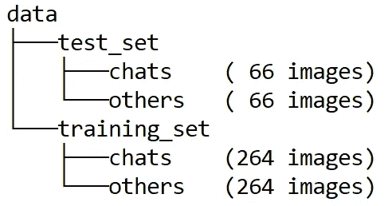
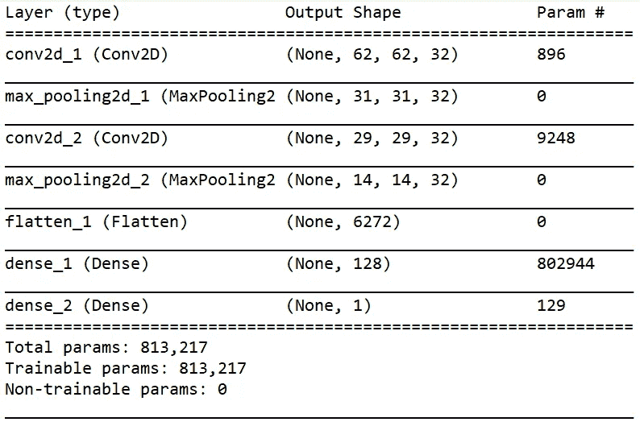
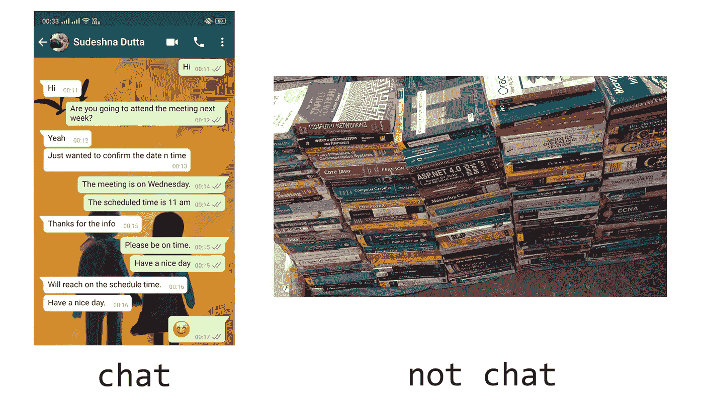

# 我如何使用机器学习来检测手机上的聊天截图

> 原文：<https://towardsdatascience.com/how-i-used-machine-learning-to-detect-chat-screenshots-on-my-phone-a46d875b07af?source=collection_archive---------10----------------------->


Image from Unsplash

有些时候，我们不是告诉朋友我们在某个消息应用程序上的聊天，而是把那次聊天的截图发给他们。如果你发送或接收了大量的截图，那么最终你手机的大部分内存会被封锁。我就是这种情况。在保证重要图像安全的同时找到并删除这些截图是一项极其耗时的任务。然后一个简单的(假设对 ML 有一点了解)想法出现在我的脑海里…

# 想法

我意识到**从普通图像中检测聊天截图的任务可以表述为一个经典的二值图像分类问题！**我们可以使用卷积神经网络(CNN)来完成这项工作。CNN 的输入层将是一个图像，输出层将只包含一个神经元，告诉我们输入图像是正常图像还是聊天截图。在接下来的章节中，我将介绍构建模型的所有细节。

# 数据收集

在机器学习中，一切从数据开始。在这个分类问题中，我们有**两类:【聊天】和【不聊天】**。第一个表示聊天截图，另一个表示普通图片。所以我收集了我和朋友们在不同消息应用上聊天的截图，比如 WhatsApp，Messenger，Instagram 等等。第二节课，我从手机和互联网上收集了一些人物、地点、风景的随机图片。总共我拍了 ***660 张*** 图片(每班 ***330 张*** )。请注意，对于许多更难的问题来说，这些数据量是不够的。

# 列车测试分离

我用 ***80%*** 的数据进行训练，剩下的用于测试。为了能够在 Keras 中使用 flow_from_directory 函数，我像这样组织数据…



Folder tree of data

# 构建模型

每个 CNN 由两个主要部分组成:卷积基和全连接网络。在卷积库中，我使用了两个卷积块，每个包含 ***32 个*** 滤波器。内核大小为**3 * 3。第一个卷积层的输入尺寸为 ***64*64*3*** (大小为 ***64 px*64 px*** 的 RGB 图像)。每个卷积块后面是一个大小为 ***2*2*** 的 max_pooling 层。Relu 激活功能用于卷积层。卷积模块的输出被展平为一个向量，以将其传递给全连接网络。隐藏层由 ***128 个*** 神经元组成。该层的激活功能再次被 Relu。输出层(即最后一层)只包含一个告诉我们结果的神经元。由于这是一个二进制分类问题，我在这一层使用了 sigmoid 函数，该函数输出一个在 ***0*** 到 ***1*** 之间的数字( ***p*** )，表示输入图像属于“聊天”类别的概率(如果 ***p≤0.5*** ，则“聊天”否则“不聊天”)。下面是实现…**



The architecture of the model

# 输入数据

由于数据是以上面提到的特定方式组织的，现在我们可以使用 Keras 的 **ImageDataGenerator** 类和 **flow_from_directory** 方法来扩充并将其提供给模型。首先，创建一个 ImageDataGenerator 对象。在这个对象的帮助下，我使用了缩放，剪切，翻转变换来增加数据。图像应通过系数 ***1/255.0*** 进行重新缩放，以标准化像素值。现在，目录路径、class_mode 和 target_size 作为 flow_from_directory 方法的参数传递，这有助于将数据提供给模型。我们必须将这个过程进行两次(一次用于训练数据，另一次用于测试数据)。**这里需要记住的一件重要事情是，只有训练数据需要扩充，而不是测试数据。**这是关于这个的代码…

# 培养

现在到了模型学习的部分。这里我们需要一个优化器，因为学习只不过是通过更新模型的权重和偏差来优化成本函数。在这种情况下，我选择了 **Adam optimizer** 。成本函数是**二元交叉熵**(因为这是二元分类)。Keras 提供了一个名为 **fit_generator** 的函数，可以用来运行训练。在这里，我们还可以设置历元数、每历元步数和验证步数。由于数据相对较少，因此我使用了 **steps_per_epoch =训练样本数**和 **validation_steps =测试样本数。**

# 结果

仅经过 ***5*** 个历元后，模型达到了*99%的训练准确率和*98%的测试准确率。一旦我们保存了模型，我们就可以多次使用它。为了能够使用该模型预测新图像，我们必须将图像整形为 ***64*64*3*** 并对像素进行归一化。这个[脚本](https://github.com/Suji04/Chat_ScreenShot_Classifier/blob/master/load%20model%20and%20predict.py)为我们做了这项工作。以下是一些预测示例…**

****

**Images from the author’s collection**

**在这里找到完整的代码。**

# **如果你真的很兴奋**

**要使用这个模型来分类手机上一个文件夹的所有图像，你只需要遍历这个文件夹，一次传递一个图像给这个模型。类似这样的…**

```
**import glob
for img_file in glob.iglob(“dir_name/*”):
  new_image = load_image(img_file)
  pred = classifier.predict(new_image)
  if pred<.5 : print(“chat”)
  else : print(“not chat”)**
```

## **还好奇？看一个我最近做的视频…**

**我希望你喜欢阅读。下次见…学习愉快！**