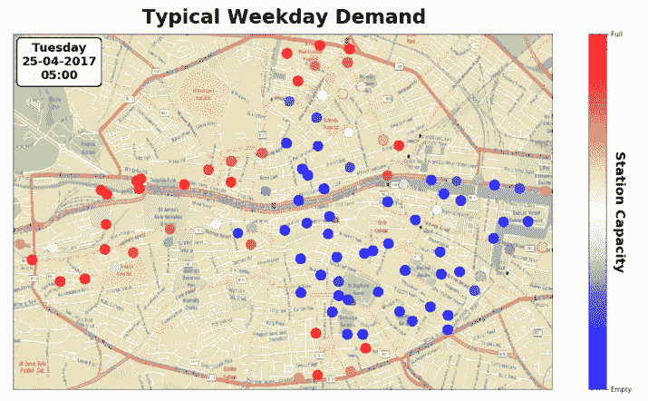

# 我如何使用统计数据来改善我的都柏林自行车运输

> 原文：<https://towardsdatascience.com/how-i-used-machine-learning-to-improve-my-dublin-bikes-transit-b6bdc7c2b5cb?source=collection_archive---------34----------------------->

作为都柏林自行车的用户，我很高兴地发现实时自行车数据可以通过爱尔兰国家开放数据项目免费在线获取。不仅如此，一个用户已经收集了几个月的数据，[在网上分享了这些数据。都柏林自行车是环游城市的绝佳方式，但像许多城市自行车计划一样，它们经常面临在满站/空站长时间等待的挑战。在繁忙的商业区工作，如果你不走运的话，你会发现自己等了 10 分钟甚至更久。](/usage-patterns-of-dublin-bikes-stations-484bdd9c5b9e)

我决定更深入地研究这些数据，看看我能否回答突然出现在我面前的 3 个特定问题。

*   我的轶事经验与数据相符吗？
*   如果是，这些使用模式的趋势有多强？可以用统计学建模吗？
*   我如何利用这些数据来改善我(和其他人)的用户体验？

但是在我开始之前，让我介绍一下我一直在处理的数据(如果你不喜欢，可以跳过这一段)。Dublin Bikes API 返回城市中每个车站的可用自行车的当前数量。在 6 个月的时间里，每 2 分钟收集并存储一次这些数据，同时还有一个单独的 API 调用来收集同步的天气信息。此外，还有一个静态文件，包含每个站点的位置和容量。与大多数数据集一样，通常的疑点(缺失数据、数据格式等)也存在一些挑战，因此在预处理之后，我得到了连续 36 天近乎完美的都柏林自行车数据。我们可以从这些数据中看到一个典型的工作日，并检查一天中每个车站的需求是如何变化的。

Visualisation of how full each bike station is across a typical weekday. Dublin locals might notice the Heuston train station nodes filling up very quickly in the evening as people cycle to get the train home.

这样一来，让我们看看能否依次解开我的 3 个问题。

> 我的轶事经验与数据相符吗？

我对都柏林自行车的体验相当不错。它们为市内短途旅行提供了快捷、方便的方法。然而，我偶尔有过这样的经历:在傍晚六点钟，在雨中站在一个空的自行车站，只希望有人来把自行车放下。问题是，每个人似乎都在做同样的旅行:早上，人们从郊区进入市中心，而在晚上，情况正好相反。上面的视觉化似乎同意这一点，但是，为了验证，我决定画出在整个 36 天的每个时间点使用的自行车数量。结果让我有些吃惊！不仅早上/晚上的峰值清晰，而且在工作日之间也非常一致。

Number of bikes being used across the entire city over all 36 days

早高峰出现在 9 点之前，而且似乎总是比晚高峰稍忙一些。周二是一周中最忙的一天，而周五晚上的需求往往较少(大概是因为人们喜欢在周末去喝一杯，而不是赶回家)。我们还可以观察到第三个较小的峰值出现在中午，它与午餐时间密切相关。数据清楚地证实了我对该方案的体验。

> 这些使用模式的趋势有多强？可以用统计学建模吗？

根据我们在之前的图中已经观察到的模式来判断，这些数据看起来是时间序列建模的理想候选。从用户的角度来看，使用中的自行车数量很有趣，但知道可用自行车的数量更有用，所以我决定将它建模为因变量。

自回归综合移动平均(ARIMA)是时间序列数据建模的一种较为成熟的方法，对于这个问题很有意义。此外，有一个明显的每周季节性需要处理，我想考虑到天气和假期的外生变量。因此，我用 SARIMAX 模型来拟合数据，它表现得相当好。当我从训练集的末尾推断模型预测时，它们与测试集的基本事实非常接近。

A snapshot of the performance of my SARIMAX model predicting the number of available bikes across the city in the coming days

平均绝对百分比误差(MAPE)仅为 2.22，表明该模型表现良好，预测值与真实值的平均差异仅为 2%左右。可以得出这样的结论:城市中自行车的使用可以被非常准确地建模，这为在现实世界的应用中使用这些数据提供了一个很好的机会。

> 我如何利用这些数据来改善我(和其他人)的用户体验？

基于到目前为止我所讨论的一切，我很高兴看到人们如何使用这些数据来改善他们自己的用户体验。对我来说特别有用的一个想法是实时估计离我最近的车站的等待时间。我决定制作一个简单的原型应用程序(点击这里查看 python 脚本)，它具有以下功能:

1.  通过公开可用的 API 获取当前都柏林自行车实时数据。
2.  将等待时间建模为指数分布，并基于历史数据，估计自行车到达城市中每个空车站的等待时间。
3.  调用[谷歌距离矩阵 API](https://developers.google.com/maps/documentation/distance-matrix/start) 来计算从我现在的位置到 100 多个自行车站的步行距离。
4.  结合到每个车站的步行距离和在同一个车站的预期等待时间，来估计我跳上实际自行车的总时间。
5.  最后，再调用两次 google API 来获取从我当前位置到最近的自行车的方向，并将其作为输出。

当我今天晚上运行脚本时，我的当前位置离我工作的地方很近，它给我提供了到汉诺威码头的步行方向，步行不到 4 分钟，并告诉我在下一辆自行车可用之前，我有 1 分钟的等待时间。

Directions from my current location to nearest available bike in terms of walking time combined with my expected waiting time at the station

事实上，本森街是离我最近的车站，但由于剧本考虑了自行车到达的预期等待时间，所以它把我送到了汉诺威码头，预计那里会更快有自行车可用。那很方便！

My nearest bike stations ordered by which I can walk to and get a bike at soonest

感谢阅读！我很高兴听到任何反馈，因为还有很多可以用这些数据做的事情。关于这篇文章背后我的分析的更多技术细节，请查看 Github 上的[。](https://github.com/alanjeffares/data-science-nanodegree/tree/master/dublin-bikes-analysis)