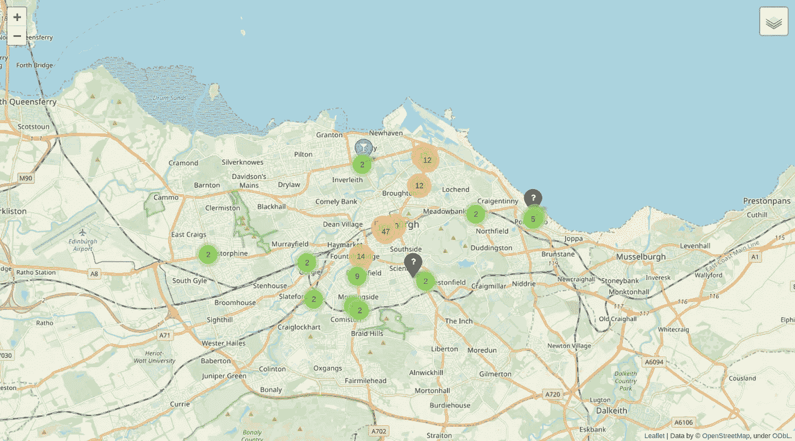

# 我如何使用 Python 和开放数据来构建爱丁堡啤酒花园的交互式地图

> 原文：<https://towardsdatascience.com/how-i-used-python-and-open-data-to-build-an-interactive-map-of-edinburghs-beer-gardens-cad2f607e57e?source=collection_archive---------28----------------------->


Summertime — Photo by [Tomasz Rynkiewicz on Unsplash](https://unsplash.com/@thmsr)

随着夏天终于到来，我想在我的家乡爱丁堡找到一个在户外享受冰镇饮料(含酒精或不含酒精)的好地方。因此，我将一个关于椅子和桌子许可的开放数据集与一些地理编码结合起来，创建了一个爱丁堡户外座位的交互式地图。

# 背景和项目描述

在过去的几年里，英国政府机构一直致力于[开源他们的数据](https://www.computerworlduk.com/data/how-uk-government-uses-open-data-3683332/)，爱丁堡市议会也不例外。在[https://edinburgphopendata . info](https://edinburghopendata.info)，你可以找到一个包含公共生活许多方面信息的数据集列表(尽管有些文件确实需要更新)。例如，[这个](https://data.edinburghopendata.info/dataset/tables-and-chairs-permits)页面包含 2014 年桌椅许可证的详细信息。幸运的是，在这里可以找到最新版本。请注意，虽然这两个文件的文件结构是相同的，但是文件头是不同的，所以如果您想查看历史数据，您需要相应地修改下面的代码。该文件包含允许摆放椅子的场所的名称和地址以及一些附加信息。该文件构成了本项目的基础，分为四个部分:

*   获取并加载许可文件
*   使用 open street map API 获取每个机构的纬度和经度以及服务地址类别
*   清理并装箱服务地址类别
*   用叶子在地图上标出经营场所

事不宜迟，我们开始吧。完整的笔记本可以在我的 [GitHub](https://github.com/walkenho/tales-of-1001-data/blob/master/beergarden_happiness_with_python/beergarden_happiness_with_python.ipynb) 上找到。

# 步骤 0:设置

首先，我们导入库。

```
import pandas as pd
import requests
import wgetimport folium
from folium.plugins import MarkerCluster
```

# 步骤 1:获取数据

我们使用 wget 下载文件，并将其读入熊猫数据框。确保设置编码，因为文件包含特殊字符(列表中有很多咖啡馆)。

```
filename = wget.download("http://www.edinburgh.gov.uk/download/downloads/id/11854/tables_and_chairs_permits.csv")df0 = pd.read_csv(filename, encoding = "ISO-8859-1")
df0.head()
```

Premises with Table and Chair Permits in Edinburgh

快速浏览一下数据就会发现数据中有几处重复。这主要是由于多个许可的开始和结束日期不同。一种很好的清理方式是按日期过滤，但是坦白地说，我现在不太在乎，所以我只保留服务地址和名称，去掉重复的。(注意:该文件还包含关于表区域的信息，我可能会在将来的某个时候再次访问它)。删除重复项后，我们只剩下 389 行地址和房屋名称。

```
# dropping duplicate entries
df1 = df0.loc[:, ['Premises Name', 'Premises Address']]
df1 = df1.drop_duplicates()# in 2012: 280
print(df1.shape[0])389
```

顺便说一句:2014 年夏天，只有 280 个场所有桌椅许可证。露天文化确实正在起飞，这是证明它的数据:)

# 步骤 2:获取每个前提的纬度和经度

如果我们想在地图上可视化前提，地址是不够的，我们需要 GPS 坐标。有不同的 API，允许您查询地址并将返回纬度和经度(这个过程称为[地理编码](https://en.wikipedia.org/wiki/Geocoding))。一种可能是使用[谷歌地图 API](https://developers.google.com/maps/documentation/) ，但它带有一些警告。 [OpenStreetMap](https://www.programmableweb.com/api/openstreetmap) API 提供了相同的功能，但是可以免费使用，而且结果对我的目的来说足够好了。

我们使用 Pandas map 函数来获取每一行的 API 响应。查询完 API 后，我们删除所有没有得到响应的行。再说一次，我不太担心我失去的几个前提(大约 20 个)，还有很多。

查看响应中的 JSON 字段，我们发现除了坐标之外，API 还返回一个名为“type”的字段，其中包含该地址的房屋类型。我将这些信息与坐标一起添加到数据框中。

```
# extract relevant fields from API response (json format)
df2['lat'] = df2['json'].map(lambda x: x[0]['lat'])
df2['lon'] = df2['json'].map(lambda x: x[0]['lon'])
df2['type'] = df2['json'].map(lambda x: x[0]['type'])
```

最常见的场所类型是咖啡馆、酒吧、餐馆、第三产业和住宅:

```
df2.type.value_counts()[:5]cafe          84
pub           69
restaurant    66
tertiary      33
house         27
Name: type, dtype: int64
```

# 步骤 3:分配服务地址类别

我最感兴趣的是区分两种类型的场所:一种是卖咖啡的，更可能在白天营业(如咖啡店和面包店)，另一种是卖啤酒的，更可能在晚上营业(如酒吧和餐馆)。因此，我想把我的前提分为三类:

*   第一类:日间场所(咖啡店、面包店、熟食店、冰激凌店)
*   第二类:酒吧、餐馆、快餐店和酒吧
*   第 3 类:其他一切

为此，我有两个信息来源:由 OpenStreetMap 返回的场所名称和类型。查看数据，我们发现类型是一个很好的第一指标，但许多地方的标签不正确或根本没有。因此，我采用了两步方法:I)根据 OpenStreetMap 类型分配类别 ii)使用其名称清理数据，此步骤覆盖了步骤 I)。为了清理数据，如果服务地址名称包含某些关键元素(如咖啡店的“cafe”、“coffee”或类似元素，以及餐馆和酒吧的“restaurant”、“inn”或类似元素)，我决定否决 OpenStreetMap 分类。例如，这将安达卢西亚咖啡馆错误地归类为咖啡店，但在大多数情况下效果还不错。特别是，它似乎基本上保持了分类为咖啡店的模式，这些地方可能在白天营业，所以它符合我的目的。当然，对于少于 400 个条目，可以手动浏览列表，并为每个条目分配正确的类别。然而，我对创建一个过程感兴趣，它可以很容易地转移到其他地方，因此专门为爱丁堡的风景量身定制的人工干预是不合适的。

## 步骤 3a:根据 OpenStreetMap 类型分配服务地址类别

## 步骤 3b:根据服务地址名称覆盖类别

快速检查表明，重新分配似乎是合理的:

```
# show some differences between classification by name 
# and by type returned by the API
df2.loc[(df2.is_coffeeshop) & (df2.type != 'cafe'), ['Premises Name', 'type']].head(10)
```

我为标记为餐馆或咖啡店的场所重新分配了类别。如果服务地址被标记为两者，则咖啡店类别优先:

```
# reset category if flagged as restaurant or coffee-shop through name
df2.loc[df2.is_restaurant, 'category'] = 2
df2.loc[df2.is_coffeeshop, 'category'] = 1
```

# 第四步:视觉化

最后，我们使用 Python 的 lyum 包将结果可视化为地图上的标记。如果在同一区域中有太多的符号，将单个点添加到标记群集允许我们将符号汇总成组。为每个类别创建单独的簇允许我们使用 LayerControl 选项来单独切换每个类别。我们使用“fa”前缀来使用字体-awesome(而不是标准的 glyphicon)符号。由于 follow 地图本身不在介质上显示，下图显示了地图的静态版本。可以看这里的互动地图[。](https://walkenho.github.io/beergarden-happiness-with-python/)



A static version of the beer garden map — Find the dynamic version in the original post [here](https://walkenho.github.io/beergarden-happiness-with-python/)

# 补充步骤 5:将地图保存到 png

如果不能在这里嵌入地图的动态版本，我至少想在这篇文章中嵌入一个静态版本。我发现最好的方法(不仅仅是手动截图)是以 HTML 格式保存地图，然后使用 Selenium 保存 HTML 的截图。下面展示了如何做到这一点(硒部分归功于[这篇 stackoverflow 帖子](https://stackoverflow.com/questions/40208051/selenium-using-python-geckodriver-executable-needs-to-be-in-path))。

注意:为了让它工作，你需要安装 geckodriver。从[这里](https://github.com/mozilla/geckodriver/releases)下载文件，放入/usr/bin/local(对于 Linux 机器)。

# 摘要

在这篇文章中，我们从爱丁堡委员会下载了一个包含桌椅许可的开放数据集。然后，我们使用 Open Street Map API 根据地址获取房屋的类型和 GPS 位置。在根据场所名称进行了一些额外的数据清理之后，我们将场所分成了“咖啡店”、“酒吧/餐馆”和“其他”三个类别，并将其绘制在一个交互式地图上，我们以 HTML 格式保存了该地图。

# 结论

我们现在有一个工作的啤酒花园和爱丁堡的露天咖啡店地图，可以坐在外面喝着美味的冰咖啡或冰啤酒享受夏天。我已经利用了它，这是我在地图上的一个前提下享受下班后的饮料- Prost！:)


*原载于*[*https://walken ho . github . io*](https://walkenho.github.io/beergarden-happiness-with-python/)*。*